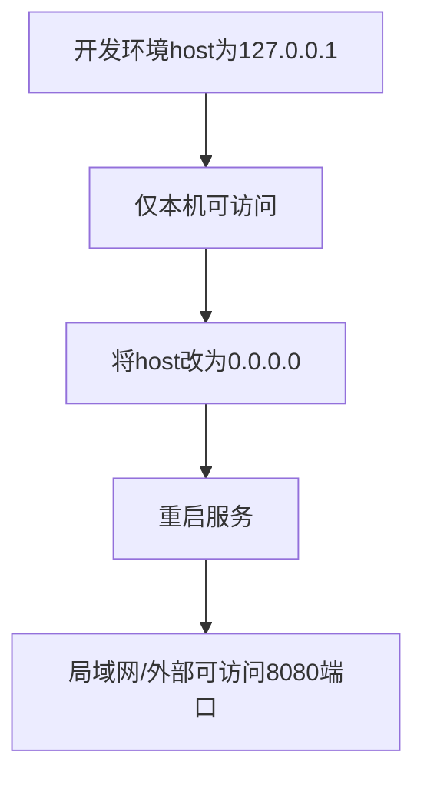

# 服务器监听地址修改说明

## 修改原因

原本开发环境配置为 `127.0.0.1:8080`，仅允许本机访问，导致局域网或外部无法访问服务。为便于调试和多端访问，需要将监听地址改为 `0.0.0.0:8080`。

## 操作步骤

1. 打开 `config/server.dev.yaml`。
2. 将 `server.host` 字段由 `127.0.0.1` 改为 `0.0.0.0`。
3. 保存文件并重启服务。

## 修改前后对比

| 配置项      | 修改前         | 修改后         |
|-------------|----------------|----------------|
| server.host | 127.0.0.1      | 0.0.0.0        |
| server.port | 8080           | 8080           |

## 影响

- 修改后，服务器将监听所有网卡，局域网和外部设备可通过 `服务器IP:8080` 访问。
- 本机访问方式不变。

## 变更流程图

---

**更新时间**: 2024-06-19 