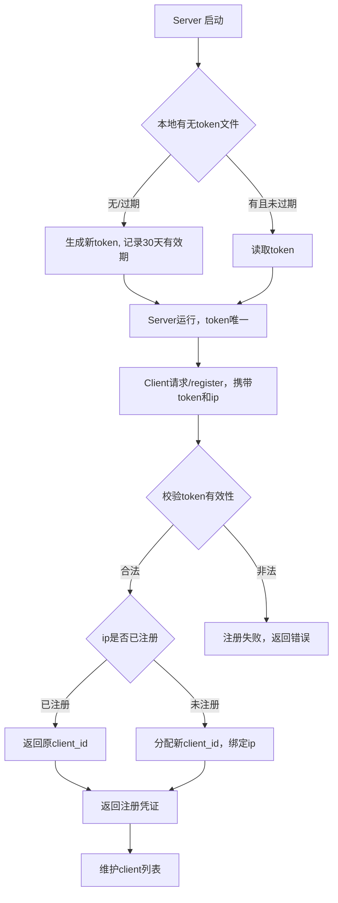

# 注册token机制与注册流程说明

## 1. 注册token机制
- server首次启动时自动生成一个随机token（32位），并持久化到`register_token.json`，有效期30天。
- 若token过期，server自动生成新token并覆盖。
- token结构如下：
```json
{
  "token": "xxxx",
  "created_at": "2024-06-19T21:00:00+08:00",
  "expires_at": "2024-07-19T21:00:00+08:00"
}
```

## 2. /register接口
- client通过POST `/register`，body中携带token和ip（可选，默认取请求来源ip）。
- server校验token合法性和有效期。
- 校验通过后，server检查该ip是否已注册：
  - 已注册：返回原有client_id。
  - 未注册：分配新client_id（16位随机字符串），并绑定ip。
- 返回注册凭证（client_id、是否新注册、token过期时间等）。

## 3. client列表维护
- server用`clients.json`持久化所有已注册client，结构如下：
```json
[
  {
    "client_id": "xxx",
    "ip": "192.168.1.100",
    "registered_at": "2024-06-19T21:00:00+08:00"
  }
]
```

## 4. 流程图



---

**更新时间**: 2024-06-19 