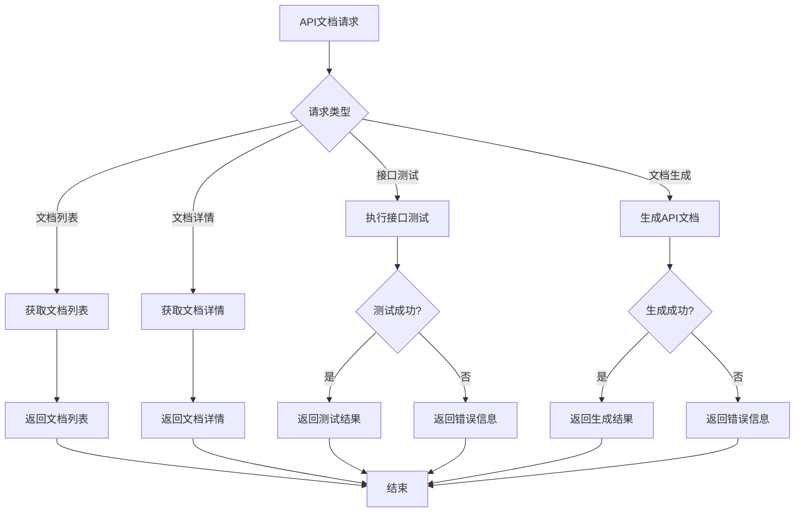

# API文档管理模块需求文档

## 1. 功能描述
API文档管理模块用于统一管理系统的API文档，包括自动生成API文档、接口测试、文档版本管理、在线调试等功能，提供完整的API文档服务。

## 2. 目标
- 提供自动化的API文档生成
- 支持在线接口测试
- 实现文档版本管理
- 提供文档搜索和导航
- 支持多种文档格式

## 3. 输入输出
### 输入
- API接口定义
- 接口注释和说明
- 测试用例数据
- 文档配置信息

### 输出
- 格式化的API文档
- 接口测试结果
- 文档版本信息
- 在线调试工具

## 4. API/接口设计
| 接口 | 方法 | 路径 | 描述 |
| ---- | ---- | ---- | ---- |
| 文档列表 | GET | /api/doc/v1/list | 获取API文档列表 |
| 文档详情 | GET | /api/doc/v1/detail/{id} | 获取文档详情 |
| 接口测试 | POST | /api/doc/v1/test | 在线测试接口 |
| 文档生成 | POST | /api/doc/v1/generate | 生成API文档 |
| 文档导出 | GET | /api/doc/v1/export/{format} | 导出文档 |

#### 请求示例
- POST /api/doc/v1/test
  ```json
  {
    "url": "/api/user/v1/detail/123",
    "method": "GET",
    "headers": {
      "Authorization": "Bearer token123"
    },
    "params": {},
    "body": {}
  }
  ```

- POST /api/doc/v1/generate
  ```json
  {
    "format": "swagger",
    "version": "1.0.0",
    "title": "OneGoServer API",
    "description": "OneGoServer API文档"
  }
  ```

#### 响应示例
```json
{
  "code": 0,
  "msg": "success",
  "data": {
    "documents": [
      {
        "id": "doc_001",
        "title": "用户管理API",
        "version": "1.0.0",
        "description": "用户管理相关接口",
        "endpoints": [
          {
            "path": "/api/user/v1/list",
            "method": "GET",
            "description": "获取用户列表",
            "parameters": [
              {
                "name": "page",
                "type": "integer",
                "required": false,
                "default": 1
              }
            ]
          }
        ],
        "lastUpdated": "2024-01-01T10:00:00Z"
      }
    ],
    "testResult": {
      "status": 200,
      "response": {
        "code": 0,
        "msg": "success",
        "data": []
      },
      "executionTime": 150
    }
  }
}
```

## 5. 数据结构
```go
// API文档信息
APIDoc struct {
    ID          string       `json:"id"`
    Title       string       `json:"title"`
    Version     string       `json:"version"`
    Description string       `json:"description"`
    BaseURL     string       `json:"baseUrl"`
    Endpoints   []Endpoint   `json:"endpoints"`
    Tags        []string     `json:"tags"`
    LastUpdated time.Time    `json:"lastUpdated"`
}

// 接口端点
Endpoint struct {
    Path        string       `json:"path"`
    Method      string       `json:"method"`
    Summary     string       `json:"summary"`
    Description string       `json:"description"`
    Parameters  []Parameter  `json:"parameters"`
    Responses   []Response   `json:"responses"`
    Tags        []string     `json:"tags"`
}

// 参数定义
Parameter struct {
    Name        string `json:"name"`
    Type        string `json:"type"`
    Required    bool   `json:"required"`
    Default     interface{} `json:"default,omitempty"`
    Description string `json:"description"`
    Example     interface{} `json:"example,omitempty"`
}

// 响应定义
Response struct {
    Code        int         `json:"code"`
    Description string      `json:"description"`
    Schema      interface{} `json:"schema"`
    Example     interface{} `json:"example"`
}

// 测试结果
TestResult struct {
    Status       int         `json:"status"`
    Response     interface{} `json:"response"`
    Headers      map[string]string `json:"headers"`
    ExecutionTime int64      `json:"executionTime"`
    Error        string      `json:"error,omitempty"`
}
```

## 6. 异常处理
- 文档不存在：返回404，"文档不存在"
- 接口测试失败：返回400，"接口测试失败"
- 文档生成失败：返回500，"文档生成失败"
- 格式不支持：返回400，"格式不支持"

## 7. 流程图


## 8. 安全性
- 文档访问权限控制
- 接口测试安全限制
- 敏感信息脱敏
- 防止恶意测试

## 9. 日志
- 记录文档访问日志
- 记录接口测试操作
- 记录文档生成过程
- 记录文档导出操作

## 10. 测试用例
1. 测试文档列表获取
2. 测试文档详情查看
3. 测试接口在线测试
4. 测试文档自动生成
5. 测试文档版本管理
6. 测试文档搜索功能
7. 测试文档导出功能 