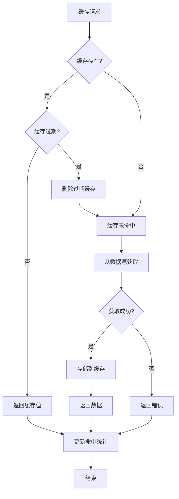

# 缓存管理模块需求文档

## 1. 功能描述
缓存管理模块用于统一管理系统中的各种缓存，包括内存缓存、Redis缓存等，提供缓存的存储、获取、更新、删除、过期处理等功能。

## 2. 目标
- 提供统一的缓存管理接口
- 支持多种缓存策略（LRU、LFU、TTL）
- 实现缓存自动过期
- 支持缓存预热和更新
- 提供缓存性能监控

## 3. 输入输出
### 输入
- 缓存键值对
- 缓存过期时间
- 缓存策略配置
- 缓存更新规则

### 输出
- 缓存存储结果
- 缓存查询结果
- 缓存统计信息
- 缓存性能指标

## 4. API/接口设计
| 接口 | 方法 | 路径 | 描述 |
| ---- | ---- | ---- | ---- |
| 设置缓存 | POST | /api/cache/v1/set | 设置缓存项 |
| 获取缓存 | GET | /api/cache/v1/get/{key} | 获取缓存项 |
| 删除缓存 | DELETE | /api/cache/v1/delete/{key} | 删除缓存项 |
| 清空缓存 | POST | /api/cache/v1/clear | 清空所有缓存 |
| 缓存统计 | GET | /api/cache/v1/stats | 获取缓存统计 |

#### 请求示例
- POST /api/cache/v1/set
  ```json
  {
    "key": "user:123",
    "value": {
      "id": 123,
      "name": "张三",
      "email": "zhangsan@example.com"
    },
    "ttl": 3600,
    "strategy": "lru"
  }
  ```

- GET /api/cache/v1/get/user:123
- DELETE /api/cache/v1/delete/user:123

#### 响应示例
```json
{
  "code": 0,
  "msg": "success",
  "data": {
    "key": "user:123",
    "value": {
      "id": 123,
      "name": "张三",
      "email": "zhangsan@example.com"
    },
    "ttl": 3600,
    "createdAt": "2024-01-01T10:00:00Z",
    "expiresAt": "2024-01-01T11:00:00Z"
  }
}
```

## 5. 数据结构
```go
// 缓存项结构体
CacheItem struct {
    Key       string      `json:"key"`
    Value     interface{} `json:"value"`
    TTL       int64       `json:"ttl"`
    Strategy  string      `json:"strategy"`
    CreatedAt time.Time   `json:"createdAt"`
    ExpiresAt time.Time   `json:"expiresAt"`
    Hits      int64       `json:"hits"`
    LastHit   time.Time   `json:"lastHit"`
}

// 缓存统计
CacheStats struct {
    TotalItems    int64   `json:"totalItems"`
    TotalHits     int64   `json:"totalHits"`
    TotalMisses   int64   `json:"totalMisses"`
    HitRate       float64 `json:"hitRate"`
    MemoryUsage   int64   `json:"memoryUsage"`
    EvictedItems  int64   `json:"evictedItems"`
}

// 缓存配置
CacheConfig struct {
    MaxSize       int64  `json:"maxSize"`
    DefaultTTL    int64  `json:"defaultTTL"`
    Strategy      string `json:"strategy"`
    EnableStats   bool   `json:"enableStats"`
    EnableEviction bool  `json:"enableEviction"`
}
```

## 6. 异常处理
- 缓存键不存在：返回404，"缓存项不存在"
- 缓存已过期：自动删除，返回404
- 缓存空间不足：触发LRU淘汰
- 缓存服务异常：返回500，"缓存服务异常"

## 7. 流程图


## 8. 安全性
- 缓存键名验证
- 缓存值大小限制
- 缓存访问权限控制
- 防止缓存穿透攻击

## 9. 日志
- 记录缓存操作日志
- 记录缓存命中率
- 记录缓存淘汰事件
- 记录缓存异常信息

## 10. 测试用例
1. 测试缓存设置和获取
2. 测试缓存过期处理
3. 测试缓存淘汰策略
4. 测试缓存统计功能
5. 测试缓存预热功能
6. 测试缓存更新机制
7. 测试缓存性能监控 