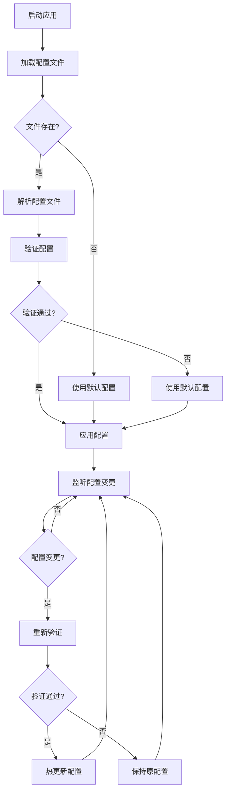

# 配置管理模块需求文档

## 1. 功能描述
配置管理模块用于统一管理系统配置，包括应用配置、数据库配置、缓存配置、日志配置等，支持配置文件的加载、解析、验证、热更新等功能。

## 2. 目标
- 提供统一的配置管理接口
- 支持多种配置格式（JSON、YAML、TOML、ENV）
- 实现配置热更新
- 支持环境变量覆盖
- 提供配置验证和默认值

## 3. 输入输出
### 输入
- 配置文件路径
- 配置项键值对
- 环境变量
- 配置验证规则

### 输出
- 解析后的配置对象
- 配置验证结果
- 配置更新通知
- 配置变更日志

## 4. API/接口设计
| 接口 | 方法 | 路径 | 描述 |
| ---- | ---- | ---- | ---- |
| 获取配置 | GET | /api/config/v1/get/{key} | 获取指定配置项 |
| 设置配置 | PUT | /api/config/v1/set/{key} | 设置配置项 |
| 配置列表 | GET | /api/config/v1/list | 获取所有配置 |
| 配置验证 | POST | /api/config/v1/validate | 验证配置有效性 |
| 配置重载 | POST | /api/config/v1/reload | 重新加载配置 |

#### 请求示例
- GET /api/config/v1/get/database.host
- PUT /api/config/v1/set/database.host
  ```json
  {
    "value": "localhost",
    "description": "数据库主机地址"
  }
  ```

- POST /api/config/v1/validate
  ```json
  {
    "config": {
      "database": {
        "host": "localhost",
        "port": 3306,
        "username": "root",
        "password": "password"
      }
    }
  }
  ```

#### 响应示例
```json
{
  "code": 0,
  "msg": "success",
  "data": {
    "key": "database.host",
    "value": "localhost",
    "type": "string",
    "description": "数据库主机地址",
    "lastModified": "2024-01-01T10:00:00Z"
  }
}
```

## 5. 数据结构
```go
// 配置项结构体
ConfigItem struct {
    Key         string      `json:"key"`
    Value       interface{} `json:"value"`
    Type        string      `json:"type"`
    Description string      `json:"description"`
    Required    bool        `json:"required"`
    Default     interface{} `json:"default,omitempty"`
    Validation  string      `json:"validation,omitempty"`
    LastModified time.Time  `json:"lastModified"`
}

// 配置验证结果
ConfigValidation struct {
    Valid   bool              `json:"valid"`
    Errors  []ValidationError `json:"errors,omitempty"`
    Warnings []ValidationError `json:"warnings,omitempty"`
}

// 验证错误
ValidationError struct {
    Field   string `json:"field"`
    Message string `json:"message"`
    Code    string `json:"code"`
}
```

## 6. 异常处理
- 配置文件不存在：使用默认配置
- 配置文件格式错误：返回400，"配置文件格式错误"
- 配置验证失败：返回400，"配置验证失败"
- 配置更新失败：回滚到上一版本

## 7. 流程图


## 8. 安全性
- 敏感配置加密存储
- 配置访问权限控制
- 配置变更审计日志
- 防止配置注入攻击

## 9. 日志
- 记录配置加载过程
- 记录配置变更操作
- 记录配置验证结果
- 记录配置错误信息

## 10. 测试用例
1. 加载不同格式的配置文件
2. 测试配置热更新功能
3. 测试配置验证规则
4. 测试环境变量覆盖
5. 测试敏感配置加密
6. 测试配置回滚功能
7. 测试配置变更通知 