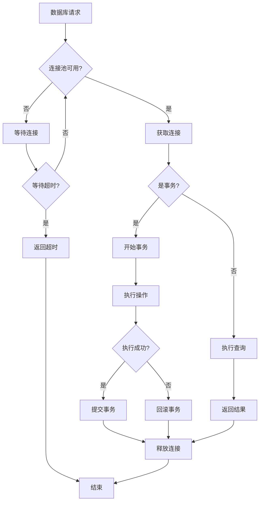

# 数据库连接管理模块需求文档

## 1. 功能描述
数据库连接管理模块用于统一管理系统中的数据库连接，包括连接池管理、事务管理、数据库迁移、连接监控等功能，支持多种数据库类型。

## 2. 目标
- 提供统一的数据库连接接口
- 实现连接池管理和优化
- 支持事务管理和回滚
- 实现数据库迁移和版本控制
- 提供连接监控和性能分析

## 3. 输入输出
### 输入
- 数据库连接配置
- SQL查询语句
- 事务操作
- 数据库迁移脚本

### 输出
- 查询结果集
- 事务执行结果
- 连接状态信息
- 性能监控数据

## 4. API/接口设计
| 接口 | 方法 | 路径 | 描述 |
| ---- | ---- | ---- | ---- |
| 连接状态 | GET | /api/database/v1/status | 获取数据库连接状态 |
| 执行查询 | POST | /api/database/v1/query | 执行SQL查询 |
| 执行事务 | POST | /api/database/v1/transaction | 执行数据库事务 |
| 连接池信息 | GET | /api/database/v1/pool | 获取连接池信息 |
| 数据库迁移 | POST | /api/database/v1/migrate | 执行数据库迁移 |

#### 请求示例
- POST /api/database/v1/query
  ```json
  {
    "sql": "SELECT * FROM users WHERE id = ?",
    "params": [123],
    "timeout": 30
  }
  ```

- POST /api/database/v1/transaction
  ```json
  {
    "operations": [
      {
        "sql": "INSERT INTO users (name, email) VALUES (?, ?)",
        "params": ["张三", "zhangsan@example.com"]
      },
      {
        "sql": "UPDATE user_stats SET count = count + 1",
        "params": []
      }
    ]
  }
  ```

#### 响应示例
```json
{
  "code": 0,
  "msg": "success",
  "data": {
    "rows": [
      {
        "id": 123,
        "name": "张三",
        "email": "zhangsan@example.com",
        "created_at": "2024-01-01T10:00:00Z"
      }
    ],
    "affectedRows": 1,
    "executionTime": 5.2
  }
}
```

## 5. 数据结构
```go
// 数据库连接配置
DBConfig struct {
    Host         string `json:"host"`
    Port         int    `json:"port"`
    Database     string `json:"database"`
    Username     string `json:"username"`
    Password     string `json:"password"`
    MaxOpenConns int    `json:"maxOpenConns"`
    MaxIdleConns int    `json:"maxIdleConns"`
    ConnMaxLifetime int `json:"connMaxLifetime"`
}

// 连接池状态
PoolStatus struct {
    OpenConnections int   `json:"openConnections"`
    InUse           int   `json:"inUse"`
    Idle            int   `json:"idle"`
    WaitCount       int64 `json:"waitCount"`
    WaitDuration    int64 `json:"waitDuration"`
    MaxIdleClosed   int64 `json:"maxIdleClosed"`
    MaxLifetimeClosed int64 `json:"maxLifetimeClosed"`
}

// 查询结果
QueryResult struct {
    Rows         []map[string]interface{} `json:"rows"`
    AffectedRows int64                    `json:"affectedRows"`
    LastInsertID int64                    `json:"lastInsertId,omitempty"`
    ExecutionTime float64                 `json:"executionTime"`
}

// 事务操作
TransactionOp struct {
    SQL    string        `json:"sql"`
    Params []interface{} `json:"params"`
}
```

## 6. 异常处理
- 连接失败：返回500，"数据库连接失败"
- 查询超时：返回408，"查询超时"
- 事务回滚：自动回滚，返回500，"事务执行失败"
- 连接池满：返回503，"连接池已满"

## 7. 流程图


## 8. 安全性
- 数据库连接加密
- SQL注入防护
- 连接权限控制
- 敏感数据脱敏

## 9. 日志
- 记录数据库操作日志
- 记录连接池状态变化
- 记录慢查询日志
- 记录事务执行日志

## 10. 测试用例
1. 测试数据库连接建立
2. 测试连接池管理
3. 测试SQL查询执行
4. 测试事务管理
5. 测试数据库迁移
6. 测试连接监控
7. 测试性能压力测试 