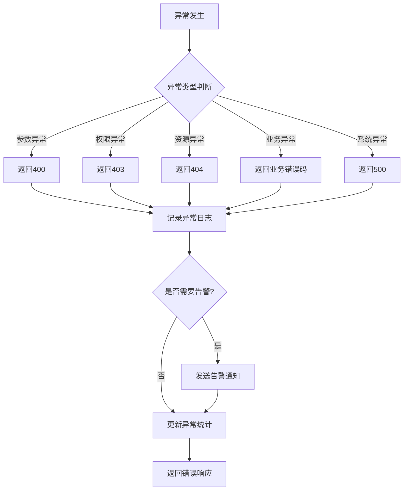

# 异常处理模块需求文档

## 1. 功能描述
异常处理模块用于统一管理系统中的异常和错误，包括异常捕获、错误码管理、异常日志记录、用户友好错误信息等功能。

## 2. 目标
- 提供统一的异常处理机制
- 实现错误码标准化管理
- 支持异常分类和分级
- 提供用户友好的错误信息
- 实现异常监控和告警

## 3. 输入输出
### 输入
- 异常信息
- 错误码
- 异常上下文
- 异常级别

### 输出
- 标准化的错误响应
- 异常日志记录
- 异常统计信息
- 告警通知

## 4. API/接口设计
| 接口 | 方法 | 路径 | 描述 |
| ---- | ---- | ---- | ---- |
| 错误码列表 | GET | /api/exception/v1/codes | 获取所有错误码 |
| 异常统计 | GET | /api/exception/v1/stats | 获取异常统计信息 |
| 异常详情 | GET | /api/exception/v1/detail/{id} | 获取异常详情 |
| 异常配置 | PUT | /api/exception/v1/config | 更新异常处理配置 |

#### 请求示例
- GET /api/exception/v1/codes?category=validation
- GET /api/exception/v1/stats?startTime=2024-01-01&endTime=2024-01-02

#### 响应示例
```json
{
  "code": 0,
  "msg": "success",
  "data": {
    "errorCodes": [
      {
        "code": "VALIDATION_ERROR",
        "message": "参数验证失败",
        "category": "validation",
        "level": "warning",
        "httpStatus": 400
      }
    ],
    "stats": {
      "totalExceptions": 100,
      "errorRate": 0.05,
      "topErrors": [
        {
          "code": "VALIDATION_ERROR",
          "count": 20,
          "percentage": 0.2
        }
      ]
    }
  }
}
```

## 5. 数据结构
```go
// 错误码结构体
ErrorCode struct {
    Code       string `json:"code"`
    Message    string `json:"message"`
    Category   string `json:"category"`
    Level      string `json:"level"`
    HTTPStatus int    `json:"httpStatus"`
    Internal   bool   `json:"internal"`
}

// 异常信息
ExceptionInfo struct {
    ID          string                 `json:"id"`
    Code        string                 `json:"code"`
    Message     string                 `json:"message"`
    Category    string                 `json:"category"`
    Level       string                 `json:"level"`
    StackTrace  string                 `json:"stackTrace,omitempty"`
    Context     map[string]interface{} `json:"context,omitempty"`
    UserID      int64                  `json:"userId,omitempty"`
    IP          string                 `json:"ip,omitempty"`
    UserAgent   string                 `json:"userAgent,omitempty"`
    Timestamp   time.Time              `json:"timestamp"`
}

// 异常统计
ExceptionStats struct {
    TotalExceptions int64                    `json:"totalExceptions"`
    ErrorRate       float64                  `json:"errorRate"`
    TopErrors       []ErrorStat              `json:"topErrors"`
    CategoryStats   map[string]CategoryStat  `json:"categoryStats"`
    TimeRange       TimeRange                `json:"timeRange"`
}

// 错误统计
ErrorStat struct {
    Code        string `json:"code"`
    Count       int64  `json:"count"`
    Percentage  float64 `json:"percentage"`
}
```

## 6. 异常处理
- 参数验证异常：返回400，参数错误信息
- 权限验证异常：返回403，权限不足信息
- 资源不存在：返回404，资源不存在信息
- 系统内部异常：返回500，通用错误信息
- 业务逻辑异常：返回相应业务错误码

## 7. 流程图


## 8. 安全性
- 敏感信息脱敏
- 异常信息过滤
- 防止异常信息泄露
- 异常访问权限控制

## 9. 日志
- 记录异常详细信息
- 记录异常堆栈信息
- 记录异常上下文
- 记录异常处理过程

## 10. 测试用例
1. 测试参数验证异常处理
2. 测试权限验证异常处理
3. 测试资源不存在异常处理
4. 测试业务逻辑异常处理
5. 测试系统内部异常处理
6. 测试异常日志记录
7. 测试异常统计功能 