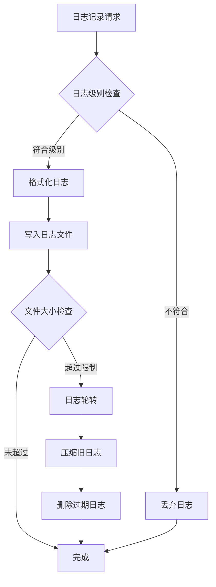

# 日志管理模块需求文档

## 1. 功能描述
日志管理模块用于统一管理系统运行过程中的各类日志，包括应用日志、访问日志、错误日志、安全日志等，提供日志记录、格式化、存储、查询等功能。

## 2. 目标
- 提供统一的日志记录接口
- 支持多种日志级别（DEBUG、INFO、WARN、ERROR、FATAL）
- 实现日志轮转和归档
- 支持结构化日志输出
- 提供日志查询和分析功能

## 3. 输入输出
### 输入
- 日志级别
- 日志消息内容
- 日志上下文信息（时间、用户、IP等）
- 日志标签和分类

### 输出
- 格式化的日志记录
- 日志文件存储
- 日志查询结果
- 日志统计信息

## 4. API/接口设计
| 接口 | 方法 | 路径 | 描述 |
| ---- | ---- | ---- | ---- |
| 记录日志 | POST | /api/log/v1/record | 记录应用日志 |
| 查询日志 | GET | /api/log/v1/query | 查询日志记录 |
| 日志统计 | GET | /api/log/v1/stats | 获取日志统计信息 |
| 日志配置 | PUT | /api/log/v1/config | 更新日志配置 |

#### 请求示例
- POST /api/log/v1/record
  ```json
  {
    "level": "INFO",
    "message": "用户登录成功",
    "module": "user",
    "userId": 123,
    "ip": "192.168.1.1",
    "tags": ["auth", "login"]
  }
  ```

- GET /api/log/v1/query?level=ERROR&startTime=2024-01-01&endTime=2024-01-02&module=user

#### 响应示例
```json
{
  "code": 0,
  "msg": "success",
  "data": {
    "logs": [
      {
        "id": "log_001",
        "timestamp": "2024-01-01T10:00:00Z",
        "level": "INFO",
        "message": "用户登录成功",
        "module": "user",
        "userId": 123,
        "ip": "192.168.1.1",
        "tags": ["auth", "login"]
      }
    ],
    "total": 100,
    "page": 1,
    "size": 20
  }
}
```

## 5. 数据结构
```go
// 日志记录结构体
LogRecord struct {
    ID        string            `json:"id"`
    Timestamp time.Time         `json:"timestamp"`
    Level     string            `json:"level"`
    Message   string            `json:"message"`
    Module    string            `json:"module"`
    UserID    int64             `json:"userId,omitempty"`
    IP        string            `json:"ip,omitempty"`
    Tags      []string          `json:"tags,omitempty"`
    Context   map[string]string `json:"context,omitempty"`
}

// 日志配置结构体
LogConfig struct {
    Level      string `json:"level"`
    Output     string `json:"output"`
    Format     string `json:"format"`
    MaxSize    int    `json:"maxSize"`
    MaxAge     int    `json:"maxAge"`
    MaxBackups int    `json:"maxBackups"`
    Compress   bool   `json:"compress"`
}
```

## 6. 异常处理
- 日志文件写入失败：记录到备用存储
- 日志级别配置错误：使用默认级别
- 日志查询参数错误：返回400，"参数错误"
- 存储空间不足：触发日志清理和告警

## 7. 流程图


## 8. 安全性
- 敏感信息脱敏处理
- 日志文件权限控制
- 日志访问权限验证
- 防止日志注入攻击

## 9. 日志
- 记录日志系统自身的运行状态
- 记录日志配置变更
- 记录日志查询操作
- 记录异常和错误信息

## 10. 测试用例
1. 记录不同级别的日志，验证输出格式
2. 测试日志轮转功能
3. 测试日志查询和过滤
4. 测试日志统计功能
5. 测试日志配置更新
6. 测试异常情况处理
7. 测试性能压力测试 