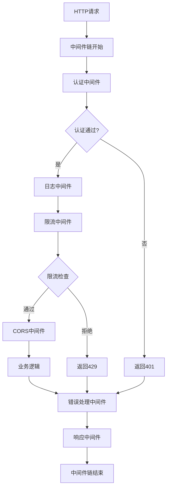

# 中间件管理模块需求文档

## 1. 功能描述
中间件管理模块用于统一管理系统中的各种中间件，包括认证中间件、日志中间件、限流中间件、CORS中间件、错误处理中间件等，提供中间件的注册、配置、启用、禁用等功能。

## 2. 目标
- 提供统一的中间件管理接口
- 支持中间件的动态配置
- 实现中间件的链式调用
- 支持中间件的条件启用
- 提供中间件性能监控

## 3. 输入输出
### 输入
- 中间件配置参数
- 请求上下文信息
- 中间件执行顺序
- 中间件启用条件

### 输出
- 中间件处理结果
- 中间件执行日志
- 中间件性能指标
- 中间件错误信息

## 4. API/接口设计
| 接口 | 方法 | 路径 | 描述 |
| ---- | ---- | ---- | ---- |
| 中间件列表 | GET | /api/middleware/v1/list | 获取所有中间件 |
| 启用中间件 | POST | /api/middleware/v1/enable/{name} | 启用指定中间件 |
| 禁用中间件 | POST | /api/middleware/v1/disable/{name} | 禁用指定中间件 |
| 中间件配置 | PUT | /api/middleware/v1/config/{name} | 配置中间件参数 |
| 中间件状态 | GET | /api/middleware/v1/status/{name} | 获取中间件状态 |

#### 请求示例
- POST /api/middleware/v1/enable/auth
- PUT /api/middleware/v1/config/rateLimit
  ```json
  {
    "maxRequests": 100,
    "windowSize": 60,
    "strategy": "token_bucket"
  }
  ```

- GET /api/middleware/v1/status/auth

#### 响应示例
```json
{
  "code": 0,
  "msg": "success",
  "data": {
    "name": "auth",
    "enabled": true,
    "config": {
      "secret": "***",
      "expireTime": 3600
    },
    "status": {
      "totalRequests": 1000,
      "successRate": 0.95,
      "avgResponseTime": 50
    }
  }
}
```

## 5. 数据结构
```go
// 中间件信息结构体
MiddlewareInfo struct {
    Name        string                 `json:"name"`
    Description string                 `json:"description"`
    Enabled     bool                   `json:"enabled"`
    Config      map[string]interface{} `json:"config"`
    Order       int                    `json:"order"`
    Status      MiddlewareStatus       `json:"status"`
}

// 中间件状态
MiddlewareStatus struct {
    TotalRequests   int64   `json:"totalRequests"`
    SuccessRate     float64 `json:"successRate"`
    AvgResponseTime int64   `json:"avgResponseTime"`
    ErrorCount      int64   `json:"errorCount"`
    LastError       string  `json:"lastError,omitempty"`
}

// 中间件配置
MiddlewareConfig struct {
    Name   string                 `json:"name"`
    Config map[string]interface{} `json:"config"`
    Order  int                    `json:"order"`
    Enable bool                   `json:"enable"`
}
```

## 6. 异常处理
- 中间件不存在：返回404，"中间件不存在"
- 中间件配置错误：返回400，"配置错误"
- 中间件执行失败：记录错误日志，继续执行
- 中间件冲突：返回400，"中间件冲突"

## 7. 流程图


## 8. 安全性
- 中间件权限控制
- 敏感配置加密
- 中间件执行审计
- 防止中间件注入攻击

## 9. 日志
- 记录中间件启用/禁用操作
- 记录中间件配置变更
- 记录中间件执行状态
- 记录中间件错误信息

## 10. 测试用例
1. 测试中间件启用/禁用功能
2. 测试中间件配置更新
3. 测试中间件链式调用
4. 测试中间件性能监控
5. 测试中间件错误处理
6. 测试中间件条件启用
7. 测试中间件冲突检测 