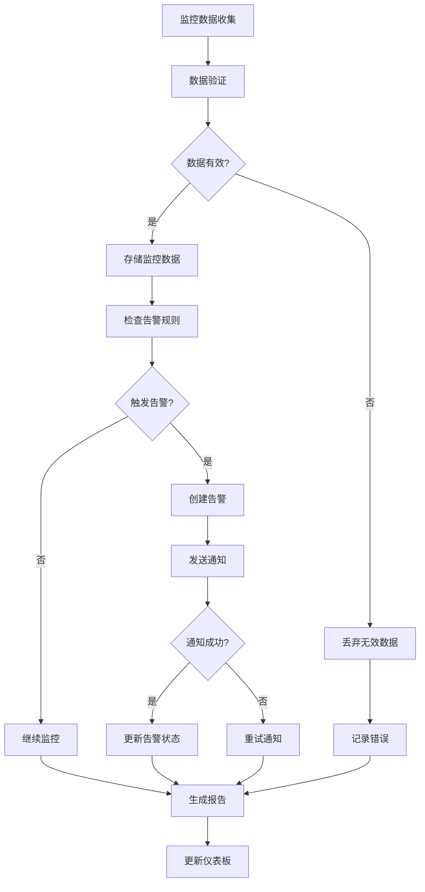

# 监控告警模块需求文档

## 1. 功能描述
监控告警模块用于统一管理系统的监控和告警功能，包括系统监控、性能指标、告警规则、通知机制等，提供系统运行状态的实时监控和异常告警。

## 2. 目标
- 提供统一的监控数据收集
- 实现性能指标实时监控
- 支持自定义告警规则
- 提供多渠道通知机制
- 实现监控数据可视化

## 3. 输入输出
### 输入
- 系统性能指标
- 业务监控数据
- 告警规则配置
- 通知渠道配置

### 输出
- 监控数据报告
- 告警通知消息
- 性能分析报告
- 监控仪表板

## 4. API/接口设计
| 接口 | 方法 | 路径 | 描述 |
| ---- | ---- | ---- | ---- |
| 监控数据 | POST | /api/monitoring/v1/metrics | 上报监控指标 |
| 告警规则 | GET | /api/monitoring/v1/rules | 获取告警规则 |
| 告警历史 | GET | /api/monitoring/v1/alerts | 获取告警历史 |
| 监控面板 | GET | /api/monitoring/v1/dashboard | 获取监控面板数据 |
| 通知配置 | PUT | /api/monitoring/v1/notify/config | 更新通知配置 |

#### 请求示例
- POST /api/monitoring/v1/metrics
  ```json
  {
    "timestamp": "2024-01-01T10:00:00Z",
    "metrics": {
      "cpu_usage": 75.5,
      "memory_usage": 68.2,
      "disk_usage": 45.8,
      "response_time": 120,
      "error_rate": 0.02
    },
    "tags": {
      "service": "user-service",
      "instance": "instance-001"
    }
  }
  ```

- GET /api/monitoring/v1/alerts?startTime=2024-01-01&endTime=2024-01-02

#### 响应示例
```json
{
  "code": 0,
  "msg": "success",
  "data": {
    "alerts": [
      {
        "id": "alert_001",
        "level": "warning",
        "message": "CPU使用率超过阈值",
        "metric": "cpu_usage",
        "value": 85.5,
        "threshold": 80.0,
        "timestamp": "2024-01-01T10:30:00Z",
        "status": "active"
      }
    ],
    "dashboard": {
      "cpu_usage": 75.5,
      "memory_usage": 68.2,
      "disk_usage": 45.8,
      "response_time": 120,
      "error_rate": 0.02
    }
  }
}
```

## 5. 数据结构
```go
// 监控指标
Metric struct {
    Name      string                 `json:"name"`
    Value     float64                `json:"value"`
    Unit      string                 `json:"unit"`
    Timestamp time.Time              `json:"timestamp"`
    Tags      map[string]string      `json:"tags"`
    Metadata  map[string]interface{} `json:"metadata,omitempty"`
}

// 告警规则
AlertRule struct {
    ID          string  `json:"id"`
    Name        string  `json:"name"`
    Description string  `json:"description"`
    Metric      string  `json:"metric"`
    Operator    string  `json:"operator"`
    Threshold   float64 `json:"threshold"`
    Duration    int     `json:"duration"`
    Level       string  `json:"level"`
    Enabled     bool    `json:"enabled"`
}

// 告警信息
Alert struct {
    ID          string    `json:"id"`
    RuleID      string    `json:"ruleId"`
    Level       string    `json:"level"`
    Message     string    `json:"message"`
    Metric      string    `json:"metric"`
    Value       float64   `json:"value"`
    Threshold   float64   `json:"threshold"`
    Timestamp   time.Time `json:"timestamp"`
    Status      string    `json:"status"`
    Notified    bool      `json:"notified"`
}

// 通知配置
NotificationConfig struct {
    Email     EmailConfig     `json:"email"`
    SMS       SMSConfig       `json:"sms"`
    Webhook   WebhookConfig   `json:"webhook"`
    DingTalk  DingTalkConfig  `json:"dingtalk"`
}
```

## 6. 异常处理
- 监控数据异常：记录错误日志，继续处理
- 告警规则无效：返回400，"告警规则配置错误"
- 通知发送失败：重试机制，记录失败日志
- 监控服务异常：返回500，"监控服务异常"

## 7. 流程图


## 8. 安全性
- 监控数据加密存储
- 告警规则权限控制
- 通知渠道安全配置
- 防止监控数据泄露

## 9. 日志
- 记录监控数据收集
- 记录告警触发事件
- 记录通知发送状态
- 记录监控系统异常

## 10. 测试用例
1. 测试监控数据收集
2. 测试告警规则触发
3. 测试通知发送功能
4. 测试监控面板显示
5. 测试性能指标计算
6. 测试告警历史查询
7. 测试监控数据导出 