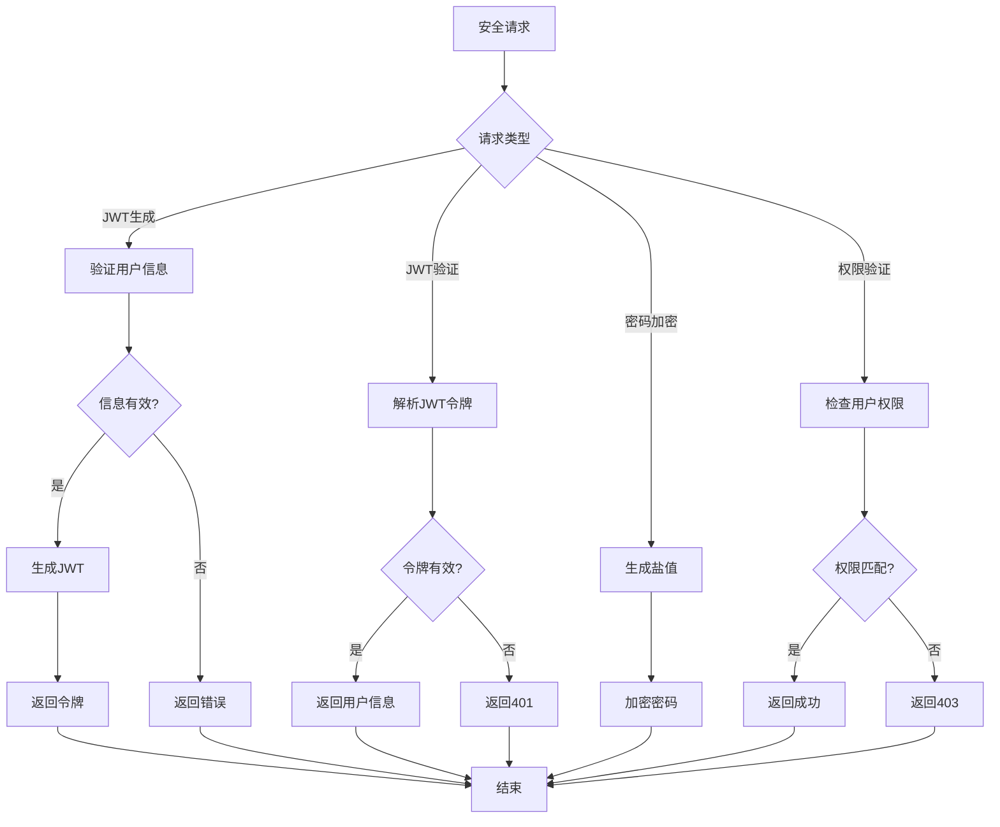

# 安全工具模块需求文档

## 1. 功能描述
安全工具模块用于统一管理系统中的安全相关功能，包括JWT工具、密码加密、权限验证、安全过滤等，提供系统安全防护和认证授权功能。

## 2. 目标
- 提供统一的JWT管理接口
- 实现安全的密码加密和验证
- 支持权限验证和访问控制
- 提供安全过滤和防护
- 实现安全审计和监控

## 3. 输入输出
### 输入
- 用户认证信息
- 权限验证请求
- 密码加密请求
- 安全过滤规则

### 输出
- JWT令牌
- 密码加密结果
- 权限验证结果
- 安全过滤结果

## 4. API/接口设计
| 接口 | 方法 | 路径 | 描述 |
| ---- | ---- | ---- | ---- |
| 生成JWT | POST | /api/security/v1/jwt/generate | 生成JWT令牌 |
| 验证JWT | POST | /api/security/v1/jwt/verify | 验证JWT令牌 |
| 刷新JWT | POST | /api/security/v1/jwt/refresh | 刷新JWT令牌 |
| 密码加密 | POST | /api/security/v1/password/encrypt | 密码加密 |
| 密码验证 | POST | /api/security/v1/password/verify | 密码验证 |
| 权限验证 | POST | /api/security/v1/permission/check | 权限验证 |

#### 请求示例
- POST /api/security/v1/jwt/generate
  ```json
  {
    "userId": 123,
    "username": "zhangsan",
    "roles": ["user", "admin"],
    "expireTime": 3600
  }
  ```

- POST /api/security/v1/password/encrypt
  ```json
  {
    "password": "mypassword123",
    "salt": "random_salt"
  }
  ```

- POST /api/security/v1/permission/check
  ```json
  {
    "userId": 123,
    "resource": "user:read",
    "action": "read"
  }
  ```

#### 响应示例
```json
{
  "code": 0,
  "msg": "success",
  "data": {
    "token": "eyJhbGciOiJIUzI1NiIsInR5cCI6IkpXVCJ9...",
    "expiresAt": "2024-01-01T11:00:00Z",
    "refreshToken": "refresh_token_here"
  }
}
```

## 5. 数据结构
```go
// JWT信息
JWTInfo struct {
    Token        string    `json:"token"`
    RefreshToken string    `json:"refreshToken"`
    ExpiresAt    time.Time `json:"expiresAt"`
    UserID       int64     `json:"userId"`
    Username     string    `json:"username"`
    Roles        []string  `json:"roles"`
}

// 密码信息
PasswordInfo struct {
    Hash     string `json:"hash"`
    Salt     string `json:"salt"`
    Algorithm string `json:"algorithm"`
    Cost     int    `json:"cost"`
}

// 权限验证结果
PermissionResult struct {
    Granted   bool     `json:"granted"`
    Reason    string   `json:"reason,omitempty"`
    Roles     []string `json:"roles"`
    Permissions []string `json:"permissions"`
}

// 安全配置
SecurityConfig struct {
    JWTSecret     string `json:"jwtSecret"`
    JWTExpireTime int    `json:"jwtExpireTime"`
    PasswordCost  int    `json:"passwordCost"`
    MaxLoginAttempts int `json:"maxLoginAttempts"`
    LockoutDuration int  `json:"lockoutDuration"`
}
```

## 6. 异常处理
- JWT无效：返回401，"令牌无效"
- JWT过期：返回401，"令牌已过期"
- 密码错误：返回400，"密码错误"
- 权限不足：返回403，"权限不足"
- 安全攻击：返回429，"请求过于频繁"

## 7. 流程图


## 8. 安全性
- JWT密钥安全存储
- 密码加盐哈希
- 防止暴力破解
- 防止JWT重放攻击
- 敏感信息脱敏

## 9. 日志
- 记录JWT生成和验证
- 记录密码操作
- 记录权限验证
- 记录安全事件

## 10. 测试用例
1. 测试JWT生成和验证
2. 测试密码加密和验证
3. 测试权限验证功能
4. 测试安全过滤功能
5. 测试防暴力破解
6. 测试JWT过期处理
7. 测试安全审计功能 