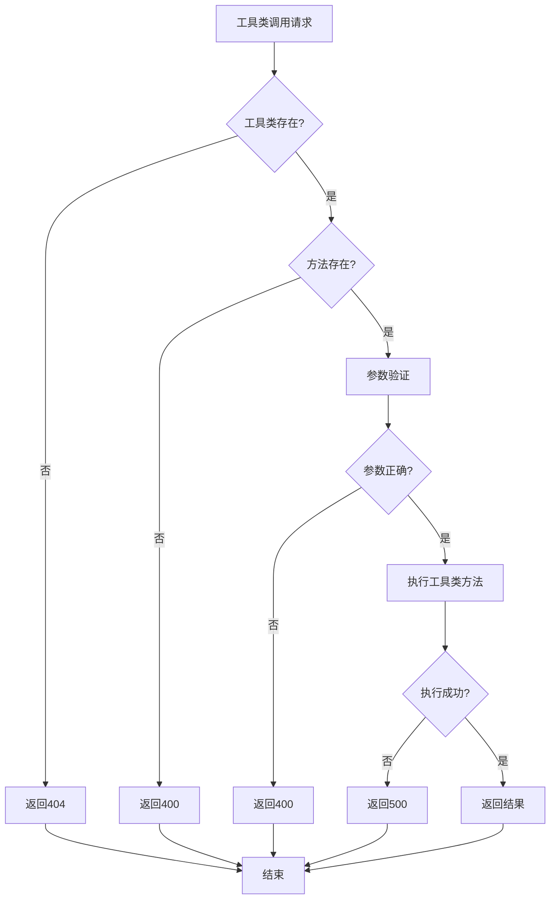

# 工具类管理模块需求文档

## 1. 功能描述
工具类管理模块用于统一管理系统中的各种工具类，包括字符串工具、时间工具、加密工具、验证工具、文件工具等，提供常用功能的封装和复用。

## 2. 目标
- 提供统一的工具类接口
- 支持常用功能的封装
- 实现工具类的版本管理
- 支持工具类的性能优化
- 提供工具类的使用统计

## 3. 输入输出
### 输入
- 工具类调用参数
- 工具类配置选项
- 工具类版本信息
- 工具类使用上下文

### 输出
- 工具类处理结果
- 工具类执行日志
- 工具类性能指标
- 工具类错误信息

## 4. API/接口设计
| 接口 | 方法 | 路径 | 描述 |
| ---- | ---- | ---- | ---- |
| 工具类列表 | GET | /api/utility/v1/list | 获取所有工具类 |
| 工具类详情 | GET | /api/utility/v1/detail/{name} | 获取工具类详情 |
| 工具类调用 | POST | /api/utility/v1/call/{name} | 调用指定工具类 |
| 工具类统计 | GET | /api/utility/v1/stats/{name} | 获取工具类使用统计 |

#### 请求示例
- POST /api/utility/v1/call/stringUtils
  ```json
  {
    "method": "toCamelCase",
    "params": {
      "input": "hello_world"
    }
  }
  ```

- GET /api/utility/v1/stats/encryptUtils

#### 响应示例
```json
{
  "code": 0,
  "msg": "success",
  "data": {
    "name": "stringUtils",
    "method": "toCamelCase",
    "result": "helloWorld",
    "executionTime": 1.5,
    "version": "1.0.0"
  }
}
```

## 5. 数据结构
```go
// 工具类信息结构体
UtilityInfo struct {
    Name        string            `json:"name"`
    Description string            `json:"description"`
    Version     string            `json:"version"`
    Methods     []MethodInfo      `json:"methods"`
    Status      UtilityStatus     `json:"status"`
}

// 方法信息
MethodInfo struct {
    Name        string                 `json:"name"`
    Description string                 `json:"description"`
    Parameters  []ParameterInfo        `json:"parameters"`
    ReturnType  string                 `json:"returnType"`
    Examples    []map[string]interface{} `json:"examples"`
}

// 参数信息
ParameterInfo struct {
    Name     string `json:"name"`
    Type     string `json:"type"`
    Required bool   `json:"required"`
    Default  interface{} `json:"default,omitempty"`
}

// 工具类状态
UtilityStatus struct {
    TotalCalls      int64   `json:"totalCalls"`
    SuccessRate     float64 `json:"successRate"`
    AvgExecutionTime float64 `json:"avgExecutionTime"`
    LastUsed        time.Time `json:"lastUsed"`
}
```

## 6. 异常处理
- 工具类不存在：返回404，"工具类不存在"
- 方法不存在：返回400，"方法不存在"
- 参数错误：返回400，"参数错误"
- 执行失败：返回500，"执行失败"

## 7. 流程图


## 8. 安全性
- 工具类权限控制
- 参数输入验证
- 敏感操作审计
- 防止工具类滥用

## 9. 日志
- 记录工具类调用操作
- 记录工具类执行结果
- 记录工具类错误信息
- 记录工具类性能指标

## 10. 测试用例
1. 测试字符串工具类功能
2. 测试时间工具类功能
3. 测试加密工具类功能
4. 测试验证工具类功能
5. 测试文件工具类功能
6. 测试工具类参数验证
7. 测试工具类性能监控 