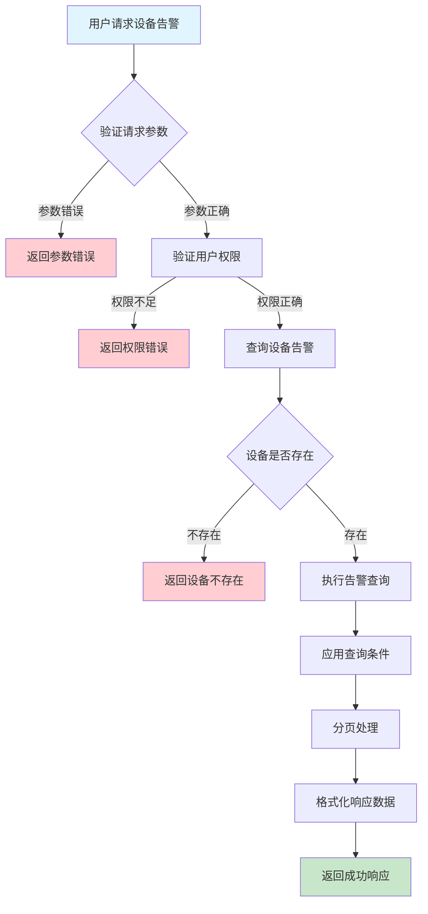
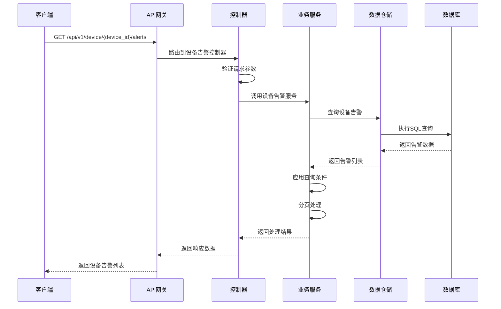

# 设备告警需求文档

## 1. 功能描述

### 1.1 功能概述
设备告警功能用于监控和管理设备的异常状态，包括告警规则配置、告警触发、告警通知、告警处理等。该功能帮助用户及时发现设备问题，快速响应和处理异常情况，确保设备正常运行。

### 1.2 主要功能列表
- 告警规则配置
- 告警触发检测
- 告警通知发送
- 告警状态管理
- 告警历史查询
- 告警统计分析

### 1.3 支持的功能特性
- 多种告警类型支持
- 告警级别分类
- 告警通知渠道
- 告警自动恢复
- 告警升级机制
- 告警抑制功能

## 2. 功能目标

### 2.1 业务目标
- 及时发现设备异常
- 快速响应告警事件
- 减少设备故障时间
- 提高设备可用性

### 2.2 技术目标
- 实时告警检测
- 高效告警处理
- 可靠通知机制
- 完整告警记录

### 2.3 安全目标
- 保护告警数据安全
- 控制告警访问权限
- 防止误报和漏报
- 确保告警操作审计

## 3. 输入输出说明

### 3.1 输入参数

#### 3.1.1 必需参数
- `device_id` (string): 设备ID，用于指定告警的设备

#### 3.1.2 可选参数
- `alert_type` (string): 告警类型，如：cpu_high、memory_low、disk_full
- `alert_level` (string): 告警级别，如：info、warning、critical
- `start_time` (string): 开始时间，格式：YYYY-MM-DD HH:mm:ss
- `end_time` (string): 结束时间，格式：YYYY-MM-DD HH:mm:ss
- `status` (string): 告警状态，如：active、resolved、acknowledged
- `page` (int): 页码，默认：1
- `page_size` (int): 每页大小，默认：20，最大：100

### 3.2 输出参数

#### 3.2.1 成功响应
```json
{
  "code": 200,
  "message": "success",
  "data": {
    "total": 150,
    "page": 1,
    "page_size": 20,
    "alerts": [
      {
        "id": "alert_001",
        "device_id": "device_001",
        "alert_type": "cpu_high",
        "alert_level": "critical",
        "title": "CPU使用率过高",
        "message": "设备CPU使用率达到95%，超过阈值90%",
        "details": {
          "cpu_usage": 95.2,
          "threshold": 90.0,
          "duration": "5分钟"
        },
        "status": "active",
        "created_at": "2024-01-15T10:30:00Z",
        "updated_at": "2024-01-15T10:30:00Z",
        "acknowledged_at": null,
        "resolved_at": null,
        "acknowledged_by": null,
        "resolved_by": null
      }
    ]
  }
}
```

#### 3.2.2 错误响应
```json
{
  "code": 400,
  "message": "设备ID不能为空",
  "data": null
}
```

### 3.3 参数格式和约束
- 设备ID：长度1-64字符，支持字母、数字、下划线
- 告警类型：支持cpu_high、memory_low、disk_full、network_error等
- 告警级别：支持info、warning、critical、fatal
- 告警状态：支持active、resolved、acknowledged、suppressed
- 时间格式：ISO 8601标准格式
- 分页参数：正整数，页码>=1，页大小1-100

## 4. 涉及接口以及接口设计

### 4.1 API接口定义

#### 4.1.1 获取设备告警列表
```go
// 获取设备告警列表
GET /api/v1/device/{device_id}/alerts
```

**请求参数：**
- Path参数：device_id
- Query参数：alert_type, alert_level, start_time, end_time, status, page, page_size

**响应结构：**
```go
type DeviceAlertsResponse struct {
    Code    int    `json:"code"`
    Message string `json:"message"`
    Data    struct {
        Total    int64        `json:"total"`
        Page     int          `json:"page"`
        PageSize int          `json:"page_size"`
        Alerts   []DeviceAlert `json:"alerts"`
    } `json:"data"`
}

type DeviceAlert struct {
    ID             string                 `json:"id"`
    DeviceID       string                 `json:"device_id"`
    AlertType      string                 `json:"alert_type"`
    AlertLevel     string                 `json:"alert_level"`
    Title          string                 `json:"title"`
    Message        string                 `json:"message"`
    Details        map[string]interface{} `json:"details"`
    Status         string                 `json:"status"`
    CreatedAt      time.Time              `json:"created_at"`
    UpdatedAt      time.Time              `json:"updated_at"`
    AcknowledgedAt *time.Time             `json:"acknowledged_at"`
    ResolvedAt     *time.Time             `json:"resolved_at"`
    AcknowledgedBy *string                `json:"acknowledged_by"`
    ResolvedBy     *string                `json:"resolved_by"`
}
```

#### 4.1.2 获取告警详情
```go
// 获取告警详情
GET /api/v1/device/alerts/{alert_id}
```

**响应结构：**
```go
type AlertDetailResponse struct {
    Code    int         `json:"code"`
    Message string      `json:"message"`
    Data    DeviceAlert `json:"data"`
}
```

#### 4.1.3 确认告警
```go
// 确认告警
POST /api/v1/device/alerts/{alert_id}/acknowledge
```

**请求参数：**
```go
type AcknowledgeAlertRequest struct {
    Comment string `json:"comment"`
}
```

**响应结构：**
```go
type AcknowledgeAlertResponse struct {
    Code    int    `json:"code"`
    Message string `json:"message"`
    Data    struct {
        AlertID        string    `json:"alert_id"`
        AcknowledgedAt time.Time `json:"acknowledged_at"`
        AcknowledgedBy string    `json:"acknowledged_by"`
        Comment        string    `json:"comment"`
    } `json:"data"`
}
```

### 4.2 内部接口设计

#### 4.2.1 设备告警服务接口
```go
type DeviceAlertService interface {
    // 获取设备告警列表
    GetDeviceAlerts(ctx context.Context, req *DeviceAlertsRequest) (*DeviceAlertsResponse, error)
    
    // 获取告警详情
    GetAlertDetail(ctx context.Context, alertID string) (*DeviceAlert, error)
    
    // 确认告警
    AcknowledgeAlert(ctx context.Context, alertID string, req *AcknowledgeAlertRequest) error
    
    // 解决告警
    ResolveAlert(ctx context.Context, alertID string, req *ResolveAlertRequest) error
    
    // 创建告警
    CreateAlert(ctx context.Context, alert *DeviceAlert) error
    
    // 更新告警状态
    UpdateAlertStatus(ctx context.Context, alertID string, status string) error
}
```

#### 4.2.2 设备告警仓储接口
```go
type DeviceAlertRepository interface {
    // 获取设备告警列表
    GetDeviceAlerts(ctx context.Context, req *DeviceAlertsRequest) ([]DeviceAlert, int64, error)
    
    // 根据ID获取告警
    GetByID(ctx context.Context, id string) (*DeviceAlert, error)
    
    // 创建告警
    Create(ctx context.Context, alert *DeviceAlert) error
    
    // 更新告警
    Update(ctx context.Context, alert *DeviceAlert) error
    
    // 更新告警状态
    UpdateStatus(ctx context.Context, alertID string, status string) error
    
    // 获取活跃告警数量
    GetActiveAlertCount(ctx context.Context, deviceID string) (int64, error)
}
```

## 5. 数据结构设计

### 5.1 数据库表结构

#### 5.1.1 设备告警表 (device_alerts)
```sql
CREATE TABLE device_alerts (
    id VARCHAR(64) PRIMARY KEY COMMENT '告警ID',
    device_id VARCHAR(64) NOT NULL COMMENT '设备ID',
    alert_type VARCHAR(50) NOT NULL COMMENT '告警类型',
    alert_level VARCHAR(20) NOT NULL COMMENT '告警级别',
    title VARCHAR(200) NOT NULL COMMENT '告警标题',
    message TEXT NOT NULL COMMENT '告警消息',
    details JSON COMMENT '告警详情',
    status VARCHAR(20) DEFAULT 'active' COMMENT '告警状态',
    created_at TIMESTAMP DEFAULT CURRENT_TIMESTAMP COMMENT '创建时间',
    updated_at TIMESTAMP DEFAULT CURRENT_TIMESTAMP ON UPDATE CURRENT_TIMESTAMP COMMENT '更新时间',
    acknowledged_at TIMESTAMP NULL COMMENT '确认时间',
    resolved_at TIMESTAMP NULL COMMENT '解决时间',
    acknowledged_by VARCHAR(64) COMMENT '确认人员',
    resolved_by VARCHAR(64) COMMENT '解决人员',
    acknowledged_comment TEXT COMMENT '确认备注',
    resolved_comment TEXT COMMENT '解决备注',
    
    INDEX idx_device_id (device_id),
    INDEX idx_alert_type (alert_type),
    INDEX idx_alert_level (alert_level),
    INDEX idx_status (status),
    INDEX idx_created_at (created_at),
    INDEX idx_device_status (device_id, status),
    INDEX idx_device_type (device_id, alert_type),
    FOREIGN KEY (device_id) REFERENCES devices(id) ON DELETE CASCADE
) ENGINE=InnoDB DEFAULT CHARSET=utf8mb4 COMMENT='设备告警表';
```

#### 5.1.2 告警规则表 (device_alert_rules)
```sql
CREATE TABLE device_alert_rules (
    id VARCHAR(64) PRIMARY KEY COMMENT '规则ID',
    device_id VARCHAR(64) NOT NULL COMMENT '设备ID',
    rule_name VARCHAR(100) NOT NULL COMMENT '规则名称',
    alert_type VARCHAR(50) NOT NULL COMMENT '告警类型',
    alert_level VARCHAR(20) NOT NULL COMMENT '告警级别',
    condition_type VARCHAR(20) NOT NULL COMMENT '条件类型',
    condition_value JSON NOT NULL COMMENT '条件值',
    enabled BOOLEAN DEFAULT TRUE COMMENT '是否启用',
    created_at TIMESTAMP DEFAULT CURRENT_TIMESTAMP COMMENT '创建时间',
    updated_at TIMESTAMP DEFAULT CURRENT_TIMESTAMP ON UPDATE CURRENT_TIMESTAMP COMMENT '更新时间',
    
    INDEX idx_device_id (device_id),
    INDEX idx_alert_type (alert_type),
    INDEX idx_enabled (enabled),
    FOREIGN KEY (device_id) REFERENCES devices(id) ON DELETE CASCADE
) ENGINE=InnoDB DEFAULT CHARSET=utf8mb4 COMMENT='设备告警规则表';
```

### 5.2 模型结构定义

#### 5.2.1 设备告警模型
```go
type DeviceAlert struct {
    ID                string                 `json:"id" db:"id"`
    DeviceID          string                 `json:"device_id" db:"device_id"`
    AlertType         string                 `json:"alert_type" db:"alert_type"`
    AlertLevel        string                 `json:"alert_level" db:"alert_level"`
    Title             string                 `json:"title" db:"title"`
    Message           string                 `json:"message" db:"message"`
    Details           map[string]interface{} `json:"details" db:"details"`
    Status            string                 `json:"status" db:"status"`
    CreatedAt         time.Time              `json:"created_at" db:"created_at"`
    UpdatedAt         time.Time              `json:"updated_at" db:"updated_at"`
    AcknowledgedAt    *time.Time             `json:"acknowledged_at" db:"acknowledged_at"`
    ResolvedAt        *time.Time             `json:"resolved_at" db:"resolved_at"`
    AcknowledgedBy    *string                `json:"acknowledged_by" db:"acknowledged_by"`
    ResolvedBy        *string                `json:"resolved_by" db:"resolved_by"`
    AcknowledgedComment string               `json:"acknowledged_comment" db:"acknowledged_comment"`
    ResolvedComment   string                 `json:"resolved_comment" db:"resolved_comment"`
}
```

#### 5.2.2 告警查询请求模型
```go
type DeviceAlertsRequest struct {
    DeviceID   string `json:"device_id" v:"required"`
    AlertType  string `json:"alert_type"`
    AlertLevel string `json:"alert_level"`
    StartTime  string `json:"start_time"`
    EndTime    string `json:"end_time"`
    Status     string `json:"status"`
    Page       int    `json:"page" v:"min:1"`
    PageSize   int    `json:"page_size" v:"min:1,max:100"`
}
```

### 5.3 数据关系说明
- 设备告警与设备表通过device_id关联
- 告警规则与设备表通过device_id关联
- 支持多种告警类型和级别
- 提供告警状态跟踪和处理记录

## 6. 异常处理

### 6.1 输入验证异常
- 设备ID为空或格式错误
- 告警类型不支持
- 告警级别无效
- 时间格式不正确

### 6.2 业务逻辑异常
- 设备不存在
- 告警不存在
- 权限不足
- 告警状态不允许操作

### 6.3 系统异常
- 数据库连接失败
- 网络超时
- 系统资源不足
- 服务不可用

## 7. 交互流程图



## 8. 交互时序图



## 9. 安全与权限

### 9.1 访问控制策略
- 需要用户身份验证
- 验证用户对指定设备的访问权限
- 支持基于角色的访问控制(RBAC)
- 记录所有告警查询操作

### 9.2 数据安全要求
- 保护告警数据安全
- 告警信息需要脱敏处理
- 支持数据访问审计
- 防止SQL注入攻击

### 9.3 身份验证机制
- 使用JWT令牌进行身份验证
- 支持API密钥认证
- 实现请求频率限制
- 支持IP白名单控制

## 10. 日志与审计要求

### 10.1 操作日志要求
- 记录所有告警查询操作
- 记录告警确认和解决操作
- 记录操作人员身份信息
- 记录操作时间和IP地址

### 10.2 审计日志要求
- 记录告警访问轨迹
- 记录操作人员的身份和权限
- 记录告警处理过程
- 支持审计日志的长期保存

### 10.3 日志格式规范
```json
{
  "timestamp": "2024-01-15T10:30:00Z",
  "level": "INFO",
  "service": "device-alert",
  "operation": "get_device_alerts",
  "user_id": "user_001",
  "device_id": "device_001",
  "parameters": {
    "alert_type": "cpu_high",
    "alert_level": "critical",
    "status": "active",
    "page": 1,
    "page_size": 20
  },
  "result": {
    "total": 150,
    "returned": 20
  }
}
```

## 11. 测试用例

### 11.1 功能测试用例

#### 11.1.1 正常查询测试
**测试场景：** 获取设备告警列表
**输入数据：**
```json
{
  "device_id": "device_001",
  "page": 1,
  "page_size": 20
}
```
**预期结果：**
- 返回状态码：200
- 返回设备告警列表
- 包含分页信息
- 数据格式符合预期

#### 11.1.2 条件查询测试
**测试场景：** 按条件查询告警
**输入数据：**
```json
{
  "device_id": "device_001",
  "alert_type": "cpu_high",
  "alert_level": "critical",
  "status": "active"
}
```
**预期结果：**
- 返回状态码：200
- 只返回符合条件的告警
- 查询条件正确应用

#### 11.1.3 时间范围查询测试
**测试场景：** 按时间范围查询告警
**输入数据：**
```json
{
  "device_id": "device_001",
  "start_time": "2024-01-01T00:00:00Z",
  "end_time": "2024-01-15T23:59:59Z"
}
```
**预期结果：**
- 返回状态码：200
- 只返回时间范围内的告警
- 时间过滤正确

### 11.2 性能测试用例

#### 11.2.1 大量告警查询测试
**测试场景：** 查询大量告警数据
**测试数据：** 100万条告警记录
**测试条件：**
- 查询频率：每秒100次
- 测试时长：5分钟

**预期结果：**
- 查询响应时间 < 1秒
- 内存使用 < 1GB
- 错误率 < 1%

#### 11.2.2 复杂条件查询测试
**测试场景：** 复杂条件组合查询
**测试数据：** 多条件组合查询
**预期结果：**
- 查询响应时间 < 2秒
- 查询结果准确
- 索引使用合理

### 11.3 安全测试用例

#### 11.3.1 权限验证测试
**测试场景：** 验证用户访问权限
**测试数据：**
- 用户A：有设备访问权限
- 用户B：无设备访问权限

**预期结果：**
- 用户A：成功获取告警列表
- 用户B：返回权限错误

#### 11.3.2 数据脱敏测试
**测试场景：** 测试敏感信息脱敏
**输入数据：**
```json
{
  "device_id": "device_with_sensitive_data"
}
```
**预期结果：**
- 敏感信息被正确脱敏
- 不影响告警的可读性
- 符合数据保护要求

### 11.4 异常测试用例

#### 11.4.1 设备不存在测试
**测试场景：** 查询不存在的设备告警
**输入数据：**
```json
{
  "device_id": "non_existent_device"
}
```
**预期结果：**
- 返回设备不存在错误
- 状态码：404
- 错误信息友好

#### 11.4.2 参数错误测试
**测试场景：** 测试各种参数错误情况
**测试数据：**
```json
{
  "device_id": "",
  "page": 0,
  "page_size": 200
}
```
**预期结果：**
- 返回参数验证错误
- 错误信息明确具体
- 状态码：400

#### 11.4.3 系统异常测试
**测试场景：** 模拟数据库连接失败
**测试方法：** 临时关闭数据库连接
**预期结果：**
- 返回系统错误
- 状态码：500
- 记录详细错误日志 