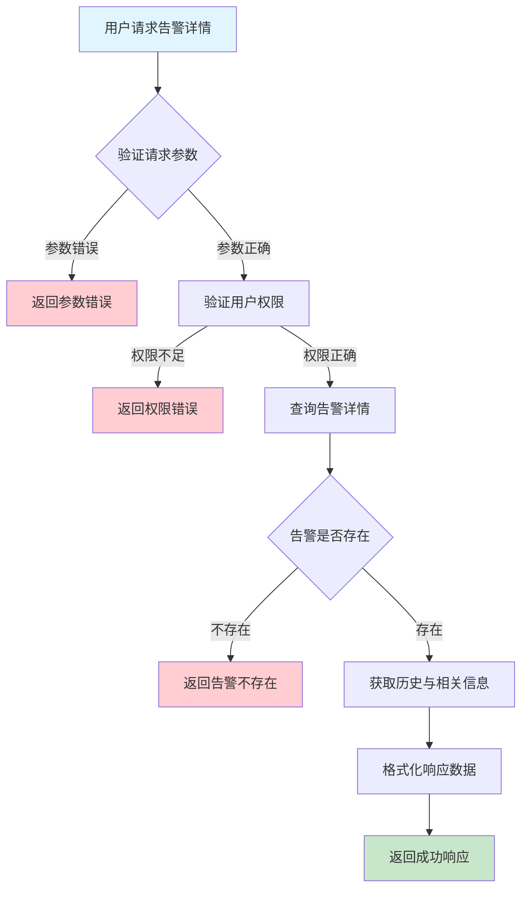
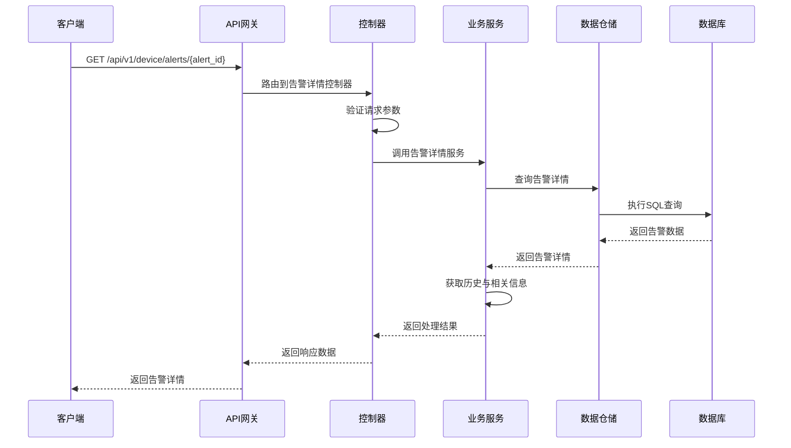

# 设备告警详情需求文档

## 1. 功能描述

### 1.1 功能概述
设备告警详情功能用于获取单条设备告警的详细信息，包括告警的基本属性、触发条件、处理记录、关联设备信息、历史变更等。该功能为用户提供告警溯源、分析和处理的依据。

### 1.2 主要功能列表
- 获取单条告警详细信息
- 展示告警触发条件与上下文
- 展示告警处理与变更记录
- 展示关联设备与相关告警
- 支持详情导出

### 1.3 支持的功能特性
- 结构化详情展示
- 处理记录追踪
- 关联信息联查
- 告警详情高亮
- 支持多终端访问

## 2. 功能目标

### 2.1 业务目标
- 提供完整的告警溯源信息
- 支持高效告警分析与处理
- 提升运维响应速度

### 2.2 技术目标
- 高效查询单条告警详情
- 支持复杂数据结构解析
- 确保数据一致性与准确性

### 2.3 安全目标
- 保护敏感告警信息
- 控制详情访问权限
- 审计所有详情访问操作

## 3. 输入输出说明

### 3.1 输入参数

#### 3.1.1 必需参数
- `alert_id` (string): 告警ID，指定要查询的告警

#### 3.1.2 可选参数
- `include_history` (boolean): 是否包含处理与变更历史，默认true
- `include_related` (boolean): 是否包含相关告警，默认false

### 3.2 输出参数

#### 3.2.1 成功响应
```json
{
  "code": 200,
  "message": "success",
  "data": {
    "id": "alert_001",
    "device_id": "device_001",
    "alert_type": "cpu_high",
    "alert_level": "critical",
    "title": "CPU使用率过高",
    "message": "设备CPU使用率达到95%，超过阈值90%",
    "details": {
      "cpu_usage": 95.2,
      "threshold": 90.0,
      "duration": "5分钟"
    },
    "status": "active",
    "created_at": "2024-01-15T10:30:00Z",
    "updated_at": "2024-01-15T10:30:00Z",
    "acknowledged_at": null,
    "resolved_at": null,
    "acknowledged_by": null,
    "resolved_by": null,
    "history": [
      {
        "action": "created",
        "operator": "system",
        "timestamp": "2024-01-15T10:30:00Z",
        "comment": "自动触发"
      }
    ],
    "related_alerts": [
      {
        "id": "alert_002",
        "alert_type": "memory_low",
        "status": "resolved"
      }
    ]
  }
}
```

#### 3.2.2 错误响应
```json
{
  "code": 404,
  "message": "告警不存在",
  "data": null
}
```

### 3.3 参数格式和约束
- 告警ID：长度1-64字符，字母、数字、下划线
- 布尔参数：true/false

## 4. 涉及接口以及接口设计

### 4.1 API接口定义

#### 4.1.1 获取告警详情
```go
// 获取告警详情
GET /api/v1/device/alerts/{alert_id}
```

**请求参数：**
- Path参数：alert_id
- Query参数：include_history, include_related

**响应结构：**
```go
type AlertDetailResponse struct {
    Code    int         `json:"code"`
    Message string      `json:"message"`
    Data    AlertDetail `json:"data"`
}

type AlertDetail struct {
    ID             string                 `json:"id"`
    DeviceID       string                 `json:"device_id"`
    AlertType      string                 `json:"alert_type"`
    AlertLevel     string                 `json:"alert_level"`
    Title          string                 `json:"title"`
    Message        string                 `json:"message"`
    Details        map[string]interface{} `json:"details"`
    Status         string                 `json:"status"`
    CreatedAt      time.Time              `json:"created_at"`
    UpdatedAt      time.Time              `json:"updated_at"`
    AcknowledgedAt *time.Time             `json:"acknowledged_at"`
    ResolvedAt     *time.Time             `json:"resolved_at"`
    AcknowledgedBy *string                `json:"acknowledged_by"`
    ResolvedBy     *string                `json:"resolved_by"`
    History        []AlertHistory         `json:"history"`
    RelatedAlerts  []RelatedAlert         `json:"related_alerts"`
}

type AlertHistory struct {
    Action    string    `json:"action"`
    Operator  string    `json:"operator"`
    Timestamp time.Time `json:"timestamp"`
    Comment   string    `json:"comment"`
}

type RelatedAlert struct {
    ID        string `json:"id"`
    AlertType string `json:"alert_type"`
    Status    string `json:"status"`
}
```

### 4.2 内部接口设计

#### 4.2.1 告警详情服务接口
```go
type AlertDetailService interface {
    // 获取告警详情
    GetAlertDetail(ctx context.Context, alertID string, includeHistory, includeRelated bool) (*AlertDetail, error)
    // 获取告警历史
    GetAlertHistory(ctx context.Context, alertID string) ([]AlertHistory, error)
    // 获取相关告警
    GetRelatedAlerts(ctx context.Context, alertID string) ([]RelatedAlert, error)
}
```

#### 4.2.2 告警详情仓储接口
```go
type AlertDetailRepository interface {
    // 根据ID获取告警详情
    GetByID(ctx context.Context, id string) (*AlertDetail, error)
    // 获取告警历史
    GetHistory(ctx context.Context, alertID string) ([]AlertHistory, error)
    // 获取相关告警
    GetRelated(ctx context.Context, alertID string) ([]RelatedAlert, error)
}
```

## 5. 数据结构设计

### 5.1 数据库表结构

#### 5.1.1 设备告警表 (device_alerts)
参考 deviceAlert.md

#### 5.1.2 告警历史表 (device_alert_history)
```sql
CREATE TABLE device_alert_history (
    id BIGINT AUTO_INCREMENT PRIMARY KEY COMMENT '历史ID',
    alert_id VARCHAR(64) NOT NULL COMMENT '告警ID',
    action VARCHAR(50) NOT NULL COMMENT '操作类型',
    operator VARCHAR(64) NOT NULL COMMENT '操作人',
    timestamp TIMESTAMP DEFAULT CURRENT_TIMESTAMP COMMENT '操作时间',
    comment TEXT COMMENT '备注',
    INDEX idx_alert_id (alert_id),
    INDEX idx_action (action),
    FOREIGN KEY (alert_id) REFERENCES device_alerts(id) ON DELETE CASCADE
) ENGINE=InnoDB DEFAULT CHARSET=utf8mb4 COMMENT='设备告警历史表';
```

### 5.2 模型结构定义

#### 5.2.1 告警详情模型
见4.1.1响应结构

#### 5.2.2 告警历史模型
```go
type AlertHistory struct {
    Action    string    `json:"action" db:"action"`
    Operator  string    `json:"operator" db:"operator"`
    Timestamp time.Time `json:"timestamp" db:"timestamp"`
    Comment   string    `json:"comment" db:"comment"`
}
```

### 5.3 数据关系说明
- 告警详情与设备表通过device_id关联
- 告警历史与告警表通过alert_id关联
- 相关告警通过设备ID和类型等条件联查

## 6. 异常处理

### 6.1 输入验证异常
- 告警ID为空或格式错误

### 6.2 业务逻辑异常
- 告警不存在
- 权限不足

### 6.3 系统异常
- 数据库连接失败
- 网络超时
- 系统资源不足

## 7. 交互流程图



## 8. 交互时序图



## 9. 安全与权限

### 9.1 访问控制策略
- 需要用户身份验证
- 验证用户对指定设备的访问权限
- 支持基于角色的访问控制(RBAC)
- 记录所有详情访问操作

### 9.2 数据安全要求
- 敏感信息脱敏
- 详情数据加密存储
- 支持数据访问审计
- 防止SQL注入

### 9.3 身份验证机制
- JWT令牌
- API密钥
- 请求频率限制
- IP白名单

## 10. 日志与审计要求

### 10.1 操作日志要求
- 记录所有详情访问操作
- 记录参数和结果
- 记录操作人员身份
- 记录操作时间和IP

### 10.2 审计日志要求
- 记录访问轨迹
- 记录身份和权限
- 记录访问目的
- 支持长期保存

### 10.3 日志格式规范
```json
{
  "timestamp": "2024-01-15T10:30:00Z",
  "level": "INFO",
  "service": "device-alert-detail",
  "operation": "get_alert_detail",
  "user_id": "user_001",
  "alert_id": "alert_001",
  "parameters": {
    "include_history": true,
    "include_related": false
  },
  "result": {
    "found": true,
    "has_history": true,
    "related_count": 1
  }
}
```

## 11. 测试用例

### 11.1 功能测试用例

#### 11.1.1 正常查询测试
**测试场景：** 获取告警详情
**输入数据：**
```json
{
  "alert_id": "alert_001"
}
```
**预期结果：**
- 返回状态码：200
- 返回告警详细信息
- 包含历史与相关信息

#### 11.1.2 不含历史测试
**测试场景：** 不包含历史
**输入数据：**
```json
{
  "alert_id": "alert_001",
  "include_history": false
}
```
**预期结果：**
- 返回状态码：200
- 不包含history字段

#### 11.1.3 包含相关告警测试
**测试场景：** 包含相关告警
**输入数据：**
```json
{
  "alert_id": "alert_001",
  "include_related": true
}
```
**预期结果：**
- 返回状态码：200
- 返回相关告警列表

### 11.2 性能测试用例

#### 11.2.1 大量历史查询测试
**测试场景：** 查询包含大量历史的告警
**测试数据：** 1000条历史记录
**预期结果：**
- 查询响应时间 < 1秒
- 数据完整

### 11.3 安全测试用例

#### 11.3.1 权限验证测试
**测试场景：** 验证用户访问权限
**测试数据：**
- 用户A：有设备访问权限
- 用户B：无设备访问权限
**预期结果：**
- 用户A：成功获取详情
- 用户B：返回权限错误

#### 11.3.2 敏感信息脱敏测试
**测试场景：** 敏感信息脱敏
**输入数据：**
```json
{
  "alert_id": "alert_with_sensitive"
}
```
**预期结果：**
- 敏感信息脱敏
- 不影响可读性

### 11.4 异常测试用例

#### 11.4.1 告警不存在测试
**测试场景：** 查询不存在的告警
**输入数据：**
```json
{
  "alert_id": "non_existent_alert"
}
```
**预期结果：**
- 返回404
- 错误信息友好

#### 11.4.2 参数错误测试
**测试场景：** 参数错误
**输入数据：**
```json
{
  "alert_id": ""
}
```
**预期结果：**
- 返回参数验证错误
- 状态码400

#### 11.4.3 系统异常测试
**测试场景：** 数据库连接失败
**测试方法：** 临时关闭数据库
**预期结果：**
- 返回500
- 记录详细错误日志 