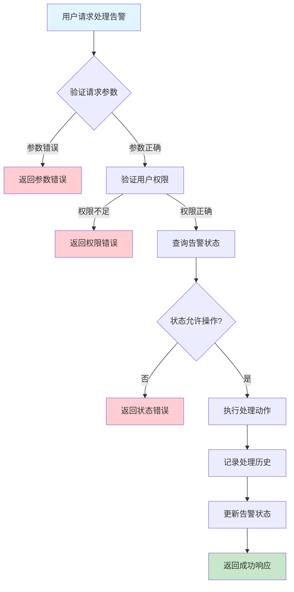
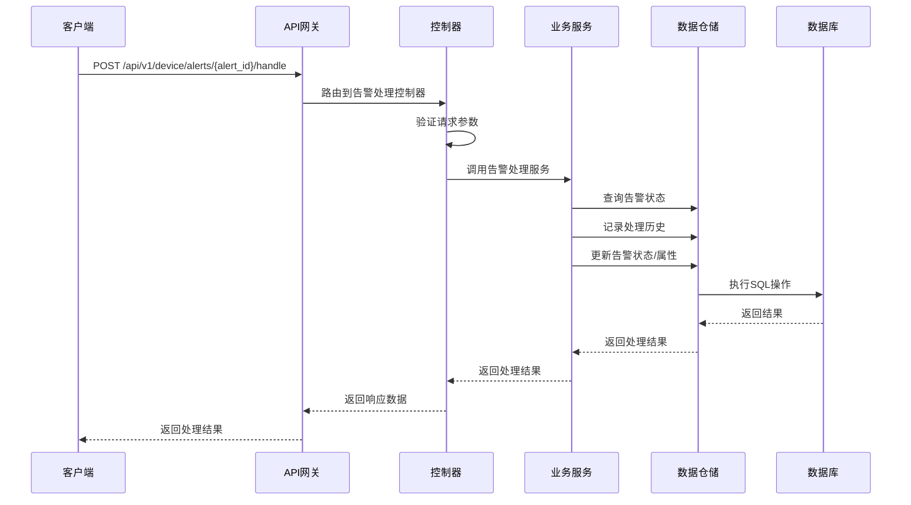

# 设备告警处理需求文档

## 1. 功能描述

### 1.1 功能概述
设备告警处理功能用于对设备产生的告警进行人工或自动处理，包括告警确认、告警解决、告警备注、告警升级、告警抑制等操作。该功能帮助用户及时响应和关闭异常，提升设备运维效率。

### 1.2 主要功能列表
- 告警确认（Acknowledge）
- 告警解决（Resolve）
- 告警备注（Comment）
- 告警升级（Escalate）
- 告警抑制（Suppress）
- 处理历史记录

### 1.3 支持的功能特性
- 多种处理动作支持
- 处理人身份记录
- 处理备注与原因
- 处理历史可追溯
- 支持批量处理

## 2. 功能目标

### 2.1 业务目标
- 快速响应和关闭告警
- 支持多角色协同处理
- 提升运维闭环效率

### 2.2 技术目标
- 高并发处理能力
- 处理操作可审计
- 数据一致性保障

### 2.3 安全目标
- 严格权限控制
- 防止误操作
- 处理操作全程审计

## 3. 输入输出说明

### 3.1 输入参数

#### 3.1.1 必需参数
- `alert_id` (string): 告警ID
- `action` (string): 处理动作（acknowledge、resolve、comment、escalate、suppress）

#### 3.1.2 可选参数
- `comment` (string): 处理备注
- `operator` (string): 处理人（如未传则取当前登录用户）
- `escalate_level` (string): 升级目标级别
- `suppress_duration` (int): 抑制时长（分钟）

### 3.2 输出参数

#### 3.2.1 成功响应
```json
{
  "code": 200,
  "message": "success",
  "data": {
    "alert_id": "alert_001",
    "action": "resolve",
    "operator": "user_001",
    "timestamp": "2024-01-15T11:00:00Z",
    "comment": "已处理，CPU负载恢复正常"
  }
}
```

#### 3.2.2 错误响应
```json
{
  "code": 400,
  "message": "参数错误或操作不允许",
  "data": null
}
```

### 3.3 参数格式和约束
- 告警ID：长度1-64字符，字母、数字、下划线
- 动作类型：acknowledge、resolve、comment、escalate、suppress
- 备注：最长500字符
- 升级级别：如critical、fatal等
- 抑制时长：正整数，1-1440（分钟）

## 4. 涉及接口以及接口设计

### 4.1 API接口定义

#### 4.1.1 处理告警
```go
// 处理告警
POST /api/v1/device/alerts/{alert_id}/handle
```

**请求参数：**
- Path参数：alert_id
- Body参数：action, comment, escalate_level, suppress_duration

**响应结构：**
```go
type AlertHandleResponse struct {
    Code    int    `json:"code"`
    Message string `json:"message"`
    Data    struct {
        AlertID   string    `json:"alert_id"`
        Action    string    `json:"action"`
        Operator  string    `json:"operator"`
        Timestamp time.Time `json:"timestamp"`
        Comment   string    `json:"comment"`
    } `json:"data"`
}
```

### 4.2 内部接口设计

#### 4.2.1 告警处理服务接口
```go
type AlertHandleService interface {
    // 处理告警
    HandleAlert(ctx context.Context, alertID string, req *AlertHandleRequest) (*AlertHandleResult, error)
}
```

#### 4.2.2 告警处理仓储接口
```go
type AlertHandleRepository interface {
    // 记录处理历史
    AddHandleHistory(ctx context.Context, alertID string, action string, operator string, comment string) error
    // 更新告警状态
    UpdateAlertStatus(ctx context.Context, alertID string, status string) error
    // 设置抑制/升级等属性
    UpdateAlertAttributes(ctx context.Context, alertID string, attrs map[string]interface{}) error
}
```

## 5. 数据结构设计

### 5.1 数据库表结构

#### 5.1.1 告警处理历史表 (device_alert_handle_history)
```sql
CREATE TABLE device_alert_handle_history (
    id BIGINT AUTO_INCREMENT PRIMARY KEY COMMENT '处理历史ID',
    alert_id VARCHAR(64) NOT NULL COMMENT '告警ID',
    action VARCHAR(50) NOT NULL COMMENT '处理动作',
    operator VARCHAR(64) NOT NULL COMMENT '处理人',
    timestamp TIMESTAMP DEFAULT CURRENT_TIMESTAMP COMMENT '处理时间',
    comment TEXT COMMENT '备注',
    escalate_level VARCHAR(20) COMMENT '升级级别',
    suppress_duration INT COMMENT '抑制时长(分钟)',
    INDEX idx_alert_id (alert_id),
    INDEX idx_action (action),
    FOREIGN KEY (alert_id) REFERENCES device_alerts(id) ON DELETE CASCADE
) ENGINE=InnoDB DEFAULT CHARSET=utf8mb4 COMMENT='设备告警处理历史表';
```

### 5.2 模型结构定义

#### 5.2.1 告警处理请求模型
```go
type AlertHandleRequest struct {
    Action          string `json:"action" v:"required"`
    Comment         string `json:"comment"`
    EscalateLevel   string `json:"escalate_level"`
    SuppressDuration int   `json:"suppress_duration"`
}
```

#### 5.2.2 告警处理结果模型
```go
type AlertHandleResult struct {
    AlertID   string    `json:"alert_id"`
    Action    string    `json:"action"`
    Operator  string    `json:"operator"`
    Timestamp time.Time `json:"timestamp"`
    Comment   string    `json:"comment"`
}
```

### 5.3 数据关系说明
- 处理历史与告警表通过alert_id关联
- 支持多种处理动作与属性

## 6. 异常处理

### 6.1 输入验证异常
- 告警ID为空或格式错误
- 动作类型不支持
- 备注超长

### 6.2 业务逻辑异常
- 告警不存在
- 权限不足
- 当前状态不允许操作

### 6.3 系统异常
- 数据库连接失败
- 网络超时
- 系统资源不足

## 7. 交互流程图



## 8. 交互时序图



## 9. 安全与权限

### 9.1 访问控制策略
- 需要用户身份验证
- 验证用户对指定设备的处理权限
- 支持基于角色的访问控制(RBAC)
- 记录所有处理操作

### 9.2 数据安全要求
- 防止误操作
- 处理操作需二次确认（如批量）
- 支持数据访问审计
- 防止SQL注入

### 9.3 身份验证机制
- JWT令牌
- API密钥
- 请求频率限制
- IP白名单

## 10. 日志与审计要求

### 10.1 操作日志要求
- 记录所有处理操作
- 记录参数和结果
- 记录操作人员身份
- 记录操作时间和IP

### 10.2 审计日志要求
- 记录处理轨迹
- 记录身份和权限
- 记录处理目的
- 支持长期保存

### 10.3 日志格式规范
```json
{
  "timestamp": "2024-01-15T11:00:00Z",
  "level": "INFO",
  "service": "device-alert-handle",
  "operation": "handle_alert",
  "user_id": "user_001",
  "alert_id": "alert_001",
  "parameters": {
    "action": "resolve",
    "comment": "已处理，CPU负载恢复正常"
  },
  "result": {
    "success": true
  }
}
```

## 11. 测试用例

### 11.1 功能测试用例

#### 11.1.1 正常处理测试
**测试场景：** 解决告警
**输入数据：**
```json
{
  "alert_id": "alert_001",
  "action": "resolve",
  "comment": "已处理，CPU负载恢复正常"
}
```
**预期结果：**
- 返回状态码：200
- 返回处理结果
- 告警状态变为resolved

#### 11.1.2 确认告警测试
**测试场景：** 确认告警
**输入数据：**
```json
{
  "alert_id": "alert_001",
  "action": "acknowledge",
  "comment": "已知晓，待处理"
}
```
**预期结果：**
- 返回状态码：200
- 告警状态变为acknowledged

#### 11.1.3 批量处理测试
**测试场景：** 批量处理多个告警
**输入数据：**
```json
[
  {"alert_id": "alert_001", "action": "resolve"},
  {"alert_id": "alert_002", "action": "acknowledge"}
]
```
**预期结果：**
- 所有告警均被正确处理
- 返回批量处理结果

### 11.2 性能测试用例

#### 11.2.1 高并发处理测试
**测试场景：** 并发处理1000个告警
**预期结果：**
- 平均响应时间 < 500ms
- 错误率 < 1%

### 11.3 安全测试用例

#### 11.3.1 权限验证测试
**测试场景：** 验证用户处理权限
**测试数据：**
- 用户A：有处理权限
- 用户B：无处理权限
**预期结果：**
- 用户A：成功处理
- 用户B：返回权限错误

#### 11.3.2 误操作防护测试
**测试场景：** 批量误操作防护
**输入数据：**
```json
[
  {"alert_id": "alert_001", "action": "resolve"},
  {"alert_id": "alert_002", "action": "resolve"}
]
```
**预期结果：**
- 需二次确认
- 未确认时不执行

### 11.4 异常测试用例

#### 11.4.1 参数错误测试
**测试场景：** 参数错误
**输入数据：**
```json
{
  "alert_id": "",
  "action": "invalid_action"
}
```
**预期结果：**
- 返回参数验证错误
- 状态码400

#### 11.4.2 告警不存在测试
**测试场景：** 处理不存在的告警
**输入数据：**
```json
{
  "alert_id": "non_existent_alert",
  "action": "resolve"
}
```
**预期结果：**
- 返回404
- 错误信息友好

#### 11.4.3 系统异常测试
**测试场景：** 数据库连接失败
**测试方法：** 临时关闭数据库
**预期结果：**
- 返回500
- 记录详细错误日志 