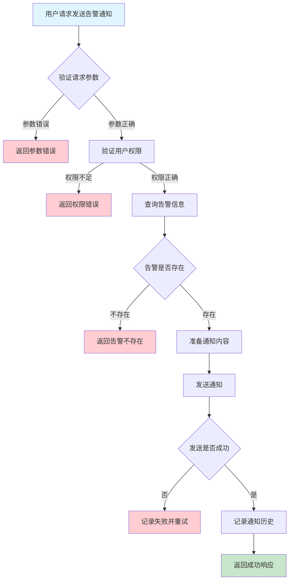
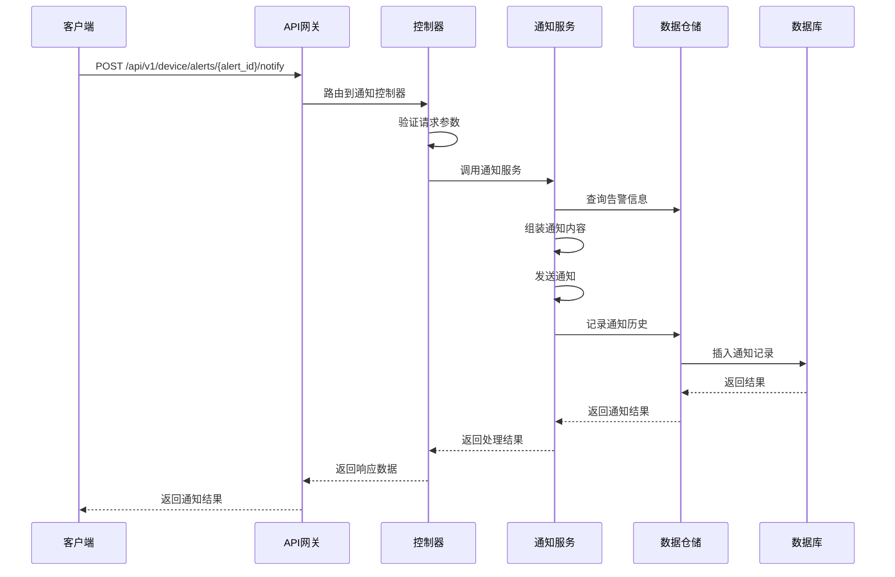

# 设备告警通知需求文档

## 1. 功能描述

### 1.1 功能概述
设备告警通知功能用于在设备产生异常告警时，自动将告警信息通过多种渠道（如邮件、短信、微信、钉钉等）及时通知相关人员，实现异常的快速响应和处理。

### 1.2 主要功能列表
- 告警通知渠道配置
- 告警通知模板管理
- 告警通知发送
- 通知历史记录查询
- 通知失败重试
- 通知接收人管理

### 1.3 支持的功能特性
- 多渠道并发通知
- 通知内容自定义
- 通知频率与去重控制
- 通知失败自动重试
- 通知状态追踪

## 2. 功能目标

### 2.1 业务目标
- 告警信息及时送达
- 降低漏报和延迟
- 提高异常响应速度

### 2.2 技术目标
- 高并发通知能力
- 通知可靠性保障
- 支持多渠道扩展

### 2.3 安全目标
- 通知内容安全合规
- 通知权限控制
- 通知操作可审计

## 3. 输入输出说明

### 3.1 输入参数

#### 3.1.1 必需参数
- `alert_id` (string): 告警ID
- `channels` (array[string]): 通知渠道（email、sms、wechat、dingtalk等）

#### 3.1.2 可选参数
- `recipients` (array[string]): 通知接收人
- `template_id` (string): 通知模板ID
- `content` (string): 自定义通知内容

### 3.2 输出参数

#### 3.2.1 成功响应
```json
{
  "code": 200,
  "message": "success",
  "data": {
    "alert_id": "alert_001",
    "channels": ["email", "sms"],
    "recipients": ["user1@example.com", "user2@example.com"],
    "status": "sent",
    "sent_at": "2024-01-15T12:00:00Z"
  }
}
```

#### 3.2.2 错误响应
```json
{
  "code": 400,
  "message": "参数错误或通知失败",
  "data": null
}
```

### 3.3 参数格式和约束
- 告警ID：1-64字符，字母、数字、下划线
- 渠道：email、sms、wechat、dingtalk等
- 接收人：邮箱、手机号、微信ID等
- 模板ID：1-64字符

## 4. 涉及接口以及接口设计

### 4.1 API接口定义

#### 4.1.1 发送告警通知
```go
// 发送告警通知
POST /api/v1/device/alerts/{alert_id}/notify
```

**请求参数：**
- Path参数：alert_id
- Body参数：channels, recipients, template_id, content

**响应结构：**
```go
type AlertNotifyResponse struct {
    Code    int    `json:"code"`
    Message string `json:"message"`
    Data    struct {
        AlertID    string   `json:"alert_id"`
        Channels   []string `json:"channels"`
        Recipients []string `json:"recipients"`
        Status     string   `json:"status"`
        SentAt     string   `json:"sent_at"`
    } `json:"data"`
}
```

#### 4.1.2 查询通知历史
```go
// 查询通知历史
GET /api/v1/device/alerts/{alert_id}/notify/history
```

**响应结构：**
```go
type AlertNotifyHistoryResponse struct {
    Code    int    `json:"code"`
    Message string `json:"message"`
    Data    []AlertNotifyHistory `json:"data"`
}

type AlertNotifyHistory struct {
    ID         string   `json:"id"`
    AlertID    string   `json:"alert_id"`
    Channel    string   `json:"channel"`
    Recipient  string   `json:"recipient"`
    Status     string   `json:"status"`
    SentAt     string   `json:"sent_at"`
    ErrorMsg   string   `json:"error_msg"`
}
```

### 4.2 内部接口设计

#### 4.2.1 告警通知服务接口
```go
type AlertNotifyService interface {
    SendAlertNotify(ctx context.Context, req *AlertNotifyRequest) (*AlertNotifyResult, error)
    GetNotifyHistory(ctx context.Context, alertID string) ([]AlertNotifyHistory, error)
}
```

#### 4.2.2 告警通知仓储接口
```go
type AlertNotifyRepository interface {
    AddNotifyRecord(ctx context.Context, record *AlertNotifyHistory) error
    GetNotifyHistory(ctx context.Context, alertID string) ([]AlertNotifyHistory, error)
    UpdateNotifyStatus(ctx context.Context, id string, status string, errorMsg string) error
}
```

## 5. 数据结构设计

### 5.1 数据库表结构

#### 5.1.1 告警通知历史表 (device_alert_notify_history)
```sql
CREATE TABLE device_alert_notify_history (
    id BIGINT AUTO_INCREMENT PRIMARY KEY COMMENT '通知记录ID',
    alert_id VARCHAR(64) NOT NULL COMMENT '告警ID',
    channel VARCHAR(20) NOT NULL COMMENT '通知渠道',
    recipient VARCHAR(100) NOT NULL COMMENT '接收人',
    status VARCHAR(20) NOT NULL COMMENT '通知状态',
    sent_at TIMESTAMP DEFAULT CURRENT_TIMESTAMP COMMENT '发送时间',
    error_msg TEXT COMMENT '错误信息',
    INDEX idx_alert_id (alert_id),
    INDEX idx_channel (channel),
    INDEX idx_status (status),
    FOREIGN KEY (alert_id) REFERENCES device_alerts(id) ON DELETE CASCADE
) ENGINE=InnoDB DEFAULT CHARSET=utf8mb4 COMMENT='设备告警通知历史表';
```

### 5.2 模型结构定义

#### 5.2.1 告警通知请求模型
```go
type AlertNotifyRequest struct {
    AlertID    string   `json:"alert_id" v:"required"`
    Channels   []string `json:"channels" v:"required"`
    Recipients []string `json:"recipients"`
    TemplateID string   `json:"template_id"`
    Content    string   `json:"content"`
}
```

#### 5.2.2 告警通知结果模型
```go
type AlertNotifyResult struct {
    AlertID    string   `json:"alert_id"`
    Channels   []string `json:"channels"`
    Recipients []string `json:"recipients"`
    Status     string   `json:"status"`
    SentAt     string   `json:"sent_at"`
}
```

### 5.3 数据关系说明
- 通知历史与告警表通过alert_id关联
- 支持多渠道多接收人

## 6. 异常处理

### 6.1 输入验证异常
- 告警ID为空或格式错误
- 渠道不支持
- 接收人格式错误

### 6.2 业务逻辑异常
- 告警不存在
- 通知模板不存在
- 权限不足
- 通知发送失败

### 6.3 系统异常
- 通知服务不可用
- 网络超时
- 数据库连接失败

## 7. 交互流程图



## 8. 交互时序图



## 9. 安全与权限

### 9.1 访问控制策略
- 需要用户身份验证
- 验证用户对告警的通知权限
- 支持基于角色的访问控制(RBAC)
- 记录所有通知操作

### 9.2 数据安全要求
- 通知内容脱敏
- 通知数据加密传输
- 支持数据访问审计

### 9.3 身份验证机制
- JWT令牌
- API密钥
- 请求频率限制
- IP白名单

## 10. 日志与审计要求

### 10.1 操作日志要求
- 记录所有通知操作
- 记录参数和结果
- 记录操作人员身份
- 记录操作时间和IP

### 10.2 审计日志要求
- 记录通知访问轨迹
- 记录身份和权限
- 记录通知目的
- 支持长期保存

### 10.3 日志格式规范
```json
{
  "timestamp": "2024-01-15T12:00:00Z",
  "level": "INFO",
  "service": "device-alert-notify",
  "operation": "send_alert_notify",
  "user_id": "user_001",
  "alert_id": "alert_001",
  "parameters": {
    "channels": ["email", "sms"],
    "recipients": ["user1@example.com"]
  },
  "result": {
    "status": "sent"
  }
}
```

## 11. 测试用例

### 11.1 功能测试用例

#### 11.1.1 正常通知测试
**测试场景：** 发送告警通知
**输入数据：**
```json
{
  "alert_id": "alert_001",
  "channels": ["email", "sms"],
  "recipients": ["user1@example.com"]
}
```
**预期结果：**
- 返回状态码：200
- 通知状态为sent
- 通知历史有记录

#### 11.1.2 多渠道通知测试
**测试场景：** 多渠道并发通知
**输入数据：**
```json
{
  "alert_id": "alert_001",
  "channels": ["email", "wechat"]
}
```
**预期结果：**
- 所有渠道均收到通知
- 通知状态正确

### 11.2 性能测试用例

#### 11.2.1 高并发通知测试
**测试场景：** 并发发送1000条通知
**预期结果：**
- 平均响应时间 < 1秒
- 错误率 < 1%

### 11.3 安全测试用例

#### 11.3.1 权限验证测试
**测试场景：** 验证用户通知权限
**测试数据：**
- 用户A：有权限
- 用户B：无权限
**预期结果：**
- 用户A：成功发送通知
- 用户B：返回权限错误

### 11.4 异常测试用例

#### 11.4.1 参数错误测试
**测试场景：** 参数错误
**输入数据：**
```json
{
  "alert_id": "",
  "channels": []
}
```
**预期结果：**
- 返回参数验证错误
- 状态码400

#### 11.4.2 告警不存在测试
**测试场景：** 通知不存在的告警
**输入数据：**
```json
{
  "alert_id": "non_existent_alert",
  "channels": ["email"]
}
```
**预期结果：**
- 返回404
- 错误信息友好

#### 11.4.3 通知服务异常测试
**测试场景：** 通知服务不可用
**测试方法：** 临时关闭通知服务
**预期结果：**
- 返回500
- 记录详细错误日志 