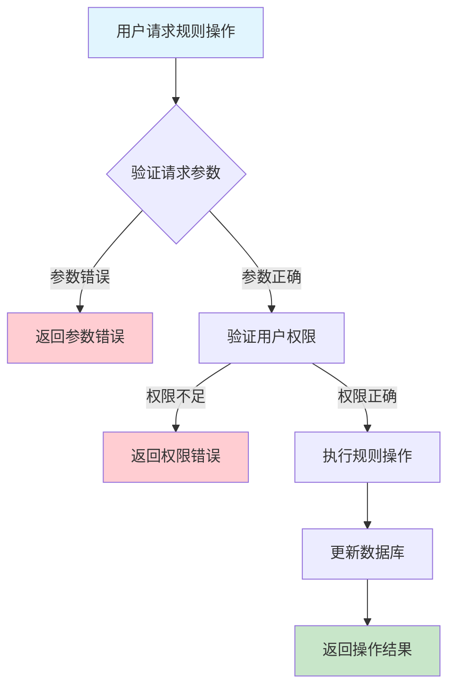
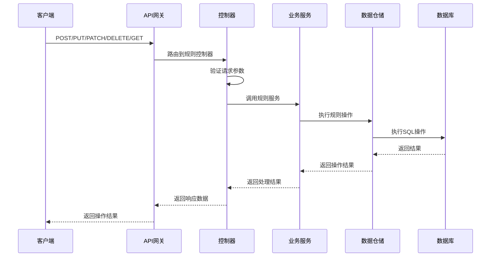

# 设备告警规则需求文档

## 1. 功能描述

### 1.1 功能概述
设备告警规则功能用于配置和管理设备的自动告警触发条件，包括规则的创建、修改、启用、禁用、删除、查询等。通过灵活的规则配置，实现对设备运行状态的自动监控和异常检测。

### 1.2 主要功能列表
- 创建告警规则
- 修改告警规则
- 启用/禁用告警规则
- 删除告警规则
- 查询告警规则列表
- 查询规则详情

### 1.3 支持的功能特性
- 多条件组合规则
- 支持多种告警类型
- 支持多级告警级别
- 规则启用/禁用切换
- 规则生效范围配置

## 2. 功能目标

### 2.1 业务目标
- 灵活配置设备监控告警
- 降低人工运维成本
- 提高异常发现及时性

### 2.2 技术目标
- 高效规则匹配与执行
- 规则变更实时生效
- 规则配置可审计

### 2.3 安全目标
- 规则操作权限控制
- 防止误配置
- 规则变更全程审计

## 3. 输入输出说明

### 3.1 输入参数

#### 3.1.1 必需参数
- `device_id` (string): 设备ID
- `rule_name` (string): 规则名称
- `alert_type` (string): 告警类型
- `alert_level` (string): 告警级别
- `condition_type` (string): 条件类型（如阈值、区间、表达式等）
- `condition_value` (object): 条件值

#### 3.1.2 可选参数
- `enabled` (boolean): 是否启用，默认true
- `scope` (string): 生效范围

### 3.2 输出参数

#### 3.2.1 成功响应
```json
{
  "code": 200,
  "message": "success",
  "data": {
    "rule_id": "rule_001",
    "device_id": "device_001",
    "rule_name": "CPU高负载告警",
    "alert_type": "cpu_high",
    "alert_level": "critical",
    "condition_type": "threshold",
    "condition_value": {"cpu_usage": ">90"},
    "enabled": true,
    "scope": "all",
    "created_at": "2024-01-15T10:00:00Z",
    "updated_at": "2024-01-15T10:00:00Z"
  }
}
```

#### 3.2.2 错误响应
```json
{
  "code": 400,
  "message": "参数错误或操作不允许",
  "data": null
}
```

### 3.3 参数格式和约束
- 设备ID/规则ID：长度1-64字符，字母、数字、下划线
- 规则名称：最长100字符
- 告警类型/级别：见基础字典
- 条件类型：threshold、range、expression等
- 条件值：JSON对象
- 布尔参数：true/false

## 4. 涉及接口以及接口设计

### 4.1 API接口定义

#### 4.1.1 创建告警规则
```go
// 创建规则
POST /api/v1/device/{device_id}/alert_rules
```

#### 4.1.2 修改告警规则
```go
// 修改规则
PUT /api/v1/device/alert_rules/{rule_id}
```

#### 4.1.3 启用/禁用规则
```go
// 启用/禁用
PATCH /api/v1/device/alert_rules/{rule_id}/enable
```

#### 4.1.4 删除规则
```go
// 删除规则
DELETE /api/v1/device/alert_rules/{rule_id}
```

#### 4.1.5 查询规则列表
```go
// 查询规则列表
GET /api/v1/device/{device_id}/alert_rules
```

#### 4.1.6 查询规则详情
```go
// 查询规则详情
GET /api/v1/device/alert_rules/{rule_id}
```

### 4.2 内部接口设计

#### 4.2.1 告警规则服务接口
```go
type AlertRuleService interface {
    CreateRule(ctx context.Context, req *AlertRuleRequest) (*AlertRule, error)
    UpdateRule(ctx context.Context, ruleID string, req *AlertRuleRequest) error
    EnableRule(ctx context.Context, ruleID string, enable bool) error
    DeleteRule(ctx context.Context, ruleID string) error
    GetRuleList(ctx context.Context, deviceID string) ([]AlertRule, error)
    GetRuleDetail(ctx context.Context, ruleID string) (*AlertRule, error)
}
```

#### 4.2.2 告警规则仓储接口
```go
type AlertRuleRepository interface {
    Create(ctx context.Context, rule *AlertRule) error
    Update(ctx context.Context, rule *AlertRule) error
    Enable(ctx context.Context, ruleID string, enable bool) error
    Delete(ctx context.Context, ruleID string) error
    GetList(ctx context.Context, deviceID string) ([]AlertRule, error)
    GetByID(ctx context.Context, ruleID string) (*AlertRule, error)
}
```

## 5. 数据结构设计

### 5.1 数据库表结构

#### 5.1.1 告警规则表 (device_alert_rules)
```sql
CREATE TABLE device_alert_rules (
    id VARCHAR(64) PRIMARY KEY COMMENT '规则ID',
    device_id VARCHAR(64) NOT NULL COMMENT '设备ID',
    rule_name VARCHAR(100) NOT NULL COMMENT '规则名称',
    alert_type VARCHAR(50) NOT NULL COMMENT '告警类型',
    alert_level VARCHAR(20) NOT NULL COMMENT '告警级别',
    condition_type VARCHAR(20) NOT NULL COMMENT '条件类型',
    condition_value JSON NOT NULL COMMENT '条件值',
    enabled BOOLEAN DEFAULT TRUE COMMENT '是否启用',
    scope VARCHAR(50) COMMENT '生效范围',
    created_at TIMESTAMP DEFAULT CURRENT_TIMESTAMP COMMENT '创建时间',
    updated_at TIMESTAMP DEFAULT CURRENT_TIMESTAMP ON UPDATE CURRENT_TIMESTAMP COMMENT '更新时间',
    INDEX idx_device_id (device_id),
    INDEX idx_alert_type (alert_type),
    INDEX idx_enabled (enabled),
    FOREIGN KEY (device_id) REFERENCES devices(id) ON DELETE CASCADE
) ENGINE=InnoDB DEFAULT CHARSET=utf8mb4 COMMENT='设备告警规则表';
```

### 5.2 模型结构定义

#### 5.2.1 告警规则模型
```go
type AlertRule struct {
    ID             string                 `json:"id" db:"id"`
    DeviceID       string                 `json:"device_id" db:"device_id"`
    RuleName       string                 `json:"rule_name" db:"rule_name"`
    AlertType      string                 `json:"alert_type" db:"alert_type"`
    AlertLevel     string                 `json:"alert_level" db:"alert_level"`
    ConditionType  string                 `json:"condition_type" db:"condition_type"`
    ConditionValue map[string]interface{} `json:"condition_value" db:"condition_value"`
    Enabled        bool                   `json:"enabled" db:"enabled"`
    Scope          string                 `json:"scope" db:"scope"`
    CreatedAt      time.Time              `json:"created_at" db:"created_at"`
    UpdatedAt      time.Time              `json:"updated_at" db:"updated_at"`
}
```

#### 5.2.2 告警规则请求模型
```go
type AlertRuleRequest struct {
    RuleName       string                 `json:"rule_name" v:"required"`
    AlertType      string                 `json:"alert_type" v:"required"`
    AlertLevel     string                 `json:"alert_level" v:"required"`
    ConditionType  string                 `json:"condition_type" v:"required"`
    ConditionValue map[string]interface{} `json:"condition_value" v:"required"`
    Enabled        bool                   `json:"enabled"`
    Scope          string                 `json:"scope"`
}
```

### 5.3 数据关系说明
- 规则与设备表通过device_id关联
- 规则与告警表通过alert_type/alert_level等关联

## 6. 异常处理

### 6.1 输入验证异常
- 设备ID/规则ID为空或格式错误
- 规则名称超长
- 条件类型/值不合法

### 6.2 业务逻辑异常
- 设备不存在
- 规则不存在
- 权限不足
- 规则冲突

### 6.3 系统异常
- 数据库连接失败
- 网络超时
- 系统资源不足

## 7. 交互流程图



## 8. 交互时序图



## 9. 安全与权限

### 9.1 访问控制策略
- 需要用户身份验证
- 验证用户对设备的规则管理权限
- 支持基于角色的访问控制(RBAC)
- 记录所有规则操作

### 9.2 数据安全要求
- 防止误配置
- 规则操作需二次确认（如删除）
- 支持数据访问审计
- 防止SQL注入

### 9.3 身份验证机制
- JWT令牌
- API密钥
- 请求频率限制
- IP白名单

## 10. 日志与审计要求

### 10.1 操作日志要求
- 记录所有规则操作
- 记录参数和结果
- 记录操作人员身份
- 记录操作时间和IP

### 10.2 审计日志要求
- 记录规则变更轨迹
- 记录身份和权限
- 记录操作目的
- 支持长期保存

### 10.3 日志格式规范
```json
{
  "timestamp": "2024-01-15T10:00:00Z",
  "level": "INFO",
  "service": "device-alert-rule",
  "operation": "create_rule",
  "user_id": "user_001",
  "device_id": "device_001",
  "parameters": {
    "rule_name": "CPU高负载告警",
    "alert_type": "cpu_high",
    "alert_level": "critical"
  },
  "result": {
    "success": true,
    "rule_id": "rule_001"
  }
}
```

## 11. 测试用例

### 11.1 功能测试用例

#### 11.1.1 创建规则测试
**测试场景：** 创建新规则
**输入数据：**
```json
{
  "device_id": "device_001",
  "rule_name": "CPU高负载告警",
  "alert_type": "cpu_high",
  "alert_level": "critical",
  "condition_type": "threshold",
  "condition_value": {"cpu_usage": ">90"}
}
```
**预期结果：**
- 返回状态码：200
- 返回新规则ID

#### 11.1.2 修改规则测试
**测试场景：** 修改规则
**输入数据：**
```json
{
  "rule_id": "rule_001",
  "rule_name": "CPU高负载告警-更新",
  "condition_value": {"cpu_usage": ">95"}
}
```
**预期结果：**
- 返回状态码：200
- 规则内容更新

#### 11.1.3 启用/禁用规则测试
**测试场景：** 启用规则
**输入数据：**
```json
{
  "rule_id": "rule_001",
  "enabled": true
}
```
**预期结果：**
- 返回状态码：200
- 规则状态变更

#### 11.1.4 删除规则测试
**测试场景：** 删除规则
**输入数据：**
```json
{
  "rule_id": "rule_001"
}
```
**预期结果：**
- 返回状态码：200
- 规则被删除

#### 11.1.5 查询规则列表测试
**测试场景：** 查询规则列表
**输入数据：**
```json
{
  "device_id": "device_001"
}
```
**预期结果：**
- 返回状态码：200
- 返回规则列表

### 11.2 性能测试用例

#### 11.2.1 大量规则查询测试
**测试场景：** 查询1000条规则
**预期结果：**
- 查询响应时间 < 1秒
- 数据完整

### 11.3 安全测试用例

#### 11.3.1 权限验证测试
**测试场景：** 验证用户规则管理权限
**测试数据：**
- 用户A：有权限
- 用户B：无权限
**预期结果：**
- 用户A：成功操作
- 用户B：返回权限错误

#### 11.3.2 误操作防护测试
**测试场景：** 删除规则需二次确认
**输入数据：**
```json
{
  "rule_id": "rule_001"
}
```
**预期结果：**
- 未确认时不执行
- 返回提示

### 11.4 异常测试用例

#### 11.4.1 参数错误测试
**测试场景：** 参数错误
**输入数据：**
```json
{
  "device_id": "",
  "rule_name": ""
}
```
**预期结果：**
- 返回参数验证错误
- 状态码400

#### 11.4.2 规则不存在测试
**测试场景：** 操作不存在的规则
**输入数据：**
```json
{
  "rule_id": "non_existent_rule"
}
```
**预期结果：**
- 返回404
- 错误信息友好

#### 11.4.3 系统异常测试
**测试场景：** 数据库连接失败
**测试方法：** 临时关闭数据库
**预期结果：**
- 返回500
- 记录详细错误日志 