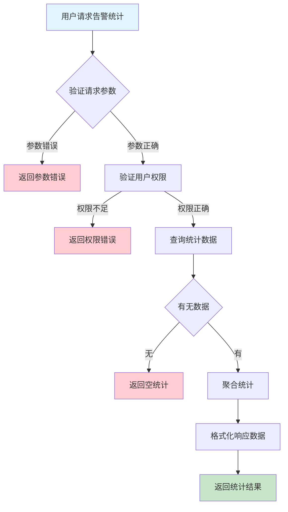
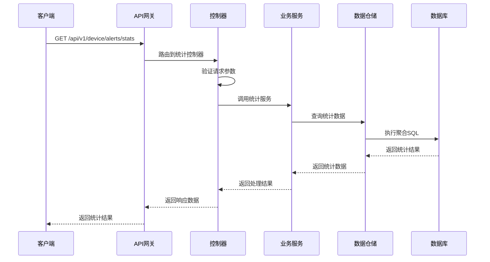

# 设备告警统计需求文档

## 1. 功能描述

### 1.1 功能概述
设备告警统计功能用于对设备产生的各类告警进行多维度统计分析，包括告警数量、类型、级别、状态、趋势等。该功能帮助用户全面了解设备运行健康状况和异常分布，辅助运维决策和优化。

### 1.2 主要功能列表
- 告警总数统计
- 按类型/级别/状态统计
- 告警趋势分析（按天/周/月）
- 活跃告警统计
- 已解决/未解决告警统计
- 多设备告警对比

### 1.3 支持的功能特性
- 多维度聚合统计
- 支持时间范围筛选
- 支持多设备批量统计
- 支持导出统计结果
- 支持图表展示

## 2. 功能目标

### 2.1 业务目标
- 全面掌握设备异常分布
- 辅助运维优化和决策
- 提高异常响应效率

### 2.2 技术目标
- 高效大数据统计能力
- 实时统计与历史分析结合
- 统计结果可视化

### 2.3 安全目标
- 统计数据权限控制
- 防止敏感数据泄露
- 统计操作可审计

## 3. 输入输出说明

### 3.1 输入参数

#### 3.1.1 必需参数
- `device_ids` (array[string]): 设备ID列表

#### 3.1.2 可选参数
- `start_time` (string): 统计起始时间，格式：YYYY-MM-DD HH:mm:ss
- `end_time` (string): 统计结束时间，格式：YYYY-MM-DD HH:mm:ss
- `group_by` (string): 聚合维度（type、level、status、date等）
- `interval` (string): 趋势统计间隔（day、week、month）
- `status` (string): 告警状态筛选

### 3.2 输出参数

#### 3.2.1 成功响应
```json
{
  "code": 200,
  "message": "success",
  "data": {
    "total": 120,
    "by_type": {"cpu_high": 40, "memory_low": 30, "disk_full": 50},
    "by_level": {"critical": 60, "warning": 40, "info": 20},
    "by_status": {"active": 20, "resolved": 100},
    "trend": [
      {"date": "2024-01-10", "count": 10},
      {"date": "2024-01-11", "count": 15}
    ]
  }
}
```

#### 3.2.2 错误响应
```json
{
  "code": 400,
  "message": "参数错误",
  "data": null
}
```

### 3.3 参数格式和约束
- 设备ID：1-64字符，字母、数字、下划线
- 时间格式：ISO 8601
- 聚合维度：type、level、status、date
- 间隔：day、week、month

## 4. 涉及接口以及接口设计

### 4.1 API接口定义

#### 4.1.1 获取告警统计
```go
// 获取告警统计
GET /api/v1/device/alerts/stats
```

**请求参数：**
- Query参数：device_ids, start_time, end_time, group_by, interval, status

**响应结构：**
```go
type AlertStatsResponse struct {
    Code    int    `json:"code"`
    Message string `json:"message"`
    Data    AlertStatsData `json:"data"`
}

type AlertStatsData struct {
    Total   int64                  `json:"total"`
    ByType  map[string]int64       `json:"by_type"`
    ByLevel map[string]int64       `json:"by_level"`
    ByStatus map[string]int64      `json:"by_status"`
    Trend   []AlertTrendPoint      `json:"trend"`
}

type AlertTrendPoint struct {
    Date  string `json:"date"`
    Count int64  `json:"count"`
}
```

### 4.2 内部接口设计

#### 4.2.1 告警统计服务接口
```go
type AlertStatsService interface {
    GetAlertStats(ctx context.Context, req *AlertStatsRequest) (*AlertStatsData, error)
}
```

#### 4.2.2 告警统计仓储接口
```go
type AlertStatsRepository interface {
    QueryStats(ctx context.Context, req *AlertStatsRequest) (*AlertStatsData, error)
}
```

## 5. 数据结构设计

### 5.1 数据库表结构
- 复用 device_alerts 表
- 可结合数据仓库/OLAP表优化统计

### 5.2 模型结构定义
```go
type AlertStatsRequest struct {
    DeviceIDs []string `json:"device_ids" v:"required"`
    StartTime string   `json:"start_time"`
    EndTime   string   `json:"end_time"`
    GroupBy   string   `json:"group_by"`
    Interval  string   `json:"interval"`
    Status    string   `json:"status"`
}
```

### 5.3 数据关系说明
- 统计数据来源于 device_alerts
- 支持多维度聚合与趋势分析

## 6. 异常处理

### 6.1 输入验证异常
- 设备ID为空或格式错误
- 时间格式不正确
- 聚合维度非法

### 6.2 业务逻辑异常
- 设备不存在
- 无告警数据
- 权限不足

### 6.3 系统异常
- 数据库连接失败
- 查询超时
- 系统资源不足

## 7. 交互流程图



## 8. 交互时序图



## 9. 安全与权限

### 9.1 访问控制策略
- 需要用户身份验证
- 验证用户对设备的统计权限
- 支持基于角色的访问控制(RBAC)
- 记录所有统计操作

### 9.2 数据安全要求
- 敏感数据脱敏
- 统计结果加密传输
- 支持数据访问审计

### 9.3 身份验证机制
- JWT令牌
- API密钥
- 请求频率限制
- IP白名单

## 10. 日志与审计要求

### 10.1 操作日志要求
- 记录所有统计操作
- 记录参数和结果
- 记录操作人员身份
- 记录操作时间和IP

### 10.2 审计日志要求
- 记录统计访问轨迹
- 记录身份和权限
- 记录统计目的
- 支持长期保存

### 10.3 日志格式规范
```json
{
  "timestamp": "2024-01-15T12:00:00Z",
  "level": "INFO",
  "service": "device-alert-stats",
  "operation": "get_alert_stats",
  "user_id": "user_001",
  "device_ids": ["device_001", "device_002"],
  "parameters": {
    "start_time": "2024-01-01T00:00:00Z",
    "end_time": "2024-01-15T23:59:59Z",
    "group_by": "type"
  },
  "result": {
    "total": 120,
    "by_type": {"cpu_high": 40, "memory_low": 30, "disk_full": 50}
  }
}
```

## 11. 测试用例

### 11.1 功能测试用例

#### 11.1.1 正常统计测试
**测试场景：** 获取设备告警统计
**输入数据：**
```json
{
  "device_ids": ["device_001", "device_002"],
  "start_time": "2024-01-01T00:00:00Z",
  "end_time": "2024-01-15T23:59:59Z",
  "group_by": "type"
}
```
**预期结果：**
- 返回状态码：200
- 返回统计数据
- 数据格式正确

#### 11.1.2 趋势统计测试
**测试场景：** 获取告警趋势
**输入数据：**
```json
{
  "device_ids": ["device_001"],
  "interval": "day"
}
```
**预期结果：**
- 返回趋势数据
- 按天聚合

### 11.2 性能测试用例

#### 11.2.1 大量数据统计测试
**测试场景：** 统计百万级告警数据
**预期结果：**
- 响应时间 < 2秒
- 错误率 < 1%

### 11.3 安全测试用例

#### 11.3.1 权限验证测试
**测试场景：** 验证用户统计权限
**测试数据：**
- 用户A：有权限
- 用户B：无权限
**预期结果：**
- 用户A：成功获取统计
- 用户B：返回权限错误

### 11.4 异常测试用例

#### 11.4.1 参数错误测试
**测试场景：** 参数错误
**输入数据：**
```json
{
  "device_ids": [],
  "group_by": "invalid"
}
```
**预期结果：**
- 返回参数验证错误
- 状态码400

#### 11.4.2 设备不存在测试
**测试场景：** 统计不存在设备
**输入数据：**
```json
{
  "device_ids": ["non_existent_device"]
}
```
**预期结果：**
- 返回404
- 错误信息友好

#### 11.4.3 系统异常测试
**测试场景：** 数据库连接失败
**测试方法：** 临时关闭数据库
**预期结果：**
- 返回500
- 记录详细错误日志 