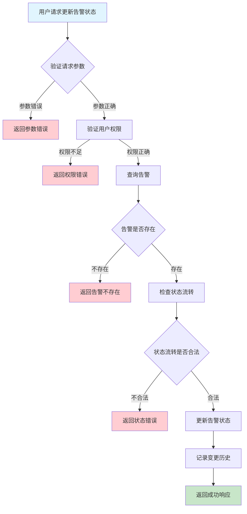
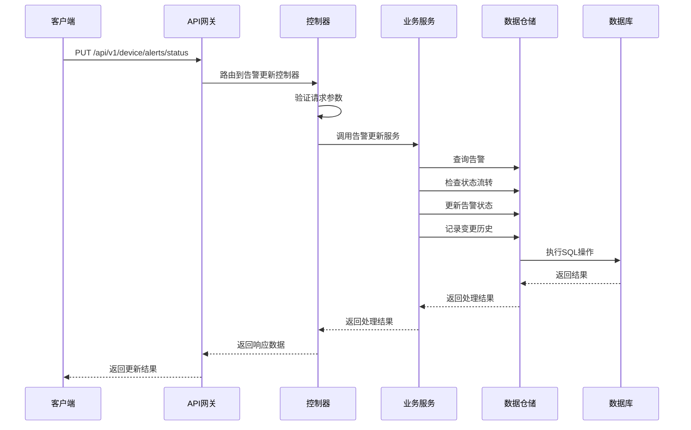

# 设备告警更新需求文档

## 1. 功能描述

### 1.1 功能概述
设备告警更新功能用于对设备产生的告警状态进行变更，包括告警的确认、解决、关闭、备注等操作。该功能支持告警生命周期管理，便于运维人员跟踪和处理异常。

### 1.2 主要功能列表
- 更新告警状态（active、acknowledged、resolved、closed等）
- 添加/修改告警备注
- 记录状态变更历史
- 支持批量状态更新

### 1.3 支持的功能特性
- 多状态流转
- 状态变更可追溯
- 支持批量操作
- 变更操作权限控制

## 2. 功能目标

### 2.1 业务目标
- 支持告警全生命周期管理
- 提高告警处理效率
- 便于异常跟踪和归档

### 2.2 技术目标
- 高效批量状态更新
- 状态变更数据一致性
- 变更历史可追溯

### 2.3 安全目标
- 严格权限控制
- 防止误操作
- 变更操作可审计

## 3. 输入输出说明

### 3.1 输入参数

#### 3.1.1 必需参数
- `alert_ids` (array[string]): 告警ID列表
- `status` (string): 目标状态（acknowledged、resolved、closed等）

#### 3.1.2 可选参数
- `comment` (string): 备注
- `operator` (string): 操作人

### 3.2 输出参数

#### 3.2.1 成功响应
```json
{
  "code": 200,
  "message": "success",
  "data": {
    "updated": ["alert_001", "alert_002"],
    "status": "resolved",
    "operator": "user_001",
    "updated_at": "2024-01-15T14:00:00Z"
  }
}
```

#### 3.2.2 错误响应
```json
{
  "code": 400,
  "message": "参数错误或操作不允许",
  "data": null
}
```

### 3.3 参数格式和约束
- 告警ID：1-64字符，字母、数字、下划线
- 状态：acknowledged、resolved、closed、suppressed等
- 备注：最长500字符

## 4. 涉及接口以及接口设计

### 4.1 API接口定义

#### 4.1.1 更新告警状态
```go
// 更新告警状态
PUT /api/v1/device/alerts/status
```

**请求参数：**
- Body参数：alert_ids, status, comment, operator

**响应结构：**
```go
type AlertUpdateResponse struct {
    Code    int    `json:"code"`
    Message string `json:"message"`
    Data    struct {
        Updated   []string `json:"updated"`
        Status    string   `json:"status"`
        Operator  string   `json:"operator"`
        UpdatedAt string   `json:"updated_at"`
    } `json:"data"`
}
```

### 4.2 内部接口设计

#### 4.2.1 告警更新服务接口
```go
type AlertUpdateService interface {
    UpdateAlertStatus(ctx context.Context, req *AlertUpdateRequest) (*AlertUpdateResult, error)
}
```

#### 4.2.2 告警更新仓储接口
```go
type AlertUpdateRepository interface {
    UpdateStatus(ctx context.Context, alertIDs []string, status string, comment string, operator string) error
    AddStatusHistory(ctx context.Context, alertID string, status string, operator string, comment string) error
}
```

## 5. 数据结构设计

### 5.1 数据库表结构
- 复用 device_alerts 表
- 新增 device_alert_status_history 表

#### 5.1.1 告警状态变更历史表 (device_alert_status_history)
```sql
CREATE TABLE device_alert_status_history (
    id BIGINT AUTO_INCREMENT PRIMARY KEY COMMENT '历史ID',
    alert_id VARCHAR(64) NOT NULL COMMENT '告警ID',
    status VARCHAR(20) NOT NULL COMMENT '变更状态',
    operator VARCHAR(64) NOT NULL COMMENT '操作人',
    comment TEXT COMMENT '备注',
    updated_at TIMESTAMP DEFAULT CURRENT_TIMESTAMP COMMENT '变更时间',
    INDEX idx_alert_id (alert_id),
    INDEX idx_status (status),
    FOREIGN KEY (alert_id) REFERENCES device_alerts(id) ON DELETE CASCADE
) ENGINE=InnoDB DEFAULT CHARSET=utf8mb4 COMMENT='设备告警状态变更历史表';
```

### 5.2 模型结构定义
```go
type AlertUpdateRequest struct {
    AlertIDs []string `json:"alert_ids" v:"required"`
    Status   string   `json:"status" v:"required"`
    Comment  string   `json:"comment"`
    Operator string   `json:"operator"`
}

type AlertUpdateResult struct {
    Updated   []string `json:"updated"`
    Status    string   `json:"status"`
    Operator  string   `json:"operator"`
    UpdatedAt string   `json:"updated_at"`
}
```

### 5.3 数据关系说明
- 状态变更历史与告警表通过alert_id关联
- 支持批量状态变更

## 6. 异常处理

### 6.1 输入验证异常
- 告警ID为空或格式错误
- 状态非法
- 备注超长

### 6.2 业务逻辑异常
- 告警不存在
- 权限不足
- 状态流转不允许

### 6.3 系统异常
- 数据库连接失败
- 网络超时
- 系统资源不足

## 7. 交互流程图



## 8. 交互时序图



## 9. 安全与权限

### 9.1 访问控制策略
- 需要用户身份验证
- 验证用户对告警的操作权限
- 支持基于角色的访问控制(RBAC)
- 记录所有状态变更操作

### 9.2 数据安全要求
- 防止误操作
- 状态变更需二次确认（如批量）
- 支持数据访问审计
- 防止SQL注入

### 9.3 身份验证机制
- JWT令牌
- API密钥
- 请求频率限制
- IP白名单

## 10. 日志与审计要求

### 10.1 操作日志要求
- 记录所有状态变更操作
- 记录参数和结果
- 记录操作人员身份
- 记录操作时间和IP

### 10.2 审计日志要求
- 记录状态变更轨迹
- 记录身份和权限
- 记录操作目的
- 支持长期保存

### 10.3 日志格式规范
```json
{
  "timestamp": "2024-01-15T14:00:00Z",
  "level": "INFO",
  "service": "device-alert-update",
  "operation": "update_alert_status",
  "user_id": "user_001",
  "parameters": {
    "alert_ids": ["alert_001", "alert_002"],
    "status": "resolved"
  },
  "result": {
    "updated": ["alert_001", "alert_002"],
    "status": "resolved"
  }
}
```

## 11. 测试用例

### 11.1 功能测试用例

#### 11.1.1 正常状态更新测试
**测试场景：** 批量更新告警状态
**输入数据：**
```json
{
  "alert_ids": ["alert_001", "alert_002"],
  "status": "resolved"
}
```
**预期结果：**
- 返回状态码：200
- 状态变更成功
- 变更历史有记录

#### 11.1.2 添加备注测试
**测试场景：** 更新状态并添加备注
**输入数据：**
```json
{
  "alert_ids": ["alert_003"],
  "status": "acknowledged",
  "comment": "已知晓，待处理"
}
```
**预期结果：**
- 返回状态码：200
- 备注被记录

### 11.2 性能测试用例

#### 11.2.1 大量告警批量更新测试
**测试场景：** 批量更新1000条告警
**预期结果：**
- 响应时间 < 2秒
- 错误率 < 1%

### 11.3 安全测试用例

#### 11.3.1 权限验证测试
**测试场景：** 验证用户状态变更权限
**测试数据：**
- 用户A：有权限
- 用户B：无权限
**预期结果：**
- 用户A：成功变更
- 用户B：返回权限错误

#### 11.3.2 误操作防护测试
**测试场景：** 批量误操作防护
**输入数据：**
```json
{
  "alert_ids": ["alert_004", "alert_005"],
  "status": "closed"
}
```
**预期结果：**
- 需二次确认
- 未确认时不执行

### 11.4 异常测试用例

#### 11.4.1 参数错误测试
**测试场景：** 参数错误
**输入数据：**
```json
{
  "alert_ids": [],
  "status": "invalid"
}
```
**预期结果：**
- 返回参数验证错误
- 状态码400

#### 11.4.2 告警不存在测试
**测试场景：** 更新不存在的告警
**输入数据：**
```json
{
  "alert_ids": ["non_existent_alert"],
  "status": "resolved"
}
```
**预期结果：**
- 返回404
- 错误信息友好

#### 11.4.3 系统异常测试
**测试场景：** 数据库连接失败
**测试方法：** 临时关闭数据库
**预期结果：**
- 返回500
- 记录详细错误日志 