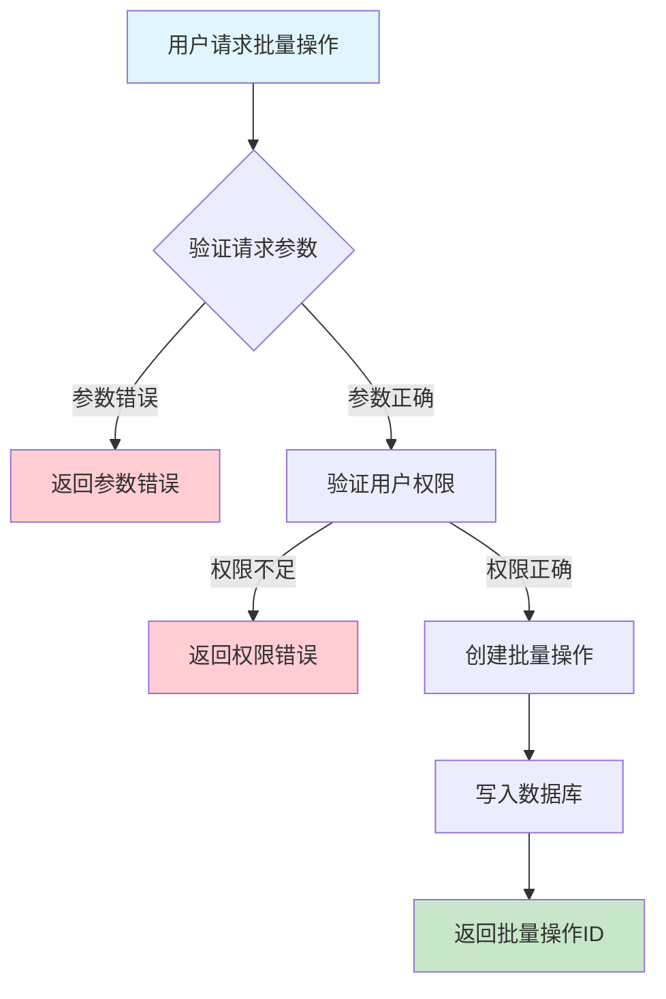
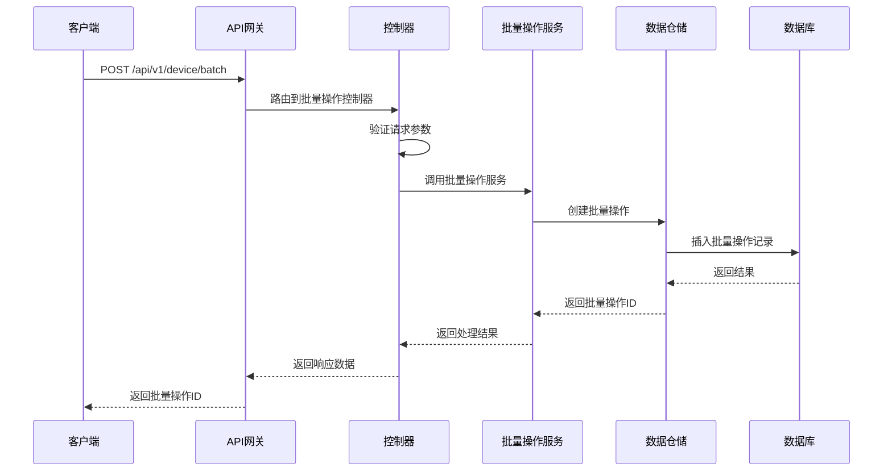

# 设备批量操作需求文档

## 1. 功能描述

### 1.1 功能概述
设备批量操作功能用于对多台设备同时执行相同的操作，如批量下发命令、批量配置、批量重启、批量升级等，提升运维效率，减少重复性工作。

### 1.2 主要功能列表
- 批量命令下发
- 批量配置下发
- 批量重启/升级/重置
- 批量状态变更
- 批量操作结果查询

### 1.3 支持的功能特性
- 支持多种批量操作类型
- 支持批量操作进度跟踪
- 支持批量操作结果统计
- 支持失败重试

## 2. 功能目标

### 2.1 业务目标
- 提高大规模设备运维效率
- 降低人工操作成本
- 支持复杂批量业务场景

### 2.2 技术目标
- 高并发批量操作能力
- 操作状态一致性保障
- 操作结果可追溯

### 2.3 安全目标
- 批量操作权限控制
- 防止误操作
- 操作可审计

## 3. 输入输出说明

### 3.1 输入参数

#### 3.1.1 必需参数
- `operation_type` (string): 操作类型（command/config/restart/upgrade/reset等）
- `device_ids` (array[string]): 设备ID列表

#### 3.1.2 可选参数
- `params` (object): 操作参数
- `schedule_time` (string): 定时操作时间
- `operator` (string): 操作人

### 3.2 输出参数

#### 3.2.1 成功响应
```json
{
  "code": 200,
  "message": "success",
  "data": {
    "batch_id": "batch_001",
    "device_ids": ["device_001", "device_002"],
    "operation_type": "restart",
    "status": "pending",
    "created_at": "2024-01-15T16:30:00Z"
  }
}
```

#### 3.2.2 错误响应
```json
{
  "code": 400,
  "message": "参数错误或操作不允许",
  "data": null
}
```

### 3.3 参数格式和约束
- 操作类型：command、config、restart、upgrade、reset等
- 设备ID：1-64字符，字母、数字、下划线
- 定时操作时间：ISO 8601格式

## 4. 涉及接口以及接口设计

### 4.1 API接口定义

#### 4.1.1 创建批量操作
```go
// 创建批量操作
POST /api/v1/device/batch
```

#### 4.1.2 查询批量操作列表
```go
// 查询批量操作列表
GET /api/v1/device/batch
```

#### 4.1.3 查询批量操作详情
```go
// 查询批量操作详情
GET /api/v1/device/batch/{batch_id}
```

### 4.2 内部接口设计

#### 4.2.1 批量操作服务接口
```go
type DeviceBatchService interface {
    CreateBatch(ctx context.Context, req *DeviceBatchRequest) (*DeviceBatch, error)
    GetBatchList(ctx context.Context, filter *BatchFilter) ([]DeviceBatch, error)
    GetBatchDetail(ctx context.Context, batchID string) (*DeviceBatch, error)
}
```

#### 4.2.2 批量操作仓储接口
```go
type DeviceBatchRepository interface {
    Create(ctx context.Context, batch *DeviceBatch) error
    GetList(ctx context.Context, filter *BatchFilter) ([]DeviceBatch, error)
    GetByID(ctx context.Context, batchID string) (*DeviceBatch, error)
}
```

## 5. 数据结构设计

### 5.1 数据库表结构
- 新增 device_batch 表

#### 5.1.1 设备批量操作表 (device_batch)
```sql
CREATE TABLE device_batch (
    id VARCHAR(64) PRIMARY KEY COMMENT '批量操作ID',
    operation_type VARCHAR(50) NOT NULL COMMENT '操作类型',
    device_ids JSON NOT NULL COMMENT '设备ID列表',
    params JSON COMMENT '操作参数',
    schedule_time TIMESTAMP NULL COMMENT '定时操作时间',
    status VARCHAR(20) DEFAULT 'pending' COMMENT '批量操作状态',
    operator VARCHAR(64) NOT NULL COMMENT '操作人',
    created_at TIMESTAMP DEFAULT CURRENT_TIMESTAMP COMMENT '创建时间',
    updated_at TIMESTAMP DEFAULT CURRENT_TIMESTAMP ON UPDATE CURRENT_TIMESTAMP COMMENT '更新时间',
    INDEX idx_operation_type (operation_type),
    INDEX idx_status (status),
    INDEX idx_created_at (created_at)
) ENGINE=InnoDB DEFAULT CHARSET=utf8mb4 COMMENT='设备批量操作表';
```

### 5.2 模型结构定义
```go
type DeviceBatch struct {
    ID            string   `json:"batch_id" db:"id"`
    OperationType string   `json:"operation_type" db:"operation_type"`
    DeviceIDs     []string `json:"device_ids" db:"device_ids"`
    Params        map[string]interface{} `json:"params" db:"params"`
    ScheduleTime  *string  `json:"schedule_time" db:"schedule_time"`
    Status        string   `json:"status" db:"status"`
    Operator      string   `json:"operator" db:"operator"`
    CreatedAt     string   `json:"created_at" db:"created_at"`
    UpdatedAt     string   `json:"updated_at" db:"updated_at"`
}

type DeviceBatchRequest struct {
    OperationType string   `json:"operation_type" v:"required"`
    DeviceIDs     []string `json:"device_ids" v:"required"`
    Params        map[string]interface{} `json:"params"`
    ScheduleTime  *string  `json:"schedule_time"`
    Operator      string   `json:"operator"`
}

type BatchFilter struct {
    Status    string   `json:"status"`
    Type      string   `json:"type"`
    DeviceID  string   `json:"device_id"`
    StartTime string   `json:"start_time"`
    EndTime   string   `json:"end_time"`
}
```

### 5.3 数据关系说明
- 批量操作与设备通过device_ids关联
- 支持多类型批量操作

## 6. 异常处理

### 6.1 输入验证异常
- 操作类型为空或不支持
- 设备ID为空或格式错误

### 6.2 业务逻辑异常
- 设备不存在
- 权限不足
- 操作状态不允许

### 6.3 系统异常
- 数据库连接失败
- 网络超时
- 系统资源不足

## 7. 交互流程图



## 8. 交互时序图



## 9. 安全与权限

### 9.1 访问控制策略
- 需要用户身份验证
- 验证用户对批量操作的权限
- 支持基于角色的访问控制(RBAC)
- 记录所有批量操作

### 9.2 数据安全要求
- 防止误操作
- 批量操作需二次确认（如大批量）
- 支持数据访问审计
- 防止SQL注入

### 9.3 身份验证机制
- JWT令牌
- API密钥
- 请求频率限制
- IP白名单

## 10. 日志与审计要求

### 10.1 操作日志要求
- 记录所有批量操作
- 记录参数和结果
- 记录操作人员身份
- 记录操作时间和IP

### 10.2 审计日志要求
- 记录批量操作轨迹
- 记录身份和权限
- 记录操作目的
- 支持长期保存

### 10.3 日志格式规范
```json
{
  "timestamp": "2024-01-15T16:30:00Z",
  "level": "INFO",
  "service": "device-batch",
  "operation": "create_batch",
  "user_id": "user_001",
  "parameters": {
    "operation_type": "restart",
    "device_ids": ["device_001", "device_002"]
  },
  "result": {
    "batch_id": "batch_001"
  }
}
```

## 11. 测试用例

### 11.1 功能测试用例

#### 11.1.1 批量重启测试
**测试场景：** 批量重启多台设备
**输入数据：**
```json
{
  "operation_type": "restart",
  "device_ids": ["device_001", "device_002"]
}
```
**预期结果：**
- 返回状态码：200
- 返回批量操作ID

#### 11.1.2 批量配置下发测试
**测试场景：** 批量下发配置
**输入数据：**
```json
{
  "operation_type": "config",
  "device_ids": ["device_003", "device_004"],
  "params": {"config_key": "value"}
}
```
**预期结果：**
- 返回状态码：200
- 返回批量操作ID

### 11.2 性能测试用例

#### 11.2.1 大量设备批量操作测试
**测试场景：** 批量操作1000台设备
**预期结果：**
- 响应时间 < 2秒
- 错误率 < 1%

### 11.3 安全测试用例

#### 11.3.1 权限验证测试
**测试场景：** 验证用户批量操作权限
**测试数据：**
- 用户A：有权限
- 用户B：无权限
**预期结果：**
- 用户A：成功操作
- 用户B：返回权限错误

#### 11.3.2 误操作防护测试
**测试场景：** 大批量误操作防护
**输入数据：**
```json
{
  "operation_type": "reset",
  "device_ids": ["device_005", "device_006"]
}
```
**预期结果：**
- 需二次确认
- 未确认时不执行

### 11.4 异常测试用例

#### 11.4.1 参数错误测试
**测试场景：** 参数错误
**输入数据：**
```json
{
  "operation_type": "",
  "device_ids": []
}
```
**预期结果：**
- 返回参数验证错误
- 状态码400

#### 11.4.2 设备不存在测试
**测试场景：** 批量操作时设备不存在
**输入数据：**
```json
{
  "operation_type": "upgrade",
  "device_ids": ["non_existent_device"]
}
```
**预期结果：**
- 返回404
- 错误信息友好

#### 11.4.3 系统异常测试
**测试场景：** 数据库连接失败
**测试方法：** 临时关闭数据库
**预期结果：**
- 返回500
- 记录详细错误日志 