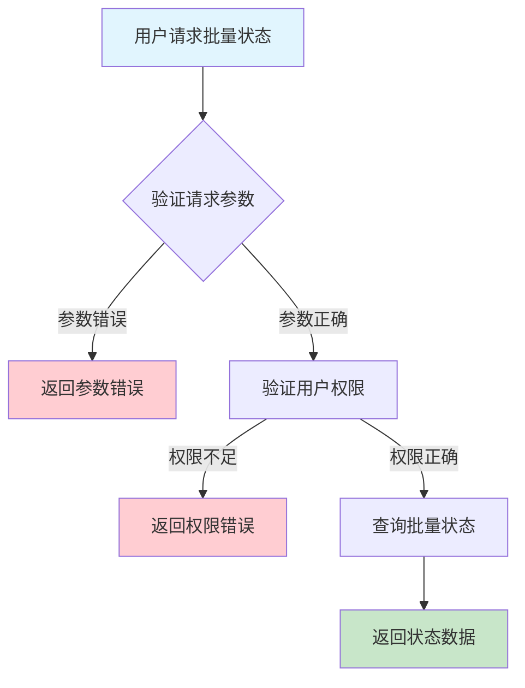
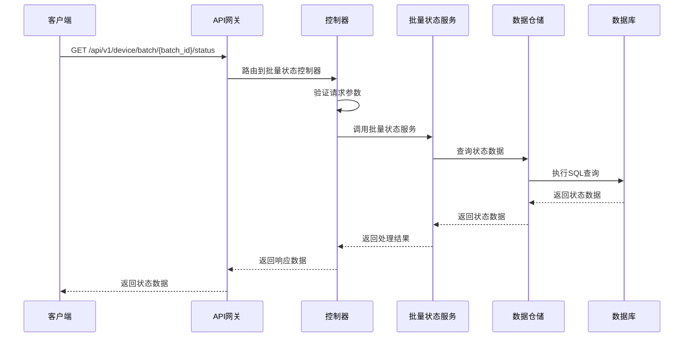

# 设备批量状态需求文档

## 1. 功能描述

### 1.1 功能概述
设备批量状态功能用于查询和跟踪批量操作中各设备的执行状态，包括批量任务的整体进度、单设备状态、失败重试等，便于运维人员实时掌握批量操作执行情况。

### 1.2 主要功能列表
- 查询批量操作整体状态
- 查询单设备批量状态
- 支持失败重试
- 支持批量状态导出

### 1.3 支持的功能特性
- 实时状态跟踪
- 支持多种批量操作类型
- 支持批量状态统计
- 支持批量状态导出

## 2. 功能目标

### 2.1 业务目标
- 实现批量操作全流程可视化
- 提高批量运维效率
- 支持异常批量处理

### 2.2 技术目标
- 高并发状态查询能力
- 状态数据一致性保障
- 状态变更可追溯

### 2.3 安全目标
- 状态查询权限控制
- 防止敏感数据泄露
- 操作可审计

## 3. 输入输出说明

### 3.1 输入参数

#### 3.1.1 必需参数
- `batch_id` (string): 批量操作ID

#### 3.1.2 可选参数
- `device_id` (string): 设备ID
- `status` (string): 状态筛选（pending/running/success/failed等）
- `limit` (int): 返回条数
- `offset` (int): 分页偏移

### 3.2 输出参数

#### 3.2.1 成功响应
```json
{
  "code": 200,
  "message": "success",
  "data": {
    "batch_id": "batch_001",
    "status": "running",
    "devices": [
      {"device_id": "device_001", "status": "success"},
      {"device_id": "device_002", "status": "failed"}
    ],
    "total": 2
  }
}
```

#### 3.2.2 错误响应
```json
{
  "code": 400,
  "message": "参数错误或操作不允许",
  "data": null
}
```

### 3.3 参数格式和约束
- 批量操作ID：1-64字符，字母、数字、下划线
- 设备ID：1-64字符，字母、数字、下划线
- 状态：pending、running、success、failed等
- 分页：limit最大1000

## 4. 涉及接口以及接口设计

### 4.1 API接口定义

#### 4.1.1 查询批量状态
```go
// 查询批量状态
GET /api/v1/device/batch/{batch_id}/status
```

**请求参数：**
- Path参数：batch_id
- Query参数：device_id, status, limit, offset

**响应结构：**
```go
type DeviceBatchStatusResponse struct {
    Code    int    `json:"code"`
    Message string `json:"message"`
    Data    struct {
        BatchID string                `json:"batch_id"`
        Status  string                `json:"status"`
        Devices []DeviceBatchStatus   `json:"devices"`
        Total   int                   `json:"total"`
    } `json:"data"`
}

type DeviceBatchStatus struct {
    DeviceID string `json:"device_id"`
    Status   string `json:"status"`
}
```

### 4.2 内部接口设计

#### 4.2.1 批量状态服务接口
```go
type DeviceBatchStatusService interface {
    QueryBatchStatus(ctx context.Context, req *BatchStatusRequest) (*DeviceBatchStatusResponse, error)
}
```

#### 4.2.2 批量状态仓储接口
```go
type DeviceBatchStatusRepository interface {
    Query(ctx context.Context, filter *BatchStatusFilter) ([]DeviceBatchStatus, int, error)
}
```

## 5. 数据结构设计

### 5.1 数据库表结构
- 新增 device_batch_status 表

#### 5.1.1 设备批量状态表 (device_batch_status)
```sql
CREATE TABLE device_batch_status (
    id BIGINT AUTO_INCREMENT PRIMARY KEY COMMENT '主键',
    batch_id VARCHAR(64) NOT NULL COMMENT '批量操作ID',
    device_id VARCHAR(64) NOT NULL COMMENT '设备ID',
    status VARCHAR(20) NOT NULL COMMENT '状态',
    updated_at TIMESTAMP DEFAULT CURRENT_TIMESTAMP ON UPDATE CURRENT_TIMESTAMP COMMENT '更新时间',
    INDEX idx_batch_id (batch_id),
    INDEX idx_device_id (device_id),
    INDEX idx_status (status)
) ENGINE=InnoDB DEFAULT CHARSET=utf8mb4 COMMENT='设备批量状态表';
```

### 5.2 模型结构定义
```go
type BatchStatusRequest struct {
    BatchID   string `json:"batch_id" v:"required"`
    DeviceID  string `json:"device_id"`
    Status    string `json:"status"`
    Limit     int    `json:"limit"`
    Offset    int    `json:"offset"`
}

type DeviceBatchStatus struct {
    DeviceID string `json:"device_id"`
    Status   string `json:"status"`
}
```

### 5.3 数据关系说明
- 批量状态与批量操作、设备表通过batch_id、device_id关联
- 支持多条件筛选

## 6. 异常处理

### 6.1 输入验证异常
- 批量操作ID为空或格式错误
- 分页参数非法

### 6.2 业务逻辑异常
- 批量操作不存在
- 权限不足

### 6.3 系统异常
- 数据库连接失败
- 查询超时
- 系统资源不足

## 7. 交互流程图



## 8. 交互时序图



## 9. 安全与权限

### 9.1 访问控制策略
- 需要用户身份验证
- 验证用户对批量状态的访问权限
- 支持基于角色的访问控制(RBAC)
- 记录所有状态访问操作

### 9.2 数据安全要求
- 敏感信息脱敏
- 状态数据加密存储
- 支持数据访问审计
- 防止SQL注入

### 9.3 身份验证机制
- JWT令牌
- API密钥
- 请求频率限制
- IP白名单

## 10. 日志与审计要求

### 10.1 操作日志要求
- 记录所有状态访问操作
- 记录参数和结果
- 记录操作人员身份
- 记录操作时间和IP

### 10.2 审计日志要求
- 记录状态访问轨迹
- 记录身份和权限
- 记录访问目的
- 支持长期保存

### 10.3 日志格式规范
```json
{
  "timestamp": "2024-01-15T16:40:00Z",
  "level": "INFO",
  "service": "device-batch-status",
  "operation": "query_batch_status",
  "user_id": "user_001",
  "parameters": {
    "batch_id": "batch_001"
  },
  "result": {
    "total": 2
  }
}
```

## 11. 测试用例

### 11.1 功能测试用例

#### 11.1.1 查询批量整体状态测试
**测试场景：** 查询批量操作整体状态
**输入数据：**
```json
{
  "batch_id": "batch_001"
}
```
**预期结果：**
- 返回状态码：200
- 返回批量整体状态及各设备状态

#### 11.1.2 查询单设备状态测试
**测试场景：** 查询单台设备批量状态
**输入数据：**
```json
{
  "batch_id": "batch_001",
  "device_id": "device_001"
}
```
**预期结果：**
- 返回状态码：200
- 返回该设备批量状态

### 11.2 性能测试用例

#### 11.2.1 大量状态查询测试
**测试场景：** 查询1000台设备批量状态
**预期结果：**
- 响应时间 < 2秒
- 错误率 < 1%

### 11.3 安全测试用例

#### 11.3.1 权限验证测试
**测试场景：** 验证用户批量状态访问权限
**测试数据：**
- 用户A：有权限
- 用户B：无权限
**预期结果：**
- 用户A：成功获取状态
- 用户B：返回权限错误

#### 11.3.2 敏感信息脱敏测试
**测试场景：** 敏感信息脱敏
**输入数据：**
```json
{
  "batch_id": "batch_001"
}
```
**预期结果：**
- 敏感字段脱敏
- 不影响可用性

### 11.4 异常测试用例

#### 11.4.1 参数错误测试
**测试场景：** 参数错误
**输入数据：**
```json
{
  "batch_id": ""
}
```
**预期结果：**
- 返回参数验证错误
- 状态码400

#### 11.4.2 批量操作不存在测试
**测试场景：** 查询不存在的批量操作
**输入数据：**
```json
{
  "batch_id": "non_existent_batch"
}
```
**预期结果：**
- 返回404
- 错误信息友好

#### 11.4.3 系统异常测试
**测试场景：** 数据库连接失败
**测试方法：** 临时关闭数据库
**预期结果：**
- 返回500
- 记录详细错误日志 