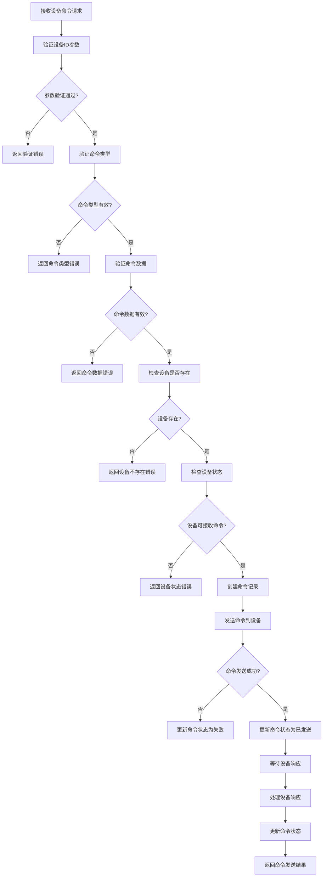
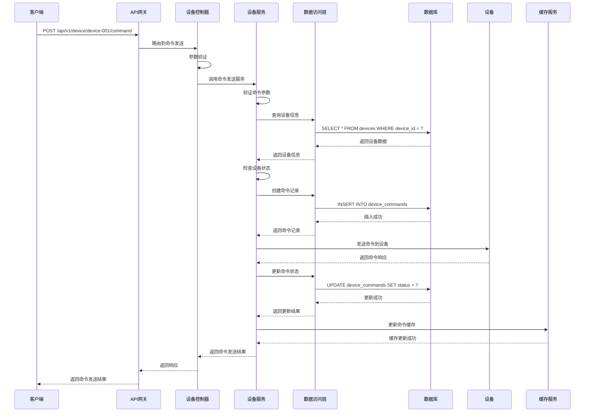

# 设备命令管理模块需求文档

## 1. 功能描述

设备命令管理模块是OneGoServer系统的核心控制功能，负责向设备发送各种控制命令，监控命令执行状态，并管理命令执行历史。该模块支持多种类型的设备命令，包括启动、停止、重启、配置、更新等操作，并提供完整的命令生命周期管理。

### 1.1 主要功能
- **命令发送**：向设备发送控制命令
- **命令状态监控**：实时监控命令执行状态
- **命令历史管理**：管理命令执行历史记录
- **命令响应处理**：处理设备返回的命令响应
- **命令超时处理**：处理命令执行超时情况
- **命令重试机制**：支持命令执行失败后的重试

### 1.2 支持命令类型
- **start**：启动设备或服务
- **stop**：停止设备或服务
- **restart**：重启设备或服务
- **status**：查询设备状态
- **configure**：配置设备参数
- **reset**：重置设备设置
- **update**：更新设备软件
- **sync**：同步设备数据

## 2. 功能目标

### 2.1 业务目标
- 提供统一的设备控制接口
- 支持多种设备命令类型
- 确保命令执行的可靠性
- 提供完整的命令执行追踪

### 2.2 技术目标
- 命令发送响应时间 < 100ms
- 支持并发命令发送
- 命令状态实时更新
- 高效的命令历史查询

### 2.3 监控目标
- 命令执行状态实时可见
- 命令执行成功率监控
- 命令执行时间分析
- 命令失败原因分析

## 3. 输入输出说明

### 3.1 输入参数

#### 3.1.1 发送设备命令请求
```json
{
  "deviceId": "string",        // 设备ID，必填
  "commandType": "string",     // 命令类型，必填，只能是start,stop,restart,status,configure,reset,update,sync
  "commandData": "string"      // 命令数据，必填，JSON格式的命令参数
}
```

#### 3.1.2 命令历史查询请求
```json
{
  "deviceId": "string",        // 设备ID，必填
  "page": 1,                  // 页码，可选，默认1
  "size": 10,                 // 每页数量，可选，默认10
  "commandType": "string",     // 命令类型过滤，可选
  "status": "string",          // 状态过滤，可选，只能是pending,sent,executed,completed,failed,timeout
  "startTime": "string",       // 开始时间，可选
  "endTime": "string"          // 结束时间，可选
}
```

### 3.2 输出参数

#### 3.2.1 发送命令成功响应
```json
{
  "code": 0,
  "message": "命令发送成功",
  "data": {
    "command_id": "cmd-001",
    "device_id": "device-001",
    "command_type": "restart",
    "status": "pending",
    "sent_time": "2024-01-01T15:30:00Z"
  }
}
```

#### 3.2.2 命令历史查询成功响应
```json
{
  "code": 0,
  "message": "success",
  "data": {
    "list": [
      {
        "id": 1,
        "device_id": "device-001",
        "command_type": "restart",
        "command_data": "{\"force\": true}",
        "status": "completed",
        "sent_time": "2024-01-01T15:30:00Z",
        "executed_time": "2024-01-01T15:30:05Z",
        "completed_time": "2024-01-01T15:30:10Z",
        "response_data": "{\"result\": \"success\"}",
        "error_message": "",
        "duration": 10,
        "created_at": "2024-01-01T15:30:00Z",
        "created_by": "user-123"
      }
    ],
    "total": 150,
    "page": 1,
    "size": 10
  }
}
```

#### 3.2.3 错误响应
```json
{
  "code": 400,
  "message": "命令类型不能为空",
  "data": null
}
```

## 4. 涉及接口以及接口设计

### 4.1 API接口定义

#### 4.1.1 发送设备命令接口
- **路径**：`POST /api/v1/device/device/{deviceId}/command`
- **标签**：设备控制
- **摘要**：发送设备命令

#### 4.1.2 获取设备命令历史接口
- **路径**：`GET /api/v1/device/device/{deviceId}/commands`
- **标签**：设备控制
- **摘要**：获取设备命令执行历史

#### 4.1.3 获取设备命令详情接口
- **路径**：`GET /api/v1/device/device/{deviceId}/command/{commandId}`
- **标签**：设备控制
- **摘要**：获取设备命令详情

### 4.2 内部接口

#### 4.2.1 命令发送接口
```go
type SendDeviceCommandInput struct {
    DeviceID    string
    CommandType string
    CommandData string
    CreatedBy   string
}

type SendDeviceCommandOutput struct {
    CommandID   string
    DeviceID    string
    CommandType string
    Status      string
    SentTime    *gtime.Time
    Message     string
}
```

#### 4.2.2 命令状态更新接口
```go
type UpdateCommandStatusInput struct {
    CommandID string
    Status    string
    Response  string
    ErrorMsg  string
}

type UpdateCommandStatusOutput struct {
    Message string
}
```

#### 4.2.3 命令历史查询接口
```go
type GetCommandHistoryInput struct {
    DeviceID    string
    Page        int
    Size        int
    CommandType string
    Status      string
    StartTime   *gtime.Time
    EndTime     *gtime.Time
}

type GetCommandHistoryOutput struct {
    Commands []DeviceCommandInfo
    Total    int64
    Page     int
    Size     int
}
```

## 5. 数据结构设计

### 5.1 数据库表结构

#### 5.1.1 设备命令表
```sql
CREATE TABLE device_commands (
    id              BIGSERIAL PRIMARY KEY,
    device_id       VARCHAR(100) NOT NULL,
    command_type    VARCHAR(50) NOT NULL,
    command_data    JSONB NOT NULL,
    status          VARCHAR(20) NOT NULL DEFAULT 'pending',
    sent_time       TIMESTAMP NOT NULL DEFAULT CURRENT_TIMESTAMP,
    executed_time   TIMESTAMP,
    completed_time  TIMESTAMP,
    response_data   JSONB,
    error_message   TEXT,
    created_at      TIMESTAMP NOT NULL DEFAULT CURRENT_TIMESTAMP,
    created_by      VARCHAR(100),
    CONSTRAINT fk_device_commands_device 
        FOREIGN KEY (device_id) REFERENCES devices(device_id) 
        ON DELETE CASCADE
);
```

#### 5.1.2 命令查询SQL
```sql
SELECT 
    id, device_id, command_type, command_data, status,
    sent_time, executed_time, completed_time, response_data,
    error_message, created_at, created_by
FROM device_commands 
WHERE device_id = ? 
    AND (? = '' OR command_type = ?)
    AND (? = '' OR status = ?)
    AND (? IS NULL OR sent_time >= ?)
    AND (? IS NULL OR sent_time <= ?)
ORDER BY sent_time DESC 
LIMIT ? OFFSET ?
```

#### 5.1.3 命令统计SQL
```sql
SELECT 
    COUNT(*) as total_commands,
    COUNT(CASE WHEN status = 'completed' THEN 1 END) as success_count,
    COUNT(CASE WHEN status = 'failed' THEN 1 END) as failed_count,
    AVG(EXTRACT(EPOCH FROM (completed_time - sent_time))) as avg_duration
FROM device_commands 
WHERE device_id = ? 
    AND sent_time >= NOW() - INTERVAL '24 hours'
```

### 5.2 缓存结构

#### 5.2.1 设备命令缓存
```go
type DeviceCommandCache struct {
    CommandID     string    // 命令ID
    DeviceID      string    // 设备ID
    CommandType   string    // 命令类型
    Status        string    // 命令状态
    SentTime      time.Time // 发送时间
    ExecutedTime  time.Time // 执行时间
    CompletedTime time.Time // 完成时间
    ResponseData  string    // 响应数据
    ErrorMessage  string    // 错误信息
    LastUpdate    time.Time // 最后更新时间
    ExpireAt      time.Time // 过期时间
}
```

#### 5.2.2 命令状态缓存
```go
type CommandStatusCache struct {
    CommandID string    // 命令ID
    Status    string    // 命令状态
    Progress  int       // 执行进度
    Message   string    // 状态消息
    LastUpdate time.Time // 最后更新时间
    ExpireAt   time.Time // 过期时间
}
```

## 6. 异常处理

### 6.1 输入验证异常
- **设备ID为空**：返回400错误，提示"设备ID不能为空"
- **设备ID格式错误**：返回400错误，提示"设备ID格式不正确"
- **命令类型为空**：返回400错误，提示"命令类型不能为空"
- **命令类型无效**：返回400错误，提示"命令类型只能是start,stop,restart,status,configure,reset,update,sync"
- **命令数据为空**：返回400错误，提示"命令数据不能为空"
- **命令数据格式错误**：返回400错误，提示"命令数据格式不正确"

### 6.2 业务逻辑异常
- **设备不存在**：返回404错误，提示"设备不存在"
- **设备已删除**：返回404错误，提示"设备已删除"
- **设备离线**：返回409错误，提示"设备离线，无法发送命令"
- **设备忙**：返回409错误，提示"设备忙，请稍后重试"
- **命令被拒绝**：返回403错误，提示"命令被拒绝"

### 6.3 系统异常
- **数据库连接失败**：返回500错误，提示"数据库连接失败"
- **命令发送失败**：返回500错误，提示"命令发送失败"
- **缓存更新失败**：返回500错误，提示"缓存更新失败"
- **命令超时**：返回408错误，提示"命令执行超时"

## 7. 交互流程图



## 8. 交互时序图



## 9. 安全与权限

### 9.1 访问控制
- **接口权限**：需要设备命令权限
- **数据权限**：根据用户权限过滤可查看的命令
- **设备权限**：根据用户权限决定可发送命令的设备

### 9.2 数据安全
- **命令数据保护**：保护命令数据不被未授权访问
- **命令审计**：记录命令发送和执行操作
- **数据完整性**：确保命令数据的一致性

### 9.3 命令安全
- **设备ID验证**：验证设备ID的有效性
- **命令类型验证**：验证命令类型的合理性
- **命令频率限制**：限制命令发送频率
- **命令权限验证**：验证用户是否有权限发送该命令

## 10. 日志与审计要求

### 10.1 命令日志
- **命令发送日志**：记录命令发送的详细信息
- **命令执行日志**：记录命令执行的结果
- **命令响应日志**：记录设备响应的内容

### 10.2 性能日志
- **命令发送耗时**：记录命令发送时间
- **命令执行耗时**：记录命令执行时间
- **数据库性能日志**：记录数据库操作性能

### 10.3 日志格式
```json
{
  "timestamp": "2024-01-01T00:00:00Z",
  "level": "INFO",
  "service": "device-command",
  "operation": "send_device_command",
  "device_id": "device-001",
  "command_type": "restart",
  "command_id": "cmd-001",
  "user_id": "user-123",
  "ip_address": "192.168.1.100",
  "result": "success",
  "duration_ms": 50,
  "status": "sent"
}
```

## 11. 测试用例

### 11.1 功能测试用例

#### 11.1.1 正常命令发送测试
- **测试目标**：验证设备命令正常发送功能
- **测试数据**：
  ```
  POST /api/v1/device/device-001/command
  {
    "commandType": "restart",
    "commandData": "{\"force\": true}"
  }
  ```
- **预期结果**：命令成功发送，返回命令ID

#### 11.1.2 设备不存在测试
- **测试目标**：验证设备不存在时的处理
- **测试数据**：
  ```
  POST /api/v1/device/non-existent-device/command
  {
    "commandType": "restart",
    "commandData": "{}"
  }
  ```
- **预期结果**：返回404错误，提示"设备不存在"

#### 11.1.3 参数验证测试
- **测试目标**：验证参数验证功能
- **测试数据**：
  ```
  POST /api/v1/device/device-001/command
  {
    "commandType": "invalid_command",
    "commandData": "{}"
  }
  ```
- **预期结果**：返回400错误，提示"命令类型只能是start,stop,restart,status,configure,reset,update,sync"

#### 11.1.4 设备离线测试
- **测试目标**：验证设备离线时的处理
- **测试场景**：向离线设备发送命令
- **预期结果**：返回409错误，提示"设备离线，无法发送命令"

#### 11.1.5 命令历史查询测试
- **测试目标**：验证命令历史查询功能
- **测试数据**：
  ```
  GET /api/v1/device/device-001/commands?page=1&size=10
  ```
- **预期结果**：返回设备的命令执行历史

### 11.2 性能测试用例

#### 11.2.1 命令发送响应时间测试
- **测试目标**：验证命令发送响应时间
- **测试场景**：发送单个设备命令
- **预期结果**：响应时间<100ms

#### 11.2.2 并发命令发送测试
- **测试目标**：验证并发命令发送性能
- **测试场景**：10个并发发送不同设备命令
- **预期结果**：所有请求在1秒内完成，成功率>99%

#### 11.2.3 命令历史查询性能测试
- **测试目标**：验证命令历史查询性能
- **测试场景**：查询大量命令历史数据
- **预期结果**：查询响应时间<200ms

### 11.3 命令准确性测试

#### 11.3.1 命令数据准确性测试
- **测试目标**：验证命令数据的准确性
- **测试场景**：发送命令后查询命令详情
- **预期结果**：命令详情与发送数据一致

#### 11.3.2 命令状态更新测试
- **测试目标**：验证命令状态更新的准确性
- **测试场景**：命令执行过程中状态变化
- **预期结果**：命令状态正确更新

#### 11.3.3 命令响应处理测试
- **测试目标**：验证命令响应处理的准确性
- **测试场景**：设备返回命令响应
- **预期结果**：响应数据正确记录

### 11.4 安全测试用例

#### 11.4.1 设备ID注入测试
- **测试目标**：验证设备ID注入防护
- **测试数据**：在设备ID中包含恶意代码
- **预期结果**：系统正确过滤恶意代码

#### 11.4.2 命令数据注入测试
- **测试目标**：验证命令数据注入防护
- **测试数据**：在命令数据中包含恶意代码
- **预期结果**：系统正确过滤恶意代码

#### 11.4.3 权限越权测试
- **测试目标**：验证权限控制
- **测试场景**：普通用户尝试发送管理员命令
- **预期结果**：返回403权限不足错误

### 11.5 异常测试用例

#### 11.5.1 数据库异常测试
- **测试目标**：验证数据库异常处理
- **测试场景**：模拟数据库连接失败
- **预期结果**：返回500错误，记录详细错误日志

#### 11.5.2 设备通信异常测试
- **测试目标**：验证设备通信异常处理
- **测试场景**：模拟设备通信失败
- **预期结果**：命令状态更新为失败，记录错误信息

#### 11.5.3 命令超时测试
- **测试目标**：验证命令超时处理
- **测试场景**：命令执行超时
- **预期结果**：命令状态更新为超时，记录超时信息

### 11.6 数据完整性测试

#### 11.6.1 命令数据一致性测试
- **测试目标**：验证命令数据一致性
- **测试场景**：并发发送命令
- **预期结果**：命令数据最终一致，无数据冲突

#### 11.6.2 命令历史完整性测试
- **测试目标**：验证命令历史完整性
- **测试场景**：多次发送命令
- **预期结果**：所有命令都有历史记录

#### 11.6.3 缓存一致性测试
- **测试目标**：验证缓存数据一致性
- **测试场景**：命令状态更新后检查缓存
- **预期结果**：缓存数据与数据库数据一致

### 11.7 业务逻辑测试

#### 11.7.1 命令类型验证测试
- **测试目标**：验证命令类型验证逻辑
- **测试场景**：发送不同类型的命令
- **预期结果**：只有有效命令类型被接受

#### 11.7.2 设备状态检查测试
- **测试目标**：验证设备状态检查逻辑
- **测试场景**：向不同状态的设备发送命令
- **预期结果**：只有在线设备能接收命令

#### 11.7.3 命令重试机制测试
- **测试目标**：验证命令重试机制
- **测试场景**：命令执行失败后重试
- **预期结果**：重试机制正常工作

### 11.8 监控功能测试

#### 11.8.1 命令执行监控测试
- **测试目标**：验证命令执行监控功能
- **测试场景**：命令执行过程中监控
- **预期结果**：能够实时监控命令执行状态

#### 11.8.2 命令成功率统计测试
- **测试目标**：验证命令成功率统计功能
- **测试场景**：收集命令执行统计数据
- **预期结果**：能够准确统计命令成功率

#### 11.8.3 命令执行时间分析测试
- **测试目标**：验证命令执行时间分析功能
- **测试场景**：分析命令执行时间
- **预期结果**：能够分析命令执行时间趋势 