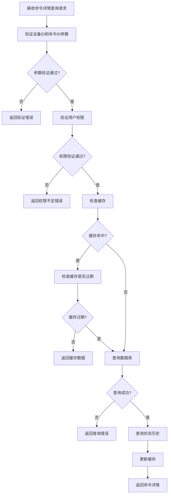
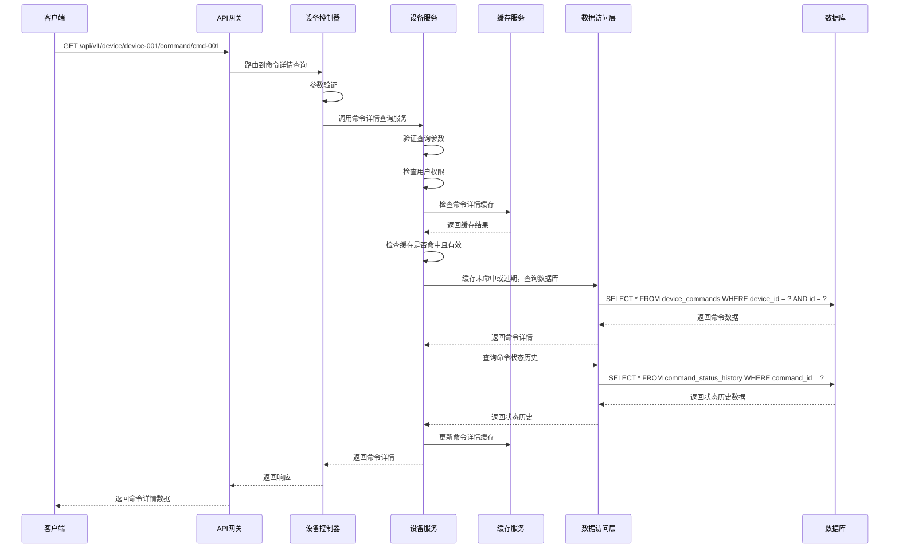

# 设备命令详情查询模块需求文档

## 1. 功能描述

设备命令详情查询模块是OneGoServer系统的精确查询功能，负责提供单个设备命令的详细信息查询服务。该模块支持查询命令的完整生命周期信息，包括发送时间、执行时间、完成时间、响应数据、错误信息等，为用户提供精确的命令执行追踪能力。

### 1.1 主要功能
- **命令详情查询**：查询单个命令的完整信息
- **执行状态追踪**：追踪命令的执行状态变化
- **响应数据分析**：分析命令的响应数据
- **错误信息查看**：查看命令执行失败的错误信息
- **执行时间分析**：分析命令的执行时间
- **重试信息查看**：查看命令的重试次数和重试原因

### 1.2 支持查询信息
- **基本信息**：命令ID、设备ID、命令类型、命令数据
- **执行状态**：当前状态、状态变化历史
- **时间信息**：发送时间、执行时间、完成时间
- **响应信息**：响应数据、错误信息、执行结果
- **性能信息**：执行耗时、重试次数、超时设置
- **操作信息**：创建者、创建时间、更新时间

## 2. 功能目标

### 2.1 业务目标
- 提供精确的命令详情查询
- 支持命令执行状态实时追踪
- 提供命令响应数据分析
- 支持命令执行失败原因分析

### 2.2 技术目标
- 查询响应时间 < 100ms
- 支持实时状态更新
- 高效的详情缓存机制
- 优化的数据库查询性能

### 2.3 监控目标
- 命令详情查询完整记录
- 命令执行状态实时可见
- 命令响应数据准确记录
- 命令失败原因详细分析

## 3. 输入输出说明

### 3.1 输入参数

#### 3.1.1 命令详情查询请求
```json
{
  "deviceId": "string",        // 设备ID，必填
  "commandId": "string"        // 命令ID，必填
}
```

### 3.2 输出参数

#### 3.2.1 命令详情查询成功响应
```json
{
  "code": 0,
  "message": "success",
  "data": {
    "id": 1,
    "device_id": "device-001",
    "command_type": "restart",
    "command_data": "{\"force\": true, \"timeout\": 30, \"retry_count\": 3}",
    "status": "completed",
    "sent_time": "2024-01-01T15:30:00Z",
    "executed_time": "2024-01-01T15:30:05Z",
    "completed_time": "2024-01-01T15:30:10Z",
    "response_data": "{\"result\": \"success\", \"details\": \"Device restarted successfully\", \"execution_time\": 5}",
    "error_message": "",
    "duration": 10,
    "created_at": "2024-01-01T15:30:00Z",
    "created_by": "user-123",
    "retry_count": 0,
    "timeout_seconds": 30,
    "status_history": [
      {
        "status": "pending",
        "timestamp": "2024-01-01T15:30:00Z",
        "message": "Command created"
      },
      {
        "status": "sent",
        "timestamp": "2024-01-01T15:30:01Z",
        "message": "Command sent to device"
      },
      {
        "status": "executed",
        "timestamp": "2024-01-01T15:30:05Z",
        "message": "Command executed on device"
      },
      {
        "status": "completed",
        "timestamp": "2024-01-01T15:30:10Z",
        "message": "Command completed successfully"
      }
    ]
  }
}
```

#### 3.2.2 命令不存在响应
```json
{
  "code": 404,
  "message": "命令不存在",
  "data": null
}
```

#### 3.2.3 权限不足响应
```json
{
  "code": 403,
  "message": "权限不足，无法查看命令详情",
  "data": null
}
```

## 4. 涉及接口以及接口设计

### 4.1 API接口定义

#### 4.1.1 获取设备命令详情接口
- **路径**：`GET /api/v1/device/device/{deviceId}/command/{commandId}`
- **标签**：设备控制
- **摘要**：获取设备命令详情

### 4.2 内部接口

#### 4.2.1 命令详情查询接口
```go
type GetCommandDetailInput struct {
    DeviceID  string
    CommandID string
    UserID    string
}

type GetCommandDetailOutput struct {
    Command       *DeviceCommandInfo
    StatusHistory []CommandStatusHistory
    Error         error
}
```

#### 4.2.2 命令状态历史查询接口
```go
type GetCommandStatusHistoryInput struct {
    CommandID string
}

type GetCommandStatusHistoryOutput struct {
    History []CommandStatusHistory
}
```

#### 4.2.3 命令权限验证接口
```go
type ValidateCommandPermissionInput struct {
    DeviceID  string
    CommandID string
    UserID    string
}

type ValidateCommandPermissionOutput struct {
    HasPermission bool
    Error         error
}
```

## 5. 数据结构设计

### 5.1 数据库查询结构

#### 5.1.1 命令详情查询SQL
```sql
SELECT 
    id, device_id, command_type, command_data, status,
    sent_time, executed_time, completed_time, response_data,
    error_message, created_at, created_by,
    EXTRACT(EPOCH FROM (completed_time - sent_time)) as duration,
    retry_count, timeout_seconds
FROM device_commands 
WHERE device_id = ? AND id = ?
```

#### 5.1.2 命令状态历史查询SQL
```sql
SELECT 
    id, command_id, status, message, timestamp
FROM command_status_history 
WHERE command_id = ? 
ORDER BY timestamp ASC
```

#### 5.1.3 命令权限验证SQL
```sql
SELECT 
    dc.device_id, dc.created_by, d.owner_id, d.department
FROM device_commands dc
JOIN devices d ON dc.device_id = d.device_id
WHERE dc.device_id = ? AND dc.id = ?
```

### 5.2 缓存结构

#### 5.2.1 命令详情缓存
```go
type CommandDetailCache struct {
    CommandID     string    // 命令ID
    DeviceID      string    // 设备ID
    Command       *DeviceCommandInfo // 命令详情
    StatusHistory []CommandStatusHistory // 状态历史
    LastUpdate    time.Time // 最后更新时间
    ExpireAt      time.Time // 过期时间
}
```

#### 5.2.2 命令状态缓存
```go
type CommandStatusCache struct {
    CommandID string    // 命令ID
    Status    string    // 当前状态
    Progress  int       // 执行进度
    Message   string    // 状态消息
    LastUpdate time.Time // 最后更新时间
    ExpireAt   time.Time // 过期时间
}
```

## 6. 异常处理

### 6.1 输入验证异常
- **设备ID为空**：返回400错误，提示"设备ID不能为空"
- **设备ID格式错误**：返回400错误，提示"设备ID格式不正确"
- **命令ID为空**：返回400错误，提示"命令ID不能为空"
- **命令ID格式错误**：返回400错误，提示"命令ID格式不正确"

### 6.2 业务逻辑异常
- **设备不存在**：返回404错误，提示"设备不存在"
- **命令不存在**：返回404错误，提示"命令不存在"
- **权限不足**：返回403错误，提示"权限不足，无法查看命令详情"
- **设备已删除**：返回404错误，提示"设备已删除"

### 6.3 系统异常
- **数据库连接失败**：返回500错误，提示"数据库连接失败"
- **查询执行失败**：返回500错误，提示"查询执行失败"
- **缓存服务异常**：返回500错误，提示"缓存服务异常"

## 7. 交互流程图



## 8. 交互时序图



## 9. 安全与权限

### 9.1 访问控制
- **接口权限**：需要设备命令查询权限
- **数据权限**：根据用户权限过滤可查看的命令详情
- **设备权限**：根据用户权限决定可查询的设备命令

### 9.2 数据安全
- **命令详情保护**：保护命令详情数据不被未授权访问
- **查询审计**：记录命令详情查询操作
- **数据脱敏**：对敏感命令数据进行脱敏处理

### 9.3 查询安全
- **设备ID验证**：验证设备ID的有效性
- **命令ID验证**：验证命令ID的有效性
- **权限验证**：验证用户是否有权限查看该命令详情

## 10. 日志与审计要求

### 10.1 查询日志
- **命令详情查询日志**：记录命令详情查询的详细信息
- **访问日志**：记录用户访问命令详情的行为
- **权限日志**：记录权限验证的结果

### 10.2 性能日志
- **查询耗时日志**：记录查询执行时间
- **缓存命中率日志**：记录缓存命中情况
- **数据库性能日志**：记录数据库查询性能

### 10.3 日志格式
```json
{
  "timestamp": "2024-01-01T00:00:00Z",
  "level": "INFO",
  "service": "device-command-detail",
  "operation": "get_command_detail",
  "device_id": "device-001",
  "command_id": "cmd-001",
  "user_id": "user-123",
  "ip_address": "192.168.1.100",
  "result": "success",
  "duration_ms": 80,
  "cache_hit": false,
  "permission_check": "passed"
}
```

## 11. 测试用例

### 11.1 功能测试用例

#### 11.1.1 正常命令详情查询测试
- **测试目标**：验证命令详情正常查询功能
- **测试数据**：
  ```
  GET /api/v1/device/device-001/command/cmd-001
  ```
- **预期结果**：返回命令cmd-001的详细信息

#### 11.1.2 设备不存在测试
- **测试目标**：验证设备不存在时的处理
- **测试数据**：
  ```
  GET /api/v1/device/non-existent-device/command/cmd-001
  ```
- **预期结果**：返回404错误，提示"设备不存在"

#### 11.1.3 命令不存在测试
- **测试目标**：验证命令不存在时的处理
- **测试数据**：
  ```
  GET /api/v1/device/device-001/command/non-existent-command
  ```
- **预期结果**：返回404错误，提示"命令不存在"

#### 11.1.4 权限验证测试
- **测试目标**：验证权限控制功能
- **测试场景**：无权限用户尝试查询命令详情
- **预期结果**：返回403错误，提示"权限不足"

#### 11.1.5 参数验证测试
- **测试目标**：验证参数验证功能
- **测试数据**：
  ```
  GET /api/v1/device//command/
  ```
- **预期结果**：返回400错误，提示参数验证失败

### 11.2 性能测试用例

#### 11.2.1 查询响应时间测试
- **测试目标**：验证查询响应时间
- **测试场景**：查询单个命令详情
- **预期结果**：响应时间<100ms

#### 11.2.2 缓存性能测试
- **测试目标**：验证缓存机制性能
- **测试场景**：重复查询相同命令详情
- **预期结果**：缓存命中后查询时间<30ms

#### 11.2.3 并发查询测试
- **测试目标**：验证并发查询性能
- **测试场景**：10个并发查询不同命令详情
- **预期结果**：所有请求在500ms内完成，成功率>99%

### 11.3 查询准确性测试

#### 11.3.1 命令详情准确性测试
- **测试目标**：验证命令详情的准确性
- **测试场景**：查询命令详情并验证数据
- **预期结果**：命令详情与数据库记录一致

#### 11.3.2 状态历史准确性测试
- **测试目标**：验证状态历史的准确性
- **测试场景**：查询命令状态历史
- **预期结果**：状态历史按时间顺序正确显示

#### 11.3.3 字段完整性测试
- **测试目标**：验证返回字段的完整性
- **测试场景**：查询命令详情
- **预期结果**：返回所有必需的字段，无缺失

### 11.4 安全测试用例

#### 11.4.1 设备ID注入测试
- **测试目标**：验证设备ID注入防护
- **测试数据**：在设备ID中包含恶意代码
- **预期结果**：系统正确过滤恶意代码

#### 11.4.2 命令ID注入测试
- **测试目标**：验证命令ID注入防护
- **测试数据**：在命令ID中包含恶意代码
- **预期结果**：系统正确过滤恶意代码

#### 11.4.3 权限越权测试
- **测试目标**：验证权限控制
- **测试场景**：普通用户尝试查询管理员命令详情
- **预期结果**：返回403权限不足错误

### 11.5 异常测试用例

#### 11.5.1 数据库异常测试
- **测试目标**：验证数据库异常处理
- **测试场景**：模拟数据库连接失败
- **预期结果**：返回500错误，记录详细错误日志

#### 11.5.2 缓存异常测试
- **测试目标**：验证缓存异常处理
- **测试场景**：模拟缓存服务不可用
- **预期结果**：降级到直接查询数据库，不影响功能

#### 11.5.3 网络异常测试
- **测试目标**：验证网络异常处理
- **测试场景**：模拟网络超时
- **预期结果**：返回超时错误，支持重试机制

### 11.6 数据完整性测试

#### 11.6.1 查询数据一致性测试
- **测试目标**：验证查询数据一致性
- **测试场景**：并发查询命令详情
- **预期结果**：查询结果一致，无数据冲突

#### 11.6.2 缓存一致性测试
- **测试目标**：验证缓存数据一致性
- **测试场景**：命令详情更新后查询
- **预期结果**：缓存数据与数据库数据一致

#### 11.6.3 状态历史完整性测试
- **测试目标**：验证状态历史完整性
- **测试场景**：查询命令状态历史
- **预期结果**：状态历史完整，无缺失记录

### 11.7 业务逻辑测试

#### 11.7.1 权限验证逻辑测试
- **测试目标**：验证权限验证逻辑
- **测试场景**：不同权限用户查询命令详情
- **预期结果**：权限验证正确，符合业务规则

#### 11.7.2 状态历史逻辑测试
- **测试目标**：验证状态历史逻辑
- **测试场景**：查询不同状态的命令详情
- **预期结果**：状态历史正确显示

#### 11.7.3 时间计算逻辑测试
- **测试目标**：验证时间计算逻辑
- **测试场景**：查询命令执行时间
- **预期结果**：执行时间计算准确

### 11.8 监控功能测试

#### 11.8.1 查询监控测试
- **测试目标**：验证查询监控功能
- **测试场景**：监控命令详情查询
- **预期结果**：能够监控查询性能和成功率

#### 11.8.2 缓存监控测试
- **测试目标**：验证缓存监控功能
- **测试场景**：监控缓存命中率
- **预期结果**：能够监控缓存性能

#### 11.8.3 权限监控测试
- **测试目标**：验证权限监控功能
- **测试场景**：监控权限验证结果
- **预期结果**：能够监控权限验证情况 