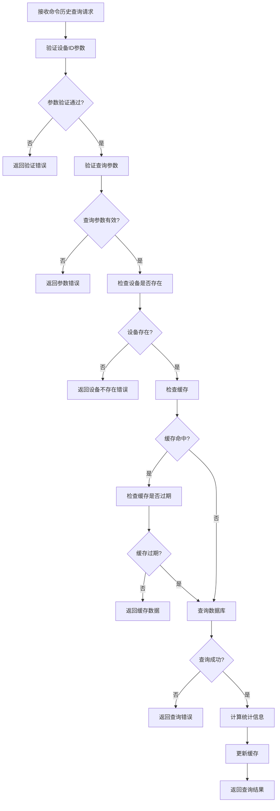
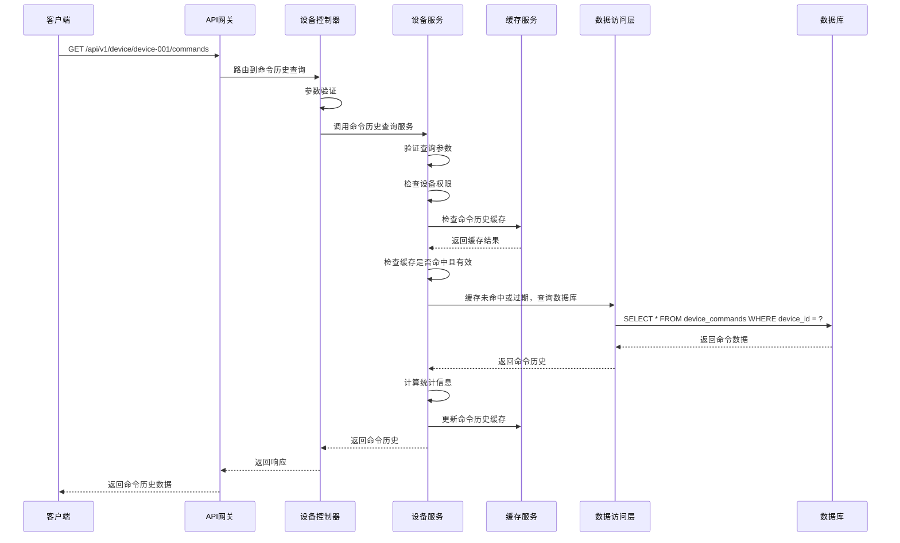

# 设备命令历史查询模块需求文档

## 1. 功能描述

设备命令历史查询模块是OneGoServer系统的重要查询功能，负责提供设备命令执行历史的查询、筛选和统计服务。该模块支持多种查询条件，包括命令类型、执行状态、时间范围等，为用户提供完整的命令执行追踪和分析能力。

### 1.1 主要功能
- **命令历史查询**：查询设备的命令执行历史
- **多条件筛选**：支持按命令类型、状态、时间等条件筛选
- **分页查询**：支持分页查询大量历史数据
- **命令统计**：统计命令执行的成功率、耗时等指标
- **命令详情查询**：查询单个命令的详细信息
- **命令趋势分析**：分析命令执行趋势

### 1.2 支持查询条件
- **设备ID**：指定查询的设备
- **命令类型**：按命令类型筛选
- **执行状态**：按执行状态筛选
- **时间范围**：按时间范围筛选
- **执行者**：按命令执行者筛选
- **关键词**：按命令内容关键词筛选

## 2. 功能目标

### 2.1 业务目标
- 提供完整的命令执行历史查询
- 支持多维度命令历史筛选
- 提供命令执行统计分析
- 支持命令执行趋势分析

### 2.2 技术目标
- 查询响应时间 < 200ms
- 支持大数据量历史查询
- 高效的查询缓存机制
- 优化的数据库查询性能

### 2.3 监控目标
- 命令执行历史完整记录
- 命令执行成功率统计
- 命令执行时间分析
- 命令失败原因分析

## 3. 输入输出说明

### 3.1 输入参数

#### 3.1.1 命令历史查询请求
```json
{
  "deviceId": "string",        // 设备ID，必填
  "page": 1,                  // 页码，可选，默认1
  "size": 10,                 // 每页数量，可选，默认10
  "commandType": "string",     // 命令类型过滤，可选
  "status": "string",          // 状态过滤，可选，只能是pending,sent,executed,completed,failed,timeout
  "startTime": "string",       // 开始时间，可选
  "endTime": "string",         // 结束时间，可选
  "createdBy": "string",       // 执行者过滤，可选
  "keyword": "string"          // 关键词过滤，可选
}
```

#### 3.1.2 命令详情查询请求
```json
{
  "deviceId": "string",        // 设备ID，必填
  "commandId": "string"        // 命令ID，必填
}
```

### 3.2 输出参数

#### 3.2.1 命令历史查询成功响应
```json
{
  "code": 0,
  "message": "success",
  "data": {
    "list": [
      {
        "id": 1,
        "device_id": "device-001",
        "command_type": "restart",
        "command_data": "{\"force\": true}",
        "status": "completed",
        "sent_time": "2024-01-01T15:30:00Z",
        "executed_time": "2024-01-01T15:30:05Z",
        "completed_time": "2024-01-01T15:30:10Z",
        "response_data": "{\"result\": \"success\"}",
        "error_message": "",
        "duration": 10,
        "created_at": "2024-01-01T15:30:00Z",
        "created_by": "user-123"
      }
    ],
    "total": 150,
    "page": 1,
    "size": 10,
    "statistics": {
      "total_commands": 150,
      "success_count": 120,
      "failed_count": 20,
      "timeout_count": 10,
      "success_rate": 80.0,
      "avg_duration": 15.5
    }
  }
}
```

#### 3.2.2 命令详情查询成功响应
```json
{
  "code": 0,
  "message": "success",
  "data": {
    "id": 1,
    "device_id": "device-001",
    "command_type": "restart",
    "command_data": "{\"force\": true, \"timeout\": 30}",
    "status": "completed",
    "sent_time": "2024-01-01T15:30:00Z",
    "executed_time": "2024-01-01T15:30:05Z",
    "completed_time": "2024-01-01T15:30:10Z",
    "response_data": "{\"result\": \"success\", \"details\": \"Device restarted successfully\"}",
    "error_message": "",
    "duration": 10,
    "created_at": "2024-01-01T15:30:00Z",
    "created_by": "user-123",
    "retry_count": 0,
    "timeout_seconds": 30
  }
}
```

#### 3.2.3 错误响应
```json
{
  "code": 404,
  "message": "命令不存在",
  "data": null
}
```

## 4. 涉及接口以及接口设计

### 4.1 API接口定义

#### 4.1.1 获取设备命令历史接口
- **路径**：`GET /api/v1/device/device/{deviceId}/commands`
- **标签**：设备控制
- **摘要**：获取设备命令执行历史

#### 4.1.2 获取设备命令详情接口
- **路径**：`GET /api/v1/device/device/{deviceId}/command/{commandId}`
- **标签**：设备控制
- **摘要**：获取设备命令详情

### 4.2 内部接口

#### 4.2.1 命令历史查询接口
```go
type GetCommandHistoryInput struct {
    DeviceID    string
    Page        int
    Size        int
    CommandType string
    Status      string
    StartTime   *gtime.Time
    EndTime     *gtime.Time
    CreatedBy   string
    Keyword     string
}

type GetCommandHistoryOutput struct {
    Commands    []DeviceCommandInfo
    Total       int64
    Page        int
    Size        int
    Statistics  *CommandStatistics
}
```

#### 4.2.2 命令详情查询接口
```go
type GetCommandDetailInput struct {
    DeviceID  string
    CommandID string
}

type GetCommandDetailOutput struct {
    Command *DeviceCommandInfo
}
```

#### 4.2.3 命令统计接口
```go
type GetCommandStatisticsInput struct {
    DeviceID    string
    StartTime   *gtime.Time
    EndTime     *gtime.Time
    CommandType string
}

type GetCommandStatisticsOutput struct {
    Statistics *CommandStatistics
}
```

## 5. 数据结构设计

### 5.1 数据库查询结构

#### 5.1.1 命令历史查询SQL
```sql
SELECT 
    id, device_id, command_type, command_data, status,
    sent_time, executed_time, completed_time, response_data,
    error_message, created_at, created_by,
    EXTRACT(EPOCH FROM (completed_time - sent_time)) as duration
FROM device_commands 
WHERE device_id = ? 
    AND (? = '' OR command_type = ?)
    AND (? = '' OR status = ?)
    AND (? IS NULL OR sent_time >= ?)
    AND (? IS NULL OR sent_time <= ?)
    AND (? = '' OR created_by = ?)
    AND (? = '' OR command_data LIKE ? OR error_message LIKE ?)
ORDER BY sent_time DESC 
LIMIT ? OFFSET ?
```

#### 5.1.2 命令详情查询SQL
```sql
SELECT 
    id, device_id, command_type, command_data, status,
    sent_time, executed_time, completed_time, response_data,
    error_message, created_at, created_by,
    EXTRACT(EPOCH FROM (completed_time - sent_time)) as duration
FROM device_commands 
WHERE device_id = ? AND id = ?
```

#### 5.1.3 命令统计查询SQL
```sql
SELECT 
    COUNT(*) as total_commands,
    COUNT(CASE WHEN status = 'completed' THEN 1 END) as success_count,
    COUNT(CASE WHEN status = 'failed' THEN 1 END) as failed_count,
    COUNT(CASE WHEN status = 'timeout' THEN 1 END) as timeout_count,
    AVG(EXTRACT(EPOCH FROM (completed_time - sent_time))) as avg_duration,
    MIN(sent_time) as first_command_time,
    MAX(sent_time) as last_command_time
FROM device_commands 
WHERE device_id = ? 
    AND (? IS NULL OR sent_time >= ?)
    AND (? IS NULL OR sent_time <= ?)
    AND (? = '' OR command_type = ?)
```

### 5.2 缓存结构

#### 5.2.1 命令历史缓存
```go
type CommandHistoryCache struct {
    DeviceID    string    // 设备ID
    QueryHash   string    // 查询条件哈希
    Commands    []DeviceCommandInfo // 命令列表
    Total       int64     // 总数
    Page        int       // 页码
    Size        int       // 每页大小
    LastUpdate  time.Time // 最后更新时间
    ExpireAt    time.Time // 过期时间
}
```

#### 5.2.2 命令统计缓存
```go
type CommandStatisticsCache struct {
    DeviceID    string    // 设备ID
    Statistics  *CommandStatistics // 统计信息
    LastUpdate  time.Time // 最后更新时间
    ExpireAt    time.Time // 过期时间
}
```

## 6. 异常处理

### 6.1 输入验证异常
- **设备ID为空**：返回400错误，提示"设备ID不能为空"
- **设备ID格式错误**：返回400错误，提示"设备ID格式不正确"
- **命令ID为空**：返回400错误，提示"命令ID不能为空"
- **页码无效**：返回400错误，提示"页码最小为1"
- **每页数量无效**：返回400错误，提示"每页数量为1-100"

### 6.2 业务逻辑异常
- **设备不存在**：返回404错误，提示"设备不存在"
- **命令不存在**：返回404错误，提示"命令不存在"
- **权限不足**：返回403错误，提示"权限不足，无法查看命令历史"

### 6.3 系统异常
- **数据库连接失败**：返回500错误，提示"数据库连接失败"
- **查询执行失败**：返回500错误，提示"查询执行失败"
- **缓存服务异常**：返回500错误，提示"缓存服务异常"

## 7. 交互流程图



## 8. 交互时序图



## 9. 安全与权限

### 9.1 访问控制
- **接口权限**：需要设备命令查询权限
- **数据权限**：根据用户权限过滤可查看的命令历史
- **设备权限**：根据用户权限决定可查询的设备

### 9.2 数据安全
- **命令历史保护**：保护命令历史数据不被未授权访问
- **查询审计**：记录命令历史查询操作
- **数据脱敏**：对敏感命令数据进行脱敏处理

### 9.3 查询安全
- **设备ID验证**：验证设备ID的有效性
- **查询频率限制**：限制命令历史查询请求频率
- **数据权限验证**：验证用户是否有权限查看该设备的命令历史

## 10. 日志与审计要求

### 10.1 查询日志
- **命令历史查询日志**：记录命令历史查询的详细信息
- **访问日志**：记录用户访问命令历史的行为
- **权限日志**：记录权限验证的结果

### 10.2 性能日志
- **查询耗时日志**：记录查询执行时间
- **缓存命中率日志**：记录缓存命中情况
- **数据库性能日志**：记录数据库查询性能

### 10.3 日志格式
```json
{
  "timestamp": "2024-01-01T00:00:00Z",
  "level": "INFO",
  "service": "device-command-history",
  "operation": "get_command_history",
  "device_id": "device-001",
  "user_id": "user-123",
  "ip_address": "192.168.1.100",
  "query_params": {
    "page": 1,
    "size": 10,
    "command_type": "restart",
    "status": "completed"
  },
  "result": "success",
  "duration_ms": 150,
  "cache_hit": false,
  "total_count": 150
}
```

## 11. 测试用例

### 11.1 功能测试用例

#### 11.1.1 正常命令历史查询测试
- **测试目标**：验证命令历史正常查询功能
- **测试数据**：
  ```
  GET /api/v1/device/device-001/commands?page=1&size=10
  ```
- **预期结果**：返回设备device-001的命令执行历史

#### 11.1.2 设备不存在测试
- **测试目标**：验证设备不存在时的处理
- **测试数据**：
  ```
  GET /api/v1/device/non-existent-device/commands
  ```
- **预期结果**：返回404错误，提示"设备不存在"

#### 11.1.3 参数验证测试
- **测试目标**：验证参数验证功能
- **测试数据**：
  ```
  GET /api/v1/device/device-001/commands?page=0&size=200
  ```
- **预期结果**：返回400错误，提示参数验证失败

#### 11.1.4 权限验证测试
- **测试目标**：验证权限控制功能
- **测试场景**：无权限用户尝试查询命令历史
- **预期结果**：返回403错误，提示"权限不足"

#### 11.1.5 命令详情查询测试
- **测试目标**：验证命令详情查询功能
- **测试数据**：
  ```
  GET /api/v1/device/device-001/command/cmd-001
  ```
- **预期结果**：返回命令cmd-001的详细信息

### 11.2 性能测试用例

#### 11.2.1 查询响应时间测试
- **测试目标**：验证查询响应时间
- **测试场景**：查询单个设备的命令历史
- **预期结果**：响应时间<200ms

#### 11.2.2 缓存性能测试
- **测试目标**：验证缓存机制性能
- **测试场景**：重复查询相同条件的命令历史
- **预期结果**：缓存命中后查询时间<50ms

#### 11.2.3 大数据量查询测试
- **测试目标**：验证大数据量查询性能
- **测试场景**：查询大量命令历史数据
- **预期结果**：查询响应时间<500ms，分页正确

### 11.3 查询准确性测试

#### 11.3.1 条件筛选准确性测试
- **测试目标**：验证条件筛选的准确性
- **测试场景**：使用不同条件筛选命令历史
- **预期结果**：筛选结果符合条件要求

#### 11.3.2 分页准确性测试
- **测试目标**：验证分页功能的准确性
- **测试场景**：查询多页命令历史数据
- **预期结果**：分页数据正确，无重复或遗漏

#### 11.3.3 统计信息准确性测试
- **测试目标**：验证统计信息的准确性
- **测试场景**：查询命令历史并检查统计信息
- **预期结果**：统计信息与历史数据一致

### 11.4 安全测试用例

#### 11.4.1 设备ID注入测试
- **测试目标**：验证设备ID注入防护
- **测试数据**：在设备ID中包含恶意代码
- **预期结果**：系统正确过滤恶意代码

#### 11.4.2 查询参数注入测试
- **测试目标**：验证查询参数注入防护
- **测试数据**：在查询参数中包含恶意代码
- **预期结果**：系统正确过滤恶意代码

#### 11.4.3 权限越权测试
- **测试目标**：验证权限控制
- **测试场景**：普通用户尝试查询管理员设备的命令历史
- **预期结果**：返回403权限不足错误

### 11.5 异常测试用例

#### 11.5.1 数据库异常测试
- **测试目标**：验证数据库异常处理
- **测试场景**：模拟数据库连接失败
- **预期结果**：返回500错误，记录详细错误日志

#### 11.5.2 缓存异常测试
- **测试目标**：验证缓存异常处理
- **测试场景**：模拟缓存服务不可用
- **预期结果**：降级到直接查询数据库，不影响功能

#### 11.5.3 网络异常测试
- **测试目标**：验证网络异常处理
- **测试场景**：模拟网络超时
- **预期结果**：返回超时错误，支持重试机制

### 11.6 数据完整性测试

#### 11.6.1 查询数据一致性测试
- **测试目标**：验证查询数据一致性
- **测试场景**：并发查询命令历史
- **预期结果**：查询结果一致，无数据冲突

#### 11.6.2 缓存一致性测试
- **测试目标**：验证缓存数据一致性
- **测试场景**：命令历史更新后查询
- **预期结果**：缓存数据与数据库数据一致

#### 11.6.3 字段完整性测试
- **测试目标**：验证返回字段的完整性
- **测试场景**：查询命令历史
- **预期结果**：返回所有必需的字段，无缺失

### 11.7 业务逻辑测试

#### 11.7.1 时间范围筛选测试
- **测试目标**：验证时间范围筛选逻辑
- **测试场景**：使用不同时间范围筛选命令历史
- **预期结果**：筛选结果符合时间范围要求

#### 11.7.2 状态筛选测试
- **测试目标**：验证状态筛选逻辑
- **测试场景**：使用不同状态筛选命令历史
- **预期结果**：筛选结果符合状态要求

#### 11.7.3 关键词搜索测试
- **测试目标**：验证关键词搜索逻辑
- **测试场景**：使用关键词搜索命令历史
- **预期结果**：搜索结果包含关键词

### 11.8 统计分析测试

#### 11.8.1 成功率统计测试
- **测试目标**：验证成功率统计功能
- **测试场景**：统计命令执行成功率
- **预期结果**：成功率计算准确

#### 11.8.2 执行时间分析测试
- **测试目标**：验证执行时间分析功能
- **测试场景**：分析命令执行时间
- **预期结果**：平均执行时间计算准确

#### 11.8.3 趋势分析测试
- **测试目标**：验证趋势分析功能
- **测试场景**：分析命令执行趋势
- **预期结果**：趋势分析结果合理 