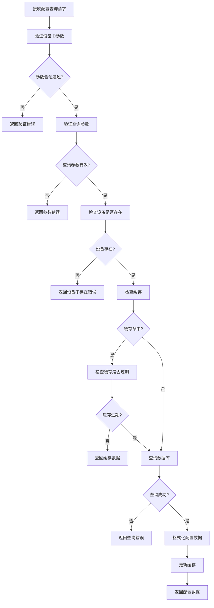
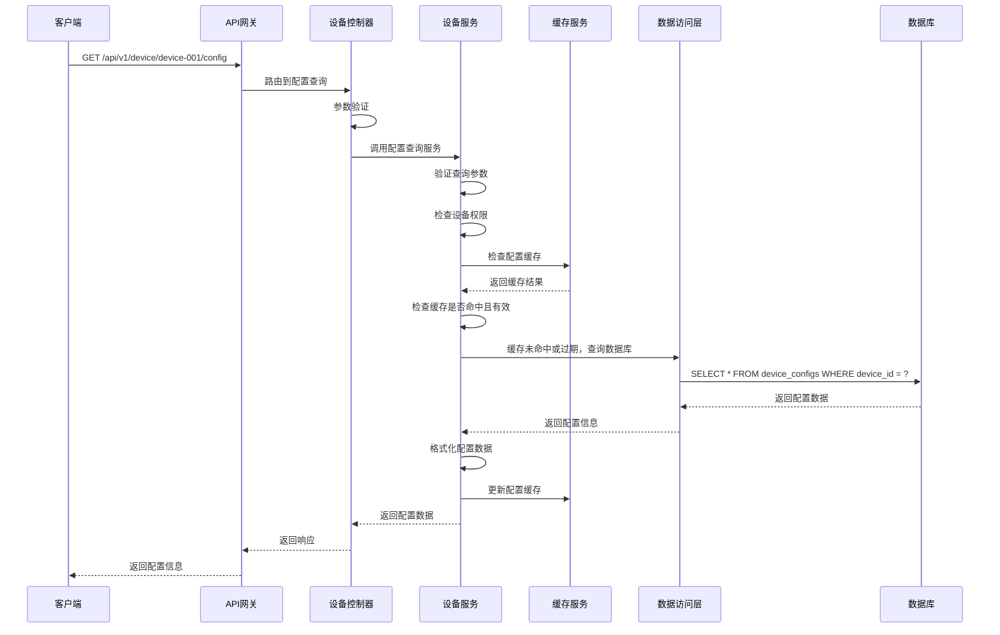

# 设备配置获取模块需求文档

## 1. 功能描述

设备配置获取模块负责查询和获取设备的当前配置信息，包括网络配置、运行参数、功能开关等各类配置项。该模块支持实时配置查询、配置项筛选、配置格式转换等功能，为设备管理和运维提供配置信息支持。

### 1.1 主要功能
- **配置查询**：查询设备的当前配置信息
- **配置项筛选**：按配置类型和配置项进行筛选
- **配置格式转换**：支持多种配置格式输出
- **配置验证**：验证配置的完整性和有效性
- **配置对比**：对比不同时间点的配置差异
- **配置导出**：导出配置信息到文件

### 1.2 支持配置类型
- **网络配置**：IP地址、子网掩码、网关、DNS等
- **系统配置**：操作系统参数、服务配置等
- **应用配置**：应用程序参数、功能开关等
- **安全配置**：认证方式、加密参数等
- **监控配置**：监控阈值、告警设置等

## 2. 功能目标

### 2.1 业务目标
- 提供完整的设备配置信息查询
- 支持多类型配置项的获取
- 确保配置信息的准确性和实时性
- 提供配置信息的格式化和导出功能

### 2.2 技术目标
- 配置查询响应时间 < 100ms
- 支持配置信息的缓存机制
- 配置数据格式标准化
- 高效的配置项筛选算法

### 2.3 监控目标
- 配置查询成功率监控
- 配置数据准确性验证
- 配置查询性能分析
- 配置变更追踪记录

## 3. 输入输出说明

### 3.1 输入参数

#### 3.1.1 设备配置查询请求
```json
{
  "deviceId": "string",        // 设备ID，必填
  "configType": "string",      // 配置类型，可选，如network,system,application
  "configKey": "string",       // 配置项键名，可选
  "format": "string"           // 输出格式，可选，默认json，支持json,xml,yaml
}
```

#### 3.1.2 设备配置项查询请求
```json
{
  "deviceId": "string",        // 设备ID，必填
  "configKeys": ["string"],    // 配置项键名列表，可选
  "includeDefault": true       // 是否包含默认值，可选，默认true
}
```

### 3.2 输出参数

#### 3.2.1 设备配置查询成功响应
```json
{
  "code": 0,
  "message": "success",
  "data": {
    "device_id": "device-001",
    "config_type": "network",
    "config_data": {
      "ip_address": "192.168.1.100",
      "subnet_mask": "255.255.255.0",
      "gateway": "192.168.1.1",
      "dns_servers": ["8.8.8.8", "8.8.4.4"],
      "mtu": 1500,
      "dhcp_enabled": false
    },
    "last_updated": "2024-01-01T15:30:00Z",
    "version": "1.0",
    "checksum": "sha256:abc123..."
  }
}
```

#### 3.2.2 设备配置项查询成功响应
```json
{
  "code": 0,
  "message": "success",
  "data": {
    "device_id": "device-001",
    "configs": [
      {
        "key": "ip_address",
        "value": "192.168.1.100",
        "type": "string",
        "description": "设备IP地址",
        "default_value": "0.0.0.0",
        "is_modified": true,
        "last_modified": "2024-01-01T15:30:00Z"
      },
      {
        "key": "max_connections",
        "value": 1000,
        "type": "integer",
        "description": "最大连接数",
        "default_value": 500,
        "is_modified": true,
        "last_modified": "2024-01-01T14:20:00Z"
      }
    ],
    "total_count": 2,
    "modified_count": 2
  }
}
```

#### 3.2.3 错误响应
```json
{
  "code": 404,
  "message": "设备不存在",
  "data": null
}
```

## 4. 涉及接口以及接口设计

### 4.1 API接口定义

#### 4.1.1 获取设备配置接口
- **路径**：`GET /api/v1/device/device/{deviceId}/config`
- **标签**：设备配置
- **摘要**：获取设备配置信息

#### 4.1.2 获取设备配置项接口
- **路径**：`GET /api/v1/device/device/{deviceId}/config/items`
- **标签**：设备配置
- **摘要**：获取设备配置项详情

#### 4.1.3 验证设备配置接口
- **路径**：`POST /api/v1/device/device/{deviceId}/config/validate`
- **标签**：设备配置
- **摘要**：验证设备配置有效性

### 4.2 内部接口

#### 4.2.1 配置查询接口
```go
type GetDeviceConfigInput struct {
    DeviceID   string
    ConfigType string
    ConfigKey  string
    Format     string
}

type GetDeviceConfigOutput struct {
    DeviceID    string
    ConfigType  string
    ConfigData  map[string]interface{}
    LastUpdated *gtime.Time
    Version     string
    Checksum    string
}
```

#### 4.2.2 配置项查询接口
```go
type GetDeviceConfigItemsInput struct {
    DeviceID      string
    ConfigKeys    []string
    IncludeDefault bool
}

type GetDeviceConfigItemsOutput struct {
    DeviceID       string
    Configs        []ConfigItem
    TotalCount     int
    ModifiedCount  int
}
```

#### 4.2.3 配置验证接口
```go
type ValidateDeviceConfigInput struct {
    DeviceID   string
    ConfigType string
    ConfigData map[string]interface{}
}

type ValidateDeviceConfigOutput struct {
    IsValid    bool
    Errors     []string
    Warnings   []string
}
```

## 5. 数据结构设计

### 5.1 数据库表结构

#### 5.1.1 设备配置表
```sql
CREATE TABLE device_configs (
    id              BIGSERIAL PRIMARY KEY,
    device_id       VARCHAR(100) NOT NULL,
    config_type     VARCHAR(50) NOT NULL,
    config_key      VARCHAR(100) NOT NULL,
    config_value    TEXT,
    config_default  TEXT,
    data_type       VARCHAR(20) NOT NULL DEFAULT 'string',
    description     TEXT,
    is_modified     BOOLEAN NOT NULL DEFAULT false,
    version         VARCHAR(20) NOT NULL DEFAULT '1.0',
    checksum        VARCHAR(64),
    created_at      TIMESTAMP NOT NULL DEFAULT CURRENT_TIMESTAMP,
    updated_at      TIMESTAMP NOT NULL DEFAULT CURRENT_TIMESTAMP,
    created_by      VARCHAR(100),
    CONSTRAINT fk_device_configs_device 
        FOREIGN KEY (device_id) REFERENCES devices(device_id) 
        ON DELETE CASCADE,
    UNIQUE(device_id, config_type, config_key)
);
```

#### 5.1.2 配置查询SQL
```sql
SELECT 
    device_id, config_type, config_key, config_value,
    config_default, data_type, description, is_modified,
    version, checksum, updated_at
FROM device_configs 
WHERE device_id = ? 
    AND (? = '' OR config_type = ?)
    AND (? = '' OR config_key = ?)
ORDER BY config_type, config_key
```

#### 5.1.3 配置项查询SQL
```sql
SELECT 
    device_id, config_type, config_key, config_value,
    config_default, data_type, description, is_modified,
    version, checksum, updated_at
FROM device_configs 
WHERE device_id = ? 
    AND config_key = ANY(?)
ORDER BY config_key
```

### 5.2 缓存结构

#### 5.2.1 设备配置缓存
```go
type DeviceConfigCache struct {
    DeviceID    string
    ConfigType  string
    ConfigData  map[string]interface{}
    LastUpdated time.Time
    Version     string
    Checksum    string
    ExpireAt    time.Time
}
```

#### 5.2.2 配置项缓存
```go
type ConfigItemCache struct {
    DeviceID   string
    ConfigKey  string
    Value      interface{}
    Default    interface{}
    DataType   string
    IsModified bool
    LastUpdate time.Time
    ExpireAt   time.Time
}
```

## 6. 异常处理

### 6.1 输入验证异常
- **设备ID为空**：返回400错误，提示"设备ID不能为空"
- **设备ID格式错误**：返回400错误，提示"设备ID格式不正确"
- **配置类型无效**：返回400错误，提示"配置类型无效"
- **输出格式不支持**：返回400错误，提示"不支持的输出格式"

### 6.2 业务逻辑异常
- **设备不存在**：返回404错误，提示"设备不存在"
- **配置不存在**：返回404错误，提示"配置不存在"
- **权限不足**：返回403错误，提示"权限不足，无法查看配置"

### 6.3 系统异常
- **数据库连接失败**：返回500错误，提示"数据库连接失败"
- **配置查询失败**：返回500错误，提示"配置查询失败"
- **缓存服务异常**：返回500错误，提示"缓存服务异常"

## 7. 交互流程图



## 8. 交互时序图



## 9. 安全与权限

### 9.1 访问控制
- **接口权限**：需要设备配置查询权限
- **数据权限**：根据用户权限过滤可查看的配置
- **设备权限**：根据用户权限决定可查询的设备

### 9.2 数据安全
- **配置数据保护**：保护敏感配置数据不被未授权访问
- **查询审计**：记录配置查询操作
- **数据脱敏**：对敏感配置数据进行脱敏处理

### 9.3 配置安全
- **设备ID验证**：验证设备ID的有效性
- **查询频率限制**：限制配置查询请求频率
- **数据权限验证**：验证用户是否有权限查看该设备的配置

## 10. 日志与审计要求

### 10.1 查询日志
- **配置查询日志**：记录配置查询的详细信息
- **访问日志**：记录用户访问配置的行为
- **权限日志**：记录权限验证的结果

### 10.2 性能日志
- **查询耗时日志**：记录查询执行时间
- **缓存命中率日志**：记录缓存命中情况
- **数据库性能日志**：记录数据库查询性能

### 10.3 日志格式
```json
{
  "timestamp": "2024-01-01T00:00:00Z",
  "level": "INFO",
  "service": "device-config",
  "operation": "get_device_config",
  "device_id": "device-001",
  "user_id": "user-123",
  "ip_address": "192.168.1.100",
  "query_params": {
    "config_type": "network",
    "format": "json"
  },
  "result": "success",
  "duration_ms": 80,
  "cache_hit": false,
  "config_count": 5
}
```

## 11. 测试用例

### 11.1 功能测试用例

#### 11.1.1 正常配置查询测试
- **测试目标**：验证设备配置正常查询功能
- **测试数据**：
  ```
  GET /api/v1/device/device-001/config?configType=network
  ```
- **预期结果**：返回设备device-001的网络配置信息

#### 11.1.2 配置项查询测试
- **测试目标**：验证配置项查询功能
- **测试数据**：
  ```
  GET /api/v1/device/device-001/config/items?configKeys=["ip_address","max_connections"]
  ```
- **预期结果**：返回指定配置项的详细信息

#### 11.1.3 配置验证测试
- **测试目标**：验证配置验证功能
- **测试数据**：
  ```
  POST /api/v1/device/device-001/config/validate
  {
    "configType": "network",
    "configData": {"ip_address": "192.168.1.100"}
  }
  ```
- **预期结果**：返回配置验证结果

#### 11.1.4 设备不存在测试
- **测试目标**：验证设备不存在时的处理
- **测试数据**：
  ```
  GET /api/v1/device/non-existent-device/config
  ```
- **预期结果**：返回404错误，提示"设备不存在"

#### 11.1.5 配置不存在测试
- **测试目标**：验证配置不存在时的处理
- **测试数据**：
  ```
  GET /api/v1/device/device-001/config?configType=invalid_type
  ```
- **预期结果**：返回404错误，提示"配置不存在"

### 11.2 性能测试用例

#### 11.2.1 配置查询响应时间测试
- **测试目标**：验证配置查询响应时间
- **测试场景**：查询单个设备的配置信息
- **预期结果**：响应时间<100ms

#### 11.2.2 缓存性能测试
- **测试目标**：验证缓存机制性能
- **测试场景**：重复查询相同设备的配置
- **预期结果**：缓存命中后查询时间<30ms

#### 11.2.3 并发查询测试
- **测试目标**：验证并发查询性能
- **测试场景**：10个并发查询不同设备配置
- **预期结果**：所有请求在500ms内完成，成功率>99%

### 11.3 配置准确性测试

#### 11.3.1 配置数据准确性测试
- **测试目标**：验证配置数据的准确性
- **测试场景**：查询配置后验证数据完整性
- **预期结果**：配置数据与设备实际配置一致

#### 11.3.2 配置格式转换测试
- **测试目标**：验证配置格式转换功能
- **测试场景**：使用不同格式查询配置
- **预期结果**：配置数据格式转换正确

#### 11.3.3 配置项筛选测试
- **测试目标**：验证配置项筛选功能
- **测试场景**：使用不同筛选条件查询配置
- **预期结果**：筛选结果符合条件要求

### 11.4 安全测试用例

#### 11.4.1 设备ID注入测试
- **测试目标**：验证设备ID注入防护
- **测试数据**：在设备ID中包含恶意代码
- **预期结果**：系统正确过滤恶意代码

#### 11.4.2 配置数据注入测试
- **测试目标**：验证配置数据注入防护
- **测试数据**：在配置数据中包含恶意代码
- **预期结果**：系统正确过滤恶意代码

#### 11.4.3 权限越权测试
- **测试目标**：验证权限控制
- **测试场景**：普通用户尝试查询管理员设备配置
- **预期结果**：返回403权限不足错误

### 11.5 异常测试用例

#### 11.5.1 数据库异常测试
- **测试目标**：验证数据库异常处理
- **测试场景**：模拟数据库连接失败
- **预期结果**：返回500错误，记录详细错误日志

#### 11.5.2 缓存异常测试
- **测试目标**：验证缓存异常处理
- **测试场景**：模拟缓存服务不可用
- **预期结果**：降级到直接查询数据库，不影响功能

#### 11.5.3 网络异常测试
- **测试目标**：验证网络异常处理
- **测试场景**：模拟网络超时
- **预期结果**：返回超时错误，支持重试机制

### 11.6 数据完整性测试

#### 11.6.1 查询数据一致性测试
- **测试目标**：验证查询数据一致性
- **测试场景**：并发查询设备配置
- **预期结果**：查询结果一致，无数据冲突

#### 11.6.2 缓存一致性测试
- **测试目标**：验证缓存数据一致性
- **测试场景**：配置更新后查询
- **预期结果**：缓存数据与数据库数据一致

#### 11.6.3 配置版本控制测试
- **测试目标**：验证配置版本控制功能
- **测试场景**：查询不同版本的配置
- **预期结果**：版本控制正确，配置历史完整

### 11.7 业务逻辑测试

#### 11.7.1 配置类型验证测试
- **测试目标**：验证配置类型验证逻辑
- **测试场景**：查询不同类型的配置
- **预期结果**：只有有效配置类型被接受

#### 11.7.2 配置项筛选测试
- **测试目标**：验证配置项筛选逻辑
- **测试场景**：使用不同筛选条件查询配置项
- **预期结果**：筛选结果符合条件要求

#### 11.7.3 配置验证逻辑测试
- **测试目标**：验证配置验证逻辑
- **测试场景**：验证不同类型的配置数据
- **预期结果**：配置验证结果准确

### 11.8 监控功能测试

#### 11.8.1 配置查询监控测试
- **测试目标**：验证配置查询监控功能
- **测试场景**：监控配置查询过程
- **预期结果**：能够实时监控配置查询状态

#### 11.8.2 配置查询成功率统计测试
- **测试目标**：验证配置查询成功率统计功能
- **测试场景**：收集配置查询统计数据
- **预期结果**：能够准确统计配置查询成功率

#### 11.8.3 配置查询时间分析测试
- **测试目标**：验证配置查询时间分析功能
- **测试场景**：分析配置查询时间
- **预期结果**：能够分析配置查询时间趋势 