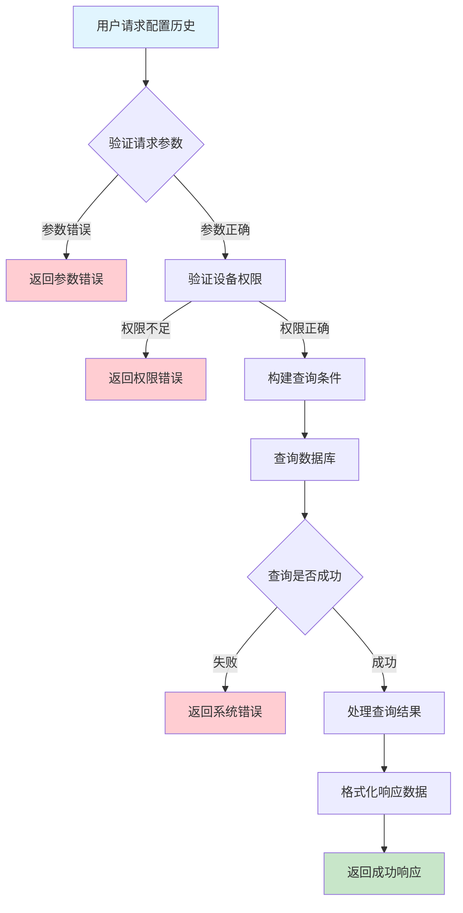
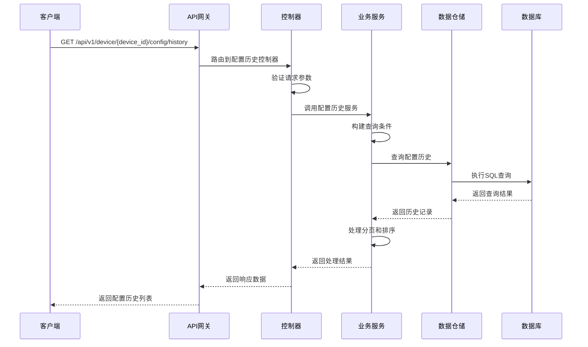

# 设备配置历史需求文档

## 1. 功能描述

### 1.1 功能概述
设备配置历史功能用于查询和管理设备的配置变更历史记录。该功能允许用户查看设备配置的变更轨迹，包括配置的修改时间、修改内容、操作人员等信息，为设备配置管理提供完整的审计追踪能力。

### 1.2 主要功能列表
- 查询设备配置历史记录
- 按时间范围筛选配置历史
- 按配置类型筛选历史记录
- 查看配置变更详情
- 导出配置历史数据
- 配置历史统计分析

### 1.3 支持的功能特性
- 分页查询支持
- 多条件组合筛选
- 历史记录排序
- 配置变更对比
- 历史记录导出
- 配置回滚支持

## 2. 功能目标

### 2.1 业务目标
- 提供完整的设备配置变更审计追踪
- 支持配置变更的合规性检查
- 便于问题排查和故障分析
- 满足监管和审计要求

### 2.2 技术目标
- 高效查询大量历史数据
- 支持复杂查询条件组合
- 提供良好的用户体验
- 确保数据完整性和一致性

### 2.3 安全目标
- 保护敏感配置信息
- 记录操作人员身份
- 防止未授权访问
- 确保审计日志完整性

## 3. 输入输出说明

### 3.1 输入参数

#### 3.1.1 必需参数
- `device_id` (string): 设备ID，用于指定查询的设备

#### 3.1.2 可选参数
- `start_time` (string): 开始时间，格式：YYYY-MM-DD HH:mm:ss
- `end_time` (string): 结束时间，格式：YYYY-MM-DD HH:mm:ss
- `config_type` (string): 配置类型，如：system、network、application等
- `operator_id` (string): 操作人员ID
- `page` (int): 页码，默认：1
- `page_size` (int): 每页数量，默认：20，最大：100

### 3.2 输出参数

#### 3.2.1 成功响应
```json
{
  "code": 200,
  "message": "success",
  "data": {
    "total": 150,
    "page": 1,
    "page_size": 20,
    "list": [
      {
        "id": "config_history_001",
        "device_id": "device_001",
        "config_type": "system",
        "config_key": "timezone",
        "old_value": "UTC+8",
        "new_value": "UTC+9",
        "change_reason": "时区调整",
        "operator_id": "user_001",
        "operator_name": "张三",
        "created_at": "2024-01-15T10:30:00Z",
        "status": "success"
      }
    ]
  }
}
```

#### 3.2.2 错误响应
```json
{
  "code": 400,
  "message": "设备ID不能为空",
  "data": null
}
```

### 3.3 参数格式和约束
- 时间格式：ISO 8601标准格式
- 设备ID：长度1-64字符，支持字母、数字、下划线
- 配置类型：长度1-50字符，支持字母、数字、下划线
- 页码：正整数，范围1-10000
- 每页数量：正整数，范围1-100

## 4. 涉及接口以及接口设计

### 4.1 API接口定义

#### 4.1.1 查询配置历史
```go
// 查询设备配置历史
GET /api/v1/device/{device_id}/config/history
```

**请求参数：**
- Path参数：device_id
- Query参数：start_time, end_time, config_type, operator_id, page, page_size

**响应结构：**
```go
type ConfigHistoryResponse struct {
    Code    int    `json:"code"`
    Message string `json:"message"`
    Data    struct {
        Total     int64           `json:"total"`
        Page      int             `json:"page"`
        PageSize  int             `json:"page_size"`
        List      []ConfigHistory `json:"list"`
    } `json:"data"`
}

type ConfigHistory struct {
    ID           string    `json:"id"`
    DeviceID     string    `json:"device_id"`
    ConfigType   string    `json:"config_type"`
    ConfigKey    string    `json:"config_key"`
    OldValue     string    `json:"old_value"`
    NewValue     string    `json:"new_value"`
    ChangeReason string    `json:"change_reason"`
    OperatorID   string    `json:"operator_id"`
    OperatorName string    `json:"operator_name"`
    CreatedAt    time.Time `json:"created_at"`
    Status       string    `json:"status"`
}
```

#### 4.1.2 获取配置历史详情
```go
// 获取配置历史详情
GET /api/v1/device/config/history/{history_id}
```

**响应结构：**
```go
type ConfigHistoryDetail struct {
    ID           string                 `json:"id"`
    DeviceID     string                 `json:"device_id"`
    ConfigType   string                 `json:"config_type"`
    ConfigKey    string                 `json:"config_key"`
    OldValue     string                 `json:"old_value"`
    NewValue     string                 `json:"new_value"`
    ChangeReason string                 `json:"change_reason"`
    OperatorID   string                 `json:"operator_id"`
    OperatorName string                 `json:"operator_name"`
    CreatedAt    time.Time              `json:"created_at"`
    Status       string                 `json:"status"`
    Metadata     map[string]interface{} `json:"metadata"`
    DiffResult   string                 `json:"diff_result"`
}
```

### 4.2 内部接口设计

#### 4.2.1 配置历史服务接口
```go
type ConfigHistoryService interface {
    // 查询配置历史
    GetConfigHistory(ctx context.Context, req *ConfigHistoryRequest) (*ConfigHistoryResponse, error)
    
    // 获取配置历史详情
    GetConfigHistoryDetail(ctx context.Context, historyID string) (*ConfigHistoryDetail, error)
    
    // 创建配置历史记录
    CreateConfigHistory(ctx context.Context, history *ConfigHistory) error
    
    // 批量查询配置历史
    BatchGetConfigHistory(ctx context.Context, deviceIDs []string, req *ConfigHistoryRequest) (map[string]*ConfigHistoryResponse, error)
}
```

#### 4.2.2 配置历史仓储接口
```go
type ConfigHistoryRepository interface {
    // 查询配置历史
    Query(ctx context.Context, req *ConfigHistoryQuery) (*ConfigHistoryResult, error)
    
    // 根据ID获取配置历史
    GetByID(ctx context.Context, id string) (*ConfigHistory, error)
    
    // 创建配置历史
    Create(ctx context.Context, history *ConfigHistory) error
    
    // 批量创建配置历史
    BatchCreate(ctx context.Context, histories []*ConfigHistory) error
}
```

## 5. 数据结构设计

### 5.1 数据库表结构

#### 5.1.1 设备配置历史表 (device_config_history)
```sql
CREATE TABLE device_config_history (
    id VARCHAR(64) PRIMARY KEY COMMENT '历史记录ID',
    device_id VARCHAR(64) NOT NULL COMMENT '设备ID',
    config_type VARCHAR(50) NOT NULL COMMENT '配置类型',
    config_key VARCHAR(100) NOT NULL COMMENT '配置键',
    old_value TEXT COMMENT '旧值',
    new_value TEXT COMMENT '新值',
    change_reason VARCHAR(500) COMMENT '变更原因',
    operator_id VARCHAR(64) COMMENT '操作人员ID',
    operator_name VARCHAR(100) COMMENT '操作人员姓名',
    status VARCHAR(20) DEFAULT 'success' COMMENT '操作状态',
    metadata JSON COMMENT '元数据',
    created_at TIMESTAMP DEFAULT CURRENT_TIMESTAMP COMMENT '创建时间',
    updated_at TIMESTAMP DEFAULT CURRENT_TIMESTAMP ON UPDATE CURRENT_TIMESTAMP COMMENT '更新时间',
    
    INDEX idx_device_id (device_id),
    INDEX idx_config_type (config_type),
    INDEX idx_operator_id (operator_id),
    INDEX idx_created_at (created_at),
    INDEX idx_device_config (device_id, config_type),
    INDEX idx_device_time (device_id, created_at)
) ENGINE=InnoDB DEFAULT CHARSET=utf8mb4 COMMENT='设备配置历史表';
```

### 5.2 模型结构定义

#### 5.2.1 配置历史模型
```go
type ConfigHistory struct {
    ID           string                 `json:"id" db:"id"`
    DeviceID     string                 `json:"device_id" db:"device_id"`
    ConfigType   string                 `json:"config_type" db:"config_type"`
    ConfigKey    string                 `json:"config_key" db:"config_key"`
    OldValue     string                 `json:"old_value" db:"old_value"`
    NewValue     string                 `json:"new_value" db:"new_value"`
    ChangeReason string                 `json:"change_reason" db:"change_reason"`
    OperatorID   string                 `json:"operator_id" db:"operator_id"`
    OperatorName string                 `json:"operator_name" db:"operator_name"`
    Status       string                 `json:"status" db:"status"`
    Metadata     map[string]interface{} `json:"metadata" db:"metadata"`
    CreatedAt    time.Time              `json:"created_at" db:"created_at"`
    UpdatedAt    time.Time              `json:"updated_at" db:"updated_at"`
}
```

#### 5.2.2 查询请求模型
```go
type ConfigHistoryRequest struct {
    DeviceID    string `json:"device_id" v:"required"`
    StartTime   string `json:"start_time"`
    EndTime     string `json:"end_time"`
    ConfigType  string `json:"config_type"`
    OperatorID  string `json:"operator_id"`
    Page        int    `json:"page" v:"min:1"`
    PageSize    int    `json:"page_size" v:"min:1,max:100"`
}
```

### 5.3 数据关系说明
- 配置历史记录与设备表通过device_id关联
- 配置历史记录与用户表通过operator_id关联
- 配置历史记录按时间顺序存储，支持时间范围查询
- 配置历史记录支持按配置类型分组查询

## 6. 异常处理

### 6.1 输入验证异常
- 设备ID为空或格式错误
- 时间格式不正确
- 页码或每页数量超出范围
- 配置类型格式错误

### 6.2 业务逻辑异常
- 设备不存在
- 查询时间范围过大
- 权限不足
- 数据量过大导致查询超时

### 6.3 系统异常
- 数据库连接失败
- 网络超时
- 系统资源不足
- 服务不可用

## 7. 交互流程图



## 8. 交互时序图



## 9. 安全与权限

### 9.1 访问控制策略
- 需要用户身份验证
- 验证用户对指定设备的访问权限
- 支持基于角色的访问控制(RBAC)
- 记录所有查询操作日志

### 9.2 数据安全要求
- 敏感配置信息需要脱敏处理
- 配置历史数据需要加密存储
- 支持数据访问审计
- 防止SQL注入攻击

### 9.3 身份验证机制
- 使用JWT令牌进行身份验证
- 支持API密钥认证
- 实现请求频率限制
- 支持IP白名单控制

## 10. 日志与审计要求

### 10.1 操作日志要求
- 记录所有配置历史查询操作
- 记录查询参数和结果数量
- 记录操作人员身份信息
- 记录操作时间和IP地址

### 10.2 审计日志要求
- 记录配置变更的完整审计轨迹
- 记录操作人员的身份和权限
- 记录配置变更的原因和影响
- 支持审计日志的长期保存

### 10.3 日志格式规范
```json
{
  "timestamp": "2024-01-15T10:30:00Z",
  "level": "INFO",
  "service": "device-config-history",
  "operation": "query_config_history",
  "user_id": "user_001",
  "device_id": "device_001",
  "parameters": {
    "start_time": "2024-01-01T00:00:00Z",
    "end_time": "2024-01-15T23:59:59Z",
    "config_type": "system"
  },
  "result": {
    "total": 150,
    "count": 20
  }
}
```

## 11. 测试用例

### 11.1 功能测试用例

#### 11.1.1 正常查询测试
**测试场景：** 查询设备配置历史记录
**输入数据：**
```json
{
  "device_id": "device_001",
  "page": 1,
  "page_size": 20
}
```
**预期结果：**
- 返回状态码：200
- 返回配置历史列表
- 分页信息正确
- 数据格式符合预期

#### 11.1.2 时间范围查询测试
**测试场景：** 按时间范围查询配置历史
**输入数据：**
```json
{
  "device_id": "device_001",
  "start_time": "2024-01-01T00:00:00Z",
  "end_time": "2024-01-15T23:59:59Z",
  "page": 1,
  "page_size": 20
}
```
**预期结果：**
- 返回状态码：200
- 只返回指定时间范围内的记录
- 记录按时间倒序排列

#### 11.1.3 配置类型筛选测试
**测试场景：** 按配置类型筛选历史记录
**输入数据：**
```json
{
  "device_id": "device_001",
  "config_type": "system",
  "page": 1,
  "page_size": 20
}
```
**预期结果：**
- 返回状态码：200
- 只返回指定配置类型的记录
- 记录数量符合预期

### 11.2 性能测试用例

#### 11.2.1 大数据量查询测试
**测试场景：** 查询大量配置历史记录
**测试数据：** 100万条配置历史记录
**测试条件：**
- 查询时间范围：1年
- 分页大小：100条
- 并发用户：100个

**预期结果：**
- 查询响应时间 < 2秒
- 内存使用 < 1GB
- 数据库CPU使用率 < 80%

#### 11.2.2 并发查询测试
**测试场景：** 多用户并发查询配置历史
**测试条件：**
- 并发用户数：1000
- 查询频率：每秒100次
- 测试时长：10分钟

**预期结果：**
- 系统稳定运行
- 响应时间 < 3秒
- 错误率 < 1%

### 11.3 安全测试用例

#### 11.3.1 权限验证测试
**测试场景：** 验证用户访问权限
**测试数据：**
- 用户A：有设备访问权限
- 用户B：无设备访问权限

**预期结果：**
- 用户A：成功获取配置历史
- 用户B：返回权限错误

#### 11.3.2 SQL注入防护测试
**测试场景：** 测试SQL注入防护
**输入数据：**
```json
{
  "device_id": "device_001'; DROP TABLE device_config_history; --",
  "config_type": "system' OR '1'='1"
}
```
**预期结果：**
- 系统正确处理特殊字符
- 不执行恶意SQL语句
- 返回参数验证错误

### 11.4 异常测试用例

#### 11.4.1 参数错误测试
**测试场景：** 测试各种参数错误情况
**测试数据：**
```json
{
  "device_id": "",
  "page": 0,
  "page_size": 1000
}
```
**预期结果：**
- 返回参数验证错误
- 错误信息明确具体
- 状态码：400

#### 11.4.2 设备不存在测试
**测试场景：** 查询不存在的设备配置历史
**输入数据：**
```json
{
  "device_id": "non_existent_device",
  "page": 1,
  "page_size": 20
}
```
**预期结果：**
- 返回设备不存在错误
- 状态码：404
- 错误信息友好

#### 11.4.3 系统异常测试
**测试场景：** 模拟数据库连接失败
**测试方法：** 临时关闭数据库连接
**预期结果：**
- 返回系统错误
- 状态码：500
- 记录详细错误日志 