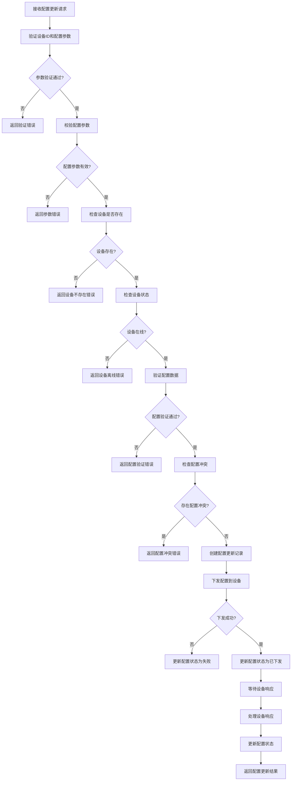
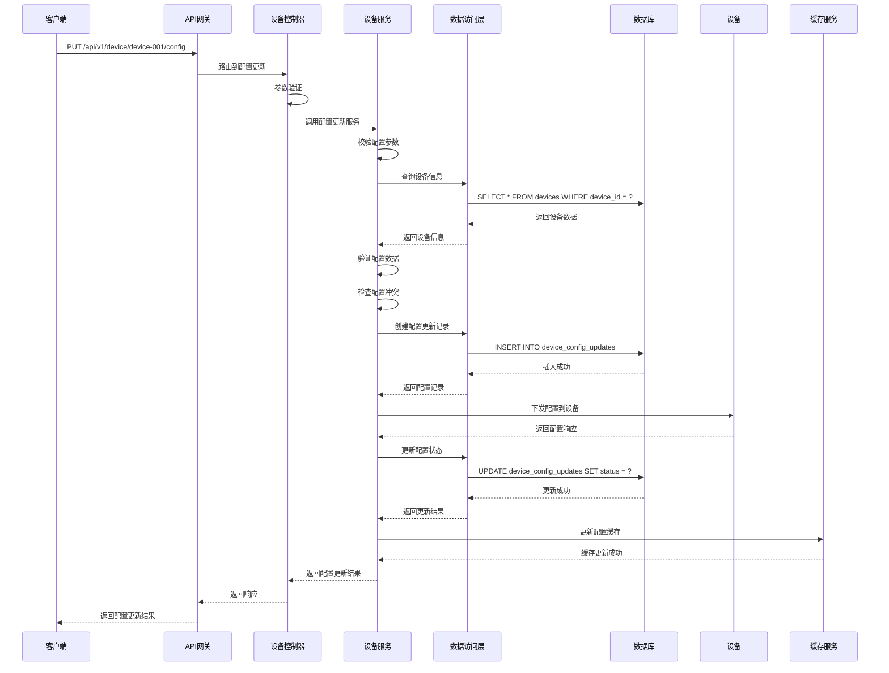

# 设备配置更新模块需求文档

## 1. 功能描述

设备配置更新模块负责更新设备的配置信息，包括网络参数、运行策略、功能开关等各类配置项。该模块支持实时配置更新、配置验证、配置下发等功能，确保配置更新的安全性和一致性，并记录每次配置更新的历史。

### 1.1 主要功能
- **配置更新**：更新设备的配置信息
- **配置验证**：验证配置参数的合法性和有效性
- **配置下发**：将更新后的配置下发到设备
- **配置回滚**：支持回滚到历史配置版本
- **配置对比**：对比更新前后的配置差异
- **配置历史**：记录配置更新的历史信息

### 1.2 支持配置类型
- **网络配置**：IP地址、子网掩码、网关、DNS等
- **系统配置**：操作系统参数、服务配置等
- **应用配置**：应用程序参数、功能开关等
- **安全配置**：认证方式、加密参数等
- **监控配置**：监控阈值、告警设置等

## 2. 功能目标

### 2.1 业务目标
- 实现远程设备配置管理
- 支持多类型配置参数更新
- 保证配置更新的安全性和一致性
- 提供配置历史追溯和回滚能力

### 2.2 技术目标
- 配置更新响应时间 < 200ms
- 支持批量配置更新
- 配置参数校验100%覆盖
- 配置历史完整记录

### 2.3 监控目标
- 配置更新成功率监控
- 配置数据准确性验证
- 配置更新性能分析
- 配置变更追踪记录

## 3. 输入输出说明

### 3.1 输入参数

#### 3.1.1 配置更新请求
```json
{
  "deviceId": "string",        // 设备ID，必填
  "configType": "string",      // 配置类型，必填，如network,system,application
  "configData": "object",      // 配置数据，必填，JSON格式
  "description": "string",     // 更新描述，可选
  "forceUpdate": false         // 强制更新，可选，默认false
}
```

#### 3.1.2 配置验证请求
```json
{
  "deviceId": "string",        // 设备ID，必填
  "configType": "string",      // 配置类型，必填
  "configData": "object",      // 配置数据，必填
  "validateOnly": true         // 仅验证不更新，可选，默认false
}
```

#### 3.1.3 配置回滚请求
```json
{
  "deviceId": "string",        // 设备ID，必填
  "configId": "string",        // 配置ID，必填
  "description": "string"      // 回滚描述，可选
}
```

### 3.2 输出参数

#### 3.2.1 配置更新成功响应
```json
{
  "code": 0,
  "message": "配置更新成功",
  "data": {
    "config_id": "cfg-001",
    "device_id": "device-001",
    "config_type": "network",
    "status": "pending",
    "sent_time": "2024-01-01T15:30:00Z",
    "updated_by": "user-123",
    "description": "更新网络配置",
    "config_changes": {
      "ip_address": {
        "old_value": "192.168.1.100",
        "new_value": "192.168.1.200"
      },
      "gateway": {
        "old_value": "192.168.1.1",
        "new_value": "192.168.1.254"
      }
    }
  }
}
```

#### 3.2.2 配置验证成功响应
```json
{
  "code": 0,
  "message": "配置验证通过",
  "data": {
    "is_valid": true,
    "warnings": [
      "IP地址变更可能需要重启网络服务"
    ],
    "affected_services": ["network", "dns"],
    "estimated_downtime": "30s"
  }
}
```

#### 3.2.3 配置回滚成功响应
```json
{
  "code": 0,
  "message": "配置回滚成功",
  "data": {
    "rollback_id": "rb-001",
    "device_id": "device-001",
    "original_config_id": "cfg-001",
    "status": "pending",
    "rollback_time": "2024-01-01T16:00:00Z",
    "description": "回滚到历史配置"
  }
}
```

#### 3.2.4 错误响应
```json
{
  "code": 400,
  "message": "配置参数不合法",
  "data": {
    "errors": [
      "IP地址格式不正确",
      "网关地址不能为空"
    ]
  }
}
```

## 4. 涉及接口以及接口设计

### 4.1 API接口定义

#### 4.1.1 更新设备配置接口
- **路径**：`PUT /api/v1/device/device/{deviceId}/config`
- **标签**：设备配置
- **摘要**：更新设备配置信息

#### 4.1.2 验证设备配置接口
- **路径**：`POST /api/v1/device/device/{deviceId}/config/validate`
- **标签**：设备配置
- **摘要**：验证设备配置有效性

#### 4.1.3 回滚设备配置接口
- **路径**：`POST /api/v1/device/device/{deviceId}/config/rollback`
- **标签**：设备配置
- **摘要**：回滚设备配置到历史版本

### 4.2 内部接口

#### 4.2.1 配置更新接口
```go
type UpdateDeviceConfigInput struct {
    DeviceID      string
    ConfigType    string
    ConfigData    map[string]interface{}
    Description   string
    ForceUpdate   bool
    UpdatedBy     string
}

type UpdateDeviceConfigOutput struct {
    ConfigID      string
    DeviceID      string
    ConfigType    string
    Status        string
    SentTime      *gtime.Time
    UpdatedBy     string
    Description   string
    ConfigChanges map[string]ConfigChange
}
```

#### 4.2.2 配置验证接口
```go
type ValidateDeviceConfigInput struct {
    DeviceID     string
    ConfigType   string
    ConfigData   map[string]interface{}
    ValidateOnly bool
}

type ValidateDeviceConfigOutput struct {
    IsValid         bool
    Errors          []string
    Warnings        []string
    AffectedServices []string
    EstimatedDowntime string
}
```

#### 4.2.3 配置回滚接口
```go
type RollbackDeviceConfigInput struct {
    DeviceID    string
    ConfigID    string
    Description string
    RollbackBy  string
}

type RollbackDeviceConfigOutput struct {
    RollbackID        string
    DeviceID          string
    OriginalConfigID  string
    Status            string
    RollbackTime      *gtime.Time
    Description       string
}
```

## 5. 数据结构设计

### 5.1 数据库表结构

#### 5.1.1 设备配置更新表
```sql
CREATE TABLE device_config_updates (
    id              BIGSERIAL PRIMARY KEY,
    config_id       VARCHAR(100) NOT NULL UNIQUE,
    device_id       VARCHAR(100) NOT NULL,
    config_type     VARCHAR(50) NOT NULL,
    config_data     JSONB NOT NULL,
    status          VARCHAR(20) NOT NULL DEFAULT 'pending',
    sent_time       TIMESTAMP NOT NULL DEFAULT CURRENT_TIMESTAMP,
    response_time   TIMESTAMP,
    response_data   JSONB,
    error_message   TEXT,
    description     TEXT,
    updated_by      VARCHAR(100) NOT NULL,
    created_at      TIMESTAMP NOT NULL DEFAULT CURRENT_TIMESTAMP,
    updated_at      TIMESTAMP NOT NULL DEFAULT CURRENT_TIMESTAMP,
    CONSTRAINT fk_device_config_updates_device 
        FOREIGN KEY (device_id) REFERENCES devices(device_id) 
        ON DELETE CASCADE
);
```

#### 5.1.2 配置变更记录表
```sql
CREATE TABLE device_config_changes (
    id              BIGSERIAL PRIMARY KEY,
    config_id       VARCHAR(100) NOT NULL,
    config_key      VARCHAR(100) NOT NULL,
    old_value       TEXT,
    new_value       TEXT,
    change_type     VARCHAR(20) NOT NULL, -- add, update, delete
    created_at      TIMESTAMP NOT NULL DEFAULT CURRENT_TIMESTAMP,
    CONSTRAINT fk_device_config_changes_config 
        FOREIGN KEY (config_id) REFERENCES device_config_updates(config_id) 
        ON DELETE CASCADE
);
```

#### 5.1.3 配置回滚记录表
```sql
CREATE TABLE device_config_rollbacks (
    id                  BIGSERIAL PRIMARY KEY,
    rollback_id         VARCHAR(100) NOT NULL UNIQUE,
    device_id           VARCHAR(100) NOT NULL,
    original_config_id  VARCHAR(100) NOT NULL,
    status              VARCHAR(20) NOT NULL DEFAULT 'pending',
    rollback_time       TIMESTAMP NOT NULL DEFAULT CURRENT_TIMESTAMP,
    description         TEXT,
    rollback_by         VARCHAR(100) NOT NULL,
    created_at          TIMESTAMP NOT NULL DEFAULT CURRENT_TIMESTAMP,
    CONSTRAINT fk_device_config_rollbacks_device 
        FOREIGN KEY (device_id) REFERENCES devices(device_id) 
        ON DELETE CASCADE,
    CONSTRAINT fk_device_config_rollbacks_config 
        FOREIGN KEY (original_config_id) REFERENCES device_config_updates(config_id) 
        ON DELETE CASCADE
);
```

### 5.2 缓存结构

#### 5.2.1 配置更新缓存
```go
type DeviceConfigUpdateCache struct {
    ConfigID     string
    DeviceID     string
    ConfigType   string
    Status       string
    SentTime     time.Time
    ResponseTime time.Time
    ResponseData string
    ErrorMessage string
    LastUpdate   time.Time
    ExpireAt     time.Time
}
```

#### 5.2.2 配置变更缓存
```go
type ConfigChangeCache struct {
    ConfigID   string
    ConfigKey  string
    OldValue   interface{}
    NewValue   interface{}
    ChangeType string
    LastUpdate time.Time
    ExpireAt   time.Time
}
```

## 6. 异常处理

### 6.1 输入验证异常
- **设备ID为空**：返回400错误，提示"设备ID不能为空"
- **配置类型为空**：返回400错误，提示"配置类型不能为空"
- **配置数据为空**：返回400错误，提示"配置数据不能为空"
- **配置数据格式错误**：返回400错误，提示"配置数据格式不正确"

### 6.2 业务逻辑异常
- **设备不存在**：返回404错误，提示"设备不存在"
- **设备离线**：返回409错误，提示"设备离线，无法更新配置"
- **配置被拒绝**：返回403错误，提示"配置被拒绝"
- **配置冲突**：返回409错误，提示"配置冲突，请先解决冲突"

### 6.3 系统异常
- **数据库连接失败**：返回500错误，提示"数据库连接失败"
- **配置更新失败**：返回500错误，提示"配置更新失败"
- **设备通信异常**：返回500错误，提示"设备通信异常"

## 7. 交互流程图



## 8. 交互时序图



## 9. 安全与权限

### 9.1 访问控制
- **接口权限**：需要设备配置更新权限
- **数据权限**：根据用户权限过滤可配置的设备
- **配置权限**：根据用户权限决定可更新的配置类型

### 9.2 数据安全
- **配置数据保护**：保护配置数据不被未授权访问
- **配置审计**：记录配置更新和变更操作
- **数据完整性**：确保配置数据的一致性

### 9.3 配置安全
- **设备ID验证**：验证设备ID的有效性
- **配置类型验证**：验证配置类型的合理性
- **配置频率限制**：限制配置更新频率
- **配置权限验证**：验证用户是否有权限更新该配置

## 10. 日志与审计要求

### 10.1 配置日志
- **配置更新日志**：记录配置更新的详细信息
- **配置响应日志**：记录设备响应的内容
- **配置变更日志**：记录配置变更的详细信息

### 10.2 性能日志
- **配置更新耗时**：记录配置更新时间
- **数据库性能日志**：记录数据库操作性能
- **设备通信日志**：记录设备通信性能

### 10.3 日志格式
```json
{
  "timestamp": "2024-01-01T00:00:00Z",
  "level": "INFO",
  "service": "device-config",
  "operation": "update_device_config",
  "device_id": "device-001",
  "config_id": "cfg-001",
  "config_type": "network",
  "user_id": "user-123",
  "ip_address": "192.168.1.100",
  "config_data": {
    "ip_address": "192.168.1.200",
    "gateway": "192.168.1.254"
  },
  "result": "success",
  "duration_ms": 150,
  "status": "sent"
}
```

## 11. 测试用例

### 11.1 功能测试用例

#### 11.1.1 正常配置更新测试
- **测试目标**：验证设备配置正常更新功能
- **测试数据**：
  ```
  PUT /api/v1/device/device-001/config
  {
    "configType": "network",
    "configData": {
      "ip_address": "192.168.1.200",
      "gateway": "192.168.1.254"
    },
    "description": "更新网络配置"
  }
  ```
- **预期结果**：配置成功更新，返回配置ID

#### 11.1.2 配置参数校验测试
- **测试目标**：验证配置参数校验功能
- **测试数据**：
  ```
  PUT /api/v1/device/device-001/config
  {
    "configType": "network",
    "configData": {
      "ip_address": "invalid_ip"
    }
  }
  ```
- **预期结果**：返回400错误，提示"配置参数不合法"

#### 11.1.3 设备不存在测试
- **测试目标**：验证设备不存在时的处理
- **测试数据**：
  ```
  PUT /api/v1/device/non-existent-device/config
  {
    "configType": "network",
    "configData": {}
  }
  ```
- **预期结果**：返回404错误，提示"设备不存在"

#### 11.1.4 设备离线测试
- **测试目标**：验证设备离线时的处理
- **测试场景**：向离线设备更新配置
- **预期结果**：返回409错误，提示"设备离线，无法更新配置"

#### 11.1.5 配置验证测试
- **测试目标**：验证配置验证功能
- **测试数据**：
  ```
  POST /api/v1/device/device-001/config/validate
  {
    "configType": "network",
    "configData": {
      "ip_address": "192.168.1.200"
    }
  }
  ```
- **预期结果**：返回配置验证结果

#### 11.1.6 配置回滚测试
- **测试目标**：验证配置回滚功能
- **测试数据**：
  ```
  POST /api/v1/device/device-001/config/rollback
  {
    "configId": "cfg-001",
    "description": "回滚到历史配置"
  }
  ```
- **预期结果**：配置成功回滚，返回回滚ID

### 11.2 性能测试用例

#### 11.2.1 配置更新响应时间测试
- **测试目标**：验证配置更新响应时间
- **测试场景**：更新单个设备配置
- **预期结果**：响应时间<200ms

#### 11.2.2 并发配置更新测试
- **测试目标**：验证并发配置更新性能
- **测试场景**：10个并发更新不同设备配置
- **预期结果**：所有请求在1秒内完成，成功率>99%

#### 11.2.3 批量配置更新测试
- **测试目标**：验证批量配置更新性能
- **测试场景**：批量更新100个设备配置
- **预期结果**：批量更新在5秒内完成，成功率>95%

### 11.3 配置准确性测试

#### 11.3.1 配置数据准确性测试
- **测试目标**：验证配置数据的准确性
- **测试场景**：更新配置后查询配置历史
- **预期结果**：配置历史与更新数据一致

#### 11.3.2 配置状态更新测试
- **测试目标**：验证配置状态更新的准确性
- **测试场景**：配置更新过程中状态变化
- **预期结果**：配置状态正确更新

#### 11.3.3 配置响应处理测试
- **测试目标**：验证配置响应处理的准确性
- **测试场景**：设备返回配置响应
- **预期结果**：响应数据正确记录

### 11.4 安全测试用例

#### 11.4.1 设备ID注入测试
- **测试目标**：验证设备ID注入防护
- **测试数据**：在设备ID中包含恶意代码
- **预期结果**：系统正确过滤恶意代码

#### 11.4.2 配置数据注入测试
- **测试目标**：验证配置数据注入防护
- **测试数据**：在配置数据中包含恶意代码
- **预期结果**：系统正确过滤恶意代码

#### 11.4.3 权限越权测试
- **测试目标**：验证权限控制
- **测试场景**：普通用户尝试更新管理员配置
- **预期结果**：返回403权限不足错误

### 11.5 异常测试用例

#### 11.5.1 数据库异常测试
- **测试目标**：验证数据库异常处理
- **测试场景**：模拟数据库连接失败
- **预期结果**：返回500错误，记录详细错误日志

#### 11.5.2 设备通信异常测试
- **测试目标**：验证设备通信异常处理
- **测试场景**：模拟设备通信失败
- **预期结果**：配置状态更新为失败，记录错误信息

#### 11.5.3 配置更新超时测试
- **测试目标**：验证配置更新超时处理
- **测试场景**：配置更新超时
- **预期结果**：配置状态更新为超时，记录超时信息

### 11.6 数据完整性测试

#### 11.6.1 配置数据一致性测试
- **测试目标**：验证配置数据一致性
- **测试场景**：并发更新配置
- **预期结果**：配置数据最终一致，无数据冲突

#### 11.6.2 配置历史完整性测试
- **测试目标**：验证配置历史完整性
- **测试场景**：多次更新配置
- **预期结果**：所有配置都有历史记录

#### 11.6.3 缓存一致性测试
- **测试目标**：验证缓存数据一致性
- **测试场景**：配置状态更新后检查缓存
- **预期结果**：缓存数据与数据库数据一致

### 11.7 业务逻辑测试

#### 11.7.1 配置类型验证测试
- **测试目标**：验证配置类型验证逻辑
- **测试场景**：更新不同类型的配置
- **预期结果**：只有有效配置类型被接受

#### 11.7.2 设备状态检查测试
- **测试目标**：验证设备状态检查逻辑
- **测试场景**：向不同状态的设备更新配置
- **预期结果**：只有在线设备能接收配置

#### 11.7.3 配置回滚机制测试
- **测试目标**：验证配置回滚机制
- **测试场景**：回滚到历史配置
- **预期结果**：回滚机制正常工作

### 11.8 监控功能测试

#### 11.8.1 配置更新监控测试
- **测试目标**：验证配置更新监控功能
- **测试场景**：配置更新过程中监控
- **预期结果**：能够实时监控配置更新状态

#### 11.8.2 配置成功率统计测试
- **测试目标**：验证配置成功率统计功能
- **测试场景**：收集配置更新统计数据
- **预期结果**：能够准确统计配置成功率

#### 11.8.3 配置更新时间分析测试
- **测试目标**：验证配置更新时间分析功能
- **测试场景**：分析配置更新时间
- **预期结果**：能够分析配置更新时间趋势 