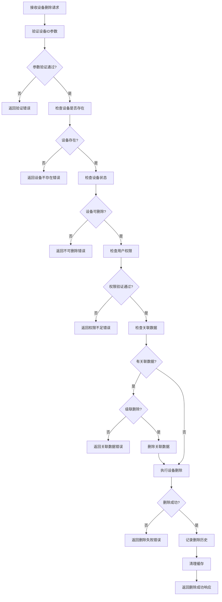
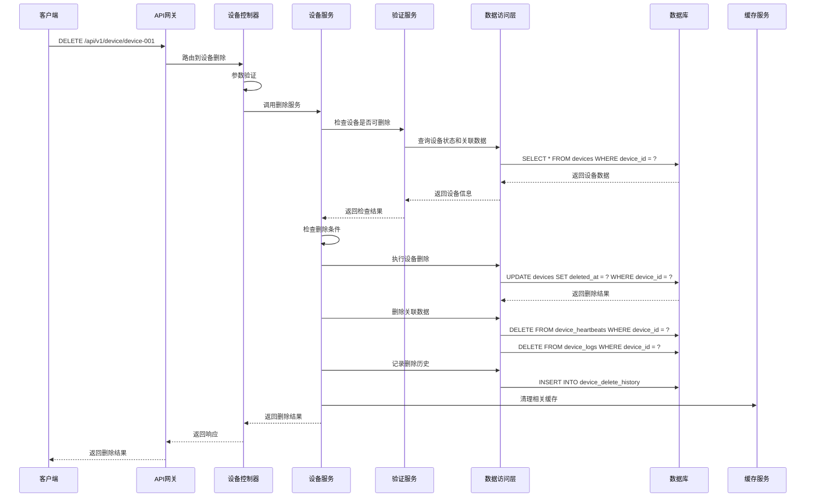

# 设备删除模块需求文档

## 1. 功能描述

设备删除模块是OneGoServer系统的重要管理功能，负责提供设备的安全删除服务。该模块支持软删除和硬删除两种模式，确保设备数据的安全移除，同时保持系统数据的完整性和一致性。

### 1.1 主要功能
- **设备软删除**：标记设备为已删除状态，保留历史数据
- **设备硬删除**：物理删除设备数据，释放存储空间
- **删除前检查**：检查设备是否可以被安全删除
- **关联数据清理**：清理设备相关的所有数据
- **删除历史记录**：记录设备删除操作的详细信息
- **删除恢复**：支持软删除设备的恢复操作

### 1.2 删除模式
- **软删除**：设置deleted_at字段，保留数据用于审计和恢复
- **硬删除**：物理删除数据库记录，不可恢复
- **级联删除**：删除设备及其所有关联数据

## 2. 功能目标

### 2.1 业务目标
- 提供安全、可控的设备删除服务
- 支持设备数据的完整清理
- 确保删除操作的可追溯性
- 支持删除操作的撤销和恢复

### 2.2 技术目标
- 删除响应时间 < 500ms
- 支持批量删除操作
- 数据一致性保证
- 删除操作原子性

### 2.3 安全目标
- 防止误删除操作
- 保护重要设备数据
- 支持删除操作审计
- 防止未授权删除

## 3. 输入输出说明

### 3.1 输入参数

#### 3.1.1 路径参数
```json
{
  "deviceId": "string"  // 设备ID，必填，不能为空
}
```

#### 3.1.2 查询参数
```json
{
  "force": false,       // 强制删除，可选，默认false
  "cascade": true,      // 级联删除，可选，默认true
  "reason": "string"    // 删除原因，可选
}
```

### 3.2 输出参数

#### 3.2.1 成功响应
```json
{
  "code": 0,
  "message": "设备删除成功",
  "data": {
    "device_id": "device-001",
    "delete_type": "soft",
    "deleted_at": "2024-01-01T15:30:00Z",
    "deleted_by": "admin",
    "reason": "设备报废"
  }
}
```

#### 3.2.2 错误响应
```json
{
  "code": 400,
  "message": "设备正在运行中，无法删除",
  "data": {
    "device_id": "device-001",
    "status": "online",
    "running_tasks": 5
  }
}
```

## 4. 涉及接口以及接口设计

### 4.1 API接口定义

#### 4.1.1 设备删除接口
- **路径**：`DELETE /api/v1/device/device/{deviceId}`
- **标签**：设备管理
- **摘要**：删除设备

### 4.2 内部接口

#### 4.2.1 设备删除接口
```go
type DeleteDeviceInput struct {
    ID int64
}

type DeleteDeviceOutput struct {
    Message string
}
```

#### 4.2.2 删除前检查接口
```go
type CheckDeviceDeletableInput struct {
    DeviceID string
}

type CheckDeviceDeletableOutput struct {
    Deletable bool
    Reason    string
    Warnings  []string
}
```

## 5. 数据结构设计

### 5.1 数据库删除结构

#### 5.1.1 软删除SQL
```sql
UPDATE devices 
SET 
    deleted_at = CURRENT_TIMESTAMP,
    deleted_by = ?,
    delete_reason = ?
WHERE device_id = ? AND deleted_at IS NULL
```

#### 5.1.2 硬删除SQL
```sql
DELETE FROM devices WHERE device_id = ?
```

#### 5.1.3 级联删除SQL
```sql
-- 删除设备心跳数据
DELETE FROM device_heartbeats WHERE device_id = ?

-- 删除设备日志
DELETE FROM device_logs WHERE device_id = ?

-- 删除设备命令
DELETE FROM device_commands WHERE device_id = ?

-- 删除设备任务
DELETE FROM device_tasks WHERE device_id = ?

-- 删除设备告警
DELETE FROM device_alerts WHERE device_id = ?
```

### 5.2 删除历史记录结构

#### 5.2.1 删除历史表
```sql
CREATE TABLE device_delete_history (
    id BIGINT PRIMARY KEY AUTO_INCREMENT,
    device_id VARCHAR(36) NOT NULL,
    delete_type ENUM('soft', 'hard') NOT NULL,
    delete_reason TEXT,
    deleted_by VARCHAR(50) NOT NULL,
    deleted_at TIMESTAMP DEFAULT CURRENT_TIMESTAMP,
    cascade_deleted BOOLEAN DEFAULT FALSE,
    related_data_count INT DEFAULT 0
);
```

## 6. 异常处理

### 6.1 输入验证异常
- **设备ID为空**：返回400错误，提示"设备ID不能为空"
- **设备ID格式错误**：返回400错误，提示"设备ID格式不正确"

### 6.2 业务逻辑异常
- **设备不存在**：返回404错误，提示"设备不存在"
- **设备已删除**：返回404错误，提示"设备已删除"
- **设备正在运行**：返回400错误，提示"设备正在运行中，无法删除"
- **设备有运行任务**：返回400错误，提示"设备有运行中的任务，无法删除"
- **权限不足**：返回403错误，提示"权限不足，无法删除设备"

### 6.3 系统异常
- **数据库连接失败**：返回500错误，提示"数据库连接失败"
- **删除操作失败**：返回500错误，提示"设备删除失败"
- **级联删除失败**：返回500错误，提示"关联数据删除失败"

## 7. 交互流程图



## 8. 交互时序图



## 9. 安全与权限

### 9.1 访问控制
- **接口权限**：需要设备删除权限
- **数据权限**：根据用户权限限制可删除的设备
- **删除确认**：重要设备删除需要二次确认

### 9.2 数据安全
- **删除审计**：记录所有设备删除操作
- **数据备份**：重要数据删除前自动备份
- **删除限制**：防止误删除重要设备

### 9.3 操作安全
- **删除前检查**：检查设备状态和关联数据
- **删除确认机制**：重要操作需要用户确认
- **删除恢复机制**：支持软删除设备的恢复

## 10. 日志与审计要求

### 10.1 删除日志
- **删除操作日志**：记录设备删除的详细信息
- **关联数据日志**：记录关联数据删除情况
- **权限验证日志**：记录权限验证的结果

### 10.2 审计日志
- **用户操作审计**：记录操作用户和时间
- **数据删除审计**：记录数据删除的详细信息
- **安全事件审计**：记录安全相关事件

### 10.3 日志格式
```json
{
  "timestamp": "2024-01-01T00:00:00Z",
  "level": "WARN",
  "service": "device-delete",
  "operation": "delete_device",
  "device_id": "device-001",
  "user_id": "user-123",
  "ip_address": "192.168.1.100",
  "delete_type": "soft",
  "delete_reason": "设备报废",
  "cascade_deleted": true,
  "related_data_count": 150,
  "result": "success",
  "duration_ms": 300
}
```

## 11. 测试用例

### 11.1 功能测试用例

#### 11.1.1 正常删除测试
- **测试目标**：验证设备正常删除功能
- **测试数据**：
  ```
  DELETE /api/v1/device/device-001
  ```
- **预期结果**：返回删除成功响应，设备被标记为已删除

#### 11.1.2 强制删除测试
- **测试目标**：验证强制删除功能
- **测试数据**：
  ```
  DELETE /api/v1/device/device-001?force=true
  ```
- **预期结果**：即使设备有运行任务，也能强制删除

#### 11.1.3 级联删除测试
- **测试目标**：验证级联删除功能
- **测试数据**：
  ```
  DELETE /api/v1/device/device-001?cascade=true
  ```
- **预期结果**：设备及其所有关联数据都被删除

#### 11.1.4 设备不存在测试
- **测试目标**：验证设备不存在时的处理
- **测试数据**：
  ```
  DELETE /api/v1/device/non-existent-device
  ```
- **预期结果**：返回404错误，提示"设备不存在"

### 11.2 权限测试用例

#### 11.2.1 权限验证测试
- **测试目标**：验证权限控制功能
- **测试场景**：无权限用户尝试删除设备
- **预期结果**：返回403错误，提示"权限不足"

#### 11.2.2 重要设备删除测试
- **测试目标**：验证重要设备删除保护
- **测试场景**：尝试删除标记为重要的设备
- **预期结果**：返回400错误，提示"重要设备需要特殊权限"

### 11.3 状态检查测试用例

#### 11.3.1 运行中设备删除测试
- **测试目标**：验证运行中设备删除限制
- **测试场景**：尝试删除状态为online的设备
- **预期结果**：返回400错误，提示"设备正在运行中，无法删除"

#### 11.3.2 有任务设备删除测试
- **测试目标**：验证有任务设备删除限制
- **测试场景**：尝试删除有运行任务的设备
- **预期结果**：返回400错误，提示"设备有运行中的任务，无法删除"

### 11.4 安全测试用例

#### 11.4.1 误删除防护测试
- **测试目标**：验证误删除防护机制
- **测试场景**：批量删除操作
- **预期结果**：需要用户确认，防止误操作

#### 11.4.2 删除恢复测试
- **测试目标**：验证删除恢复功能
- **测试场景**：软删除设备后尝试恢复
- **预期结果**：设备成功恢复，状态恢复正常

### 11.5 异常测试用例

#### 11.5.1 数据库异常测试
- **测试目标**：验证数据库异常处理
- **测试场景**：模拟数据库连接失败
- **预期结果**：返回500错误，记录详细错误日志

#### 11.5.2 级联删除异常测试
- **测试目标**：验证级联删除异常处理
- **测试场景**：关联数据删除失败
- **预期结果**：返回500错误，提示"关联数据删除失败"

### 11.6 数据一致性测试

#### 11.6.1 事务一致性测试
- **测试目标**：验证事务一致性
- **测试场景**：删除过程中发生异常
- **预期结果**：数据回滚到删除前状态

#### 11.6.2 关联数据清理测试
- **测试目标**：验证关联数据清理完整性
- **测试场景**：删除设备后检查关联数据
- **预期结果**：所有关联数据都被正确清理

#### 11.6.3 缓存清理测试
- **测试目标**：验证缓存清理完整性
- **测试场景**：删除设备后查询缓存
- **预期结果**：相关缓存被正确清理，查询返回404 