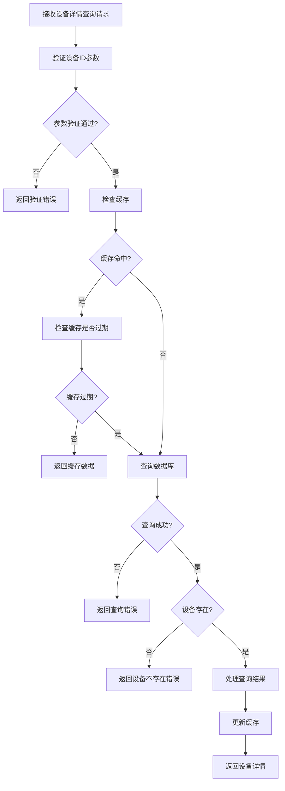
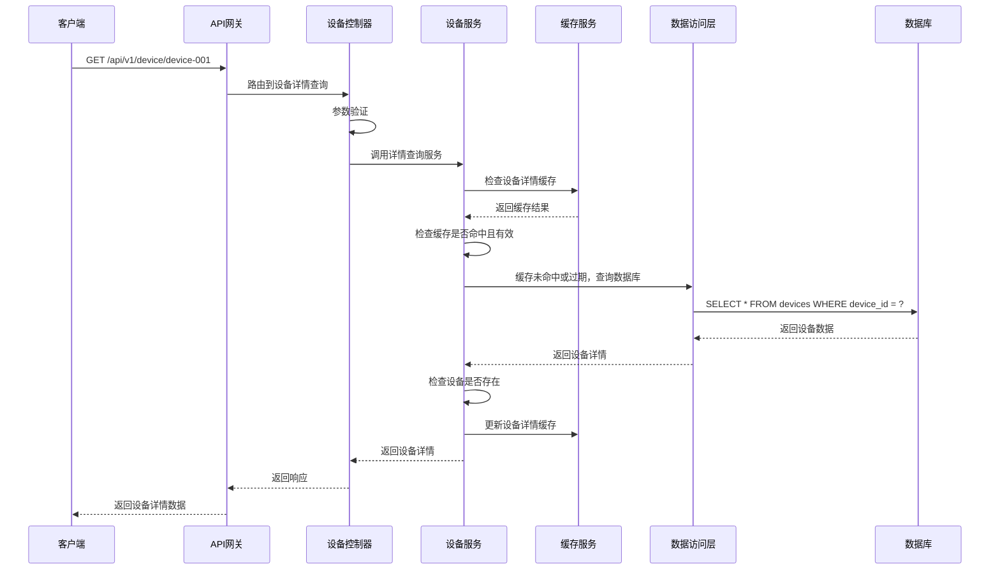

# 设备详情模块需求文档

## 1. 功能描述

设备详情模块是OneGoServer系统的核心查询功能，负责提供单个设备的详细信息查询服务。该模块不仅返回设备的基本信息，还包含设备的运行状态、性能指标、任务统计、登录配置等详细信息，为用户提供全面的设备管理视图。

### 1.1 主要功能
- **设备基本信息查询**：获取设备的基本属性信息
- **设备状态信息查询**：获取设备的当前状态和健康度
- **设备性能指标查询**：获取设备的性能统计数据
- **设备任务统计查询**：获取设备的任务执行统计
- **设备登录配置查询**：获取设备的登录认证信息
- **设备元数据查询**：获取设备的扩展配置信息

### 1.2 支持信息类型
- **基础信息**：设备ID、名称、类型、型号、主板ID等
- **网络信息**：IP地址、端口、协议、端点等
- **状态信息**：当前状态、健康评分、在线时长等
- **统计信息**：心跳次数、告警次数、任务数量等
- **配置信息**：登录用户名、端口、公钥等
- **元数据**：设备标签、扩展配置等

## 2. 功能目标

### 2.1 业务目标
- 提供设备完整信息的快速查询服务
- 支持设备管理和监控的详细信息展示
- 为设备故障排查提供详细信息支持
- 支持设备性能分析和优化决策

### 2.2 技术目标
- 查询响应时间 < 100ms
- 支持实时数据更新
- 数据一致性保证
- 缓存机制优化

### 2.3 用户体验目标
- 信息展示清晰完整
- 数据更新及时准确
- 界面响应快速流畅
- 支持信息导出功能

## 3. 输入输出说明

### 3.1 输入参数

#### 3.1.1 必需参数
```json
{
  "deviceId": "string"  // 设备ID，必填，不能为空
}
```

### 3.2 输出参数

#### 3.2.1 成功响应
```json
{
  "code": 0,
  "message": "success",
  "data": {
    "id": 1,
    "device_id": "device-001",
    "name": "测试服务器01",
    "type": "server",
    "model": "Dell PowerEdge R740",
    "board_id": "BRD001",
    "status": "online",
    "health_score": 95,
    "ip_address": "192.168.1.100",
    "port": 8080,
    "protocol": "http",
    "endpoint": "http://192.168.1.100:8080",
    "reg_time": "2024-01-01T10:00:00Z",
    "last_online_time": "2024-01-01T15:30:00Z",
    "total_online_duration": 86400,
    "total_heartbeats": 1000,
    "total_alerts": 5,
    "total_tasks": 50,
    "login_username": "admin",
    "login_port": 22,
    "login_public_key": "ssh-rsa AAAAB3NzaC1yc2E...",
    "metadata": "{\"location\":\"机房A\",\"department\":\"IT部门\"}",
    "tags": "production,web-server",
    "first_online_time": "2024-01-01T10:00:00Z",
    "total_offline_duration": 3600,
    "total_success_tasks": 45,
    "total_failed_tasks": 3,
    "total_canceled_tasks": 1,
    "total_pending_tasks": 1,
    "total_running_tasks": 0,
    "total_completed_tasks": 45,
    "created_at": "2024-01-01T10:00:00Z",
    "updated_at": "2024-01-01T15:30:00Z",
    "created_by": "system",
    "updated_by": "admin"
  }
}
```

#### 3.2.2 错误响应
```json
{
  "code": 404,
  "message": "设备不存在",
  "data": null
}
```

## 4. 涉及接口以及接口设计

### 4.1 API接口定义

#### 4.1.1 设备详情查询接口
- **路径**：`GET /api/v1/device/device/{deviceId}`
- **标签**：设备信息
- **摘要**：获取设备详情

### 4.2 内部接口

#### 4.2.1 设备详情查询接口
```go
type GetDeviceByDeviceIDInput struct {
    DeviceID string
}

type GetDeviceByDeviceIDOutput struct {
    Device *Device
}
```

#### 4.2.2 设备统计信息接口
```go
type GetDeviceStatisticsInput struct {
    DeviceID string
}

type GetDeviceStatisticsOutput struct {
    Statistics *DeviceStatistics
}
```

## 5. 数据结构设计

### 5.1 数据库查询结构

#### 5.1.1 基础查询SQL
```sql
SELECT 
    id, device_id, name, type, model, board_id, status, health_score,
    ip_address, port, protocol, endpoint, reg_time, last_online_time,
    total_online_duration, total_heartbeats, total_alerts, total_tasks,
    login_username, login_port, login_public_key, metadata, tags,
    first_online_time, total_offline_duration, total_success_tasks,
    total_failed_tasks, total_canceled_tasks, total_pending_tasks,
    total_running_tasks, total_completed_tasks, created_at, updated_at,
    created_by, updated_by
FROM devices 
WHERE device_id = ? AND deleted_at IS NULL
```

### 5.2 缓存结构

#### 5.2.1 设备详情缓存
```go
type DeviceDetailCache struct {
    DeviceID   string    // 设备ID
    Data       *Device   // 设备详情数据
    ExpireAt   time.Time // 过期时间
    LastUpdate time.Time // 最后更新时间
}
```

## 6. 异常处理

### 6.1 输入验证异常
- **设备ID为空**：返回400错误，提示"设备ID不能为空"
- **设备ID格式错误**：返回400错误，提示"设备ID格式不正确"

### 6.2 业务逻辑异常
- **设备不存在**：返回404错误，提示"设备不存在"
- **设备已删除**：返回404错误，提示"设备已删除"
- **权限不足**：返回403错误，提示"权限不足，无法查看设备详情"

### 6.3 系统异常
- **数据库连接失败**：返回500错误，提示"数据库连接失败"
- **缓存服务异常**：返回500错误，提示"缓存服务异常"
- **系统内部错误**：返回500错误，提示"系统内部错误"

## 7. 交互流程图



## 8. 交互时序图



## 9. 安全与权限

### 9.1 访问控制
- **接口权限**：需要设备查询权限
- **数据权限**：根据用户权限过滤可查看的设备信息
- **敏感信息控制**：根据用户权限决定是否返回敏感信息

### 9.2 数据安全
- **敏感信息过滤**：过滤设备密码等敏感信息
- **数据脱敏**：对敏感字段进行脱敏处理
- **访问审计**：记录设备详情查询操作日志

### 9.3 查询安全
- **设备ID验证**：验证设备ID的有效性
- **查询频率限制**：限制查询请求频率
- **数据权限验证**：验证用户是否有权限查看该设备

## 10. 日志与审计要求

### 10.1 查询日志
- **详情查询日志**：记录设备详情查询的详细信息
- **访问日志**：记录用户访问设备详情的行为
- **权限日志**：记录权限验证的结果

### 10.2 性能日志
- **查询耗时日志**：记录查询执行时间
- **缓存命中率日志**：记录缓存命中情况
- **数据库性能日志**：记录数据库查询性能

### 10.3 日志格式
```json
{
  "timestamp": "2024-01-01T00:00:00Z",
  "level": "INFO",
  "service": "device-detail",
  "operation": "get_device_detail",
  "device_id": "device-001",
  "user_id": "user-123",
  "ip_address": "192.168.1.100",
  "result": "success",
  "duration_ms": 50,
  "cache_hit": true,
  "permissions": ["device:read"]
}
```

## 11. 测试用例

### 11.1 功能测试用例

#### 11.1.1 正常查询测试
- **测试目标**：验证设备详情正常查询功能
- **测试数据**：
  ```
  GET /api/v1/device/device-001
  ```
- **预期结果**：返回设备device-001的完整详情信息

#### 11.1.2 设备不存在测试
- **测试目标**：验证设备不存在时的处理
- **测试数据**：
  ```
  GET /api/v1/device/non-existent-device
  ```
- **预期结果**：返回404错误，提示"设备不存在"

#### 11.1.3 参数验证测试
- **测试目标**：验证参数验证功能
- **测试数据**：
  ```
  GET /api/v1/device/
  ```
- **预期结果**：返回400错误，提示"设备ID不能为空"

#### 11.1.4 权限验证测试
- **测试目标**：验证权限控制功能
- **测试场景**：无权限用户尝试查询设备详情
- **预期结果**：返回403错误，提示"权限不足"

### 11.2 性能测试用例

#### 11.2.1 查询响应时间测试
- **测试目标**：验证查询响应时间
- **测试场景**：查询单个设备详情
- **预期结果**：响应时间<100ms

#### 11.2.2 缓存性能测试
- **测试目标**：验证缓存机制性能
- **测试场景**：重复查询相同设备详情
- **预期结果**：缓存命中后查询时间<20ms

#### 11.2.3 并发查询测试
- **测试目标**：验证并发查询性能
- **测试场景**：100个并发查询不同设备详情
- **预期结果**：所有请求在1秒内完成，成功率>99%

### 11.3 安全测试用例

#### 11.3.1 设备ID注入测试
- **测试目标**：验证设备ID注入防护
- **测试数据**：在设备ID中包含恶意代码
- **预期结果**：系统正确过滤恶意代码

#### 11.3.2 权限越权测试
- **测试目标**：验证权限控制
- **测试场景**：普通用户尝试查询管理员设备
- **预期结果**：返回403权限不足错误

#### 11.3.3 敏感信息保护测试
- **测试目标**：验证敏感信息保护
- **测试场景**：查询包含敏感信息的设备详情
- **预期结果**：敏感信息被正确过滤或脱敏

### 11.4 异常测试用例

#### 11.4.1 数据库异常测试
- **测试目标**：验证数据库异常处理
- **测试场景**：模拟数据库连接失败
- **预期结果**：返回500错误，记录详细错误日志

#### 11.4.2 缓存异常测试
- **测试目标**：验证缓存异常处理
- **测试场景**：模拟缓存服务不可用
- **预期结果**：降级到直接查询数据库，不影响功能

#### 11.4.3 网络异常测试
- **测试目标**：验证网络异常处理
- **测试场景**：模拟网络超时
- **预期结果**：返回超时错误，支持重试机制

### 11.5 数据完整性测试

#### 11.5.1 数据一致性测试
- **测试目标**：验证数据一致性
- **测试场景**：设备信息更新后查询详情
- **预期结果**：返回最新的设备信息

#### 11.5.2 缓存一致性测试
- **测试目标**：验证缓存数据一致性
- **测试场景**：设备信息更新后检查缓存
- **预期结果**：缓存数据与数据库数据一致

#### 11.5.3 字段完整性测试
- **测试目标**：验证返回字段的完整性
- **测试场景**：查询设备详情
- **预期结果**：返回所有必需的字段，无缺失 