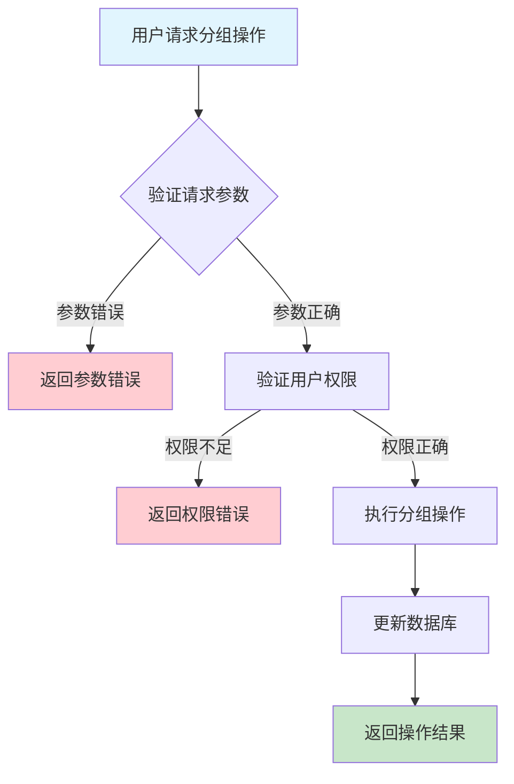
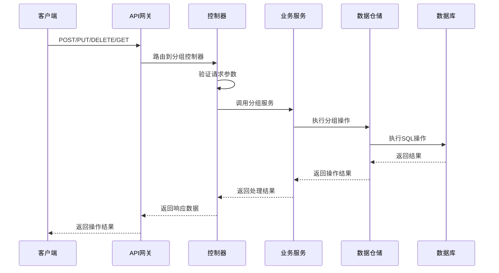

# 设备分组需求文档

## 1. 功能描述

### 1.1 功能概述
设备分组功能用于对设备进行逻辑分组管理，支持分组的创建、修改、删除、查询、分组层级管理等。通过分组可实现批量管理、权限分配、分组统计等运维需求。

### 1.2 主要功能列表
- 创建设备分组
- 修改设备分组
- 删除设备分组
- 查询分组列表
- 查询分组详情
- 分组层级管理（支持多级分组）
- 分组批量操作

### 1.3 支持的功能特性
- 多级分组结构
- 分组批量管理
- 分组权限配置
- 分组统计分析
- 分组成员动态调整

## 2. 功能目标

### 2.1 业务目标
- 提高设备管理灵活性
- 支持批量运维和权限分配
- 优化设备组织结构

### 2.2 技术目标
- 高效分组查询与维护
- 支持大规模分组管理
- 分组数据一致性保障

### 2.3 安全目标
- 分组操作权限控制
- 防止误操作
- 分组操作可审计

## 3. 输入输出说明

### 3.1 输入参数

#### 3.1.1 必需参数
- `group_name` (string): 分组名称

#### 3.1.2 可选参数
- `parent_id` (string): 父分组ID
- `description` (string): 分组描述
- `members` (array[string]): 初始成员设备ID列表

### 3.2 输出参数

#### 3.2.1 成功响应
```json
{
  "code": 200,
  "message": "success",
  "data": {
    "group_id": "group_001",
    "group_name": "生产线A",
    "parent_id": null,
    "description": "生产线A所有设备",
    "members": ["device_001", "device_002"],
    "created_at": "2024-01-15T13:00:00Z",
    "updated_at": "2024-01-15T13:00:00Z"
  }
}
```

#### 3.2.2 错误响应
```json
{
  "code": 400,
  "message": "参数错误或操作不允许",
  "data": null
}
```

### 3.3 参数格式和约束
- 分组名称：1-100字符，唯一
- 父分组ID：可为空，若有则需存在
- 成员设备ID：1-64字符，字母、数字、下划线

## 4. 涉及接口以及接口设计

### 4.1 API接口定义

#### 4.1.1 创建分组
```go
// 创建分组
POST /api/v1/device/groups
```

#### 4.1.2 修改分组
```go
// 修改分组
PUT /api/v1/device/groups/{group_id}
```

#### 4.1.3 删除分组
```go
// 删除分组
DELETE /api/v1/device/groups/{group_id}
```

#### 4.1.4 查询分组列表
```go
// 查询分组列表
GET /api/v1/device/groups
```

#### 4.1.5 查询分组详情
```go
// 查询分组详情
GET /api/v1/device/groups/{group_id}
```

### 4.2 内部接口设计

#### 4.2.1 分组服务接口
```go
type DeviceGroupService interface {
    CreateGroup(ctx context.Context, req *DeviceGroupRequest) (*DeviceGroup, error)
    UpdateGroup(ctx context.Context, groupID string, req *DeviceGroupRequest) error
    DeleteGroup(ctx context.Context, groupID string) error
    GetGroupList(ctx context.Context) ([]DeviceGroup, error)
    GetGroupDetail(ctx context.Context, groupID string) (*DeviceGroup, error)
}
```

#### 4.2.2 分组仓储接口
```go
type DeviceGroupRepository interface {
    Create(ctx context.Context, group *DeviceGroup) error
    Update(ctx context.Context, group *DeviceGroup) error
    Delete(ctx context.Context, groupID string) error
    GetList(ctx context.Context) ([]DeviceGroup, error)
    GetByID(ctx context.Context, groupID string) (*DeviceGroup, error)
}
```

## 5. 数据结构设计

### 5.1 数据库表结构

#### 5.1.1 设备分组表 (device_groups)
```sql
CREATE TABLE device_groups (
    id VARCHAR(64) PRIMARY KEY COMMENT '分组ID',
    group_name VARCHAR(100) NOT NULL UNIQUE COMMENT '分组名称',
    parent_id VARCHAR(64) COMMENT '父分组ID',
    description VARCHAR(255) COMMENT '分组描述',
    created_at TIMESTAMP DEFAULT CURRENT_TIMESTAMP COMMENT '创建时间',
    updated_at TIMESTAMP DEFAULT CURRENT_TIMESTAMP ON UPDATE CURRENT_TIMESTAMP COMMENT '更新时间',
    INDEX idx_parent_id (parent_id)
) ENGINE=InnoDB DEFAULT CHARSET=utf8mb4 COMMENT='设备分组表';
```

#### 5.1.2 分组成员表 (device_group_members)
```sql
CREATE TABLE device_group_members (
    id BIGINT AUTO_INCREMENT PRIMARY KEY COMMENT '成员ID',
    group_id VARCHAR(64) NOT NULL COMMENT '分组ID',
    device_id VARCHAR(64) NOT NULL COMMENT '设备ID',
    created_at TIMESTAMP DEFAULT CURRENT_TIMESTAMP COMMENT '加入时间',
    INDEX idx_group_id (group_id),
    INDEX idx_device_id (device_id),
    FOREIGN KEY (group_id) REFERENCES device_groups(id) ON DELETE CASCADE
) ENGINE=InnoDB DEFAULT CHARSET=utf8mb4 COMMENT='设备分组成员表';
```

### 5.2 模型结构定义

#### 5.2.1 分组模型
```go
type DeviceGroup struct {
    ID          string   `json:"group_id" db:"id"`
    GroupName   string   `json:"group_name" db:"group_name"`
    ParentID    *string  `json:"parent_id" db:"parent_id"`
    Description string   `json:"description" db:"description"`
    Members     []string `json:"members"`
    CreatedAt   string   `json:"created_at" db:"created_at"`
    UpdatedAt   string   `json:"updated_at" db:"updated_at"`
}
```

#### 5.2.2 分组请求模型
```go
type DeviceGroupRequest struct {
    GroupName   string   `json:"group_name" v:"required"`
    ParentID    *string  `json:"parent_id"`
    Description string   `json:"description"`
    Members     []string `json:"members"`
}
```

### 5.3 数据关系说明
- 分组与成员通过group_id关联
- 支持多级分组结构

## 6. 异常处理

### 6.1 输入验证异常
- 分组名称为空或重复
- 父分组ID不存在
- 成员设备ID格式错误

### 6.2 业务逻辑异常
- 分组不存在
- 权限不足
- 分组下有成员时不允许删除

### 6.3 系统异常
- 数据库连接失败
- 网络超时
- 系统资源不足

## 7. 交互流程图



## 8. 交互时序图



## 9. 安全与权限

### 9.1 访问控制策略
- 需要用户身份验证
- 验证用户对分组的管理权限
- 支持基于角色的访问控制(RBAC)
- 记录所有分组操作

### 9.2 数据安全要求
- 防止误操作
- 分组操作需二次确认（如删除）
- 支持数据访问审计
- 防止SQL注入

### 9.3 身份验证机制
- JWT令牌
- API密钥
- 请求频率限制
- IP白名单

## 10. 日志与审计要求

### 10.1 操作日志要求
- 记录所有分组操作
- 记录参数和结果
- 记录操作人员身份
- 记录操作时间和IP

### 10.2 审计日志要求
- 记录分组变更轨迹
- 记录身份和权限
- 记录操作目的
- 支持长期保存

### 10.3 日志格式规范
```json
{
  "timestamp": "2024-01-15T13:00:00Z",
  "level": "INFO",
  "service": "device-group",
  "operation": "create_group",
  "user_id": "user_001",
  "parameters": {
    "group_name": "生产线A",
    "parent_id": null
  },
  "result": {
    "success": true,
    "group_id": "group_001"
  }
}
```

## 11. 测试用例

### 11.1 功能测试用例

#### 11.1.1 创建分组测试
**测试场景：** 创建新分组
**输入数据：**
```json
{
  "group_name": "生产线A"
}
```
**预期结果：**
- 返回状态码：200
- 返回新分组ID

#### 11.1.2 修改分组测试
**测试场景：** 修改分组
**输入数据：**
```json
{
  "group_id": "group_001",
  "group_name": "生产线A-更新"
}
```
**预期结果：**
- 返回状态码：200
- 分组内容更新

#### 11.1.3 删除分组测试
**测试场景：** 删除分组
**输入数据：**
```json
{
  "group_id": "group_001"
}
```
**预期结果：**
- 返回状态码：200
- 分组被删除

#### 11.1.4 查询分组列表测试
**测试场景：** 查询分组列表
**输入数据：**
无
**预期结果：**
- 返回状态码：200
- 返回分组列表

### 11.2 性能测试用例

#### 11.2.1 大量分组查询测试
**测试场景：** 查询1000个分组
**预期结果：**
- 查询响应时间 < 1秒
- 数据完整

### 11.3 安全测试用例

#### 11.3.1 权限验证测试
**测试场景：** 验证用户分组管理权限
**测试数据：**
- 用户A：有权限
- 用户B：无权限
**预期结果：**
- 用户A：成功操作
- 用户B：返回权限错误

#### 11.3.2 误操作防护测试
**测试场景：** 删除分组需二次确认
**输入数据：**
```json
{
  "group_id": "group_001"
}
```
**预期结果：**
- 未确认时不执行
- 返回提示

### 11.4 异常测试用例

#### 11.4.1 参数错误测试
**测试场景：** 参数错误
**输入数据：**
```json
{
  "group_name": ""
}
```
**预期结果：**
- 返回参数验证错误
- 状态码400

#### 11.4.2 分组不存在测试
**测试场景：** 操作不存在的分组
**输入数据：**
```json
{
  "group_id": "non_existent_group"
}
```
**预期结果：**
- 返回404
- 错误信息友好

#### 11.4.3 系统异常测试
**测试场景：** 数据库连接失败
**测试方法：** 临时关闭数据库
**预期结果：**
- 返回500
- 记录详细错误日志 