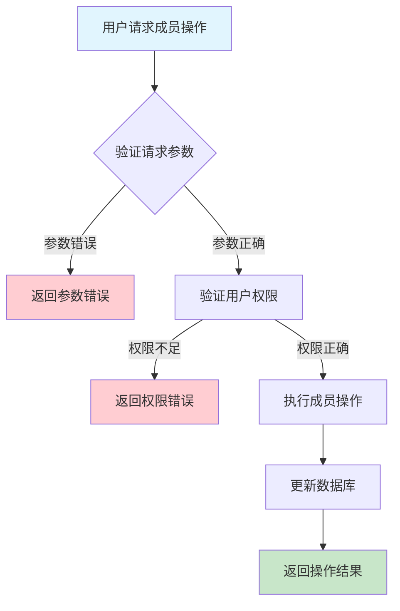
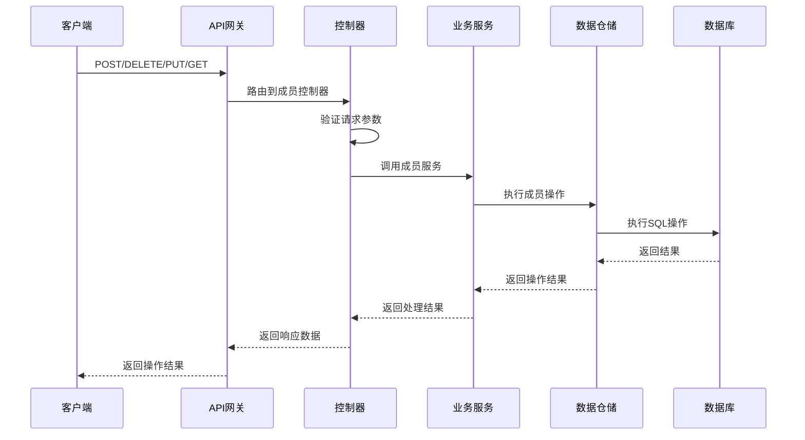

# 设备分组成员管理需求文档

## 1. 功能描述

### 1.1 功能概述
设备分组成员管理功能用于对设备分组内的成员进行增删查改，包括添加设备到分组、移除设备、批量调整成员、查询分组成员等。该功能支持灵活的设备批量管理和分组动态调整。

### 1.2 主要功能列表
- 添加设备到分组
- 从分组移除设备
- 批量调整分组成员
- 查询分组成员列表
- 查询设备所属分组

### 1.3 支持的功能特性
- 批量成员管理
- 分组成员权限配置
- 成员变更历史记录
- 分组与成员联动

## 2. 功能目标

### 2.1 业务目标
- 支持设备批量分组管理
- 提高分组成员调整效率
- 优化设备组织结构

### 2.2 技术目标
- 高效批量成员操作
- 分组成员数据一致性
- 成员变更可追溯

### 2.3 安全目标
- 分组成员操作权限控制
- 防止误操作
- 操作可审计

## 3. 输入输出说明

### 3.1 输入参数

#### 3.1.1 必需参数
- `group_id` (string): 分组ID
- `device_ids` (array[string]): 设备ID列表

#### 3.1.2 可选参数
- `action` (string): 操作类型（add、remove、replace）

### 3.2 输出参数

#### 3.2.1 成功响应
```json
{
  "code": 200,
  "message": "success",
  "data": {
    "group_id": "group_001",
    "device_ids": ["device_001", "device_002"],
    "action": "add",
    "updated_at": "2024-01-15T13:10:00Z"
  }
}
```

#### 3.2.2 错误响应
```json
{
  "code": 400,
  "message": "参数错误或操作不允许",
  "data": null
}
```

### 3.3 参数格式和约束
- 分组ID：1-64字符
- 设备ID：1-64字符，字母、数字、下划线
- 操作类型：add、remove、replace

## 4. 涉及接口以及接口设计

### 4.1 API接口定义

#### 4.1.1 添加成员
```go
// 添加成员
POST /api/v1/device/groups/{group_id}/members
```

#### 4.1.2 移除成员
```go
// 移除成员
DELETE /api/v1/device/groups/{group_id}/members
```

#### 4.1.3 批量调整成员
```go
// 批量调整成员
PUT /api/v1/device/groups/{group_id}/members
```

#### 4.1.4 查询分组成员
```go
// 查询分组成员
GET /api/v1/device/groups/{group_id}/members
```

#### 4.1.5 查询设备所属分组
```go
// 查询设备所属分组
GET /api/v1/device/{device_id}/groups
```

### 4.2 内部接口设计

#### 4.2.1 分组成员服务接口
```go
type DeviceGroupMemberService interface {
    AddMembers(ctx context.Context, groupID string, deviceIDs []string) error
    RemoveMembers(ctx context.Context, groupID string, deviceIDs []string) error
    ReplaceMembers(ctx context.Context, groupID string, deviceIDs []string) error
    GetMembers(ctx context.Context, groupID string) ([]string, error)
    GetGroupsByDevice(ctx context.Context, deviceID string) ([]string, error)
}
```

#### 4.2.2 分组成员仓储接口
```go
type DeviceGroupMemberRepository interface {
    Add(ctx context.Context, groupID string, deviceIDs []string) error
    Remove(ctx context.Context, groupID string, deviceIDs []string) error
    Replace(ctx context.Context, groupID string, deviceIDs []string) error
    GetByGroup(ctx context.Context, groupID string) ([]string, error)
    GetByDevice(ctx context.Context, deviceID string) ([]string, error)
}
```

## 5. 数据结构设计

### 5.1 数据库表结构
- 复用 device_group_members 表

### 5.2 模型结构定义
```go
type DeviceGroupMemberRequest struct {
    DeviceIDs []string `json:"device_ids" v:"required"`
    Action    string   `json:"action"`
}
```

### 5.3 数据关系说明
- 分组与成员通过group_id关联
- 支持批量成员变更

## 6. 异常处理

### 6.1 输入验证异常
- 分组ID/设备ID为空或格式错误
- 操作类型不支持

### 6.2 业务逻辑异常
- 分组不存在
- 设备不存在
- 权限不足

### 6.3 系统异常
- 数据库连接失败
- 网络超时
- 系统资源不足

## 7. 交互流程图



## 8. 交互时序图



## 9. 安全与权限

### 9.1 访问控制策略
- 需要用户身份验证
- 验证用户对分组成员的管理权限
- 支持基于角色的访问控制(RBAC)
- 记录所有成员操作

### 9.2 数据安全要求
- 防止误操作
- 成员操作需二次确认（如批量替换）
- 支持数据访问审计
- 防止SQL注入

### 9.3 身份验证机制
- JWT令牌
- API密钥
- 请求频率限制
- IP白名单

## 10. 日志与审计要求

### 10.1 操作日志要求
- 记录所有成员操作
- 记录参数和结果
- 记录操作人员身份
- 记录操作时间和IP

### 10.2 审计日志要求
- 记录成员变更轨迹
- 记录身份和权限
- 记录操作目的
- 支持长期保存

### 10.3 日志格式规范
```json
{
  "timestamp": "2024-01-15T13:10:00Z",
  "level": "INFO",
  "service": "device-group-member",
  "operation": "add_members",
  "user_id": "user_001",
  "parameters": {
    "group_id": "group_001",
    "device_ids": ["device_001", "device_002"]
  },
  "result": {
    "success": true
  }
}
```

## 11. 测试用例

### 11.1 功能测试用例

#### 11.1.1 添加成员测试
**测试场景：** 添加设备到分组
**输入数据：**
```json
{
  "group_id": "group_001",
  "device_ids": ["device_001", "device_002"],
  "action": "add"
}
```
**预期结果：**
- 返回状态码：200
- 成员添加成功

#### 11.1.2 移除成员测试
**测试场景：** 从分组移除设备
**输入数据：**
```json
{
  "group_id": "group_001",
  "device_ids": ["device_002"],
  "action": "remove"
}
```
**预期结果：**
- 返回状态码：200
- 成员移除成功

#### 11.1.3 批量替换成员测试
**测试场景：** 批量替换分组成员
**输入数据：**
```json
{
  "group_id": "group_001",
  "device_ids": ["device_003", "device_004"],
  "action": "replace"
}
```
**预期结果：**
- 返回状态码：200
- 分组成员被替换

#### 11.1.4 查询分组成员测试
**测试场景：** 查询分组成员
**输入数据：**
无
**预期结果：**
- 返回状态码：200
- 返回成员列表

### 11.2 性能测试用例

#### 11.2.1 大量成员操作测试
**测试场景：** 批量添加1000个成员
**预期结果：**
- 响应时间 < 2秒
- 错误率 < 1%

### 11.3 安全测试用例

#### 11.3.1 权限验证测试
**测试场景：** 验证用户成员管理权限
**测试数据：**
- 用户A：有权限
- 用户B：无权限
**预期结果：**
- 用户A：成功操作
- 用户B：返回权限错误

#### 11.3.2 误操作防护测试
**测试场景：** 批量替换需二次确认
**输入数据：**
```json
{
  "group_id": "group_001",
  "device_ids": ["device_005"],
  "action": "replace"
}
```
**预期结果：**
- 未确认时不执行
- 返回提示

### 11.4 异常测试用例

#### 11.4.1 参数错误测试
**测试场景：** 参数错误
**输入数据：**
```json
{
  "group_id": "",
  "device_ids": []
}
```
**预期结果：**
- 返回参数验证错误
- 状态码400

#### 11.4.2 分组/设备不存在测试
**测试场景：** 操作不存在的分组或设备
**输入数据：**
```json
{
  "group_id": "non_existent_group",
  "device_ids": ["non_existent_device"]
}
```
**预期结果：**
- 返回404
- 错误信息友好

#### 11.4.3 系统异常测试
**测试场景：** 数据库连接失败
**测试方法：** 临时关闭数据库
**预期结果：**
- 返回500
- 记录详细错误日志 