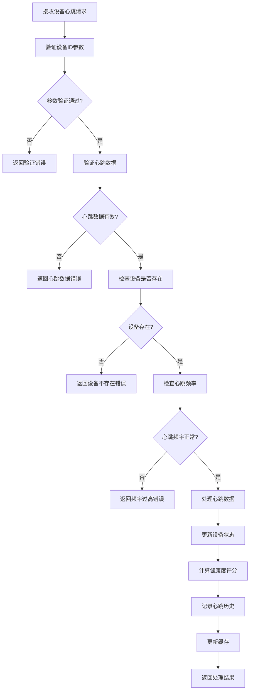
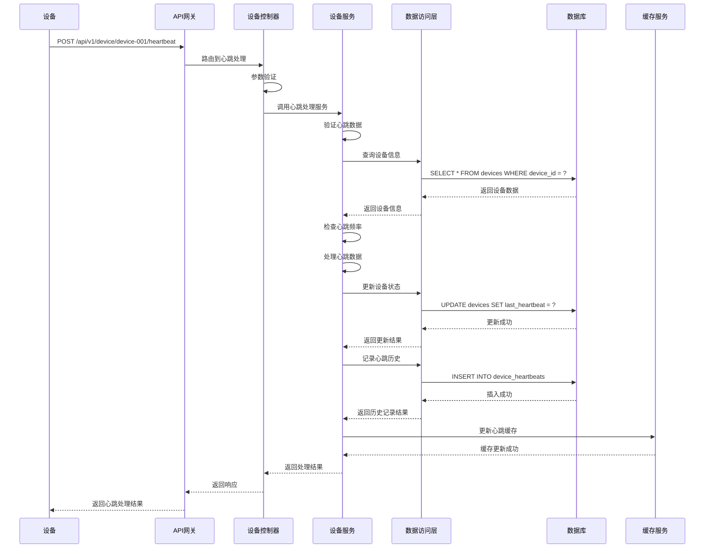

# 设备心跳管理模块需求文档

## 1. 功能描述

设备心跳管理模块是OneGoServer系统的核心监控功能，负责处理设备的定期心跳信号，监控设备的在线状态、健康度和性能指标。该模块通过接收设备的心跳数据，实时更新设备状态，计算健康度评分，并提供心跳历史查询功能。

### 1.1 主要功能
- **心跳接收处理**：接收和处理设备发送的心跳信号
- **心跳历史查询**：查询设备的心跳历史记录
- **心跳状态监控**：监控设备的心跳状态和频率
- **健康度计算**：基于心跳数据计算设备健康度
- **离线检测**：检测设备离线状态
- **心跳统计分析**：分析心跳频率和响应时间

### 1.2 支持心跳类型
- **定期心跳**：设备定期发送的状态心跳
- **状态心跳**：设备状态变更时发送的心跳
- **性能心跳**：包含性能指标的心跳
- **错误心跳**：设备错误时发送的心跳

## 2. 功能目标

### 2.1 业务目标
- 实时监控设备的在线状态
- 及时发现设备离线或异常
- 提供设备健康度评估
- 支持设备性能监控

### 2.2 技术目标
- 心跳处理响应时间 < 50ms
- 支持高并发心跳处理
- 心跳数据实时存储
- 高效的心跳历史查询

### 2.3 监控目标
- 设备在线状态实时可见
- 心跳频率异常告警
- 设备性能趋势分析
- 心跳数据完整性保证

## 3. 输入输出说明

### 3.1 输入参数

#### 3.1.1 心跳更新请求
```json
{
  "deviceId": "string",        // 设备ID，必填
  "status": "string",          // 设备状态，必填，只能是online,offline,error
  "responseTime": 100,         // 响应时间（毫秒），可选
  "metadata": "string"         // 心跳元数据，可选
}
```

#### 3.1.2 心跳查询请求
```json
{
  "deviceId": "string",        // 设备ID，必填
  "page": 1,                  // 页码，可选，默认1
  "size": 10                  // 每页数量，可选，默认10
}
```

### 3.2 输出参数

#### 3.2.1 心跳更新成功响应
```json
{
  "code": 0,
  "message": "心跳更新成功",
  "data": {
    "device_id": "device-001",
    "heartbeat_time": "2024-01-01T15:30:00Z",
    "status": "online",
    "response_time": 100
  }
}
```

#### 3.2.2 心跳查询成功响应
```json
{
  "code": 0,
  "message": "success",
  "data": {
    "list": [
      {
        "device_id": "device-001",
        "heartbeat_time": "2024-01-01T15:30:00Z",
        "status": "online",
        "ip_address": "192.168.1.100",
        "response_time": 100,
        "metadata": "{\"cpu_usage\": 45.2, \"memory_usage\": 60.1}"
      }
    ],
    "total": 150,
    "page": 1,
    "size": 10
  }
}
```

#### 3.2.3 错误响应
```json
{
  "code": 400,
  "message": "设备ID不能为空",
  "data": null
}
```

## 4. 涉及接口以及接口设计

### 4.1 API接口定义

#### 4.1.1 更新设备心跳接口
- **路径**：`POST /api/v1/device/device/{deviceId}/heartbeat`
- **标签**：设备控制
- **摘要**：更新设备心跳

#### 4.1.2 获取设备心跳接口
- **路径**：`GET /api/v1/device/device/{deviceId}/heartbeat`
- **标签**：设备控制
- **摘要**：获取设备心跳

### 4.2 内部接口

#### 4.2.1 心跳处理接口
```go
type HandleDeviceHeartbeatInput struct {
    DeviceID      string
    HeartbeatData map[string]interface{}
}

type HandleDeviceHeartbeatOutput struct {
    DeviceID      string
    HeartbeatData map[string]interface{}
    HealthScore   float64
    Status        string
    Message       string
}
```

#### 4.2.2 心跳历史查询接口
```go
type GetDeviceHeartbeatHistoryInput struct {
    DeviceID string
    Page     int
    Size     int
    StartTime *gtime.Time
    EndTime   *gtime.Time
}

type GetDeviceHeartbeatHistoryOutput struct {
    Heartbeats []DeviceHeartbeatInfo
    Total      int64
    Page       int
    Size       int
}
```

#### 4.2.3 心跳统计分析接口
```go
type AnalyzeHeartbeatInput struct {
    DeviceID string
    Hours    int
}

type AnalyzeHeartbeatOutput struct {
    AverageResponseTime float64
    HeartbeatFrequency  float64
    UptimePercentage    float64
    ErrorRate           float64
}
```

## 5. 数据结构设计

### 5.1 数据库表结构

#### 5.1.1 设备心跳表
```sql
CREATE TABLE device_heartbeats (
    id              BIGSERIAL PRIMARY KEY,
    device_id       VARCHAR(100) NOT NULL,
    heartbeat_time  TIMESTAMP NOT NULL DEFAULT CURRENT_TIMESTAMP,
    status          VARCHAR(20) NOT NULL,
    metadata        JSONB,
    ip_address      INET,
    response_time   INTEGER,
    CONSTRAINT fk_device_heartbeats_device 
        FOREIGN KEY (device_id) REFERENCES devices(device_id) 
        ON DELETE CASCADE
);
```

#### 5.1.2 心跳查询SQL
```sql
SELECT 
    device_id, heartbeat_time, status, ip_address, 
    response_time, metadata
FROM device_heartbeats 
WHERE device_id = ? 
ORDER BY heartbeat_time DESC 
LIMIT ? OFFSET ?
```

#### 5.1.3 心跳统计SQL
```sql
SELECT 
    COUNT(*) as total_heartbeats,
    AVG(response_time) as avg_response_time,
    COUNT(CASE WHEN status = 'error' THEN 1 END) as error_count
FROM device_heartbeats 
WHERE device_id = ? 
    AND heartbeat_time >= NOW() - INTERVAL '24 hours'
```

### 5.2 缓存结构

#### 5.2.1 设备心跳缓存
```go
type DeviceHeartbeatCache struct {
    DeviceID      string    // 设备ID
    LastHeartbeat time.Time // 最后心跳时间
    Status        string    // 设备状态
    ResponseTime  int       // 响应时间
    IPAddress     string    // IP地址
    Metadata      string    // 元数据
    LastUpdate    time.Time // 最后更新时间
    ExpireAt      time.Time // 过期时间
}
```

#### 5.2.2 心跳统计缓存
```go
type HeartbeatStatsCache struct {
    DeviceID           string    // 设备ID
    AverageResponseTime float64   // 平均响应时间
    HeartbeatFrequency  float64   // 心跳频率
    UptimePercentage    float64   // 在线率
    ErrorRate           float64   // 错误率
    LastUpdate          time.Time // 最后更新时间
    ExpireAt            time.Time // 过期时间
}
```

## 6. 异常处理

### 6.1 输入验证异常
- **设备ID为空**：返回400错误，提示"设备ID不能为空"
- **设备ID格式错误**：返回400错误，提示"设备ID格式不正确"
- **状态参数无效**：返回400错误，提示"状态只能是online,offline,error"
- **响应时间为负数**：返回400错误，提示"响应时间不能为负数"

### 6.2 业务逻辑异常
- **设备不存在**：返回404错误，提示"设备不存在"
- **设备已删除**：返回404错误，提示"设备已删除"
- **心跳频率过高**：返回429错误，提示"心跳频率过高"
- **心跳数据异常**：返回400错误，提示"心跳数据异常"

### 6.3 系统异常
- **数据库连接失败**：返回500错误，提示"数据库连接失败"
- **心跳处理失败**：返回500错误，提示"心跳处理失败"
- **缓存更新失败**：返回500错误，提示"缓存更新失败"

## 7. 交互流程图



## 8. 交互时序图



## 9. 安全与权限

### 9.1 访问控制
- **接口权限**：需要设备心跳权限
- **数据权限**：根据用户权限过滤可查看的心跳数据
- **设备权限**：根据用户权限决定可处理的心跳

### 9.2 数据安全
- **心跳数据保护**：保护心跳数据不被未授权访问
- **心跳审计**：记录心跳处理操作
- **数据完整性**：确保心跳数据的一致性

### 9.3 心跳安全
- **设备ID验证**：验证设备ID的有效性
- **心跳频率限制**：限制心跳发送频率
- **数据验证**：验证心跳数据的合理性
- **防重放攻击**：防止心跳重放攻击

## 10. 日志与审计要求

### 10.1 心跳日志
- **心跳接收日志**：记录心跳接收的详细信息
- **心跳处理日志**：记录心跳处理的结果
- **异常心跳日志**：记录异常心跳的处理

### 10.2 性能日志
- **心跳处理耗时**：记录心跳处理时间
- **数据库性能日志**：记录数据库操作性能
- **缓存性能日志**：记录缓存操作性能

### 10.3 日志格式
```json
{
  "timestamp": "2024-01-01T00:00:00Z",
  "level": "INFO",
  "service": "device-heartbeat",
  "operation": "handle_device_heartbeat",
  "device_id": "device-001",
  "ip_address": "192.168.1.100",
  "status": "online",
  "response_time": 100,
  "result": "success",
  "duration_ms": 25,
  "frequency_check": "normal"
}
```

## 11. 测试用例

### 11.1 功能测试用例

#### 11.1.1 正常心跳更新测试
- **测试目标**：验证设备心跳正常更新功能
- **测试数据**：
  ```
  POST /api/v1/device/device-001/heartbeat
  {
    "status": "online",
    "responseTime": 100,
    "metadata": "{\"cpu_usage\": 45.2}"
  }
  ```
- **预期结果**：心跳数据成功更新，设备状态为online

#### 11.1.2 设备不存在测试
- **测试目标**：验证设备不存在时的处理
- **测试数据**：
  ```
  POST /api/v1/device/non-existent-device/heartbeat
  {
    "status": "online"
  }
  ```
- **预期结果**：返回404错误，提示"设备不存在"

#### 11.1.3 参数验证测试
- **测试目标**：验证参数验证功能
- **测试数据**：
  ```
  POST /api/v1/device/device-001/heartbeat
  {
    "status": "invalid_status"
  }
  ```
- **预期结果**：返回400错误，提示"状态只能是online,offline,error"

#### 11.1.4 心跳频率限制测试
- **测试目标**：验证心跳频率限制功能
- **测试场景**：短时间内发送大量心跳请求
- **预期结果**：超出频率限制后返回429错误

#### 11.1.5 心跳查询测试
- **测试目标**：验证心跳查询功能
- **测试数据**：
  ```
  GET /api/v1/device/device-001/heartbeat?page=1&size=10
  ```
- **预期结果**：返回设备的心跳历史记录

### 11.2 性能测试用例

#### 11.2.1 心跳处理响应时间测试
- **测试目标**：验证心跳处理响应时间
- **测试场景**：处理单个设备心跳
- **预期结果**：响应时间<50ms

#### 11.2.2 并发心跳处理测试
- **测试目标**：验证并发心跳处理性能
- **测试场景**：100个并发心跳请求
- **预期结果**：所有请求在1秒内完成，成功率>99%

#### 11.2.3 心跳查询性能测试
- **测试目标**：验证心跳查询性能
- **测试场景**：查询大量心跳历史数据
- **预期结果**：查询响应时间<100ms

### 11.3 心跳准确性测试

#### 11.3.1 心跳数据准确性测试
- **测试目标**：验证心跳数据的准确性
- **测试场景**：发送心跳后查询心跳历史
- **预期结果**：心跳历史记录与发送数据一致

#### 11.3.2 心跳时间戳测试
- **测试目标**：验证心跳时间戳的准确性
- **测试场景**：发送心跳并检查时间戳
- **预期结果**：时间戳准确反映心跳发送时间

#### 11.3.3 心跳状态更新测试
- **测试目标**：验证心跳状态更新的准确性
- **测试场景**：发送不同状态的心跳
- **预期结果**：设备状态正确更新

### 11.4 安全测试用例

#### 11.4.1 设备ID注入测试
- **测试目标**：验证设备ID注入防护
- **测试数据**：在设备ID中包含恶意代码
- **预期结果**：系统正确过滤恶意代码

#### 11.4.2 心跳数据注入测试
- **测试目标**：验证心跳数据注入防护
- **测试数据**：在心跳数据中包含恶意代码
- **预期结果**：系统正确过滤恶意代码

#### 11.4.3 心跳重放攻击测试
- **测试目标**：验证心跳重放攻击防护
- **测试场景**：重放历史心跳数据
- **预期结果**：系统拒绝重放的心跳数据

### 11.5 异常测试用例

#### 11.5.1 数据库异常测试
- **测试目标**：验证数据库异常处理
- **测试场景**：模拟数据库连接失败
- **预期结果**：返回500错误，记录详细错误日志

#### 11.5.2 缓存异常测试
- **测试目标**：验证缓存异常处理
- **测试场景**：模拟缓存服务不可用
- **预期结果**：降级到直接操作数据库，不影响功能

#### 11.5.3 网络异常测试
- **测试目标**：验证网络异常处理
- **测试场景**：模拟网络超时
- **预期结果**：返回超时错误，支持重试机制

### 11.6 数据完整性测试

#### 11.6.1 心跳数据一致性测试
- **测试目标**：验证心跳数据一致性
- **测试场景**：并发发送心跳数据
- **预期结果**：心跳数据最终一致，无数据冲突

#### 11.6.2 心跳历史完整性测试
- **测试目标**：验证心跳历史完整性
- **测试场景**：多次发送心跳数据
- **预期结果**：所有心跳都有历史记录

#### 11.6.3 缓存一致性测试
- **测试目标**：验证缓存数据一致性
- **测试场景**：心跳更新后检查缓存
- **预期结果**：缓存数据与数据库数据一致

### 11.7 业务逻辑测试

#### 11.7.1 心跳频率控制测试
- **测试目标**：验证心跳频率控制逻辑
- **测试场景**：快速连续发送心跳
- **预期结果**：超出频率限制的心跳被拒绝

#### 11.7.2 离线检测测试
- **测试目标**：验证离线检测逻辑
- **测试场景**：设备停止发送心跳
- **预期结果**：系统正确检测设备离线

#### 11.7.3 健康度计算测试
- **测试目标**：验证健康度计算逻辑
- **测试场景**：发送不同性能指标的心跳
- **预期结果**：健康度评分正确计算

### 11.8 监控功能测试

#### 11.8.1 心跳监控测试
- **测试目标**：验证心跳监控功能
- **测试场景**：设备心跳异常
- **预期结果**：系统能够监控并告警

#### 11.8.2 性能监控测试
- **测试目标**：验证性能监控功能
- **测试场景**：设备性能指标变化
- **预期结果**：系统能够监控性能变化

#### 11.8.3 统计分析测试
- **测试目标**：验证统计分析功能
- **测试场景**：收集心跳统计数据
- **预期结果**：系统能够生成准确的统计报告 