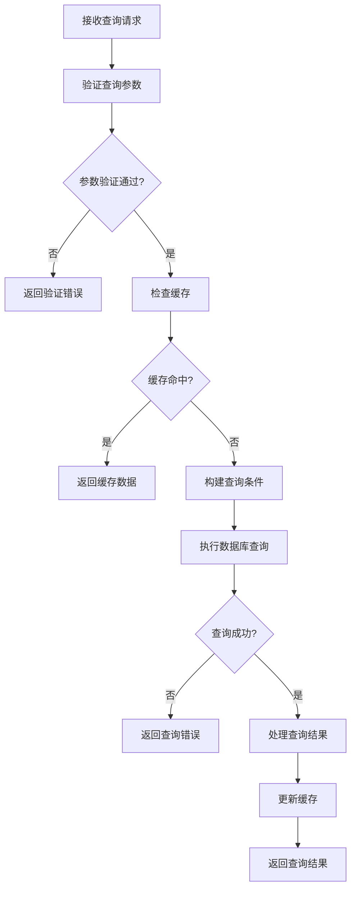
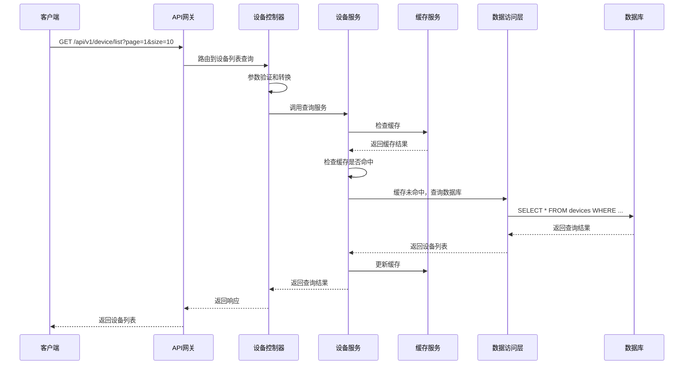

# 设备列表模块需求文档

## 1. 功能描述

设备列表模块是OneGoServer系统的基础查询功能，负责提供设备信息的查询和列表展示服务。该模块支持多种查询条件组合，提供分页查询功能，并支持按不同维度对设备进行排序和筛选，为用户提供灵活的设备管理界面。

### 1.1 主要功能
- **设备列表查询**：根据条件查询设备列表
- **分页查询**：支持分页显示，提高查询性能
- **条件筛选**：支持按状态、类型、部门等条件筛选
- **关键词搜索**：支持设备名称、型号等关键词搜索
- **时间范围查询**：支持按注册时间、最后在线时间等时间范围查询
- **排序功能**：支持按不同字段进行升序或降序排序

### 1.2 支持查询维度
- **设备状态**：online（在线）、offline（离线）、maintenance（维护）、error（错误）
- **设备类型**：server（服务器）、workstation（工作站）、mobile（移动设备）、iot（物联网设备）
- **部门信息**：按设备所属部门筛选
- **时间范围**：按设备注册时间、最后在线时间等筛选

## 2. 功能目标

### 2.1 业务目标
- 提供快速、准确的设备信息查询服务
- 支持大规模设备数据的列表展示
- 提供灵活的查询条件组合
- 确保查询结果的实时性和准确性

### 2.2 技术目标
- 查询响应时间 < 200ms
- 支持10000+设备数据的快速查询
- 分页查询性能优化
- 查询结果缓存机制

### 2.3 用户体验目标
- 查询界面简洁易用
- 查询条件设置灵活
- 查询结果展示清晰
- 支持查询条件保存和复用

## 3. 输入输出说明

### 3.1 输入参数

#### 3.1.1 分页参数
```json
{
  "page": 1,        // 页码，默认1，最小值1
  "size": 10        // 每页数量，默认10，范围1-100
}
```

#### 3.1.2 查询条件参数
```json
{
  "status": "online",                    // 设备状态筛选
  "device_type": "server",               // 设备类型筛选
  "department": "IT部门",                // 部门筛选
  "keyword": "服务器",                   // 关键词搜索
  "start_time": "2024-01-01T00:00:00Z", // 开始时间
  "end_time": "2024-12-31T23:59:59Z",   // 结束时间
  "sort_by": "created_at",              // 排序字段
  "sort_order": "desc"                  // 排序方向：asc|desc
}
```

### 3.2 输出参数

#### 3.2.1 成功响应
```json
{
  "code": 0,
  "message": "success",
  "data": {
    "list": [
      {
        "id": 1,
        "device_id": "device-001",
        "name": "测试服务器01",
        "type": "server",
        "model": "Dell PowerEdge R740",
        "board_id": "BRD001",
        "status": "online",
        "health_score": 95,
        "ip_address": "192.168.1.100",
        "port": 8080,
        "protocol": "http",
        "endpoint": "http://192.168.1.100:8080",
        "reg_time": "2024-01-01T10:00:00Z",
        "last_online_time": "2024-01-01T15:30:00Z",
        "total_online_duration": 86400,
        "total_heartbeats": 1000,
        "total_alerts": 5,
        "total_tasks": 50,
        "created_at": "2024-01-01T10:00:00Z",
        "updated_at": "2024-01-01T15:30:00Z"
      }
    ],
    "total": 100,
    "page": 1,
    "size": 10
  }
}
```

#### 3.2.2 错误响应
```json
{
  "code": 400,
  "message": "参数验证失败",
  "data": null
}
```

## 4. 涉及接口以及接口设计

### 4.1 API接口定义

#### 4.1.1 设备列表查询接口
- **路径**：`GET /api/v1/device/device/list`
- **标签**：设备管理
- **摘要**：获取设备列表

### 4.2 内部接口

#### 4.2.1 设备查询接口
```go
type GetDeviceListInput struct {
    Filter     *DeviceFilter
    Sort       *DeviceSortOption
    Pagination *common.PaginationRequest
}

type GetDeviceListOutput struct {
    common.PaginationResponse[Device]
}
```

#### 4.2.2 设备筛选接口
```go
type DeviceFilter struct {
    Status       []string
    Type         []string
    Department   *string
    Keyword      *string
    StartTime    *time.Time
    EndTime      *time.Time
}
```

## 5. 数据结构设计

### 5.1 数据库查询结构

#### 5.1.1 基础查询SQL
```sql
SELECT 
    id, device_id, name, type, model, board_id, status, health_score,
    ip_address, port, protocol, endpoint, reg_time, last_online_time,
    total_online_duration, total_heartbeats, total_alerts, total_tasks,
    created_at, updated_at
FROM devices 
WHERE deleted_at IS NULL
```

#### 5.1.2 条件筛选SQL
```sql
-- 状态筛选
AND status IN (?)

-- 类型筛选  
AND type IN (?)

-- 部门筛选
AND department LIKE ?

-- 关键词搜索
AND (name LIKE ? OR model LIKE ? OR device_id LIKE ?)

-- 时间范围筛选
AND created_at BETWEEN ? AND ?
```

### 5.2 缓存结构

#### 5.2.1 查询结果缓存
```go
type DeviceListCache struct {
    Key       string    // 缓存键：md5(查询条件)
    Data      []Device  // 设备列表数据
    Total     int64     // 总数量
    ExpireAt  time.Time // 过期时间
}
```

## 6. 异常处理

### 6.1 输入验证异常
- **页码无效**：返回400错误，提示"页码最小为1"
- **每页数量超限**：返回400错误，提示"每页数量为1-100"
- **设备状态无效**：返回400错误，提示"状态值无效"
- **设备类型无效**：返回400错误，提示"设备类型无效"
- **时间格式错误**：返回400错误，提示"时间格式不正确"

### 6.2 业务逻辑异常
- **查询条件过于复杂**：返回400错误，提示"查询条件过于复杂"
- **查询超时**：返回408错误，提示"查询超时，请简化查询条件"
- **数据权限不足**：返回403错误，提示"权限不足，无法查询设备信息"

### 6.3 系统异常
- **数据库连接失败**：返回500错误，提示"数据库连接失败"
- **缓存服务异常**：返回500错误，提示"缓存服务异常"
- **系统内部错误**：返回500错误，提示"系统内部错误"

## 7. 交互流程图



## 8. 交互时序图



## 9. 安全与权限

### 9.1 访问控制
- **接口权限**：需要设备查询权限
- **数据权限**：根据用户权限过滤可查询的设备
- **查询限制**：限制单次查询的最大数量

### 9.2 数据安全
- **敏感信息过滤**：过滤设备敏感信息（如密码）
- **数据脱敏**：对敏感字段进行脱敏处理
- **查询审计**：记录查询操作日志

### 9.3 查询安全
- **SQL注入防护**：使用参数化查询
- **查询频率限制**：限制查询请求频率
- **查询复杂度限制**：限制查询条件的复杂度

## 10. 日志与审计要求

### 10.1 查询日志
- **查询操作日志**：记录查询请求的详细信息
- **查询条件日志**：记录查询条件参数
- **查询结果日志**：记录查询结果统计信息

### 10.2 性能日志
- **查询耗时日志**：记录查询执行时间
- **缓存命中率日志**：记录缓存命中情况
- **数据库性能日志**：记录数据库查询性能

### 10.3 日志格式
```json
{
  "timestamp": "2024-01-01T00:00:00Z",
  "level": "INFO",
  "service": "device-list",
  "operation": "query_devices",
  "user_id": "user-123",
  "query_params": {
    "page": 1,
    "size": 10,
    "status": "online"
  },
  "result": {
    "total": 100,
    "count": 10,
    "duration_ms": 150
  },
  "cache_hit": false
}
```

## 11. 测试用例

### 11.1 功能测试用例

#### 11.1.1 基础查询测试
- **测试目标**：验证基础查询功能
- **测试数据**：
  ```
  GET /api/v1/device/list?page=1&size=10
  ```
- **预期结果**：返回第一页10条设备记录

#### 11.1.2 条件筛选测试
- **测试目标**：验证条件筛选功能
- **测试数据**：
  ```
  GET /api/v1/device/list?status=online&device_type=server
  ```
- **预期结果**：返回在线状态的服务器设备

#### 11.1.3 关键词搜索测试
- **测试目标**：验证关键词搜索功能
- **测试数据**：
  ```
  GET /api/v1/device/list?keyword=服务器
  ```
- **预期结果**：返回名称或型号包含"服务器"的设备

#### 11.1.4 时间范围查询测试
- **测试目标**：验证时间范围查询功能
- **测试数据**：
  ```
  GET /api/v1/device/list?start_time=2024-01-01&end_time=2024-12-31
  ```
- **预期结果**：返回指定时间范围内注册的设备

### 11.2 性能测试用例

#### 11.2.1 大数据量查询测试
- **测试目标**：验证大数据量查询性能
- **测试场景**：查询10000+设备数据
- **预期结果**：查询时间<200ms，内存使用合理

#### 11.2.2 并发查询测试
- **测试目标**：验证并发查询性能
- **测试场景**：100个并发查询请求
- **预期结果**：所有请求在2秒内完成，成功率>99%

#### 11.2.3 缓存性能测试
- **测试目标**：验证缓存机制性能
- **测试场景**：重复查询相同条件
- **预期结果**：缓存命中后查询时间<50ms

### 11.3 安全测试用例

#### 11.3.1 SQL注入测试
- **测试目标**：验证SQL注入防护
- **测试数据**：在查询参数中包含SQL注入代码
- **预期结果**：系统正确过滤恶意代码

#### 11.3.2 权限验证测试
- **测试目标**：验证权限控制
- **测试场景**：无权限用户尝试查询设备
- **预期结果**：返回403权限不足错误

#### 11.3.3 查询频率限制测试
- **测试目标**：验证查询频率限制
- **测试场景**：短时间内发送大量查询请求
- **预期结果**：超出限制后返回429错误

### 11.4 异常测试用例

#### 11.4.1 参数异常测试
- **测试目标**：验证参数异常处理
- **测试数据**：
  ```
  GET /api/v1/device/list?page=0&size=1000
  ```
- **预期结果**：返回400参数验证错误

#### 11.4.2 数据库异常测试
- **测试目标**：验证数据库异常处理
- **测试场景**：模拟数据库连接失败
- **预期结果**：返回500错误，记录详细错误日志

#### 11.4.3 缓存异常测试
- **测试目标**：验证缓存异常处理
- **测试场景**：模拟缓存服务不可用
- **预期结果**：降级到直接查询数据库，不影响功能 