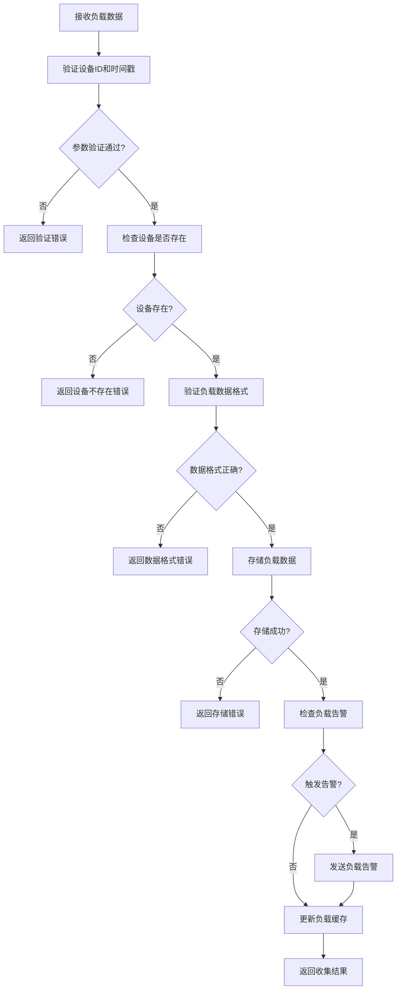
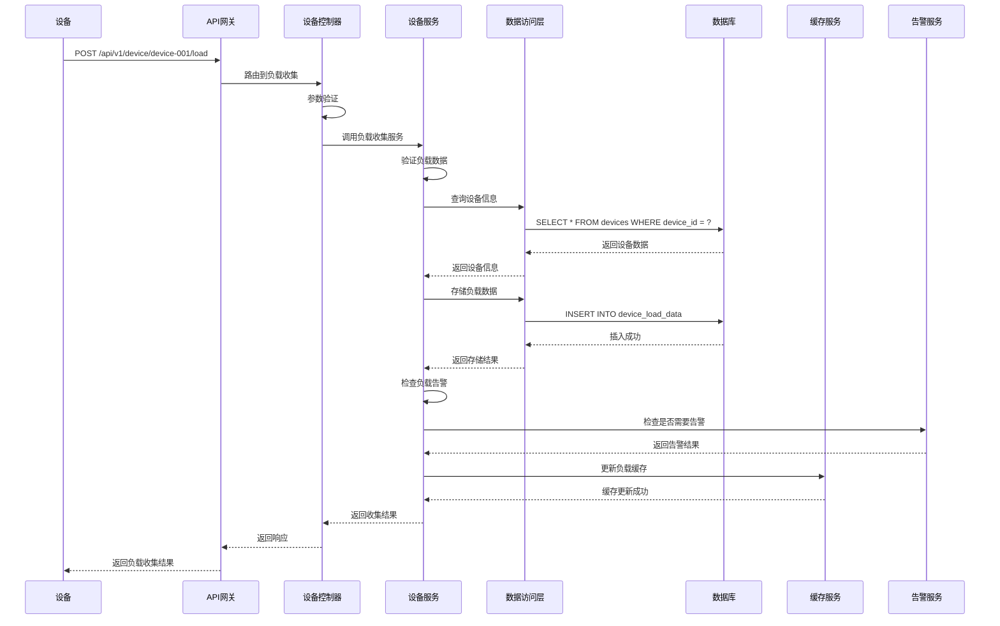

# 设备负载监控模块需求文档

## 1. 功能描述

设备负载监控模块负责实时监控设备的系统负载情况，包括CPU使用率、内存使用率、磁盘使用率、网络流量等关键指标。该模块支持负载数据收集、负载分析、负载告警等功能，为设备性能优化和故障诊断提供数据支持。

### 1.1 主要功能
- **负载数据收集**：实时收集设备的负载数据
- **负载数据分析**：分析负载数据趋势和异常
- **负载告警**：当负载超过阈值时发送告警
- **负载报告**：生成负载监控报告
- **负载优化建议**：基于负载数据提供优化建议
- **负载历史查询**：查询历史负载数据

### 1.2 监控指标
- **CPU指标**：CPU使用率、CPU负载、进程数等
- **内存指标**：内存使用率、可用内存、交换分区等
- **磁盘指标**：磁盘使用率、IOPS、读写速度等
- **网络指标**：网络流量、连接数、带宽使用率等
- **系统指标**：系统负载、进程状态、服务状态等

## 2. 功能目标

### 2.1 业务目标
- 实时监控设备系统负载状态
- 及时发现负载异常和性能问题
- 提供负载优化建议和预警
- 支持负载数据的长期存储和分析

### 2.2 技术目标
- 负载数据收集频率 < 30秒
- 负载数据查询响应时间 < 100ms
- 负载告警延迟 < 10秒
- 负载数据存储时间 > 1年

### 2.3 监控目标
- 负载监控覆盖率 > 99%
- 负载数据准确性 > 99.9%
- 负载告警准确率 > 95%
- 负载分析准确率 > 90%

## 3. 输入输出说明

### 3.1 输入参数

#### 3.1.1 负载数据收集请求
```json
{
  "deviceId": "string",        // 设备ID，必填
  "timestamp": "string",       // 时间戳，必填，ISO 8601格式
  "loadData": {
    "cpu": {
      "usage": 75.5,           // CPU使用率，百分比
      "load_average": [1.2, 1.1, 0.9], // 负载平均值
      "process_count": 150     // 进程数
    },
    "memory": {
      "total": 8589934592,     // 总内存，字节
      "used": 6442450944,      // 已用内存，字节
      "available": 2147483648, // 可用内存，字节
      "usage": 75.0            // 内存使用率，百分比
    },
    "disk": {
      "total": 107374182400,   // 总磁盘空间，字节
      "used": 64424509440,     // 已用磁盘空间，字节
      "usage": 60.0,           // 磁盘使用率，百分比
      "iops": 1500             // IOPS
    },
    "network": {
      "bytes_sent": 1048576,   // 发送字节数
      "bytes_recv": 2097152,   // 接收字节数
      "packets_sent": 1000,    // 发送包数
      "packets_recv": 2000     // 接收包数
    }
  }
}
```

#### 3.1.2 负载查询请求
```json
{
  "deviceId": "string",        // 设备ID，必填
  "startTime": "string",       // 开始时间，可选
  "endTime": "string",         // 结束时间，可选
  "metrics": ["cpu", "memory"], // 监控指标，可选
  "interval": "5m"             // 查询间隔，可选，如1m,5m,1h
}
```

#### 3.1.3 负载告警配置请求
```json
{
  "deviceId": "string",        // 设备ID，必填
  "alertConfig": {
    "cpu_threshold": 80.0,     // CPU告警阈值，百分比
    "memory_threshold": 85.0,  // 内存告警阈值，百分比
    "disk_threshold": 90.0,    // 磁盘告警阈值，百分比
    "network_threshold": 80.0, // 网络告警阈值，百分比
    "enabled": true            // 是否启用告警
  }
}
```

### 3.2 输出参数

#### 3.2.1 负载数据收集成功响应
```json
{
  "code": 0,
  "message": "负载数据收集成功",
  "data": {
    "device_id": "device-001",
    "timestamp": "2024-01-01T15:30:00Z",
    "collect_id": "load-001",
    "status": "success",
    "data_points": 4
  }
}
```

#### 3.2.2 负载查询成功响应
```json
{
  "code": 0,
  "message": "success",
  "data": {
    "device_id": "device-001",
    "time_range": {
      "start": "2024-01-01T15:00:00Z",
      "end": "2024-01-01T16:00:00Z"
    },
    "metrics": {
      "cpu": [
        {
          "timestamp": "2024-01-01T15:00:00Z",
          "usage": 75.5,
          "load_average": [1.2, 1.1, 0.9],
          "process_count": 150
        }
      ],
      "memory": [
        {
          "timestamp": "2024-01-01T15:00:00Z",
          "total": 8589934592,
          "used": 6442450944,
          "available": 2147483648,
          "usage": 75.0
        }
      ]
    },
    "summary": {
      "cpu_avg": 72.3,
      "cpu_max": 85.1,
      "memory_avg": 73.8,
      "memory_max": 82.5
    }
  }
}
```

#### 3.2.3 负载告警响应
```json
{
  "code": 0,
  "message": "负载告警",
  "data": {
    "alert_id": "alert-001",
    "device_id": "device-001",
    "alert_type": "cpu_high",
    "severity": "warning",
    "timestamp": "2024-01-01T15:30:00Z",
    "threshold": 80.0,
    "current_value": 85.5,
    "message": "CPU使用率超过阈值"
  }
}
```

#### 3.2.4 错误响应
```json
{
  "code": 400,
  "message": "设备ID不能为空",
  "data": null
}
```

## 4. 涉及接口以及接口设计

### 4.1 API接口定义

#### 4.1.1 收集负载数据接口
- **路径**：`POST /api/v1/device/device/{deviceId}/load`
- **标签**：设备负载
- **摘要**：收集设备负载数据

#### 4.1.2 查询负载数据接口
- **路径**：`GET /api/v1/device/device/{deviceId}/load`
- **标签**：设备负载
- **摘要**：查询设备负载数据

#### 4.1.3 配置负载告警接口
- **路径**：`PUT /api/v1/device/device/{deviceId}/load/alert`
- **标签**：设备负载
- **摘要**：配置设备负载告警

### 4.2 内部接口

#### 4.2.1 负载数据收集接口
```go
type CollectLoadDataInput struct {
    DeviceID  string
    Timestamp *gtime.Time
    LoadData  LoadData
}

type CollectLoadDataOutput struct {
    DeviceID    string
    CollectID   string
    Status      string
    DataPoints  int
    CreatedAt   *gtime.Time
}
```

#### 4.2.2 负载数据查询接口
```go
type QueryLoadDataInput struct {
    DeviceID  string
    StartTime *gtime.Time
    EndTime   *gtime.Time
    Metrics   []string
    Interval  string
}

type QueryLoadDataOutput struct {
    DeviceID   string
    TimeRange  TimeRange
    Metrics    map[string][]LoadMetric
    Summary    LoadSummary
}
```

#### 4.2.3 负载告警配置接口
```go
type ConfigureLoadAlertInput struct {
    DeviceID     string
    AlertConfig  LoadAlertConfig
}

type ConfigureLoadAlertOutput struct {
    DeviceID     string
    AlertConfig  LoadAlertConfig
    UpdatedAt    *gtime.Time
}
```

## 5. 数据结构设计

### 5.1 数据库表结构

#### 5.1.1 设备负载数据表
```sql
CREATE TABLE device_load_data (
    id              BIGSERIAL PRIMARY KEY,
    device_id       VARCHAR(100) NOT NULL,
    timestamp       TIMESTAMP NOT NULL,
    cpu_usage       DECIMAL(5,2),
    cpu_load_avg_1  DECIMAL(5,2),
    cpu_load_avg_5  DECIMAL(5,2),
    cpu_load_avg_15 DECIMAL(5,2),
    process_count   INTEGER,
    memory_total    BIGINT,
    memory_used     BIGINT,
    memory_available BIGINT,
    memory_usage    DECIMAL(5,2),
    disk_total      BIGINT,
    disk_used       BIGINT,
    disk_usage      DECIMAL(5,2),
    disk_iops       INTEGER,
    network_bytes_sent BIGINT,
    network_bytes_recv BIGINT,
    network_packets_sent INTEGER,
    network_packets_recv INTEGER,
    created_at      TIMESTAMP NOT NULL DEFAULT CURRENT_TIMESTAMP,
    CONSTRAINT fk_device_load_data_device 
        FOREIGN KEY (device_id) REFERENCES devices(device_id) 
        ON DELETE CASCADE,
    INDEX idx_device_load_data_device_time (device_id, timestamp)
);
```

#### 5.1.2 负载告警配置表
```sql
CREATE TABLE device_load_alerts (
    id                  BIGSERIAL PRIMARY KEY,
    device_id           VARCHAR(100) NOT NULL,
    cpu_threshold       DECIMAL(5,2) DEFAULT 80.0,
    memory_threshold    DECIMAL(5,2) DEFAULT 85.0,
    disk_threshold      DECIMAL(5,2) DEFAULT 90.0,
    network_threshold   DECIMAL(5,2) DEFAULT 80.0,
    enabled             BOOLEAN NOT NULL DEFAULT true,
    created_at          TIMESTAMP NOT NULL DEFAULT CURRENT_TIMESTAMP,
    updated_at          TIMESTAMP NOT NULL DEFAULT CURRENT_TIMESTAMP,
    CONSTRAINT fk_device_load_alerts_device 
        FOREIGN KEY (device_id) REFERENCES devices(device_id) 
        ON DELETE CASCADE,
    UNIQUE(device_id)
);
```

#### 5.1.3 负载告警记录表
```sql
CREATE TABLE device_load_alert_logs (
    id              BIGSERIAL PRIMARY KEY,
    alert_id        VARCHAR(100) NOT NULL UNIQUE,
    device_id       VARCHAR(100) NOT NULL,
    alert_type      VARCHAR(50) NOT NULL,
    severity        VARCHAR(20) NOT NULL,
    threshold       DECIMAL(5,2),
    current_value   DECIMAL(5,2),
    message         TEXT,
    timestamp       TIMESTAMP NOT NULL DEFAULT CURRENT_TIMESTAMP,
    resolved_at     TIMESTAMP,
    created_at      TIMESTAMP NOT NULL DEFAULT CURRENT_TIMESTAMP,
    CONSTRAINT fk_device_load_alert_logs_device 
        FOREIGN KEY (device_id) REFERENCES devices(device_id) 
        ON DELETE CASCADE
);
```

### 5.2 缓存结构

#### 5.2.1 负载数据缓存
```go
type LoadDataCache struct {
    DeviceID   string
    Timestamp  time.Time
    LoadData   LoadData
    LastUpdate time.Time
    ExpireAt   time.Time
}
```

#### 5.2.2 负载告警缓存
```go
type LoadAlertCache struct {
    DeviceID     string
    AlertConfig  LoadAlertConfig
    LastUpdate   time.Time
    ExpireAt     time.Time
}
```

## 6. 异常处理

### 6.1 输入验证异常
- **设备ID为空**：返回400错误，提示"设备ID不能为空"
- **时间戳格式错误**：返回400错误，提示"时间戳格式不正确"
- **负载数据为空**：返回400错误，提示"负载数据不能为空"
- **监控指标无效**：返回400错误，提示"监控指标无效"

### 6.2 业务逻辑异常
- **设备不存在**：返回404错误，提示"设备不存在"
- **负载数据过期**：返回400错误，提示"负载数据已过期"
- **查询时间范围过大**：返回400错误，提示"查询时间范围过大"

### 6.3 系统异常
- **数据库连接失败**：返回500错误，提示"数据库连接失败"
- **负载数据存储失败**：返回500错误，提示"负载数据存储失败"
- **缓存服务异常**：返回500错误，提示"缓存服务异常"

## 7. 交互流程图



## 8. 交互时序图



## 9. 安全与权限

### 9.1 访问控制
- **接口权限**：需要设备负载监控权限
- **数据权限**：根据用户权限过滤可监控的设备
- **查询权限**：根据用户权限决定可查询的时间范围

### 9.2 数据安全
- **负载数据保护**：保护负载数据不被未授权访问
- **数据脱敏**：对敏感负载数据进行脱敏处理
- **数据完整性**：确保负载数据的一致性

### 9.3 监控安全
- **设备ID验证**：验证设备ID的有效性
- **数据频率限制**：限制负载数据收集频率
- **查询权限验证**：验证用户是否有权限查询该设备的负载数据

## 10. 日志与审计要求

### 10.1 负载日志
- **负载数据收集日志**：记录负载数据收集的详细信息
- **负载查询日志**：记录负载数据查询的行为
- **负载告警日志**：记录负载告警的详细信息

### 10.2 性能日志
- **负载数据存储耗时**：记录负载数据存储时间
- **负载查询耗时**：记录负载查询执行时间
- **数据库性能日志**：记录数据库操作性能

### 10.3 日志格式
```json
{
  "timestamp": "2024-01-01T00:00:00Z",
  "level": "INFO",
  "service": "device-load",
  "operation": "collect_load_data",
  "device_id": "device-001",
  "collect_id": "load-001",
  "data_points": 4,
  "result": "success",
  "duration_ms": 50,
  "cpu_usage": 75.5,
  "memory_usage": 75.0
}
```

## 11. 测试用例

### 11.1 功能测试用例

#### 11.1.1 正常负载数据收集测试
- **测试目标**：验证负载数据正常收集功能
- **测试数据**：
  ```
  POST /api/v1/device/device-001/load
  {
    "timestamp": "2024-01-01T15:30:00Z",
    "loadData": {
      "cpu": {"usage": 75.5},
      "memory": {"usage": 75.0}
    }
  }
  ```
- **预期结果**：负载数据成功收集，返回收集ID

#### 11.1.2 负载数据查询测试
- **测试目标**：验证负载数据查询功能
- **测试数据**：
  ```
  GET /api/v1/device/device-001/load?startTime=2024-01-01T15:00:00Z&endTime=2024-01-01T16:00:00Z
  ```
- **预期结果**：返回指定时间范围的负载数据

#### 11.1.3 负载告警配置测试
- **测试目标**：验证负载告警配置功能
- **测试数据**：
  ```
  PUT /api/v1/device/device-001/load/alert
  {
    "alertConfig": {
      "cpu_threshold": 80.0,
      "memory_threshold": 85.0
    }
  }
  ```
- **预期结果**：负载告警配置成功

#### 11.1.4 设备不存在测试
- **测试目标**：验证设备不存在时的处理
- **测试数据**：
  ```
  POST /api/v1/device/non-existent-device/load
  ```
- **预期结果**：返回404错误，提示"设备不存在"

#### 11.1.5 负载数据格式错误测试
- **测试目标**：验证负载数据格式验证
- **测试数据**：
  ```
  POST /api/v1/device/device-001/load
  {
    "loadData": {"invalid": "data"}
  }
  ```
- **预期结果**：返回400错误，提示"负载数据格式不正确"

### 11.2 性能测试用例

#### 11.2.1 负载数据收集响应时间测试
- **测试目标**：验证负载数据收集响应时间
- **测试场景**：收集单个设备的负载数据
- **预期结果**：响应时间<100ms

#### 11.2.2 并发负载数据收集测试
- **测试目标**：验证并发负载数据收集性能
- **测试场景**：10个并发收集不同设备负载数据
- **预期结果**：所有请求在500ms内完成，成功率>99%

#### 11.2.3 负载数据查询性能测试
- **测试目标**：验证负载数据查询性能
- **测试场景**：查询1小时内的负载数据
- **预期结果**：查询时间<200ms，数据准确性>99%

### 11.3 负载数据准确性测试

#### 11.3.1 负载数据准确性测试
- **测试目标**：验证负载数据的准确性
- **测试场景**：收集负载数据后验证数据完整性
- **预期结果**：负载数据与设备实际状态一致

#### 11.3.2 负载数据时间同步测试
- **测试目标**：验证负载数据时间同步
- **测试场景**：检查负载数据时间戳的准确性
- **预期结果**：负载数据时间戳准确，时间同步正常

#### 11.3.3 负载数据范围验证测试
- **测试目标**：验证负载数据范围的有效性
- **测试场景**：验证CPU、内存等指标的范围
- **预期结果**：所有负载指标在有效范围内

### 11.4 安全测试用例

#### 11.4.1 设备ID注入测试
- **测试目标**：验证设备ID注入防护
- **测试数据**：在设备ID中包含恶意代码
- **预期结果**：系统正确过滤恶意代码

#### 11.4.2 负载数据注入测试
- **测试目标**：验证负载数据注入防护
- **测试数据**：在负载数据中包含恶意代码
- **预期结果**：系统正确过滤恶意代码

#### 11.4.3 权限越权测试
- **测试目标**：验证权限控制
- **测试场景**：普通用户尝试查询管理员设备负载
- **预期结果**：返回403权限不足错误

### 11.5 异常测试用例

#### 11.5.1 数据库异常测试
- **测试目标**：验证数据库异常处理
- **测试场景**：模拟数据库连接失败
- **预期结果**：返回500错误，记录详细错误日志

#### 11.5.2 缓存异常测试
- **测试目标**：验证缓存异常处理
- **测试场景**：模拟缓存服务不可用
- **预期结果**：降级到直接查询数据库，不影响功能

#### 11.5.3 网络异常测试
- **测试目标**：验证网络异常处理
- **测试场景**：模拟网络超时
- **预期结果**：返回超时错误，支持重试机制

### 11.6 数据完整性测试

#### 11.6.1 负载数据一致性测试
- **测试目标**：验证负载数据一致性
- **测试场景**：并发收集负载数据
- **预期结果**：负载数据最终一致，无数据冲突

#### 11.6.2 负载数据完整性测试
- **测试目标**：验证负载数据完整性
- **测试场景**：检查负载数据的完整性
- **预期结果**：所有必需的负载指标都存在

#### 11.6.3 缓存一致性测试
- **测试目标**：验证缓存数据一致性
- **测试场景**：负载数据更新后检查缓存
- **预期结果**：缓存数据与数据库数据一致

### 11.7 业务逻辑测试

#### 11.7.1 负载告警逻辑测试
- **测试目标**：验证负载告警逻辑
- **测试场景**：负载超过阈值时触发告警
- **预期结果**：告警逻辑正确，告警及时发送

#### 11.7.2 负载数据聚合测试
- **测试目标**：验证负载数据聚合逻辑
- **测试场景**：聚合不同时间段的负载数据
- **预期结果**：负载数据聚合结果准确

#### 11.7.3 负载趋势分析测试
- **测试目标**：验证负载趋势分析功能
- **测试场景**：分析负载数据趋势
- **预期结果**：负载趋势分析结果准确

### 11.8 监控功能测试

#### 11.8.1 负载监控覆盖率测试
- **测试目标**：验证负载监控覆盖率
- **测试场景**：监控所有设备的负载状态
- **预期结果**：负载监控覆盖率>99%

#### 11.8.2 负载数据准确性统计测试
- **测试目标**：验证负载数据准确性统计功能
- **测试场景**：统计负载数据准确性
- **预期结果**：能够准确统计负载数据准确性

#### 11.8.3 负载告警准确率统计测试
- **测试目标**：验证负载告警准确率统计功能
- **测试场景**：统计负载告警准确率
- **预期结果**：能够准确统计负载告警准确率 