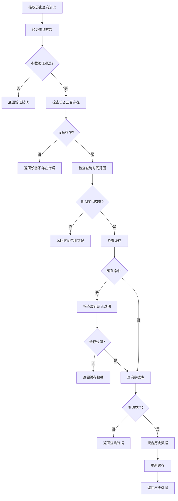
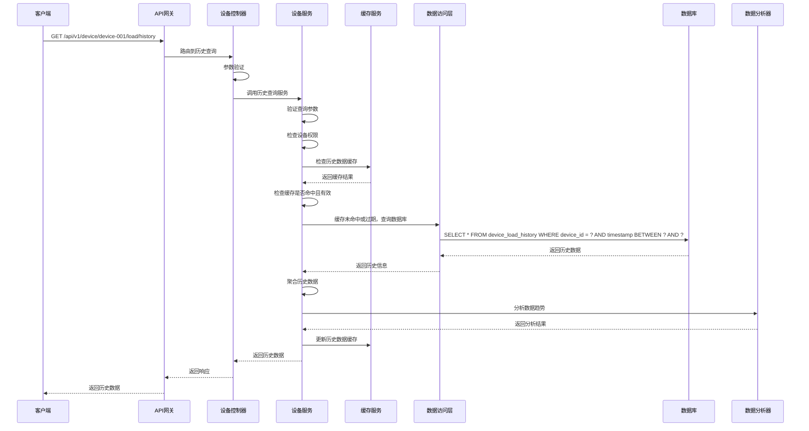

# 设备负载历史查询模块需求文档

## 1. 功能描述

设备负载历史查询模块负责查询和分析设备的历史负载数据，包括CPU、内存、磁盘、网络等各项指标的历史趋势。该模块支持历史数据查询、趋势分析、性能报告等功能，为设备性能优化和故障诊断提供历史数据支持。

### 1.1 主要功能
- **历史数据查询**：查询指定时间范围的负载历史数据
- **趋势分析**：分析负载数据的历史趋势和变化规律
- **性能报告**：生成负载性能分析报告
- **异常检测**：检测历史负载数据中的异常情况
- **数据导出**：导出历史负载数据到文件
- **数据聚合**：对历史数据进行聚合分析

### 1.2 支持历史数据类型
- **CPU历史**：CPU使用率、负载平均值、进程数等
- **内存历史**：内存使用率、可用内存、交换分区等
- **磁盘历史**：磁盘使用率、IOPS、读写速度等
- **网络历史**：网络流量、连接数、带宽使用率等
- **系统历史**：系统负载、进程状态、服务状态等

## 2. 功能目标

### 2.1 业务目标
- 提供完整的历史负载数据查询
- 支持负载趋势分析和预测
- 生成详细的性能分析报告
- 支持历史数据的长期存储和查询

### 2.2 技术目标
- 历史数据查询响应时间 < 200ms
- 支持大数据量的历史数据查询
- 历史数据存储时间 > 2年
- 数据聚合分析准确率 > 99%

### 2.3 监控目标
- 历史数据查询成功率 > 99.9%
- 历史数据完整性 > 99.9%
- 趋势分析准确率 > 95%
- 异常检测准确率 > 90%

## 3. 输入输出说明

### 3.1 输入参数

#### 3.1.1 历史数据查询请求
```json
{
  "deviceId": "string",        // 设备ID，必填
  "startTime": "string",       // 开始时间，必填，ISO 8601格式
  "endTime": "string",         // 结束时间，必填，ISO 8601格式
  "metrics": ["cpu", "memory"], // 监控指标，可选
  "interval": "5m",            // 查询间隔，可选，如1m,5m,1h,1d
  "aggregation": "avg"         // 聚合方式，可选，如avg,max,min,sum
}
```

#### 3.1.2 趋势分析请求
```json
{
  "deviceId": "string",        // 设备ID，必填
  "startTime": "string",       // 开始时间，必填
  "endTime": "string",         // 结束时间，必填
  "metric": "cpu",             // 分析指标，必填
  "analysisType": "trend",     // 分析类型，可选，如trend,seasonal,anomaly
  "granularity": "1h"          // 分析粒度，可选
}
```

#### 3.1.3 性能报告请求
```json
{
  "deviceId": "string",        // 设备ID，必填
  "reportType": "daily",       // 报告类型，必填，如daily,weekly,monthly
  "startDate": "string",       // 开始日期，必填
  "endDate": "string",         // 结束日期，必填
  "includeCharts": true        // 是否包含图表，可选，默认true
}
```

### 3.2 输出参数

#### 3.2.1 历史数据查询成功响应
```json
{
  "code": 0,
  "message": "success",
  "data": {
    "device_id": "device-001",
    "time_range": {
      "start": "2024-01-01T00:00:00Z",
      "end": "2024-01-01T23:59:59Z"
    },
    "interval": "5m",
    "aggregation": "avg",
    "data_points": [
      {
        "timestamp": "2024-01-01T00:00:00Z",
        "cpu": {
          "usage": 75.5,
          "load_average": [1.2, 1.1, 0.9],
          "process_count": 150
        },
        "memory": {
          "usage": 75.0,
          "total": 8589934592,
          "used": 6442450944,
          "available": 2147483648
        }
      }
    ],
    "summary": {
      "cpu_avg": 72.3,
      "cpu_max": 85.1,
      "cpu_min": 45.2,
      "memory_avg": 73.8,
      "memory_max": 82.5,
      "memory_min": 65.1
    }
  }
}
```

#### 3.2.2 趋势分析成功响应
```json
{
  "code": 0,
  "message": "success",
  "data": {
    "device_id": "device-001",
    "metric": "cpu",
    "analysis_type": "trend",
    "time_range": {
      "start": "2024-01-01T00:00:00Z",
      "end": "2024-01-31T23:59:59Z"
    },
    "trend_data": {
      "trend_direction": "increasing",
      "trend_slope": 0.15,
      "trend_confidence": 0.85,
      "seasonal_pattern": "daily",
      "anomalies": [
        {
          "timestamp": "2024-01-15T14:30:00Z",
          "value": 95.2,
          "severity": "high"
        }
      ]
    },
    "predictions": {
      "next_24h": 78.5,
      "next_7d": 82.1,
      "confidence": 0.75
    }
  }
}
```

#### 3.2.3 性能报告成功响应
```json
{
  "code": 0,
  "message": "success",
  "data": {
    "device_id": "device-001",
    "report_type": "daily",
    "report_date": "2024-01-01",
    "summary": {
      "uptime": "99.8%",
      "avg_cpu": 72.3,
      "max_cpu": 85.1,
      "avg_memory": 73.8,
      "max_memory": 82.5,
      "disk_usage": 65.2,
      "network_traffic": "2.5GB"
    },
    "performance_metrics": {
      "cpu_performance": "good",
      "memory_performance": "good",
      "disk_performance": "excellent",
      "network_performance": "good"
    },
    "alerts": [
      {
        "timestamp": "2024-01-01T14:30:00Z",
        "type": "cpu_high",
        "severity": "warning",
        "message": "CPU使用率超过阈值"
      }
    ],
    "recommendations": [
      "建议优化CPU密集型任务",
      "内存使用率正常，无需调整"
    ]
  }
}
```

#### 3.2.4 错误响应
```json
{
  "code": 400,
  "message": "查询参数无效",
  "data": {
    "errors": [
      "开始时间不能晚于结束时间",
      "查询时间范围不能超过30天"
    ]
  }
}
```

## 4. 涉及接口以及接口设计

### 4.1 API接口定义

#### 4.1.1 查询负载历史接口
- **路径**：`GET /api/v1/device/device/{deviceId}/load/history`
- **标签**：设备负载
- **摘要**：查询设备负载历史数据

#### 4.1.2 负载趋势分析接口
- **路径**：`POST /api/v1/device/device/{deviceId}/load/trend`
- **标签**：设备负载
- **摘要**：分析设备负载趋势

#### 4.1.3 负载性能报告接口
- **路径**：`GET /api/v1/device/device/{deviceId}/load/report`
- **标签**：设备负载
- **摘要**：生成设备负载性能报告

### 4.2 内部接口

#### 4.2.1 历史数据查询接口
```go
type QueryLoadHistoryInput struct {
    DeviceID     string
    StartTime    *gtime.Time
    EndTime      *gtime.Time
    Metrics      []string
    Interval     string
    Aggregation  string
}

type QueryLoadHistoryOutput struct {
    DeviceID     string
    TimeRange    TimeRange
    Interval     string
    Aggregation  string
    DataPoints   []LoadDataPoint
    Summary      LoadSummary
}
```

#### 4.2.2 趋势分析接口
```go
type AnalyzeLoadTrendInput struct {
    DeviceID      string
    StartTime     *gtime.Time
    EndTime       *gtime.Time
    Metric        string
    AnalysisType  string
    Granularity   string
}

type AnalyzeLoadTrendOutput struct {
    DeviceID      string
    Metric        string
    AnalysisType  string
    TimeRange     TimeRange
    TrendData     TrendAnalysis
    Predictions   TrendPredictions
}
```

#### 4.2.3 性能报告接口
```go
type GenerateLoadReportInput struct {
    DeviceID      string
    ReportType    string
    StartDate     *gtime.Time
    EndDate       *gtime.Time
    IncludeCharts bool
}

type GenerateLoadReportOutput struct {
    DeviceID           string
    ReportType         string
    ReportDate         string
    Summary            LoadReportSummary
    PerformanceMetrics LoadPerformanceMetrics
    Alerts             []LoadAlert
    Recommendations    []string
}
```

## 5. 数据结构设计

### 5.1 数据库表结构

#### 5.1.1 设备负载历史数据表
```sql
CREATE TABLE device_load_history (
    id              BIGSERIAL PRIMARY KEY,
    device_id       VARCHAR(100) NOT NULL,
    timestamp       TIMESTAMP NOT NULL,
    cpu_usage       DECIMAL(5,2),
    cpu_load_avg_1  DECIMAL(5,2),
    cpu_load_avg_5  DECIMAL(5,2),
    cpu_load_avg_15 DECIMAL(5,2),
    process_count   INTEGER,
    memory_total    BIGINT,
    memory_used     BIGINT,
    memory_available BIGINT,
    memory_usage    DECIMAL(5,2),
    disk_total      BIGINT,
    disk_used       BIGINT,
    disk_usage      DECIMAL(5,2),
    disk_iops       INTEGER,
    network_bytes_sent BIGINT,
    network_bytes_recv BIGINT,
    network_packets_sent INTEGER,
    network_packets_recv INTEGER,
    created_at      TIMESTAMP NOT NULL DEFAULT CURRENT_TIMESTAMP,
    CONSTRAINT fk_device_load_history_device 
        FOREIGN KEY (device_id) REFERENCES devices(device_id) 
        ON DELETE CASCADE,
    INDEX idx_device_load_history_device_time (device_id, timestamp),
    INDEX idx_device_load_history_timestamp (timestamp)
);
```

#### 5.1.2 负载趋势分析表
```sql
CREATE TABLE device_load_trends (
    id                  BIGSERIAL PRIMARY KEY,
    device_id           VARCHAR(100) NOT NULL,
    metric              VARCHAR(50) NOT NULL,
    analysis_type       VARCHAR(50) NOT NULL,
    start_time          TIMESTAMP NOT NULL,
    end_time            TIMESTAMP NOT NULL,
    trend_direction     VARCHAR(20),
    trend_slope         DECIMAL(10,4),
    trend_confidence    DECIMAL(5,2),
    seasonal_pattern    VARCHAR(50),
    anomaly_count       INTEGER DEFAULT 0,
    prediction_data     JSONB,
    created_at          TIMESTAMP NOT NULL DEFAULT CURRENT_TIMESTAMP,
    CONSTRAINT fk_device_load_trends_device 
        FOREIGN KEY (device_id) REFERENCES devices(device_id) 
        ON DELETE CASCADE,
    INDEX idx_device_load_trends_device_metric (device_id, metric)
);
```

#### 5.1.3 负载性能报告表
```sql
CREATE TABLE device_load_reports (
    id                  BIGSERIAL PRIMARY KEY,
    device_id           VARCHAR(100) NOT NULL,
    report_type         VARCHAR(20) NOT NULL,
    report_date         DATE NOT NULL,
    uptime_percentage   DECIMAL(5,2),
    avg_cpu_usage       DECIMAL(5,2),
    max_cpu_usage       DECIMAL(5,2),
    avg_memory_usage    DECIMAL(5,2),
    max_memory_usage    DECIMAL(5,2),
    disk_usage          DECIMAL(5,2),
    network_traffic     BIGINT,
    alert_count         INTEGER DEFAULT 0,
    performance_score   DECIMAL(5,2),
    report_data         JSONB,
    created_at          TIMESTAMP NOT NULL DEFAULT CURRENT_TIMESTAMP,
    CONSTRAINT fk_device_load_reports_device 
        FOREIGN KEY (device_id) REFERENCES devices(device_id) 
        ON DELETE CASCADE,
    UNIQUE(device_id, report_type, report_date)
);
```

### 5.2 缓存结构

#### 5.2.1 历史数据缓存
```go
type LoadHistoryCache struct {
    DeviceID     string
    TimeRange    TimeRange
    Interval     string
    DataPoints   []LoadDataPoint
    LastUpdate   time.Time
    ExpireAt     time.Time
}
```

#### 5.2.2 趋势分析缓存
```go
type LoadTrendCache struct {
    DeviceID      string
    Metric        string
    AnalysisType  string
    TimeRange     TimeRange
    TrendData     TrendAnalysis
    LastUpdate    time.Time
    ExpireAt      time.Time
}
```

## 6. 异常处理

### 6.1 输入验证异常
- **设备ID为空**：返回400错误，提示"设备ID不能为空"
- **开始时间为空**：返回400错误，提示"开始时间不能为空"
- **结束时间为空**：返回400错误，提示"结束时间不能为空"
- **时间范围过大**：返回400错误，提示"查询时间范围过大"

### 6.2 业务逻辑异常
- **设备不存在**：返回404错误，提示"设备不存在"
- **历史数据不存在**：返回404错误，提示"历史数据不存在"
- **查询时间范围无效**：返回400错误，提示"查询时间范围无效"

### 6.3 系统异常
- **数据库连接失败**：返回500错误，提示"数据库连接失败"
- **历史数据查询失败**：返回500错误，提示"历史数据查询失败"
- **缓存服务异常**：返回500错误，提示"缓存服务异常"

## 7. 交互流程图



## 8. 交互时序图



## 9. 安全与权限

### 9.1 访问控制
- **接口权限**：需要设备负载历史查询权限
- **数据权限**：根据用户权限过滤可查询的设备
- **查询权限**：根据用户权限决定可查询的时间范围

### 9.2 数据安全
- **历史数据保护**：保护历史数据不被未授权访问
- **数据脱敏**：对敏感历史数据进行脱敏处理
- **数据完整性**：确保历史数据的一致性

### 9.3 查询安全
- **设备ID验证**：验证设备ID的有效性
- **查询频率限制**：限制历史数据查询频率
- **查询权限验证**：验证用户是否有权限查询该设备的历史数据

## 10. 日志与审计要求

### 10.1 查询日志
- **历史数据查询日志**：记录历史数据查询的详细信息
- **趋势分析日志**：记录趋势分析的行为
- **性能报告日志**：记录性能报告的生成

### 10.2 性能日志
- **历史数据查询耗时**：记录历史数据查询时间
- **趋势分析耗时**：记录趋势分析执行时间
- **数据库性能日志**：记录数据库查询性能

### 10.3 日志格式
```json
{
  "timestamp": "2024-01-01T00:00:00Z",
  "level": "INFO",
  "service": "device-load-history",
  "operation": "query_load_history",
  "device_id": "device-001",
  "time_range": {
    "start": "2024-01-01T00:00:00Z",
    "end": "2024-01-01T23:59:59Z"
  },
  "metrics": ["cpu", "memory"],
  "result": "success",
  "duration_ms": 150,
  "data_points": 288
}
```

## 11. 测试用例

### 11.1 功能测试用例

#### 11.1.1 正常历史数据查询测试
- **测试目标**：验证历史数据正常查询功能
- **测试数据**：
  ```
  GET /api/v1/device/device-001/load/history?startTime=2024-01-01T00:00:00Z&endTime=2024-01-01T23:59:59Z
  ```
- **预期结果**：返回指定时间范围的历史数据

#### 11.1.2 趋势分析测试
- **测试目标**：验证趋势分析功能
- **测试数据**：
  ```
  POST /api/v1/device/device-001/load/trend
  {
    "startTime": "2024-01-01T00:00:00Z",
    "endTime": "2024-01-31T23:59:59Z",
    "metric": "cpu",
    "analysisType": "trend"
  }
  ```
- **预期结果**：返回CPU使用率趋势分析结果

#### 11.1.3 性能报告测试
- **测试目标**：验证性能报告生成功能
- **测试数据**：
  ```
  GET /api/v1/device/device-001/load/report?reportType=daily&startDate=2024-01-01&endDate=2024-01-31
  ```
- **预期结果**：返回设备性能报告

#### 11.1.4 设备不存在测试
- **测试目标**：验证设备不存在时的处理
- **测试数据**：
  ```
  GET /api/v1/device/non-existent-device/load/history
  ```
- **预期结果**：返回404错误，提示"设备不存在"

#### 11.1.5 时间范围错误测试
- **测试目标**：验证时间范围验证功能
- **测试数据**：
  ```
  GET /api/v1/device/device-001/load/history?startTime=2024-01-02T00:00:00Z&endTime=2024-01-01T00:00:00Z
  ```
- **预期结果**：返回400错误，提示"开始时间不能晚于结束时间"

### 11.2 性能测试用例

#### 11.2.1 历史数据查询响应时间测试
- **测试目标**：验证历史数据查询响应时间
- **测试场景**：查询1天的历史数据
- **预期结果**：响应时间<200ms

#### 11.2.2 大数据量查询测试
- **测试目标**：验证大数据量历史数据查询性能
- **测试场景**：查询30天的历史数据
- **预期结果**：查询时间<2秒，数据准确性>99%

#### 11.2.3 并发历史查询测试
- **测试目标**：验证并发历史查询性能
- **测试场景**：10个并发查询不同设备历史数据
- **预期结果**：所有请求在1秒内完成，成功率>99%

### 11.3 历史数据准确性测试

#### 11.3.1 历史数据完整性测试
- **测试目标**：验证历史数据的完整性
- **测试场景**：检查历史数据的完整性
- **预期结果**：历史数据完整，无缺失

#### 11.3.2 历史数据时间同步测试
- **测试目标**：验证历史数据时间同步
- **测试场景**：检查历史数据时间戳的准确性
- **预期结果**：历史数据时间戳准确，时间同步正常

#### 11.3.3 历史数据范围验证测试
- **测试目标**：验证历史数据范围的有效性
- **测试场景**：验证历史数据中各项指标的范围
- **预期结果**：所有历史数据指标在有效范围内

### 11.4 安全测试用例

#### 11.4.1 设备ID注入测试
- **测试目标**：验证设备ID注入防护
- **测试数据**：在设备ID中包含恶意代码
- **预期结果**：系统正确过滤恶意代码

#### 11.4.2 查询参数注入测试
- **测试目标**：验证查询参数注入防护
- **测试数据**：在查询参数中包含恶意代码
- **预期结果**：系统正确过滤恶意代码

#### 11.4.3 权限越权测试
- **测试目标**：验证权限控制
- **测试场景**：普通用户尝试查询管理员设备历史
- **预期结果**：返回403权限不足错误

### 11.5 异常测试用例

#### 11.5.1 数据库异常测试
- **测试目标**：验证数据库异常处理
- **测试场景**：模拟数据库连接失败
- **预期结果**：返回500错误，记录详细错误日志

#### 11.5.2 缓存异常测试
- **测试目标**：验证缓存异常处理
- **测试场景**：模拟缓存服务不可用
- **预期结果**：降级到直接查询数据库，不影响功能

#### 11.5.3 网络异常测试
- **测试目标**：验证网络异常处理
- **测试场景**：模拟网络超时
- **预期结果**：返回超时错误，支持重试机制

### 11.6 数据完整性测试

#### 11.6.1 历史数据一致性测试
- **测试目标**：验证历史数据一致性
- **测试场景**：并发查询历史数据
- **预期结果**：历史数据查询结果一致，无数据冲突

#### 11.6.2 历史数据聚合测试
- **测试目标**：验证历史数据聚合功能
- **测试场景**：聚合不同时间段的历史数据
- **预期结果**：历史数据聚合结果准确

#### 11.6.3 缓存一致性测试
- **测试目标**：验证缓存数据一致性
- **测试场景**：历史数据更新后检查缓存
- **预期结果**：缓存数据与数据库数据一致

### 11.7 业务逻辑测试

#### 11.7.1 趋势分析逻辑测试
- **测试目标**：验证趋势分析逻辑
- **测试场景**：分析不同类型的历史数据趋势
- **预期结果**：趋势分析结果准确

#### 11.7.2 异常检测逻辑测试
- **测试目标**：验证异常检测逻辑
- **测试场景**：检测历史数据中的异常情况
- **预期结果**：异常检测结果准确

#### 11.7.3 性能报告逻辑测试
- **测试目标**：验证性能报告生成逻辑
- **测试场景**：生成不同类型的性能报告
- **预期结果**：性能报告内容准确完整

### 11.8 监控功能测试

#### 11.8.1 历史查询监控测试
- **测试目标**：验证历史查询监控功能
- **测试场景**：监控历史数据查询过程
- **预期结果**：能够实时监控历史查询状态

#### 11.8.2 历史查询成功率统计测试
- **测试目标**：验证历史查询成功率统计功能
- **测试场景**：收集历史查询统计数据
- **预期结果**：能够准确统计历史查询成功率

#### 11.8.3 历史数据完整性统计测试
- **测试目标**：验证历史数据完整性统计功能
- **测试场景**：统计历史数据完整性
- **预期结果**：能够准确统计历史数据完整性 