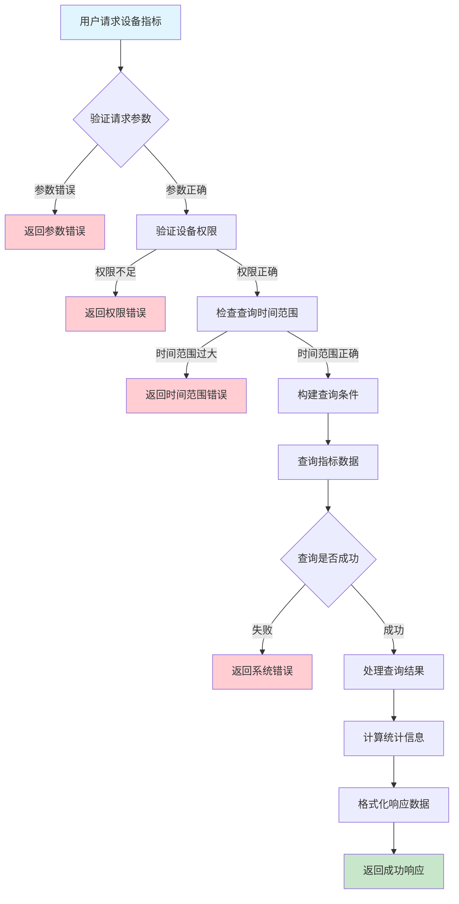
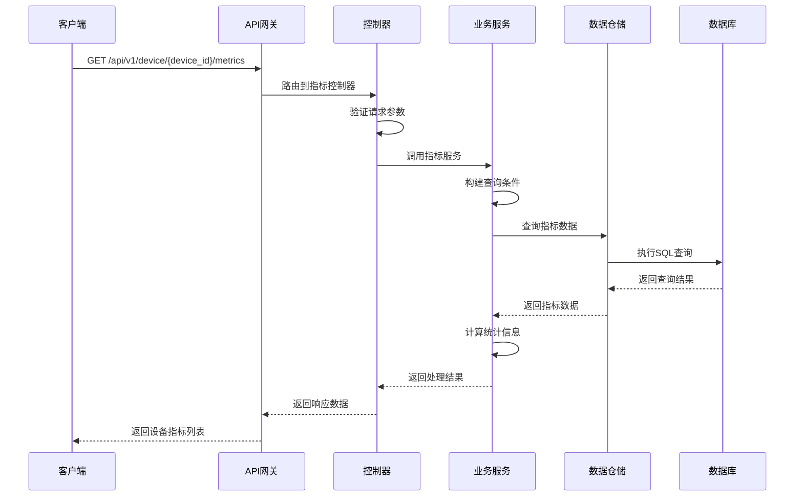

# 设备负载指标需求文档

## 1. 功能描述

### 1.1 功能概述
设备负载指标功能用于查询和分析设备的性能指标数据，包括CPU使用率、内存使用率、磁盘使用率、网络流量等关键性能指标。该功能提供实时和历史指标查询，支持多维度分析和趋势预测，为设备性能监控和容量规划提供数据支撑。

### 1.2 主要功能列表
- 查询设备实时性能指标
- 获取历史性能指标数据
- 支持多维度指标分析
- 提供指标趋势分析
- 支持指标数据导出
- 实现指标告警阈值监控

### 1.3 支持的功能特性
- 实时指标查询
- 历史数据查询
- 多指标聚合分析
- 趋势图表生成
- 指标对比分析
- 自定义时间范围查询

## 2. 功能目标

### 2.1 业务目标
- 提供设备性能监控能力
- 支持性能问题诊断分析
- 实现容量规划和预测
- 优化设备资源配置

### 2.2 技术目标
- 高效处理大量指标数据
- 支持实时数据查询
- 提供灵活的查询接口
- 确保数据准确性和一致性

### 2.3 安全目标
- 保护敏感性能数据
- 控制指标数据访问权限
- 防止数据泄露
- 确保查询操作审计

## 3. 输入输出说明

### 3.1 输入参数

#### 3.1.1 必需参数
- `device_id` (string): 设备ID，用于指定查询的设备

#### 3.1.2 可选参数
- `start_time` (string): 开始时间，格式：YYYY-MM-DD HH:mm:ss
- `end_time` (string): 结束时间，格式：YYYY-MM-DD HH:mm:ss
- `metrics` (array): 指标类型数组，如：["cpu", "memory", "disk", "network"]
- `interval` (string): 数据间隔，如：1m、5m、1h、1d
- `aggregation` (string): 聚合方式，如：avg、max、min、sum
- `page` (int): 页码，默认：1
- `page_size` (int): 每页数量，默认：100，最大：1000

### 3.2 输出参数

#### 3.2.1 成功响应
```json
{
  "code": 200,
  "message": "success",
  "data": {
    "device_id": "device_001",
    "metrics": [
      {
        "timestamp": "2024-01-15T10:30:00Z",
        "cpu_usage": 45.2,
        "memory_usage": 67.8,
        "disk_usage": 23.4,
        "network_in": 1024.5,
        "network_out": 512.3,
        "load_average": 1.2
      }
    ],
    "summary": {
      "avg_cpu": 42.1,
      "max_cpu": 85.6,
      "avg_memory": 65.3,
      "max_memory": 89.2,
      "avg_disk": 22.8,
      "max_disk": 45.7
    },
    "total": 1440,
    "page": 1,
    "page_size": 100
  }
}
```

#### 3.2.2 错误响应
```json
{
  "code": 400,
  "message": "设备ID不能为空",
  "data": null
}
```

### 3.3 参数格式和约束
- 时间格式：ISO 8601标准格式
- 设备ID：长度1-64字符，支持字母、数字、下划线
- 指标类型：支持cpu、memory、disk、network、load等
- 数据间隔：支持1m、5m、15m、1h、6h、1d
- 聚合方式：支持avg、max、min、sum、count

## 4. 涉及接口以及接口设计

### 4.1 API接口定义

#### 4.1.1 查询设备指标
```go
// 查询设备性能指标
GET /api/v1/device/{device_id}/metrics
```

**请求参数：**
- Path参数：device_id
- Query参数：start_time, end_time, metrics, interval, aggregation, page, page_size

**响应结构：**
```go
type MetricsResponse struct {
    Code    int    `json:"code"`
    Message string `json:"message"`
    Data    struct {
        DeviceID string           `json:"device_id"`
        Metrics  []DeviceMetrics  `json:"metrics"`
        Summary  MetricsSummary   `json:"summary"`
        Total    int64            `json:"total"`
        Page     int              `json:"page"`
        PageSize int              `json:"page_size"`
    } `json:"data"`
}

type DeviceMetrics struct {
    Timestamp    time.Time `json:"timestamp"`
    CPUUsage     float64   `json:"cpu_usage"`
    MemoryUsage  float64   `json:"memory_usage"`
    DiskUsage    float64   `json:"disk_usage"`
    NetworkIn    float64   `json:"network_in"`
    NetworkOut   float64   `json:"network_out"`
    LoadAverage  float64   `json:"load_average"`
}

type MetricsSummary struct {
    AvgCPU    float64 `json:"avg_cpu"`
    MaxCPU    float64 `json:"max_cpu"`
    AvgMemory float64 `json:"avg_memory"`
    MaxMemory float64 `json:"max_memory"`
    AvgDisk   float64 `json:"avg_disk"`
    MaxDisk   float64 `json:"max_disk"`
}
```

#### 4.1.2 获取实时指标
```go
// 获取设备实时指标
GET /api/v1/device/{device_id}/metrics/realtime
```

**响应结构：**
```go
type RealtimeMetrics struct {
    DeviceID     string    `json:"device_id"`
    Timestamp    time.Time `json:"timestamp"`
    CPUUsage     float64   `json:"cpu_usage"`
    MemoryUsage  float64   `json:"memory_usage"`
    DiskUsage    float64   `json:"disk_usage"`
    NetworkIn    float64   `json:"network_in"`
    NetworkOut   float64   `json:"network_out"`
    LoadAverage  float64   `json:"load_average"`
    Status       string    `json:"status"`
}
```

### 4.2 内部接口设计

#### 4.2.1 指标服务接口
```go
type MetricsService interface {
    // 查询设备指标
    GetDeviceMetrics(ctx context.Context, req *MetricsRequest) (*MetricsResponse, error)
    
    // 获取实时指标
    GetRealtimeMetrics(ctx context.Context, deviceID string) (*RealtimeMetrics, error)
    
    // 批量查询指标
    BatchGetMetrics(ctx context.Context, deviceIDs []string, req *MetricsRequest) (map[string]*MetricsResponse, error)
    
    // 获取指标统计
    GetMetricsSummary(ctx context.Context, deviceID string, req *MetricsRequest) (*MetricsSummary, error)
}
```

#### 4.2.2 指标仓储接口
```go
type MetricsRepository interface {
    // 查询指标数据
    Query(ctx context.Context, req *MetricsQuery) (*MetricsResult, error)
    
    // 获取实时指标
    GetRealtime(ctx context.Context, deviceID string) (*DeviceMetrics, error)
    
    // 批量查询指标
    BatchQuery(ctx context.Context, deviceIDs []string, req *MetricsQuery) (map[string]*MetricsResult, error)
    
    // 获取指标统计
    GetSummary(ctx context.Context, deviceID string, req *MetricsQuery) (*MetricsSummary, error)
}
```

## 5. 数据结构设计

### 5.1 数据库表结构

#### 5.1.1 设备指标表 (device_metrics)
```sql
CREATE TABLE device_metrics (
    id BIGINT AUTO_INCREMENT PRIMARY KEY COMMENT '指标记录ID',
    device_id VARCHAR(64) NOT NULL COMMENT '设备ID',
    timestamp TIMESTAMP NOT NULL COMMENT '指标时间戳',
    cpu_usage DECIMAL(5,2) COMMENT 'CPU使用率(%)',
    memory_usage DECIMAL(5,2) COMMENT '内存使用率(%)',
    disk_usage DECIMAL(5,2) COMMENT '磁盘使用率(%)',
    network_in DECIMAL(10,2) COMMENT '网络入流量(MB/s)',
    network_out DECIMAL(10,2) COMMENT '网络出流量(MB/s)',
    load_average DECIMAL(5,2) COMMENT '系统负载',
    temperature DECIMAL(5,2) COMMENT '设备温度(℃)',
    power_consumption DECIMAL(8,2) COMMENT '功耗(W)',
    created_at TIMESTAMP DEFAULT CURRENT_TIMESTAMP COMMENT '创建时间',
    
    INDEX idx_device_id (device_id),
    INDEX idx_timestamp (timestamp),
    INDEX idx_device_time (device_id, timestamp),
    INDEX idx_metrics_time (device_id, cpu_usage, timestamp)
) ENGINE=InnoDB DEFAULT CHARSET=utf8mb4 COMMENT='设备指标表';
```

#### 5.1.2 指标聚合表 (device_metrics_aggregated)
```sql
CREATE TABLE device_metrics_aggregated (
    id BIGINT AUTO_INCREMENT PRIMARY KEY COMMENT '聚合记录ID',
    device_id VARCHAR(64) NOT NULL COMMENT '设备ID',
    metric_type VARCHAR(20) NOT NULL COMMENT '指标类型',
    interval_type VARCHAR(10) NOT NULL COMMENT '聚合间隔',
    start_time TIMESTAMP NOT NULL COMMENT '开始时间',
    end_time TIMESTAMP NOT NULL COMMENT '结束时间',
    avg_value DECIMAL(10,4) COMMENT '平均值',
    max_value DECIMAL(10,4) COMMENT '最大值',
    min_value DECIMAL(10,4) COMMENT '最小值',
    sum_value DECIMAL(15,4) COMMENT '累计值',
    count_value INT COMMENT '数据点数量',
    created_at TIMESTAMP DEFAULT CURRENT_TIMESTAMP COMMENT '创建时间',
    
    UNIQUE KEY uk_device_metric_interval (device_id, metric_type, interval_type, start_time),
    INDEX idx_device_id (device_id),
    INDEX idx_metric_type (metric_type),
    INDEX idx_start_time (start_time)
) ENGINE=InnoDB DEFAULT CHARSET=utf8mb4 COMMENT='设备指标聚合表';
```

### 5.2 模型结构定义

#### 5.2.1 设备指标模型
```go
type DeviceMetrics struct {
    ID             int64     `json:"id" db:"id"`
    DeviceID       string    `json:"device_id" db:"device_id"`
    Timestamp      time.Time `json:"timestamp" db:"timestamp"`
    CPUUsage       float64   `json:"cpu_usage" db:"cpu_usage"`
    MemoryUsage    float64   `json:"memory_usage" db:"memory_usage"`
    DiskUsage      float64   `json:"disk_usage" db:"disk_usage"`
    NetworkIn      float64   `json:"network_in" db:"network_in"`
    NetworkOut     float64   `json:"network_out" db:"network_out"`
    LoadAverage    float64   `json:"load_average" db:"load_average"`
    Temperature    float64   `json:"temperature" db:"temperature"`
    PowerConsumption float64 `json:"power_consumption" db:"power_consumption"`
    CreatedAt      time.Time `json:"created_at" db:"created_at"`
}
```

#### 5.2.2 查询请求模型
```go
type MetricsRequest struct {
    DeviceID    string   `json:"device_id" v:"required"`
    StartTime   string   `json:"start_time"`
    EndTime     string   `json:"end_time"`
    Metrics     []string `json:"metrics"`
    Interval    string   `json:"interval"`
    Aggregation string   `json:"aggregation"`
    Page        int      `json:"page" v:"min:1"`
    PageSize    int      `json:"page_size" v:"min:1,max:1000"`
}
```

### 5.3 数据关系说明
- 设备指标与设备表通过device_id关联
- 指标数据按时间顺序存储，支持时间范围查询
- 聚合表提供预计算的聚合数据，提高查询性能
- 支持多种指标类型和聚合方式

## 6. 异常处理

### 6.1 输入验证异常
- 设备ID为空或格式错误
- 时间格式不正确
- 指标类型不支持
- 聚合方式无效

### 6.2 业务逻辑异常
- 设备不存在
- 查询时间范围过大
- 数据量过大导致查询超时
- 权限不足

### 6.3 系统异常
- 数据库连接失败
- 网络超时
- 系统资源不足
- 服务不可用

## 7. 交互流程图



## 8. 交互时序图



## 9. 安全与权限

### 9.1 访问控制策略
- 需要用户身份验证
- 验证用户对指定设备的访问权限
- 支持基于角色的访问控制(RBAC)
- 记录所有指标查询操作日志

### 9.2 数据安全要求
- 敏感性能数据需要脱敏处理
- 指标数据需要加密存储
- 支持数据访问审计
- 防止SQL注入攻击

### 9.3 身份验证机制
- 使用JWT令牌进行身份验证
- 支持API密钥认证
- 实现请求频率限制
- 支持IP白名单控制

## 10. 日志与审计要求

### 10.1 操作日志要求
- 记录所有指标查询操作
- 记录查询参数和结果数量
- 记录操作人员身份信息
- 记录操作时间和IP地址

### 10.2 审计日志要求
- 记录指标数据的访问轨迹
- 记录操作人员的身份和权限
- 记录查询的目的和影响
- 支持审计日志的长期保存

### 10.3 日志格式规范
```json
{
  "timestamp": "2024-01-15T10:30:00Z",
  "level": "INFO",
  "service": "device-metrics",
  "operation": "query_device_metrics",
  "user_id": "user_001",
  "device_id": "device_001",
  "parameters": {
    "start_time": "2024-01-15T00:00:00Z",
    "end_time": "2024-01-15T23:59:59Z",
    "metrics": ["cpu", "memory", "disk"]
  },
  "result": {
    "total": 1440,
    "count": 100
  }
}
```

## 11. 测试用例

### 11.1 功能测试用例

#### 11.1.1 正常查询测试
**测试场景：** 查询设备性能指标
**输入数据：**
```json
{
  "device_id": "device_001",
  "start_time": "2024-01-15T00:00:00Z",
  "end_time": "2024-01-15T23:59:59Z",
  "page": 1,
  "page_size": 100
}
```
**预期结果：**
- 返回状态码：200
- 返回设备指标数据
- 分页信息正确
- 数据格式符合预期

#### 11.1.2 实时指标查询测试
**测试场景：** 查询设备实时指标
**输入数据：**
```json
{
  "device_id": "device_001"
}
```
**预期结果：**
- 返回状态码：200
- 返回最新的指标数据
- 数据时间戳为当前时间
- 指标值在合理范围内

#### 11.1.3 指标筛选测试
**测试场景：** 按指标类型筛选数据
**输入数据：**
```json
{
  "device_id": "device_001",
  "metrics": ["cpu", "memory"],
  "start_time": "2024-01-15T00:00:00Z",
  "end_time": "2024-01-15T23:59:59Z"
}
```
**预期结果：**
- 返回状态码：200
- 只返回CPU和内存指标
- 其他指标字段为空或null

### 11.2 性能测试用例

#### 11.2.1 大数据量查询测试
**测试场景：** 查询大量指标数据
**测试数据：** 1000万条指标记录
**测试条件：**
- 查询时间范围：30天
- 分页大小：1000条
- 并发用户：50个

**预期结果：**
- 查询响应时间 < 5秒
- 内存使用 < 2GB
- 数据库CPU使用率 < 70%

#### 11.2.2 并发查询测试
**测试场景：** 多用户并发查询指标
**测试条件：**
- 并发用户数：500
- 查询频率：每秒200次
- 测试时长：15分钟

**预期结果：**
- 系统稳定运行
- 响应时间 < 5秒
- 错误率 < 2%

### 11.3 安全测试用例

#### 11.3.1 权限验证测试
**测试场景：** 验证用户访问权限
**测试数据：**
- 用户A：有设备访问权限
- 用户B：无设备访问权限

**预期结果：**
- 用户A：成功获取指标数据
- 用户B：返回权限错误

#### 11.3.2 SQL注入防护测试
**测试场景：** 测试SQL注入防护
**输入数据：**
```json
{
  "device_id": "device_001'; DROP TABLE device_metrics; --",
  "metrics": ["cpu' OR '1'='1"]
}
```
**预期结果：**
- 系统正确处理特殊字符
- 不执行恶意SQL语句
- 返回参数验证错误

### 11.4 异常测试用例

#### 11.4.1 参数错误测试
**测试场景：** 测试各种参数错误情况
**测试数据：**
```json
{
  "device_id": "",
  "start_time": "invalid_time",
  "page": 0,
  "page_size": 2000
}
```
**预期结果：**
- 返回参数验证错误
- 错误信息明确具体
- 状态码：400

#### 11.4.2 设备不存在测试
**测试场景：** 查询不存在的设备指标
**输入数据：**
```json
{
  "device_id": "non_existent_device",
  "start_time": "2024-01-15T00:00:00Z",
  "end_time": "2024-01-15T23:59:59Z"
}
```
**预期结果：**
- 返回设备不存在错误
- 状态码：404
- 错误信息友好

#### 11.4.3 系统异常测试
**测试场景：** 模拟数据库连接失败
**测试方法：** 临时关闭数据库连接
**预期结果：**
- 返回系统错误
- 状态码：500
- 记录详细错误日志 