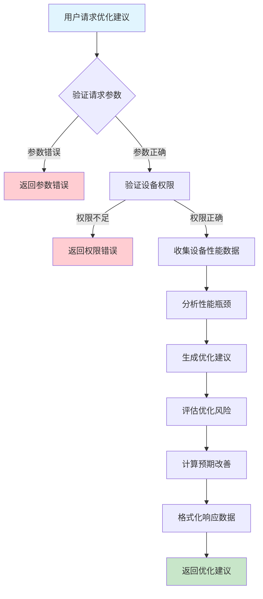
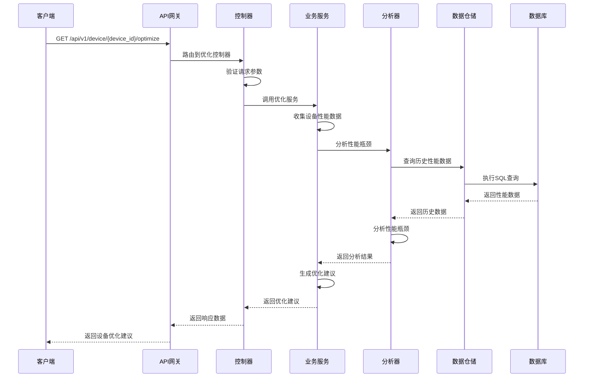

# 设备负载优化需求文档

## 1. 功能描述

### 1.1 功能概述
设备负载优化功能用于分析设备性能瓶颈，提供智能优化建议，帮助用户改善设备性能。该功能基于历史性能数据和实时监控数据，通过机器学习算法分析设备负载模式，识别性能问题，并提供针对性的优化方案。

### 1.2 主要功能列表
- 设备性能瓶颈分析
- 智能优化建议生成
- 性能趋势预测
- 资源配置优化建议
- 负载均衡策略推荐
- 性能优化效果评估

### 1.3 支持的功能特性
- 自动化性能分析
- 智能建议生成
- 多维度优化策略
- 实时优化监控
- 优化效果跟踪
- 自定义优化规则

## 2. 功能目标

### 2.1 业务目标
- 提升设备整体性能
- 减少性能瓶颈问题
- 优化资源利用效率
- 降低运维成本

### 2.2 技术目标
- 准确识别性能瓶颈
- 提供有效的优化建议
- 实现自动化优化分析
- 确保优化建议的可执行性

### 2.3 安全目标
- 保护设备性能数据
- 确保优化建议的安全性
- 防止恶意优化操作
- 记录优化操作审计

## 3. 输入输出说明

### 3.1 输入参数

#### 3.1.1 必需参数
- `device_id` (string): 设备ID，用于指定分析优化的设备

#### 3.1.2 可选参数
- `analysis_type` (string): 分析类型，如：performance、resource、bottleneck
- `time_range` (string): 分析时间范围，如：1d、7d、30d
- `optimization_level` (string): 优化级别，如：conservative、moderate、aggressive
- `include_history` (boolean): 是否包含历史数据，默认：true
- `threshold` (float): 性能阈值，默认：80.0

### 3.2 输出参数

#### 3.2.1 成功响应
```json
{
  "code": 200,
  "message": "success",
  "data": {
    "device_id": "device_001",
    "analysis_time": "2024-01-15T10:30:00Z",
    "performance_score": 75.5,
    "bottlenecks": [
      {
        "type": "cpu",
        "severity": "high",
        "description": "CPU使用率持续超过90%",
        "impact": "系统响应缓慢",
        "recommendation": "增加CPU核心或优化进程"
      }
    ],
    "optimization_suggestions": [
      {
        "category": "resource",
        "priority": "high",
        "title": "增加内存容量",
        "description": "当前内存使用率过高，建议增加8GB内存",
        "expected_improvement": "性能提升15%",
        "implementation_steps": [
          "备份重要数据",
          "关闭非必要服务",
          "增加内存模块",
          "重启设备验证"
        ],
        "risk_level": "low"
      }
    ],
    "performance_trends": {
      "cpu_trend": "increasing",
      "memory_trend": "stable",
      "disk_trend": "decreasing"
    },
    "optimization_history": [
      {
        "date": "2024-01-10T15:00:00Z",
        "optimization_type": "memory_upgrade",
        "improvement": "12%",
        "status": "completed"
      }
    ]
  }
}
```

#### 3.2.2 错误响应
```json
{
  "code": 400,
  "message": "设备ID不能为空",
  "data": null
}
```

### 3.3 参数格式和约束
- 设备ID：长度1-64字符，支持字母、数字、下划线
- 分析类型：支持performance、resource、bottleneck、comprehensive
- 时间范围：支持1d、7d、30d、90d
- 优化级别：支持conservative、moderate、aggressive
- 性能阈值：范围0.0-100.0

## 4. 涉及接口以及接口设计

### 4.1 API接口定义

#### 4.1.1 获取优化建议
```go
// 获取设备负载优化建议
GET /api/v1/device/{device_id}/optimize
```

**请求参数：**
- Path参数：device_id
- Query参数：analysis_type, time_range, optimization_level, include_history, threshold

**响应结构：**
```go
type OptimizationResponse struct {
    Code    int    `json:"code"`
    Message string `json:"message"`
    Data    struct {
        DeviceID              string                  `json:"device_id"`
        AnalysisTime          time.Time               `json:"analysis_time"`
        PerformanceScore      float64                 `json:"performance_score"`
        Bottlenecks           []Bottleneck            `json:"bottlenecks"`
        OptimizationSuggestions []OptimizationSuggestion `json:"optimization_suggestions"`
        PerformanceTrends     PerformanceTrends       `json:"performance_trends"`
        OptimizationHistory   []OptimizationHistory   `json:"optimization_history"`
    } `json:"data"`
}

type Bottleneck struct {
    Type         string  `json:"type"`
    Severity     string  `json:"severity"`
    Description  string  `json:"description"`
    Impact       string  `json:"impact"`
    Recommendation string `json:"recommendation"`
}

type OptimizationSuggestion struct {
    Category           string   `json:"category"`
    Priority           string   `json:"priority"`
    Title              string   `json:"title"`
    Description        string   `json:"description"`
    ExpectedImprovement string  `json:"expected_improvement"`
    ImplementationSteps []string `json:"implementation_steps"`
    RiskLevel          string   `json:"risk_level"`
}
```

#### 4.1.2 执行优化操作
```go
// 执行设备优化操作
POST /api/v1/device/{device_id}/optimize/execute
```

**请求结构：**
```go
type ExecuteOptimizationRequest struct {
    OptimizationID string                 `json:"optimization_id" v:"required"`
    Parameters     map[string]interface{} `json:"parameters"`
    AutoConfirm    bool                   `json:"auto_confirm"`
}
```

**响应结构：**
```go
type ExecuteOptimizationResponse struct {
    Code    int    `json:"code"`
    Message string `json:"message"`
    Data    struct {
        TaskID     string    `json:"task_id"`
        Status     string    `json:"status"`
        StartTime  time.Time `json:"start_time"`
        EstimatedDuration string `json:"estimated_duration"`
    } `json:"data"`
}
```

### 4.2 内部接口设计

#### 4.2.1 优化服务接口
```go
type OptimizationService interface {
    // 获取优化建议
    GetOptimizationSuggestions(ctx context.Context, req *OptimizationRequest) (*OptimizationResponse, error)
    
    // 执行优化操作
    ExecuteOptimization(ctx context.Context, deviceID string, req *ExecuteOptimizationRequest) (*ExecuteOptimizationResponse, error)
    
    // 获取优化历史
    GetOptimizationHistory(ctx context.Context, deviceID string) ([]OptimizationHistory, error)
    
    // 分析性能瓶颈
    AnalyzeBottlenecks(ctx context.Context, deviceID string, req *OptimizationRequest) ([]Bottleneck, error)
}
```

#### 4.2.2 优化分析器接口
```go
type OptimizationAnalyzer interface {
    // 分析CPU性能
    AnalyzeCPUPerformance(ctx context.Context, deviceID string, timeRange string) (*CPUAnalysis, error)
    
    // 分析内存性能
    AnalyzeMemoryPerformance(ctx context.Context, deviceID string, timeRange string) (*MemoryAnalysis, error)
    
    // 分析磁盘性能
    AnalyzeDiskPerformance(ctx context.Context, deviceID string, timeRange string) (*DiskAnalysis, error)
    
    // 分析网络性能
    AnalyzeNetworkPerformance(ctx context.Context, deviceID string, timeRange string) (*NetworkAnalysis, error)
}
```

## 5. 数据结构设计

### 5.1 数据库表结构

#### 5.1.1 设备优化建议表 (device_optimization_suggestions)
```sql
CREATE TABLE device_optimization_suggestions (
    id BIGINT AUTO_INCREMENT PRIMARY KEY COMMENT '建议ID',
    device_id VARCHAR(64) NOT NULL COMMENT '设备ID',
    category VARCHAR(50) NOT NULL COMMENT '优化类别',
    priority VARCHAR(20) NOT NULL COMMENT '优先级',
    title VARCHAR(200) NOT NULL COMMENT '建议标题',
    description TEXT COMMENT '建议描述',
    expected_improvement VARCHAR(100) COMMENT '预期改善',
    implementation_steps JSON COMMENT '实施步骤',
    risk_level VARCHAR(20) COMMENT '风险等级',
    status VARCHAR(20) DEFAULT 'pending' COMMENT '状态',
    created_at TIMESTAMP DEFAULT CURRENT_TIMESTAMP COMMENT '创建时间',
    updated_at TIMESTAMP DEFAULT CURRENT_TIMESTAMP ON UPDATE CURRENT_TIMESTAMP COMMENT '更新时间',
    
    INDEX idx_device_id (device_id),
    INDEX idx_category (category),
    INDEX idx_priority (priority),
    INDEX idx_status (status),
    INDEX idx_created_at (created_at)
) ENGINE=InnoDB DEFAULT CHARSET=utf8mb4 COMMENT='设备优化建议表';
```

#### 5.1.2 设备性能瓶颈表 (device_performance_bottlenecks)
```sql
CREATE TABLE device_performance_bottlenecks (
    id BIGINT AUTO_INCREMENT PRIMARY KEY COMMENT '瓶颈ID',
    device_id VARCHAR(64) NOT NULL COMMENT '设备ID',
    bottleneck_type VARCHAR(50) NOT NULL COMMENT '瓶颈类型',
    severity VARCHAR(20) NOT NULL COMMENT '严重程度',
    description TEXT COMMENT '瓶颈描述',
    impact TEXT COMMENT '影响分析',
    recommendation TEXT COMMENT '解决建议',
    detected_at TIMESTAMP NOT NULL COMMENT '检测时间',
    resolved_at TIMESTAMP NULL COMMENT '解决时间',
    status VARCHAR(20) DEFAULT 'active' COMMENT '状态',
    created_at TIMESTAMP DEFAULT CURRENT_TIMESTAMP COMMENT '创建时间',
    
    INDEX idx_device_id (device_id),
    INDEX idx_bottleneck_type (bottleneck_type),
    INDEX idx_severity (severity),
    INDEX idx_status (status),
    INDEX idx_detected_at (detected_at)
) ENGINE=InnoDB DEFAULT CHARSET=utf8mb4 COMMENT='设备性能瓶颈表';
```

#### 5.1.3 设备优化历史表 (device_optimization_history)
```sql
CREATE TABLE device_optimization_history (
    id BIGINT AUTO_INCREMENT PRIMARY KEY COMMENT '历史ID',
    device_id VARCHAR(64) NOT NULL COMMENT '设备ID',
    optimization_type VARCHAR(50) NOT NULL COMMENT '优化类型',
    optimization_id VARCHAR(64) COMMENT '优化建议ID',
    description TEXT COMMENT '优化描述',
    improvement_percentage DECIMAL(5,2) COMMENT '改善百分比',
    status VARCHAR(20) NOT NULL COMMENT '状态',
    executed_by VARCHAR(64) COMMENT '执行人员',
    executed_at TIMESTAMP NOT NULL COMMENT '执行时间',
    completed_at TIMESTAMP NULL COMMENT '完成时间',
    result_data JSON COMMENT '结果数据',
    created_at TIMESTAMP DEFAULT CURRENT_TIMESTAMP COMMENT '创建时间',
    
    INDEX idx_device_id (device_id),
    INDEX idx_optimization_type (optimization_type),
    INDEX idx_status (status),
    INDEX idx_executed_at (executed_at)
) ENGINE=InnoDB DEFAULT CHARSET=utf8mb4 COMMENT='设备优化历史表';
```

### 5.2 模型结构定义

#### 5.2.1 优化建议模型
```go
type OptimizationSuggestion struct {
    ID                   int64     `json:"id" db:"id"`
    DeviceID             string    `json:"device_id" db:"device_id"`
    Category             string    `json:"category" db:"category"`
    Priority             string    `json:"priority" db:"priority"`
    Title                string    `json:"title" db:"title"`
    Description          string    `json:"description" db:"description"`
    ExpectedImprovement  string    `json:"expected_improvement" db:"expected_improvement"`
    ImplementationSteps  []string  `json:"implementation_steps" db:"implementation_steps"`
    RiskLevel            string    `json:"risk_level" db:"risk_level"`
    Status               string    `json:"status" db:"status"`
    CreatedAt            time.Time `json:"created_at" db:"created_at"`
    UpdatedAt            time.Time `json:"updated_at" db:"updated_at"`
}
```

#### 5.2.2 性能瓶颈模型
```go
type PerformanceBottleneck struct {
    ID              int64     `json:"id" db:"id"`
    DeviceID        string    `json:"device_id" db:"device_id"`
    BottleneckType  string    `json:"bottleneck_type" db:"bottleneck_type"`
    Severity        string    `json:"severity" db:"severity"`
    Description     string    `json:"description" db:"description"`
    Impact          string    `json:"impact" db:"impact"`
    Recommendation  string    `json:"recommendation" db:"recommendation"`
    DetectedAt      time.Time `json:"detected_at" db:"detected_at"`
    ResolvedAt      *time.Time `json:"resolved_at" db:"resolved_at"`
    Status          string    `json:"status" db:"status"`
    CreatedAt       time.Time `json:"created_at" db:"created_at"`
}
```

### 5.3 数据关系说明
- 优化建议与设备表通过device_id关联
- 性能瓶颈与设备表通过device_id关联
- 优化历史与设备表通过device_id关联
- 优化建议与优化历史通过optimization_id关联

## 6. 异常处理

### 6.1 输入验证异常
- 设备ID为空或格式错误
- 分析类型不支持
- 时间范围格式错误
- 优化级别无效

### 6.2 业务逻辑异常
- 设备不存在
- 设备数据不足无法分析
- 优化建议已存在
- 权限不足

### 6.3 系统异常
- 数据库连接失败
- 分析服务不可用
- 机器学习模型异常
- 系统资源不足

## 7. 交互流程图



## 8. 交互时序图



## 9. 安全与权限

### 9.1 访问控制策略
- 需要用户身份验证
- 验证用户对指定设备的访问权限
- 支持基于角色的访问控制(RBAC)
- 记录所有优化操作日志

### 9.2 数据安全要求
- 保护设备性能数据
- 优化建议需要安全验证
- 支持数据访问审计
- 防止恶意优化操作

### 9.3 身份验证机制
- 使用JWT令牌进行身份验证
- 支持API密钥认证
- 实现请求频率限制
- 支持IP白名单控制

## 10. 日志与审计要求

### 10.1 操作日志要求
- 记录所有优化分析操作
- 记录优化建议生成过程
- 记录优化执行操作
- 记录操作人员身份信息

### 10.2 审计日志要求
- 记录优化建议的完整生命周期
- 记录优化执行的结果和影响
- 记录性能改善的验证过程
- 支持审计日志的长期保存

### 10.3 日志格式规范
```json
{
  "timestamp": "2024-01-15T10:30:00Z",
  "level": "INFO",
  "service": "device-optimization",
  "operation": "generate_optimization_suggestions",
  "user_id": "user_001",
  "device_id": "device_001",
  "parameters": {
    "analysis_type": "comprehensive",
    "time_range": "30d",
    "optimization_level": "moderate"
  },
  "result": {
    "suggestions_count": 5,
    "bottlenecks_count": 2,
    "performance_score": 75.5
  }
}
```

## 11. 测试用例

### 11.1 功能测试用例

#### 11.1.1 正常优化建议测试
**测试场景：** 获取设备优化建议
**输入数据：**
```json
{
  "device_id": "device_001",
  "analysis_type": "comprehensive",
  "time_range": "30d"
}
```
**预期结果：**
- 返回状态码：200
- 返回优化建议列表
- 包含性能瓶颈分析
- 提供具体的优化方案

#### 11.1.2 性能瓶颈分析测试
**测试场景：** 分析设备性能瓶颈
**输入数据：**
```json
{
  "device_id": "device_001",
  "analysis_type": "bottleneck",
  "time_range": "7d"
}
```
**预期结果：**
- 返回状态码：200
- 识别性能瓶颈
- 提供瓶颈严重程度
- 给出解决建议

#### 11.1.3 优化历史查询测试
**测试场景：** 查询设备优化历史
**输入数据：**
```json
{
  "device_id": "device_001"
}
```
**预期结果：**
- 返回状态码：200
- 返回优化历史记录
- 包含优化效果数据
- 显示优化状态

### 11.2 性能测试用例

#### 11.2.1 大数据量分析测试
**测试场景：** 分析大量性能数据
**测试数据：** 100万条性能记录
**测试条件：**
- 分析时间范围：90天
- 设备数量：100个
- 并发用户：20个

**预期结果：**
- 分析响应时间 < 10秒
- 内存使用 < 2GB
- 分析准确率 > 90%

#### 11.2.2 并发优化分析测试
**测试场景：** 多用户并发请求优化分析
**测试条件：**
- 并发用户数：100
- 请求频率：每秒50次
- 测试时长：10分钟

**预期结果：**
- 系统稳定运行
- 响应时间 < 15秒
- 错误率 < 5%

### 11.3 安全测试用例

#### 11.3.1 权限验证测试
**测试场景：** 验证用户访问权限
**测试数据：**
- 用户A：有设备访问权限
- 用户B：无设备访问权限

**预期结果：**
- 用户A：成功获取优化建议
- 用户B：返回权限错误

#### 11.3.2 优化执行安全测试
**测试场景：** 测试优化执行的安全性
**输入数据：**
```json
{
  "device_id": "device_001",
  "optimization_id": "opt_001",
  "auto_confirm": false
}
```
**预期结果：**
- 系统验证优化建议的有效性
- 检查执行权限
- 记录执行操作日志

### 11.4 异常测试用例

#### 11.4.1 参数错误测试
**测试场景：** 测试各种参数错误情况
**测试数据：**
```json
{
  "device_id": "",
  "analysis_type": "invalid_type",
  "time_range": "invalid_range"
}
```
**预期结果：**
- 返回参数验证错误
- 错误信息明确具体
- 状态码：400

#### 11.4.2 设备不存在测试
**测试场景：** 分析不存在的设备
**输入数据：**
```json
{
  "device_id": "non_existent_device",
  "analysis_type": "comprehensive"
}
```
**预期结果：**
- 返回设备不存在错误
- 状态码：404
- 错误信息友好

#### 11.4.3 数据不足测试
**测试场景：** 设备性能数据不足
**输入数据：**
```json
{
  "device_id": "device_001",
  "time_range": "90d"
}
```
**预期结果：**
- 返回数据不足错误
- 状态码：400
- 建议缩短分析时间范围

#### 11.4.4 系统异常测试
**测试场景：** 模拟分析服务异常
**测试方法：** 临时关闭分析服务
**预期结果：**
- 返回系统错误
- 状态码：500
- 记录详细错误日志 