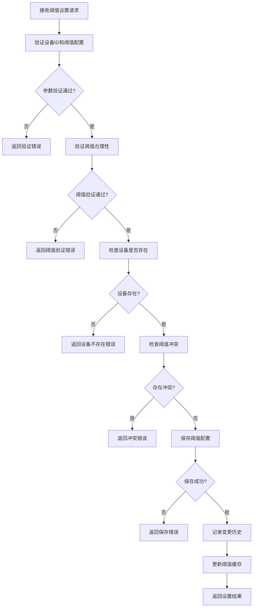
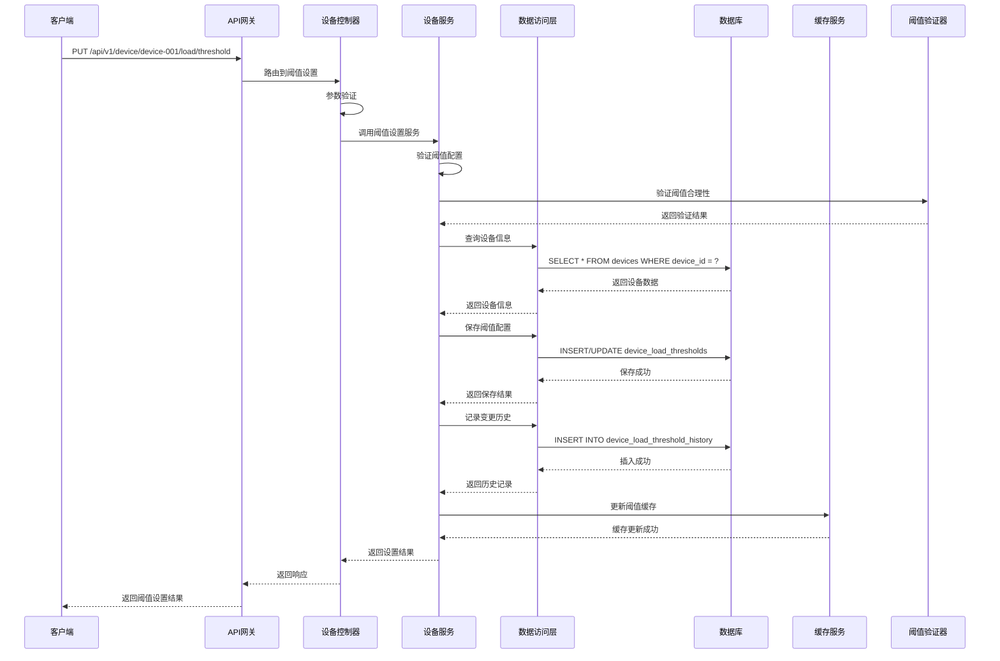

# 设备负载阈值设置模块需求文档

## 1. 功能描述

设备负载阈值设置模块负责配置和管理设备的负载监控阈值，包括CPU、内存、磁盘、网络等各项指标的告警阈值。该模块支持阈值设置、阈值验证、阈值告警等功能，为设备性能监控和预警提供配置支持。

### 1.1 主要功能
- **阈值设置**：设置各项负载指标的告警阈值
- **阈值验证**：验证阈值设置的合理性
- **阈值告警**：当负载超过阈值时触发告警
- **阈值模板**：提供预设的阈值模板
- **阈值继承**：支持从上级设备继承阈值设置
- **阈值历史**：记录阈值变更历史

### 1.2 支持阈值类型
- **CPU阈值**：CPU使用率告警阈值
- **内存阈值**：内存使用率告警阈值
- **磁盘阈值**：磁盘使用率告警阈值
- **网络阈值**：网络流量告警阈值
- **进程阈值**：进程数量告警阈值
- **连接阈值**：连接数量告警阈值

## 2. 功能目标

### 2.1 业务目标
- 提供灵活的负载阈值配置
- 支持多级阈值告警机制
- 确保阈值设置的合理性
- 提供阈值变更的审计追踪

### 2.2 技术目标
- 阈值设置响应时间 < 100ms
- 阈值验证准确率 > 99%
- 阈值告警延迟 < 5秒
- 阈值数据存储时间 > 2年

### 2.3 监控目标
- 阈值设置成功率 > 99.9%
- 阈值告警准确率 > 95%
- 阈值变更追踪完整性 > 100%
- 阈值模板使用率 > 80%

## 3. 输入输出说明

### 3.1 输入参数

#### 3.1.1 阈值设置请求
```json
{
  "deviceId": "string",        // 设备ID，必填
  "thresholdConfig": {
    "cpu": {
      "warning": 70.0,         // CPU警告阈值，百分比
      "critical": 90.0,        // CPU严重阈值，百分比
      "enabled": true          // 是否启用CPU告警
    },
    "memory": {
      "warning": 80.0,         // 内存警告阈值，百分比
      "critical": 95.0,        // 内存严重阈值，百分比
      "enabled": true          // 是否启用内存告警
    },
    "disk": {
      "warning": 85.0,         // 磁盘警告阈值，百分比
      "critical": 95.0,        // 磁盘严重阈值，百分比
      "enabled": true          // 是否启用磁盘告警
    },
    "network": {
      "warning": 80.0,         // 网络警告阈值，百分比
      "critical": 90.0,        // 网络严重阈值，百分比
      "enabled": true          // 是否启用网络告警
    }
  },
  "description": "string"      // 设置描述，可选
}
```

#### 3.1.2 阈值查询请求
```json
{
  "deviceId": "string",        // 设备ID，必填
  "thresholdType": "string"    // 阈值类型，可选，如cpu,memory,disk
}
```

#### 3.1.3 阈值模板应用请求
```json
{
  "deviceId": "string",        // 设备ID，必填
  "templateId": "string",      // 模板ID，必填
  "overwrite": false           // 是否覆盖现有设置，可选，默认false
}
```

### 3.2 输出参数

#### 3.2.1 阈值设置成功响应
```json
{
  "code": 0,
  "message": "阈值设置成功",
  "data": {
    "device_id": "device-001",
    "threshold_id": "th-001",
    "threshold_config": {
      "cpu": {
        "warning": 70.0,
        "critical": 90.0,
        "enabled": true
      },
      "memory": {
        "warning": 80.0,
        "critical": 95.0,
        "enabled": true
      }
    },
    "created_by": "user-123",
    "created_at": "2024-01-01T15:30:00Z",
    "description": "设置负载阈值"
  }
}
```

#### 3.2.2 阈值查询成功响应
```json
{
  "code": 0,
  "message": "success",
  "data": {
    "device_id": "device-001",
    "threshold_config": {
      "cpu": {
        "warning": 70.0,
        "critical": 90.0,
        "enabled": true,
        "last_updated": "2024-01-01T15:30:00Z"
      },
      "memory": {
        "warning": 80.0,
        "critical": 95.0,
        "enabled": true,
        "last_updated": "2024-01-01T15:30:00Z"
      }
    },
    "inherited_from": "parent-device-001",
    "template_applied": "high-performance-template"
  }
}
```

#### 3.2.3 阈值模板列表响应
```json
{
  "code": 0,
  "message": "success",
  "data": {
    "templates": [
      {
        "template_id": "high-performance",
        "name": "高性能模板",
        "description": "适用于高性能设备的阈值设置",
        "threshold_config": {
          "cpu": {"warning": 80.0, "critical": 95.0},
          "memory": {"warning": 85.0, "critical": 98.0}
        }
      },
      {
        "template_id": "standard",
        "name": "标准模板",
        "description": "适用于标准设备的阈值设置",
        "threshold_config": {
          "cpu": {"warning": 70.0, "critical": 90.0},
          "memory": {"warning": 80.0, "critical": 95.0}
        }
      }
    ]
  }
}
```

#### 3.2.4 错误响应
```json
{
  "code": 400,
  "message": "阈值设置无效",
  "data": {
    "errors": [
      "CPU警告阈值不能大于严重阈值",
      "内存阈值范围应在0-100之间"
    ]
  }
}
```

## 4. 涉及接口以及接口设计

### 4.1 API接口定义

#### 4.1.1 设置负载阈值接口
- **路径**：`PUT /api/v1/device/device/{deviceId}/load/threshold`
- **标签**：设备负载
- **摘要**：设置设备负载阈值

#### 4.1.2 查询负载阈值接口
- **路径**：`GET /api/v1/device/device/{deviceId}/load/threshold`
- **标签**：设备负载
- **摘要**：查询设备负载阈值

#### 4.1.3 应用阈值模板接口
- **路径**：`POST /api/v1/device/device/{deviceId}/load/threshold/template`
- **标签**：设备负载
- **摘要**：应用负载阈值模板

### 4.2 内部接口

#### 4.2.1 阈值设置接口
```go
type SetLoadThresholdInput struct {
    DeviceID         string
    ThresholdConfig  LoadThresholdConfig
    Description      string
    SetBy            string
}

type SetLoadThresholdOutput struct {
    DeviceID         string
    ThresholdID      string
    ThresholdConfig  LoadThresholdConfig
    CreatedBy        string
    CreatedAt        *gtime.Time
    Description      string
}
```

#### 4.2.2 阈值查询接口
```go
type GetLoadThresholdInput struct {
    DeviceID       string
    ThresholdType  string
}

type GetLoadThresholdOutput struct {
    DeviceID         string
    ThresholdConfig  LoadThresholdConfig
    InheritedFrom    string
    TemplateApplied  string
}
```

#### 4.2.3 阈值验证接口
```go
type ValidateLoadThresholdInput struct {
    ThresholdConfig LoadThresholdConfig
}

type ValidateLoadThresholdOutput struct {
    IsValid bool
    Errors  []string
    Warnings []string
}
```

## 5. 数据结构设计

### 5.1 数据库表结构

#### 5.1.1 设备负载阈值表
```sql
CREATE TABLE device_load_thresholds (
    id                  BIGSERIAL PRIMARY KEY,
    device_id           VARCHAR(100) NOT NULL,
    threshold_id        VARCHAR(100) NOT NULL UNIQUE,
    cpu_warning         DECIMAL(5,2) DEFAULT 70.0,
    cpu_critical        DECIMAL(5,2) DEFAULT 90.0,
    cpu_enabled         BOOLEAN NOT NULL DEFAULT true,
    memory_warning      DECIMAL(5,2) DEFAULT 80.0,
    memory_critical     DECIMAL(5,2) DEFAULT 95.0,
    memory_enabled      BOOLEAN NOT NULL DEFAULT true,
    disk_warning        DECIMAL(5,2) DEFAULT 85.0,
    disk_critical       DECIMAL(5,2) DEFAULT 95.0,
    disk_enabled        BOOLEAN NOT NULL DEFAULT true,
    network_warning     DECIMAL(5,2) DEFAULT 80.0,
    network_critical    DECIMAL(5,2) DEFAULT 90.0,
    network_enabled     BOOLEAN NOT NULL DEFAULT true,
    process_warning     INTEGER DEFAULT 1000,
    process_critical    INTEGER DEFAULT 2000,
    process_enabled     BOOLEAN NOT NULL DEFAULT true,
    connection_warning  INTEGER DEFAULT 500,
    connection_critical INTEGER DEFAULT 1000,
    connection_enabled  BOOLEAN NOT NULL DEFAULT true,
    description         TEXT,
    created_by          VARCHAR(100) NOT NULL,
    created_at          TIMESTAMP NOT NULL DEFAULT CURRENT_TIMESTAMP,
    updated_at          TIMESTAMP NOT NULL DEFAULT CURRENT_TIMESTAMP,
    CONSTRAINT fk_device_load_thresholds_device 
        FOREIGN KEY (device_id) REFERENCES devices(device_id) 
        ON DELETE CASCADE,
    UNIQUE(device_id)
);
```

#### 5.1.2 阈值模板表
```sql
CREATE TABLE device_load_threshold_templates (
    id                  BIGSERIAL PRIMARY KEY,
    template_id         VARCHAR(100) NOT NULL UNIQUE,
    name                VARCHAR(100) NOT NULL,
    description         TEXT,
    cpu_warning         DECIMAL(5,2),
    cpu_critical        DECIMAL(5,2),
    memory_warning      DECIMAL(5,2),
    memory_critical     DECIMAL(5,2),
    disk_warning        DECIMAL(5,2),
    disk_critical       DECIMAL(5,2),
    network_warning     DECIMAL(5,2),
    network_critical    DECIMAL(5,2),
    process_warning     INTEGER,
    process_critical    INTEGER,
    connection_warning  INTEGER,
    connection_critical INTEGER,
    is_default          BOOLEAN NOT NULL DEFAULT false,
    created_at          TIMESTAMP NOT NULL DEFAULT CURRENT_TIMESTAMP,
    updated_at          TIMESTAMP NOT NULL DEFAULT CURRENT_TIMESTAMP
);
```

#### 5.1.3 阈值变更历史表
```sql
CREATE TABLE device_load_threshold_history (
    id                  BIGSERIAL PRIMARY KEY,
    device_id           VARCHAR(100) NOT NULL,
    threshold_id        VARCHAR(100) NOT NULL,
    change_type         VARCHAR(20) NOT NULL, -- create, update, delete
    old_config          JSONB,
    new_config          JSONB,
    changed_by          VARCHAR(100) NOT NULL,
    change_reason       TEXT,
    created_at          TIMESTAMP NOT NULL DEFAULT CURRENT_TIMESTAMP,
    CONSTRAINT fk_device_load_threshold_history_device 
        FOREIGN KEY (device_id) REFERENCES devices(device_id) 
        ON DELETE CASCADE
);
```

### 5.2 缓存结构

#### 5.2.1 阈值配置缓存
```go
type LoadThresholdCache struct {
    DeviceID         string
    ThresholdConfig  LoadThresholdConfig
    LastUpdate       time.Time
    ExpireAt         time.Time
}
```

#### 5.2.2 阈值模板缓存
```go
type ThresholdTemplateCache struct {
    TemplateID       string
    Name             string
    Description      string
    ThresholdConfig  LoadThresholdConfig
    LastUpdate       time.Time
    ExpireAt         time.Time
}
```

## 6. 异常处理

### 6.1 输入验证异常
- **设备ID为空**：返回400错误，提示"设备ID不能为空"
- **阈值配置为空**：返回400错误，提示"阈值配置不能为空"
- **阈值范围无效**：返回400错误，提示"阈值范围无效"
- **警告阈值大于严重阈值**：返回400错误，提示"警告阈值不能大于严重阈值"

### 6.2 业务逻辑异常
- **设备不存在**：返回404错误，提示"设备不存在"
- **阈值模板不存在**：返回404错误，提示"阈值模板不存在"
- **阈值设置冲突**：返回409错误，提示"阈值设置冲突"

### 6.3 系统异常
- **数据库连接失败**：返回500错误，提示"数据库连接失败"
- **阈值设置失败**：返回500错误，提示"阈值设置失败"
- **缓存服务异常**：返回500错误，提示"缓存服务异常"

## 7. 交互流程图



## 8. 交互时序图



## 9. 安全与权限

### 9.1 访问控制
- **接口权限**：需要设备负载阈值设置权限
- **数据权限**：根据用户权限过滤可设置的设备
- **阈值权限**：根据用户权限决定可设置的阈值范围

### 9.2 数据安全
- **阈值数据保护**：保护阈值数据不被未授权访问
- **阈值审计**：记录阈值设置和变更操作
- **数据完整性**：确保阈值数据的一致性

### 9.3 阈值安全
- **设备ID验证**：验证设备ID的有效性
- **阈值范围验证**：验证阈值设置的合理性
- **阈值权限验证**：验证用户是否有权限设置该阈值

## 10. 日志与审计要求

### 10.1 阈值日志
- **阈值设置日志**：记录阈值设置的详细信息
- **阈值变更日志**：记录阈值变更的历史
- **阈值验证日志**：记录阈值验证的结果

### 10.2 性能日志
- **阈值设置耗时**：记录阈值设置时间
- **阈值查询耗时**：记录阈值查询执行时间
- **数据库性能日志**：记录数据库操作性能

### 10.3 日志格式
```json
{
  "timestamp": "2024-01-01T00:00:00Z",
  "level": "INFO",
  "service": "device-load-threshold",
  "operation": "set_load_threshold",
  "device_id": "device-001",
  "threshold_id": "th-001",
  "user_id": "user-123",
  "threshold_config": {
    "cpu": {"warning": 70.0, "critical": 90.0},
    "memory": {"warning": 80.0, "critical": 95.0}
  },
  "result": "success",
  "duration_ms": 80
}
```

## 11. 测试用例

### 11.1 功能测试用例

#### 11.1.1 正常阈值设置测试
- **测试目标**：验证阈值正常设置功能
- **测试数据**：
  ```
  PUT /api/v1/device/device-001/load/threshold
  {
    "thresholdConfig": {
      "cpu": {"warning": 70.0, "critical": 90.0},
      "memory": {"warning": 80.0, "critical": 95.0}
    }
  }
  ```
- **预期结果**：阈值设置成功，返回阈值ID

#### 11.1.2 阈值查询测试
- **测试目标**：验证阈值查询功能
- **测试数据**：
  ```
  GET /api/v1/device/device-001/load/threshold
  ```
- **预期结果**：返回设备的阈值配置

#### 11.1.3 阈值模板应用测试
- **测试目标**：验证阈值模板应用功能
- **测试数据**：
  ```
  POST /api/v1/device/device-001/load/threshold/template
  {
    "templateId": "high-performance"
  }
  ```
- **预期结果**：阈值模板应用成功

#### 11.1.4 设备不存在测试
- **测试目标**：验证设备不存在时的处理
- **测试数据**：
  ```
  PUT /api/v1/device/non-existent-device/load/threshold
  ```
- **预期结果**：返回404错误，提示"设备不存在"

#### 11.1.5 阈值验证错误测试
- **测试目标**：验证阈值验证功能
- **测试数据**：
  ```
  PUT /api/v1/device/device-001/load/threshold
  {
    "thresholdConfig": {
      "cpu": {"warning": 95.0, "critical": 90.0}
    }
  }
  ```
- **预期结果**：返回400错误，提示"警告阈值不能大于严重阈值"

### 11.2 性能测试用例

#### 11.2.1 阈值设置响应时间测试
- **测试目标**：验证阈值设置响应时间
- **测试场景**：设置单个设备的阈值
- **预期结果**：响应时间<100ms

#### 11.2.2 并发阈值设置测试
- **测试目标**：验证并发阈值设置性能
- **测试场景**：10个并发设置不同设备阈值
- **预期结果**：所有请求在500ms内完成，成功率>99%

#### 11.2.3 阈值查询性能测试
- **测试目标**：验证阈值查询性能
- **测试场景**：查询100个设备的阈值配置
- **预期结果**：查询时间<200ms，数据准确性>99%

### 11.3 阈值准确性测试

#### 11.3.1 阈值范围验证测试
- **测试目标**：验证阈值范围的准确性
- **测试场景**：设置不同范围的阈值
- **预期结果**：阈值范围验证正确

#### 11.3.2 阈值逻辑验证测试
- **测试目标**：验证阈值逻辑的准确性
- **测试场景**：验证警告阈值和严重阈值的关系
- **预期结果**：阈值逻辑验证正确

#### 11.3.3 阈值继承测试
- **测试目标**：验证阈值继承功能
- **测试场景**：从上级设备继承阈值设置
- **预期结果**：阈值继承功能正常

### 11.4 安全测试用例

#### 11.4.1 设备ID注入测试
- **测试目标**：验证设备ID注入防护
- **测试数据**：在设备ID中包含恶意代码
- **预期结果**：系统正确过滤恶意代码

#### 11.4.2 阈值数据注入测试
- **测试目标**：验证阈值数据注入防护
- **测试数据**：在阈值数据中包含恶意代码
- **预期结果**：系统正确过滤恶意代码

#### 11.4.3 权限越权测试
- **测试目标**：验证权限控制
- **测试场景**：普通用户尝试设置管理员设备阈值
- **预期结果**：返回403权限不足错误

### 11.5 异常测试用例

#### 11.5.1 数据库异常测试
- **测试目标**：验证数据库异常处理
- **测试场景**：模拟数据库连接失败
- **预期结果**：返回500错误，记录详细错误日志

#### 11.5.2 缓存异常测试
- **测试目标**：验证缓存异常处理
- **测试场景**：模拟缓存服务不可用
- **预期结果**：降级到直接查询数据库，不影响功能

#### 11.5.3 网络异常测试
- **测试目标**：验证网络异常处理
- **测试场景**：模拟网络超时
- **预期结果**：返回超时错误，支持重试机制

### 11.6 数据完整性测试

#### 11.6.1 阈值数据一致性测试
- **测试目标**：验证阈值数据一致性
- **测试场景**：并发设置阈值
- **预期结果**：阈值数据最终一致，无数据冲突

#### 11.6.2 阈值历史完整性测试
- **测试目标**：验证阈值历史完整性
- **测试场景**：多次修改阈值
- **预期结果**：所有阈值变更都有历史记录

#### 11.6.3 缓存一致性测试
- **测试目标**：验证缓存数据一致性
- **测试场景**：阈值更新后检查缓存
- **预期结果**：缓存数据与数据库数据一致

### 11.7 业务逻辑测试

#### 11.7.1 阈值模板逻辑测试
- **测试目标**：验证阈值模板逻辑
- **测试场景**：应用不同类型的阈值模板
- **预期结果**：阈值模板应用逻辑正确

#### 11.7.2 阈值继承逻辑测试
- **测试目标**：验证阈值继承逻辑
- **测试场景**：从上级设备继承阈值设置
- **预期结果**：阈值继承逻辑正确

#### 11.7.3 阈值覆盖逻辑测试
- **测试目标**：验证阈值覆盖逻辑
- **测试场景**：覆盖现有阈值设置
- **预期结果**：阈值覆盖逻辑正确

### 11.8 监控功能测试

#### 11.8.1 阈值设置监控测试
- **测试目标**：验证阈值设置监控功能
- **测试场景**：监控阈值设置过程
- **预期结果**：能够实时监控阈值设置状态

#### 11.8.2 阈值设置成功率统计测试
- **测试目标**：验证阈值设置成功率统计功能
- **测试场景**：收集阈值设置统计数据
- **预期结果**：能够准确统计阈值设置成功率

#### 11.8.3 阈值告警准确率统计测试
- **测试目标**：验证阈值告警准确率统计功能
- **测试场景**：统计阈值告警准确率
- **预期结果**：能够准确统计阈值告警准确率 