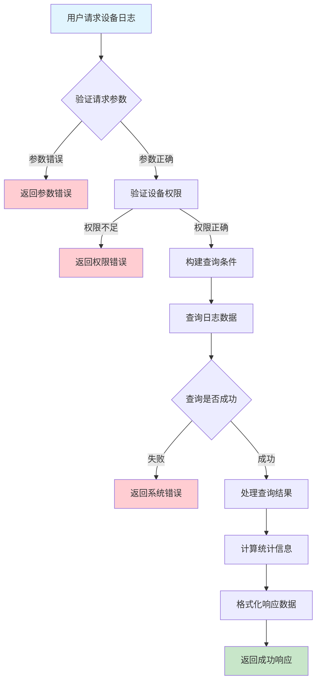
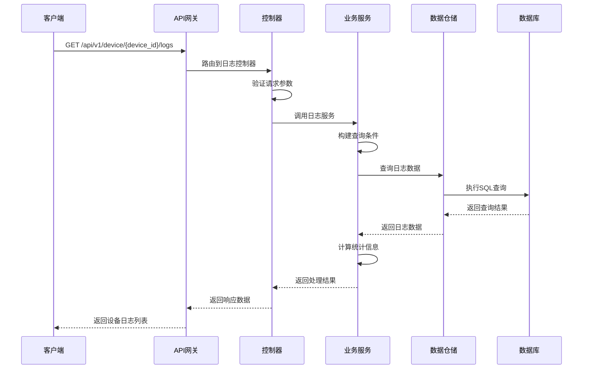

# 设备日志需求文档

## 1. 功能描述

### 1.1 功能概述
设备日志功能用于查询和管理设备的运行日志，包括系统日志、应用日志、错误日志等。该功能提供日志查询、日志分析、日志导出等能力，帮助用户了解设备运行状态，排查问题和故障。

### 1.2 主要功能列表
- 查询设备运行日志
- 按日志级别筛选日志
- 按时间范围查询日志
- 日志关键词搜索
- 日志统计分析
- 日志数据导出

### 1.3 支持的功能特性
- 多级别日志查询
- 实时日志监控
- 日志聚合分析
- 日志告警设置
- 日志存储管理
- 日志清理策略

## 2. 功能目标

### 2.1 业务目标
- 提供完整的设备日志查询能力
- 支持日志分析和问题排查
- 实现日志监控和告警
- 优化日志存储和管理

### 2.2 技术目标
- 高效处理大量日志数据
- 支持实时日志查询
- 提供灵活的查询接口
- 确保日志数据完整性

### 2.3 安全目标
- 保护敏感日志信息
- 控制日志访问权限
- 防止日志数据泄露
- 确保日志操作审计

## 3. 输入输出说明

### 3.1 输入参数

#### 3.1.1 必需参数
- `device_id` (string): 设备ID，用于指定查询的设备

#### 3.1.2 可选参数
- `start_time` (string): 开始时间，格式：YYYY-MM-DD HH:mm:ss
- `end_time` (string): 结束时间，格式：YYYY-MM-DD HH:mm:ss
- `log_level` (string): 日志级别，如：debug、info、warn、error、fatal
- `log_type` (string): 日志类型，如：system、application、security
- `keyword` (string): 搜索关键词
- `page` (int): 页码，默认：1
- `page_size` (int): 每页数量，默认：100，最大：1000

### 3.2 输出参数

#### 3.2.1 成功响应
```json
{
  "code": 200,
  "message": "success",
  "data": {
    "device_id": "device_001",
    "logs": [
      {
        "id": "log_001",
        "timestamp": "2024-01-15T10:30:00Z",
        "level": "info",
        "type": "system",
        "source": "kernel",
        "message": "System boot completed successfully",
        "details": {
          "process_id": 1234,
          "thread_id": 5678,
          "file": "/var/log/system.log",
          "line": 45
        },
        "tags": ["boot", "system"]
      }
    ],
    "summary": {
      "total": 1500,
      "error_count": 25,
      "warning_count": 150,
      "info_count": 1325
    },
    "total": 1500,
    "page": 1,
    "page_size": 100
  }
}
```

#### 3.2.2 错误响应
```json
{
  "code": 400,
  "message": "设备ID不能为空",
  "data": null
}
```

### 3.3 参数格式和约束
- 时间格式：ISO 8601标准格式
- 设备ID：长度1-64字符，支持字母、数字、下划线
- 日志级别：支持debug、info、warn、error、fatal
- 日志类型：支持system、application、security、network
- 页码：正整数，范围1-10000
- 每页数量：正整数，范围1-1000

## 4. 涉及接口以及接口设计

### 4.1 API接口定义

#### 4.1.1 查询设备日志
```go
// 查询设备日志
GET /api/v1/device/{device_id}/logs
```

**请求参数：**
- Path参数：device_id
- Query参数：start_time, end_time, log_level, log_type, keyword, page, page_size

**响应结构：**
```go
type LogResponse struct {
    Code    int    `json:"code"`
    Message string `json:"message"`
    Data    struct {
        DeviceID string     `json:"device_id"`
        Logs     []DeviceLog `json:"logs"`
        Summary  LogSummary  `json:"summary"`
        Total    int64       `json:"total"`
        Page     int         `json:"page"`
        PageSize int         `json:"page_size"`
    } `json:"data"`
}

type DeviceLog struct {
    ID        string                 `json:"id"`
    Timestamp time.Time              `json:"timestamp"`
    Level     string                 `json:"level"`
    Type      string                 `json:"type"`
    Source    string                 `json:"source"`
    Message   string                 `json:"message"`
    Details   map[string]interface{} `json:"details"`
    Tags      []string               `json:"tags"`
}

type LogSummary struct {
    Total        int64 `json:"total"`
    ErrorCount   int64 `json:"error_count"`
    WarningCount int64 `json:"warning_count"`
    InfoCount    int64 `json:"info_count"`
    DebugCount   int64 `json:"debug_count"`
}
```

#### 4.1.2 获取日志详情
```go
// 获取日志详情
GET /api/v1/device/logs/{log_id}
```

**响应结构：**
```go
type LogDetail struct {
    ID        string                 `json:"id"`
    DeviceID  string                 `json:"device_id"`
    Timestamp time.Time              `json:"timestamp"`
    Level     string                 `json:"level"`
    Type      string                 `json:"type"`
    Source    string                 `json:"source"`
    Message   string                 `json:"message"`
    Details   map[string]interface{} `json:"details"`
    Tags      []string               `json:"tags"`
    StackTrace string                `json:"stack_trace"`
    Context   map[string]interface{} `json:"context"`
}
```

### 4.2 内部接口设计

#### 4.2.1 日志服务接口
```go
type LogService interface {
    // 查询设备日志
    GetDeviceLogs(ctx context.Context, req *LogRequest) (*LogResponse, error)
    
    // 获取日志详情
    GetLogDetail(ctx context.Context, logID string) (*LogDetail, error)
    
    // 批量查询日志
    BatchGetLogs(ctx context.Context, deviceIDs []string, req *LogRequest) (map[string]*LogResponse, error)
    
    // 获取日志统计
    GetLogStatistics(ctx context.Context, deviceID string, req *LogRequest) (*LogSummary, error)
}
```

#### 4.2.2 日志仓储接口
```go
type LogRepository interface {
    // 查询日志数据
    Query(ctx context.Context, req *LogQuery) (*LogResult, error)
    
    // 根据ID获取日志
    GetByID(ctx context.Context, id string) (*DeviceLog, error)
    
    // 批量查询日志
    BatchQuery(ctx context.Context, deviceIDs []string, req *LogQuery) (map[string]*LogResult, error)
    
    // 获取日志统计
    GetStatistics(ctx context.Context, deviceID string, req *LogQuery) (*LogSummary, error)
}
```

## 5. 数据结构设计

### 5.1 数据库表结构

#### 5.1.1 设备日志表 (device_logs)
```sql
CREATE TABLE device_logs (
    id VARCHAR(64) PRIMARY KEY COMMENT '日志ID',
    device_id VARCHAR(64) NOT NULL COMMENT '设备ID',
    timestamp TIMESTAMP NOT NULL COMMENT '日志时间戳',
    level VARCHAR(20) NOT NULL COMMENT '日志级别',
    type VARCHAR(50) NOT NULL COMMENT '日志类型',
    source VARCHAR(100) COMMENT '日志来源',
    message TEXT NOT NULL COMMENT '日志消息',
    details JSON COMMENT '详细信息',
    tags JSON COMMENT '标签',
    stack_trace TEXT COMMENT '堆栈跟踪',
    context JSON COMMENT '上下文信息',
    created_at TIMESTAMP DEFAULT CURRENT_TIMESTAMP COMMENT '创建时间',
    
    INDEX idx_device_id (device_id),
    INDEX idx_timestamp (timestamp),
    INDEX idx_level (level),
    INDEX idx_type (type),
    INDEX idx_device_time (device_id, timestamp),
    INDEX idx_device_level (device_id, level),
    INDEX idx_device_type (device_id, type)
) ENGINE=InnoDB DEFAULT CHARSET=utf8mb4 COMMENT='设备日志表';
```

#### 5.1.2 日志统计表 (device_log_statistics)
```sql
CREATE TABLE device_log_statistics (
    id BIGINT AUTO_INCREMENT PRIMARY KEY COMMENT '统计ID',
    device_id VARCHAR(64) NOT NULL COMMENT '设备ID',
    date DATE NOT NULL COMMENT '统计日期',
    level VARCHAR(20) NOT NULL COMMENT '日志级别',
    type VARCHAR(50) NOT NULL COMMENT '日志类型',
    count INT NOT NULL DEFAULT 0 COMMENT '日志数量',
    created_at TIMESTAMP DEFAULT CURRENT_TIMESTAMP COMMENT '创建时间',
    updated_at TIMESTAMP DEFAULT CURRENT_TIMESTAMP ON UPDATE CURRENT_TIMESTAMP COMMENT '更新时间',
    
    UNIQUE KEY uk_device_date_level_type (device_id, date, level, type),
    INDEX idx_device_id (device_id),
    INDEX idx_date (date),
    INDEX idx_level (level),
    INDEX idx_type (type)
) ENGINE=InnoDB DEFAULT CHARSET=utf8mb4 COMMENT='设备日志统计表';
```

### 5.2 模型结构定义

#### 5.2.1 设备日志模型
```go
type DeviceLog struct {
    ID         string                 `json:"id" db:"id"`
    DeviceID   string                 `json:"device_id" db:"device_id"`
    Timestamp  time.Time              `json:"timestamp" db:"timestamp"`
    Level      string                 `json:"level" db:"level"`
    Type       string                 `json:"type" db:"type"`
    Source     string                 `json:"source" db:"source"`
    Message    string                 `json:"message" db:"message"`
    Details    map[string]interface{} `json:"details" db:"details"`
    Tags       []string               `json:"tags" db:"tags"`
    StackTrace string                 `json:"stack_trace" db:"stack_trace"`
    Context    map[string]interface{} `json:"context" db:"context"`
    CreatedAt  time.Time              `json:"created_at" db:"created_at"`
}
```

#### 5.2.2 查询请求模型
```go
type LogRequest struct {
    DeviceID  string `json:"device_id" v:"required"`
    StartTime string `json:"start_time"`
    EndTime   string `json:"end_time"`
    LogLevel  string `json:"log_level"`
    LogType   string `json:"log_type"`
    Keyword   string `json:"keyword"`
    Page      int    `json:"page" v:"min:1"`
    PageSize  int    `json:"page_size" v:"min:1,max:1000"`
}
```

### 5.3 数据关系说明
- 设备日志与设备表通过device_id关联
- 日志数据按时间顺序存储，支持时间范围查询
- 日志统计表提供预计算的统计数据，提高查询性能
- 支持多种日志级别和类型的分类查询

## 6. 异常处理

### 6.1 输入验证异常
- 设备ID为空或格式错误
- 时间格式不正确
- 日志级别不支持
- 日志类型无效

### 6.2 业务逻辑异常
- 设备不存在
- 查询时间范围过大
- 数据量过大导致查询超时
- 权限不足

### 6.3 系统异常
- 数据库连接失败
- 网络超时
- 系统资源不足
- 服务不可用

## 7. 交互流程图



## 8. 交互时序图



## 9. 安全与权限

### 9.1 访问控制策略
- 需要用户身份验证
- 验证用户对指定设备的访问权限
- 支持基于角色的访问控制(RBAC)
- 记录所有日志查询操作

### 9.2 数据安全要求
- 敏感日志信息需要脱敏处理
- 日志数据需要加密存储
- 支持数据访问审计
- 防止SQL注入攻击

### 9.3 身份验证机制
- 使用JWT令牌进行身份验证
- 支持API密钥认证
- 实现请求频率限制
- 支持IP白名单控制

## 10. 日志与审计要求

### 10.1 操作日志要求
- 记录所有日志查询操作
- 记录查询参数和结果数量
- 记录操作人员身份信息
- 记录操作时间和IP地址

### 10.2 审计日志要求
- 记录日志数据的访问轨迹
- 记录操作人员的身份和权限
- 记录查询的目的和影响
- 支持审计日志的长期保存

### 10.3 日志格式规范
```json
{
  "timestamp": "2024-01-15T10:30:00Z",
  "level": "INFO",
  "service": "device-logs",
  "operation": "query_device_logs",
  "user_id": "user_001",
  "device_id": "device_001",
  "parameters": {
    "start_time": "2024-01-15T00:00:00Z",
    "end_time": "2024-01-15T23:59:59Z",
    "log_level": "error"
  },
  "result": {
    "total": 1500,
    "count": 100
  }
}
```

## 11. 测试用例

### 11.1 功能测试用例

#### 11.1.1 正常查询测试
**测试场景：** 查询设备日志
**输入数据：**
```json
{
  "device_id": "device_001",
  "start_time": "2024-01-15T00:00:00Z",
  "end_time": "2024-01-15T23:59:59Z",
  "page": 1,
  "page_size": 100
}
```
**预期结果：**
- 返回状态码：200
- 返回设备日志列表
- 分页信息正确
- 数据格式符合预期

#### 11.1.2 日志级别筛选测试
**测试场景：** 按日志级别筛选
**输入数据：**
```json
{
  "device_id": "device_001",
  "log_level": "error",
  "start_time": "2024-01-15T00:00:00Z",
  "end_time": "2024-01-15T23:59:59Z"
}
```
**预期结果：**
- 返回状态码：200
- 只返回错误级别日志
- 日志级别字段为error
- 统计信息正确

#### 11.1.3 关键词搜索测试
**测试场景：** 按关键词搜索日志
**输入数据：**
```json
{
  "device_id": "device_001",
  "keyword": "error",
  "start_time": "2024-01-15T00:00:00Z",
  "end_time": "2024-01-15T23:59:59Z"
}
```
**预期结果：**
- 返回状态码：200
- 返回包含关键词的日志
- 搜索结果按时间排序
- 统计信息正确

### 11.2 性能测试用例

#### 11.2.1 大数据量查询测试
**测试场景：** 查询大量日志数据
**测试数据：** 1000万条日志记录
**测试条件：**
- 查询时间范围：30天
- 分页大小：1000条
- 并发用户：50个

**预期结果：**
- 查询响应时间 < 5秒
- 内存使用 < 2GB
- 数据库CPU使用率 < 70%

#### 11.2.2 并发查询测试
**测试场景：** 多用户并发查询日志
**测试条件：**
- 并发用户数：500
- 查询频率：每秒200次
- 测试时长：15分钟

**预期结果：**
- 系统稳定运行
- 响应时间 < 5秒
- 错误率 < 2%

### 11.3 安全测试用例

#### 11.3.1 权限验证测试
**测试场景：** 验证用户访问权限
**测试数据：**
- 用户A：有设备访问权限
- 用户B：无设备访问权限

**预期结果：**
- 用户A：成功获取日志数据
- 用户B：返回权限错误

#### 11.3.2 SQL注入防护测试
**测试场景：** 测试SQL注入防护
**输入数据：**
```json
{
  "device_id": "device_001'; DROP TABLE device_logs; --",
  "keyword": "error' OR '1'='1"
}
```
**预期结果：**
- 系统正确处理特殊字符
- 不执行恶意SQL语句
- 返回参数验证错误

### 11.4 异常测试用例

#### 11.4.1 参数错误测试
**测试场景：** 测试各种参数错误情况
**测试数据：**
```json
{
  "device_id": "",
  "start_time": "invalid_time",
  "page": 0,
  "page_size": 2000
}
```
**预期结果：**
- 返回参数验证错误
- 错误信息明确具体
- 状态码：400

#### 11.4.2 设备不存在测试
**测试场景：** 查询不存在的设备日志
**输入数据：**
```json
{
  "device_id": "non_existent_device",
  "start_time": "2024-01-15T00:00:00Z",
  "end_time": "2024-01-15T23:59:59Z"
}
```
**预期结果：**
- 返回设备不存在错误
- 状态码：404
- 错误信息友好

#### 11.4.3 系统异常测试
**测试场景：** 模拟数据库连接失败
**测试方法：** 临时关闭数据库连接
**预期结果：**
- 返回系统错误
- 状态码：500
- 记录详细错误日志 