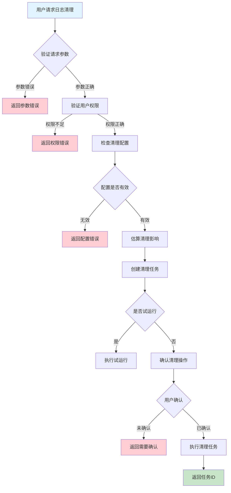
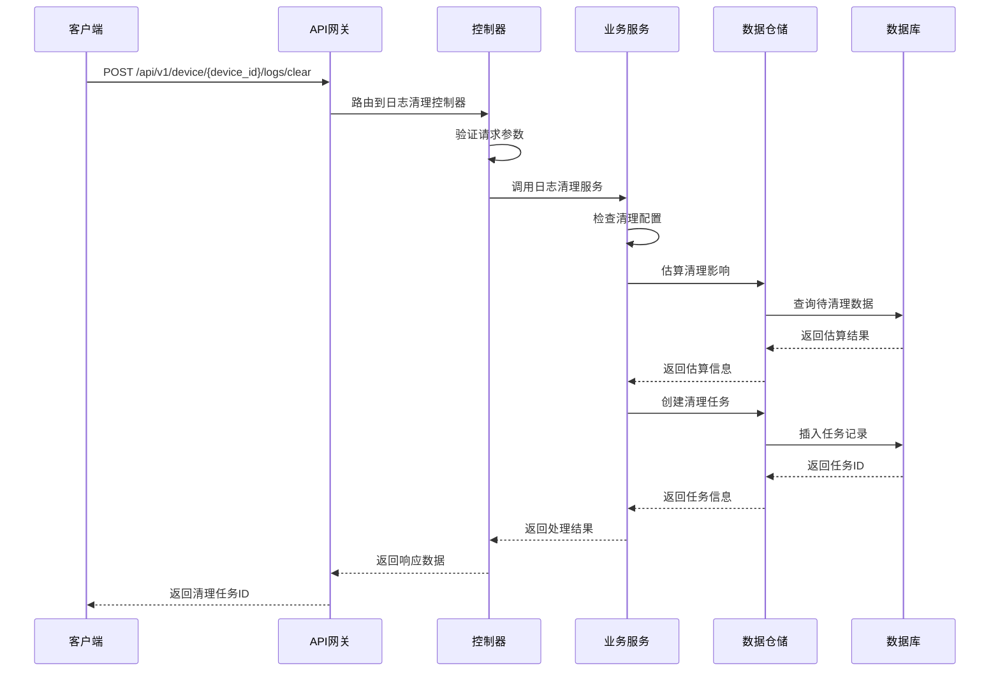

# 设备日志清理需求文档

## 1. 功能描述

### 1.1 功能概述
设备日志清理功能用于管理和清理设备的日志数据，包括按时间范围清理、按日志级别清理、按设备清理等。该功能帮助用户维护日志存储空间，提高系统性能，同时保留重要的日志数据用于审计和分析。

### 1.2 主要功能列表
- 按时间范围清理日志
- 按日志级别清理日志
- 按设备清理日志
- 清理策略配置
- 清理任务管理
- 清理结果统计

### 1.3 支持的功能特性
- 自动清理策略
- 手动清理操作
- 清理任务调度
- 清理结果通知
- 清理历史记录
- 清理空间统计

## 2. 功能目标

### 2.1 业务目标
- 优化日志存储空间
- 提高系统查询性能
- 降低存储成本
- 保持重要日志数据

### 2.2 技术目标
- 高效清理大量日志数据
- 支持多种清理策略
- 确保清理操作安全
- 提供清理进度监控

### 2.3 安全目标
- 保护重要日志数据
- 控制清理操作权限
- 防止误删除操作
- 确保清理操作审计

## 3. 输入输出说明

### 3.1 输入参数

#### 3.1.1 必需参数
- `device_id` (string): 设备ID，用于指定清理的设备

#### 3.1.2 可选参数
- `clear_type` (string): 清理类型，如：time_range、log_level、all
- `start_time` (string): 开始时间，格式：YYYY-MM-DD HH:mm:ss
- `end_time` (string): 结束时间，格式：YYYY-MM-DD HH:mm:ss
- `log_level` (string): 日志级别，如：debug、info、warn、error
- `dry_run` (boolean): 是否试运行，默认：false
- `confirm` (boolean): 是否确认清理，默认：false

### 3.2 输出参数

#### 3.2.1 成功响应
```json
{
  "code": 200,
  "message": "success",
  "data": {
    "task_id": "clear_task_001",
    "device_id": "device_001",
    "clear_type": "time_range",
    "clear_config": {
      "start_time": "2024-01-01T00:00:00Z",
      "end_time": "2024-01-15T23:59:59Z",
      "log_level": "debug"
    },
    "estimated_records": 15000,
    "estimated_space": "2.5GB",
    "status": "pending",
    "created_at": "2024-01-15T10:30:00Z",
    "created_by": "user_001"
  }
}
```

#### 3.2.2 清理完成响应
```json
{
  "code": 200,
  "message": "清理完成",
  "data": {
    "task_id": "clear_task_001",
    "device_id": "device_001",
    "status": "completed",
    "cleared_records": 14850,
    "cleared_space": "2.3GB",
    "start_time": "2024-01-15T10:30:00Z",
    "end_time": "2024-01-15T10:35:00Z",
    "duration": "5分钟"
  }
}
```

#### 3.2.3 错误响应
```json
{
  "code": 400,
  "message": "设备ID不能为空",
  "data": null
}
```

### 3.3 参数格式和约束
- 设备ID：长度1-64字符，支持字母、数字、下划线
- 清理类型：支持time_range、log_level、all
- 时间格式：ISO 8601标准格式
- 日志级别：支持debug、info、warn、error、fatal
- 布尔参数：true/false

## 4. 涉及接口以及接口设计

### 4.1 API接口定义

#### 4.1.1 创建清理任务
```go
// 创建日志清理任务
POST /api/v1/device/{device_id}/logs/clear
```

**请求参数：**
- Path参数：device_id
- Body参数：clear_type, start_time, end_time, log_level, dry_run, confirm

**响应结构：**
```go
type LogClearResponse struct {
    Code    int    `json:"code"`
    Message string `json:"message"`
    Data    struct {
        TaskID         string                 `json:"task_id"`
        DeviceID       string                 `json:"device_id"`
        ClearType      string                 `json:"clear_type"`
        ClearConfig    map[string]interface{} `json:"clear_config"`
        EstimatedRecords int64                `json:"estimated_records"`
        EstimatedSpace   string               `json:"estimated_space"`
        Status         string                 `json:"status"`
        CreatedAt      time.Time              `json:"created_at"`
        CreatedBy      string                 `json:"created_by"`
    } `json:"data"`
}
```

#### 4.1.2 获取清理任务状态
```go
// 获取清理任务状态
GET /api/v1/device/logs/clear/{task_id}
```

**响应结构：**
```go
type ClearTaskStatus struct {
    TaskID         string    `json:"task_id"`
    DeviceID       string    `json:"device_id"`
    Status         string    `json:"status"`
    Progress       float64   `json:"progress"`
    ClearedRecords int64     `json:"cleared_records"`
    ClearedSpace   string    `json:"cleared_space"`
    StartTime      time.Time `json:"start_time"`
    EndTime        *time.Time `json:"end_time"`
    Duration       string    `json:"duration"`
    ErrorMessage   string    `json:"error_message"`
}
```

### 4.2 内部接口设计

#### 4.2.1 日志清理服务接口
```go
type LogClearService interface {
    // 创建清理任务
    CreateClearTask(ctx context.Context, req *LogClearRequest) (*LogClearTask, error)
    
    // 执行清理任务
    ExecuteClearTask(ctx context.Context, taskID string) error
    
    // 获取清理任务状态
    GetClearTaskStatus(ctx context.Context, taskID string) (*ClearTaskStatus, error)
    
    // 取消清理任务
    CancelClearTask(ctx context.Context, taskID string) error
    
    // 获取清理历史
    GetClearHistory(ctx context.Context, deviceID string) ([]ClearTaskHistory, error)
}
```

#### 4.2.2 日志清理仓储接口
```go
type LogClearRepository interface {
    // 创建清理任务
    CreateTask(ctx context.Context, task *LogClearTask) error
    
    // 更新任务状态
    UpdateTaskStatus(ctx context.Context, taskID string, status string, progress float64) error
    
    // 获取任务信息
    GetTask(ctx context.Context, taskID string) (*LogClearTask, error)
    
    // 执行清理操作
    ExecuteClear(ctx context.Context, config *ClearConfig) (*ClearResult, error)
    
    // 获取清理历史
    GetClearHistory(ctx context.Context, deviceID string) ([]ClearTaskHistory, error)
}
```

## 5. 数据结构设计

### 5.1 数据库表结构

#### 5.1.1 日志清理任务表 (device_log_clear_tasks)
```sql
CREATE TABLE device_log_clear_tasks (
    task_id VARCHAR(64) PRIMARY KEY COMMENT '任务ID',
    device_id VARCHAR(64) NOT NULL COMMENT '设备ID',
    clear_type VARCHAR(20) NOT NULL COMMENT '清理类型',
    clear_config JSON COMMENT '清理配置',
    estimated_records BIGINT DEFAULT 0 COMMENT '预估记录数',
    estimated_space VARCHAR(20) COMMENT '预估空间',
    cleared_records BIGINT DEFAULT 0 COMMENT '已清理记录数',
    cleared_space VARCHAR(20) COMMENT '已清理空间',
    status VARCHAR(20) DEFAULT 'pending' COMMENT '任务状态',
    progress DECIMAL(5,2) DEFAULT 0.00 COMMENT '进度百分比',
    error_message TEXT COMMENT '错误信息',
    created_by VARCHAR(64) COMMENT '创建人员',
    created_at TIMESTAMP DEFAULT CURRENT_TIMESTAMP COMMENT '创建时间',
    started_at TIMESTAMP NULL COMMENT '开始时间',
    completed_at TIMESTAMP NULL COMMENT '完成时间',
    
    INDEX idx_device_id (device_id),
    INDEX idx_status (status),
    INDEX idx_created_at (created_at),
    INDEX idx_device_status (device_id, status)
) ENGINE=InnoDB DEFAULT CHARSET=utf8mb4 COMMENT='设备日志清理任务表';
```

#### 5.1.2 日志清理历史表 (device_log_clear_history)
```sql
CREATE TABLE device_log_clear_history (
    id BIGINT AUTO_INCREMENT PRIMARY KEY COMMENT '历史ID',
    task_id VARCHAR(64) NOT NULL COMMENT '任务ID',
    device_id VARCHAR(64) NOT NULL COMMENT '设备ID',
    clear_type VARCHAR(20) NOT NULL COMMENT '清理类型',
    clear_config JSON COMMENT '清理配置',
    cleared_records BIGINT NOT NULL COMMENT '清理记录数',
    cleared_space VARCHAR(20) COMMENT '清理空间',
    duration INT COMMENT '执行时长(秒)',
    status VARCHAR(20) NOT NULL COMMENT '执行状态',
    created_by VARCHAR(64) COMMENT '执行人员',
    created_at TIMESTAMP DEFAULT CURRENT_TIMESTAMP COMMENT '执行时间',
    
    INDEX idx_task_id (task_id),
    INDEX idx_device_id (device_id),
    INDEX idx_created_at (created_at),
    INDEX idx_device_time (device_id, created_at)
) ENGINE=InnoDB DEFAULT CHARSET=utf8mb4 COMMENT='设备日志清理历史表';
```

### 5.2 模型结构定义

#### 5.2.1 日志清理任务模型
```go
type LogClearTask struct {
    TaskID         string                 `json:"task_id" db:"task_id"`
    DeviceID       string                 `json:"device_id" db:"device_id"`
    ClearType      string                 `json:"clear_type" db:"clear_type"`
    ClearConfig    map[string]interface{} `json:"clear_config" db:"clear_config"`
    EstimatedRecords int64                `json:"estimated_records" db:"estimated_records"`
    EstimatedSpace   string               `json:"estimated_space" db:"estimated_space"`
    ClearedRecords   int64                `json:"cleared_records" db:"cleared_records"`
    ClearedSpace     string               `json:"cleared_space" db:"cleared_space"`
    Status         string                 `json:"status" db:"status"`
    Progress       float64                `json:"progress" db:"progress"`
    ErrorMessage   string                 `json:"error_message" db:"error_message"`
    CreatedBy      string                 `json:"created_by" db:"created_by"`
    CreatedAt      time.Time              `json:"created_at" db:"created_at"`
    StartedAt      *time.Time             `json:"started_at" db:"started_at"`
    CompletedAt    *time.Time             `json:"completed_at" db:"completed_at"`
}
```

#### 5.2.2 清理请求模型
```go
type LogClearRequest struct {
    DeviceID   string `json:"device_id" v:"required"`
    ClearType  string `json:"clear_type" v:"required"`
    StartTime  string `json:"start_time"`
    EndTime    string `json:"end_time"`
    LogLevel   string `json:"log_level"`
    DryRun     bool   `json:"dry_run"`
    Confirm    bool   `json:"confirm"`
}
```

### 5.3 数据关系说明
- 清理任务与设备表通过device_id关联
- 清理历史与清理任务通过task_id关联
- 支持多种清理策略和配置
- 提供清理进度和结果跟踪

## 6. 异常处理

### 6.1 输入验证异常
- 设备ID为空或格式错误
- 清理类型不支持
- 时间格式不正确
- 日志级别无效

### 6.2 业务逻辑异常
- 设备不存在
- 清理时间范围过大
- 权限不足
- 清理任务已存在

### 6.3 系统异常
- 数据库连接失败
- 存储空间不足
- 系统资源不足
- 服务不可用

## 7. 交互流程图



## 8. 交互时序图



## 9. 安全与权限

### 9.1 访问控制策略
- 需要用户身份验证
- 验证用户对指定设备的访问权限
- 支持基于角色的访问控制(RBAC)
- 记录所有清理操作日志

### 9.2 数据安全要求
- 保护重要日志数据不被误删
- 清理操作需要二次确认
- 支持数据访问审计
- 防止恶意清理操作

### 9.3 身份验证机制
- 使用JWT令牌进行身份验证
- 支持API密钥认证
- 实现请求频率限制
- 支持IP白名单控制

## 10. 日志与审计要求

### 10.1 操作日志要求
- 记录所有清理操作
- 记录清理配置和结果
- 记录操作人员身份信息
- 记录操作时间和IP地址

### 10.2 审计日志要求
- 记录清理操作的完整轨迹
- 记录操作人员的身份和权限
- 记录清理的影响和结果
- 支持审计日志的长期保存

### 10.3 日志格式规范
```json
{
  "timestamp": "2024-01-15T10:30:00Z",
  "level": "INFO",
  "service": "device-log-clear",
  "operation": "create_clear_task",
  "user_id": "user_001",
  "device_id": "device_001",
  "parameters": {
    "clear_type": "time_range",
    "start_time": "2024-01-01T00:00:00Z",
    "end_time": "2024-01-15T23:59:59Z",
    "log_level": "debug"
  },
  "result": {
    "task_id": "clear_task_001",
    "estimated_records": 15000,
    "estimated_space": "2.5GB"
  }
}
```

## 11. 测试用例

### 11.1 功能测试用例

#### 11.1.1 正常清理测试
**测试场景：** 创建日志清理任务
**输入数据：**
```json
{
  "device_id": "device_001",
  "clear_type": "time_range",
  "start_time": "2024-01-01T00:00:00Z",
  "end_time": "2024-01-15T23:59:59Z",
  "log_level": "debug",
  "confirm": true
}
```
**预期结果：**
- 返回状态码：200
- 返回清理任务ID
- 任务状态为pending
- 包含预估信息

#### 11.1.2 试运行测试
**测试场景：** 执行试运行清理
**输入数据：**
```json
{
  "device_id": "device_001",
  "clear_type": "time_range",
  "start_time": "2024-01-01T00:00:00Z",
  "end_time": "2024-01-15T23:59:59Z",
  "dry_run": true
}
```
**预期结果：**
- 返回状态码：200
- 返回预估清理信息
- 不执行实际清理操作
- 包含详细的预估数据

#### 11.1.3 按级别清理测试
**测试场景：** 按日志级别清理
**输入数据：**
```json
{
  "device_id": "device_001",
  "clear_type": "log_level",
  "log_level": "debug",
  "confirm": true
}
```
**预期结果：**
- 返回状态码：200
- 只清理debug级别日志
- 保留其他级别日志
- 返回清理结果统计

### 11.2 性能测试用例

#### 11.2.1 大量数据清理测试
**测试场景：** 清理大量日志数据
**测试数据：** 1000万条日志记录
**测试条件：**
- 清理时间范围：30天
- 并发清理任务：5个
- 测试时长：30分钟

**预期结果：**
- 清理响应时间 < 10分钟
- 内存使用 < 2GB
- 数据库CPU使用率 < 80%
- 清理成功率 > 95%

#### 11.2.2 并发清理测试
**测试场景：** 多用户并发清理
**测试条件：**
- 并发用户数：20
- 清理频率：每分钟1次
- 测试时长：1小时

**预期结果：**
- 系统稳定运行
- 清理任务正确排队
- 无数据冲突
- 错误率 < 5%

### 11.3 安全测试用例

#### 11.3.1 权限验证测试
**测试场景：** 验证用户清理权限
**测试数据：**
- 用户A：有设备清理权限
- 用户B：无设备清理权限

**预期结果：**
- 用户A：成功创建清理任务
- 用户B：返回权限错误

#### 11.3.2 确认机制测试
**测试场景：** 测试清理确认机制
**输入数据：**
```json
{
  "device_id": "device_001",
  "clear_type": "all",
  "confirm": false
}
```
**预期结果：**
- 返回需要确认错误
- 状态码：400
- 错误信息明确

### 11.4 异常测试用例

#### 11.4.1 参数错误测试
**测试场景：** 测试各种参数错误情况
**测试数据：**
```json
{
  "device_id": "",
  "clear_type": "invalid_type",
  "start_time": "invalid_time"
}
```
**预期结果：**
- 返回参数验证错误
- 错误信息明确具体
- 状态码：400

#### 11.4.2 设备不存在测试
**测试场景：** 清理不存在的设备日志
**输入数据：**
```json
{
  "device_id": "non_existent_device",
  "clear_type": "time_range"
}
```
**预期结果：**
- 返回设备不存在错误
- 状态码：404
- 错误信息友好

#### 11.4.3 系统异常测试
**测试场景：** 模拟数据库连接失败
**测试方法：** 临时关闭数据库连接
**预期结果：**
- 返回系统错误
- 状态码：500
- 记录详细错误日志 