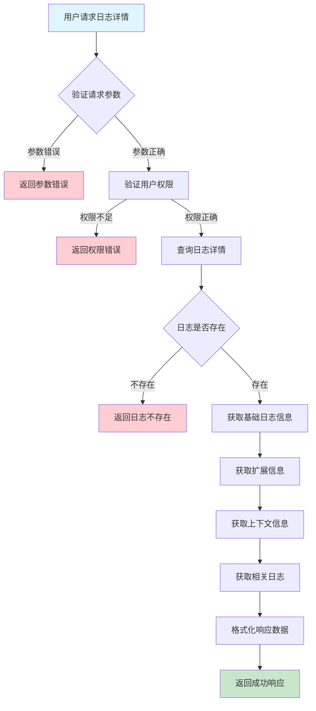
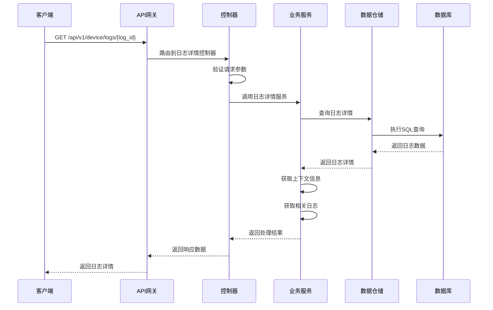

# 设备日志详情需求文档

## 1. 功能描述

### 1.1 功能概述
设备日志详情功能用于获取单条设备日志的详细信息，包括日志的完整内容、上下文信息、堆栈跟踪、相关标签等。该功能为用户提供深入的日志分析能力，帮助快速定位和解决问题。

### 1.2 主要功能列表
- 获取单条日志详细信息
- 显示日志上下文信息
- 展示堆栈跟踪信息
- 提供相关日志链接
- 支持日志内容搜索
- 日志详情导出功能

### 1.3 支持的功能特性
- 完整日志内容展示
- 结构化数据解析
- 关联日志查询
- 日志内容高亮
- 上下文信息展示
- 日志元数据查看

## 2. 功能目标

### 2.1 业务目标
- 提供详细的日志信息查看
- 支持问题快速定位
- 便于日志分析和调试
- 提升故障排查效率

### 2.2 技术目标
- 高效查询单条日志详情
- 支持复杂日志内容解析
- 提供良好的用户体验
- 确保数据完整性和准确性

### 2.3 安全目标
- 保护敏感日志信息
- 控制日志详情访问权限
- 防止日志数据泄露
- 确保访问操作审计

## 3. 输入输出说明

### 3.1 输入参数

#### 3.1.1 必需参数
- `log_id` (string): 日志ID，用于指定查询的日志记录

#### 3.1.2 可选参数
- `include_context` (boolean): 是否包含上下文信息，默认：true
- `include_stack_trace` (boolean): 是否包含堆栈跟踪，默认：true
- `include_related_logs` (boolean): 是否包含相关日志，默认：false
- `related_logs_count` (int): 相关日志数量，默认：10，最大：50

### 3.2 输出参数

#### 3.2.1 成功响应
```json
{
  "code": 200,
  "message": "success",
  "data": {
    "id": "log_001",
    "device_id": "device_001",
    "timestamp": "2024-01-15T10:30:00Z",
    "level": "error",
    "type": "application",
    "source": "user-service",
    "message": "Failed to process user request",
    "details": {
      "process_id": 1234,
      "thread_id": 5678,
      "file": "/app/services/user.go",
      "line": 45,
      "function": "ProcessUserRequest",
      "error_code": "USER_NOT_FOUND",
      "request_id": "req_123456"
    },
    "stack_trace": "goroutine 1 [running]:\nmain.ProcessUserRequest()\n\t/app/services/user.go:45 +0x123",
    "context": {
      "user_id": "user_001",
      "session_id": "sess_789",
      "ip_address": "192.168.1.100",
      "user_agent": "Mozilla/5.0..."
    },
    "tags": ["error", "user-service", "critical"],
    "related_logs": [
      {
        "id": "log_002",
        "timestamp": "2024-01-15T10:29:55Z",
        "level": "info",
        "message": "User request received",
        "details": {
          "request_id": "req_123456"
        }
      }
    ],
    "created_at": "2024-01-15T10:30:00Z"
  }
}
```

#### 3.2.2 错误响应
```json
{
  "code": 404,
  "message": "日志不存在",
  "data": null
}
```

### 3.3 参数格式和约束
- 日志ID：长度1-64字符，支持字母、数字、下划线
- 布尔参数：true/false
- 相关日志数量：正整数，范围1-50

## 4. 涉及接口以及接口设计

### 4.1 API接口定义

#### 4.1.1 获取日志详情
```go
// 获取日志详情
GET /api/v1/device/logs/{log_id}
```

**请求参数：**
- Path参数：log_id
- Query参数：include_context, include_stack_trace, include_related_logs, related_logs_count

**响应结构：**
```go
type LogDetailResponse struct {
    Code    int       `json:"code"`
    Message string    `json:"message"`
    Data    LogDetail `json:"data"`
}

type LogDetail struct {
    ID          string                 `json:"id"`
    DeviceID    string                 `json:"device_id"`
    Timestamp   time.Time              `json:"timestamp"`
    Level       string                 `json:"level"`
    Type        string                 `json:"type"`
    Source      string                 `json:"source"`
    Message     string                 `json:"message"`
    Details     map[string]interface{} `json:"details"`
    StackTrace  string                 `json:"stack_trace"`
    Context     map[string]interface{} `json:"context"`
    Tags        []string               `json:"tags"`
    RelatedLogs []RelatedLog          `json:"related_logs"`
    CreatedAt   time.Time              `json:"created_at"`
}

type RelatedLog struct {
    ID        string                 `json:"id"`
    Timestamp time.Time              `json:"timestamp"`
    Level     string                 `json:"level"`
    Message   string                 `json:"message"`
    Details   map[string]interface{} `json:"details"`
}
```

#### 4.1.2 获取日志上下文
```go
// 获取日志上下文信息
GET /api/v1/device/logs/{log_id}/context
```

**响应结构：**
```go
type LogContextResponse struct {
    Code    int         `json:"code"`
    Message string      `json:"message"`
    Data    LogContext  `json:"data"`
}

type LogContext struct {
    LogID       string                 `json:"log_id"`
    DeviceInfo  map[string]interface{} `json:"device_info"`
    SystemInfo  map[string]interface{} `json:"system_info"`
    ProcessInfo map[string]interface{} `json:"process_info"`
    NetworkInfo map[string]interface{} `json:"network_info"`
}
```

### 4.2 内部接口设计

#### 4.2.1 日志详情服务接口
```go
type LogDetailService interface {
    // 获取日志详情
    GetLogDetail(ctx context.Context, logID string, req *LogDetailRequest) (*LogDetail, error)
    
    // 获取日志上下文
    GetLogContext(ctx context.Context, logID string) (*LogContext, error)
    
    // 获取相关日志
    GetRelatedLogs(ctx context.Context, logID string, count int) ([]RelatedLog, error)
    
    // 解析日志内容
    ParseLogContent(ctx context.Context, logID string) (*ParsedLogContent, error)
}
```

#### 4.2.2 日志详情仓储接口
```go
type LogDetailRepository interface {
    // 根据ID获取日志详情
    GetByID(ctx context.Context, id string) (*DeviceLog, error)
    
    // 获取日志上下文
    GetLogContext(ctx context.Context, logID string) (*LogContext, error)
    
    // 获取相关日志
    GetRelatedLogs(ctx context.Context, logID string, deviceID string, count int) ([]DeviceLog, error)
    
    // 解析日志内容
    ParseLogContent(ctx context.Context, logID string) (*ParsedLogContent, error)
}
```

## 5. 数据结构设计

### 5.1 数据库表结构

#### 5.1.1 日志详情扩展表 (device_log_details)
```sql
CREATE TABLE device_log_details (
    log_id VARCHAR(64) PRIMARY KEY COMMENT '日志ID',
    stack_trace TEXT COMMENT '堆栈跟踪',
    context JSON COMMENT '上下文信息',
    parsed_content JSON COMMENT '解析后的内容',
    related_logs JSON COMMENT '相关日志ID列表',
    created_at TIMESTAMP DEFAULT CURRENT_TIMESTAMP COMMENT '创建时间',
    updated_at TIMESTAMP DEFAULT CURRENT_TIMESTAMP ON UPDATE CURRENT_TIMESTAMP COMMENT '更新时间',
    
    INDEX idx_log_id (log_id),
    INDEX idx_created_at (created_at),
    FOREIGN KEY (log_id) REFERENCES device_logs(id) ON DELETE CASCADE
) ENGINE=InnoDB DEFAULT CHARSET=utf8mb4 COMMENT='设备日志详情扩展表';
```

#### 5.1.2 日志上下文表 (device_log_contexts)
```sql
CREATE TABLE device_log_contexts (
    id BIGINT AUTO_INCREMENT PRIMARY KEY COMMENT '上下文ID',
    log_id VARCHAR(64) NOT NULL COMMENT '日志ID',
    context_type VARCHAR(50) NOT NULL COMMENT '上下文类型',
    context_key VARCHAR(100) NOT NULL COMMENT '上下文键',
    context_value TEXT COMMENT '上下文值',
    created_at TIMESTAMP DEFAULT CURRENT_TIMESTAMP COMMENT '创建时间',
    
    INDEX idx_log_id (log_id),
    INDEX idx_context_type (context_type),
    INDEX idx_log_context (log_id, context_type),
    FOREIGN KEY (log_id) REFERENCES device_logs(id) ON DELETE CASCADE
) ENGINE=InnoDB DEFAULT CHARSET=utf8mb4 COMMENT='设备日志上下文表';
```

### 5.2 模型结构定义

#### 5.2.1 日志详情模型
```go
type LogDetail struct {
    ID          string                 `json:"id" db:"id"`
    DeviceID    string                 `json:"device_id" db:"device_id"`
    Timestamp   time.Time              `json:"timestamp" db:"timestamp"`
    Level       string                 `json:"level" db:"level"`
    Type        string                 `json:"type" db:"type"`
    Source      string                 `json:"source" db:"source"`
    Message     string                 `json:"message" db:"message"`
    Details     map[string]interface{} `json:"details" db:"details"`
    StackTrace  string                 `json:"stack_trace" db:"stack_trace"`
    Context     map[string]interface{} `json:"context" db:"context"`
    Tags        []string               `json:"tags" db:"tags"`
    RelatedLogs []RelatedLog          `json:"related_logs"`
    CreatedAt   time.Time              `json:"created_at" db:"created_at"`
}
```

#### 5.2.2 查询请求模型
```go
type LogDetailRequest struct {
    LogID              string `json:"log_id" v:"required"`
    IncludeContext     bool   `json:"include_context"`
    IncludeStackTrace  bool   `json:"include_stack_trace"`
    IncludeRelatedLogs bool   `json:"include_related_logs"`
    RelatedLogsCount   int    `json:"related_logs_count" v:"min:1,max:50"`
}
```

### 5.3 数据关系说明
- 日志详情与设备日志表通过log_id关联
- 日志上下文与设备日志表通过log_id关联
- 相关日志通过时间范围和设备ID关联
- 支持日志内容的解析和结构化存储

## 6. 异常处理

### 6.1 输入验证异常
- 日志ID为空或格式错误
- 相关日志数量超出范围
- 参数格式不正确

### 6.2 业务逻辑异常
- 日志不存在
- 权限不足
- 日志内容解析失败

### 6.3 系统异常
- 数据库连接失败
- 网络超时
- 系统资源不足
- 服务不可用

## 7. 交互流程图



## 8. 交互时序图



## 9. 安全与权限

### 9.1 访问控制策略
- 需要用户身份验证
- 验证用户对指定设备的访问权限
- 支持基于角色的访问控制(RBAC)
- 记录所有日志详情查询操作

### 9.2 数据安全要求
- 敏感日志信息需要脱敏处理
- 日志详情数据需要加密存储
- 支持数据访问审计
- 防止SQL注入攻击

### 9.3 身份验证机制
- 使用JWT令牌进行身份验证
- 支持API密钥认证
- 实现请求频率限制
- 支持IP白名单控制

## 10. 日志与审计要求

### 10.1 操作日志要求
- 记录所有日志详情查询操作
- 记录查询参数和结果
- 记录操作人员身份信息
- 记录操作时间和IP地址

### 10.2 审计日志要求
- 记录日志详情访问轨迹
- 记录操作人员的身份和权限
- 记录查询的目的和影响
- 支持审计日志的长期保存

### 10.3 日志格式规范
```json
{
  "timestamp": "2024-01-15T10:30:00Z",
  "level": "INFO",
  "service": "device-log-detail",
  "operation": "get_log_detail",
  "user_id": "user_001",
  "log_id": "log_001",
  "parameters": {
    "include_context": true,
    "include_stack_trace": true,
    "include_related_logs": false
  },
  "result": {
    "found": true,
    "has_stack_trace": true,
    "related_logs_count": 0
  }
}
```

## 11. 测试用例

### 11.1 功能测试用例

#### 11.1.1 正常查询测试
**测试场景：** 获取日志详情
**输入数据：**
```json
{
  "log_id": "log_001"
}
```
**预期结果：**
- 返回状态码：200
- 返回日志详细信息
- 包含完整的日志内容
- 数据格式符合预期

#### 11.1.2 包含上下文测试
**测试场景：** 获取包含上下文的日志详情
**输入数据：**
```json
{
  "log_id": "log_001",
  "include_context": true
}
```
**预期结果：**
- 返回状态码：200
- 返回日志详情和上下文信息
- 上下文信息完整准确

#### 11.1.3 包含相关日志测试
**测试场景：** 获取包含相关日志的详情
**输入数据：**
```json
{
  "log_id": "log_001",
  "include_related_logs": true,
  "related_logs_count": 10
}
```
**预期结果：**
- 返回状态码：200
- 返回相关日志列表
- 相关日志数量正确

### 11.2 性能测试用例

#### 11.2.1 单条日志查询测试
**测试场景：** 查询单条日志详情
**测试数据：** 1000个并发查询
**测试条件：**
- 查询频率：每秒100次
- 测试时长：5分钟

**预期结果：**
- 查询响应时间 < 500ms
- 内存使用 < 500MB
- 错误率 < 1%

#### 11.2.2 复杂日志解析测试
**测试场景：** 解析复杂日志内容
**测试数据：** 包含大量堆栈跟踪的日志
**预期结果：**
- 解析响应时间 < 1秒
- 解析结果准确
- 内存使用合理

### 11.3 安全测试用例

#### 11.3.1 权限验证测试
**测试场景：** 验证用户访问权限
**测试数据：**
- 用户A：有设备访问权限
- 用户B：无设备访问权限

**预期结果：**
- 用户A：成功获取日志详情
- 用户B：返回权限错误

#### 11.3.2 敏感信息保护测试
**测试场景：** 测试敏感信息脱敏
**输入数据：**
```json
{
  "log_id": "log_with_sensitive_data"
}
```
**预期结果：**
- 敏感信息被正确脱敏
- 不影响日志的可读性
- 符合数据保护要求

### 11.4 异常测试用例

#### 11.4.1 日志不存在测试
**测试场景：** 查询不存在的日志
**输入数据：**
```json
{
  "log_id": "non_existent_log"
}
```
**预期结果：**
- 返回日志不存在错误
- 状态码：404
- 错误信息友好

#### 11.4.2 参数错误测试
**测试场景：** 测试各种参数错误情况
**测试数据：**
```json
{
  "log_id": "",
  "related_logs_count": 100
}
```
**预期结果：**
- 返回参数验证错误
- 错误信息明确具体
- 状态码：400

#### 11.4.3 系统异常测试
**测试场景：** 模拟数据库连接失败
**测试方法：** 临时关闭数据库连接
**预期结果：**
- 返回系统错误
- 状态码：500
- 记录详细错误日志 