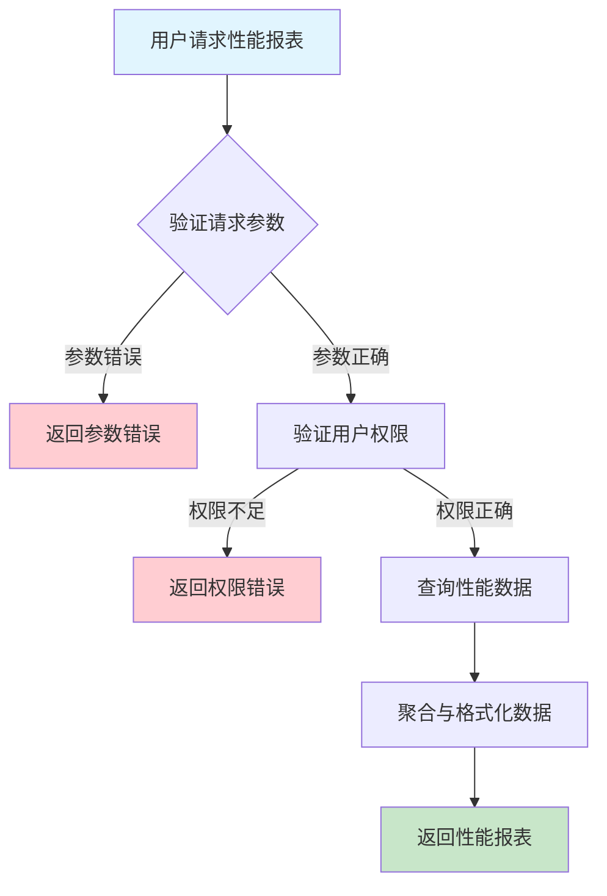
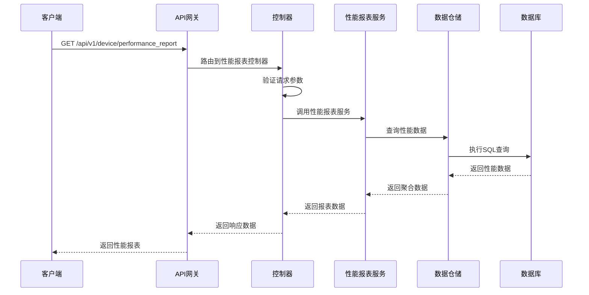

# 设备性能报表需求文档

## 1. 功能描述

### 1.1 功能概述
设备性能报表功能用于采集、统计和展示设备的各项性能指标（如CPU、内存、磁盘、网络、温度等），支持历史趋势分析、异常检测和性能对比，帮助运维人员及时发现和处理性能瓶颈。

### 1.2 主要功能列表
- 设备性能指标采集
- 性能数据历史趋势分析
- 性能异常检测与告警
- 性能对比分析
- 性能报表导出

### 1.3 支持的功能特性
- 多指标采集与展示
- 支持多设备对比
- 支持自定义时间范围
- 支持图表化展示

## 2. 功能目标

### 2.1 业务目标
- 提升设备运维效率
- 及时发现性能瓶颈
- 支持容量规划与优化

### 2.2 技术目标
- 高效大数据量采集与分析
- 实时性能数据展示
- 支持多维度对比

### 2.3 安全目标
- 性能数据权限隔离
- 防止敏感数据泄露
- 操作可审计

## 3. 输入输出说明

### 3.1 输入参数

#### 3.1.1 必需参数
- `device_ids` (array[string]): 设备ID列表
- `metrics` (array[string]): 性能指标（cpu/memory/disk/network/temperature等）

#### 3.1.2 可选参数
- `start_time` (string): 查询起始时间
- `end_time` (string): 查询结束时间
- `interval` (string): 统计粒度（minute/hour/day）

### 3.2 输出参数

#### 3.2.1 成功响应
```json
{
  "code": 200,
  "message": "success",
  "data": {
    "device_id": "device_001",
    "metrics": [
      {
        "metric": "cpu",
        "values": [
          {"timestamp": "2024-01-15T16:00:00Z", "value": 23.5},
          {"timestamp": "2024-01-15T16:05:00Z", "value": 25.1}
        ]
      },
      {
        "metric": "memory",
        "values": [
          {"timestamp": "2024-01-15T16:00:00Z", "value": 60.2},
          {"timestamp": "2024-01-15T16:05:00Z", "value": 62.0}
        ]
      }
    ]
  }
}
```

#### 3.2.2 错误响应
```json
{
  "code": 400,
  "message": "参数错误或操作不允许",
  "data": null
}
```

### 3.3 参数格式和约束
- 设备ID：1-64字符，字母、数字、下划线
- 性能指标：cpu、memory、disk、network、temperature等
- 时间：ISO 8601格式
- 粒度：minute、hour、day

## 4. 涉及接口以及接口设计

### 4.1 API接口定义

#### 4.1.1 获取设备性能报表
```go
// 获取设备性能报表
GET /api/v1/device/performance_report
```

**请求参数：**
- Query参数：device_ids, metrics, start_time, end_time, interval

**响应结构：**
```go
type DevicePerformanceReportResponse struct {
    Code    int    `json:"code"`
    Message string `json:"message"`
    Data    struct {
        DeviceID string           `json:"device_id"`
        Metrics  []MetricSeries   `json:"metrics"`
    } `json:"data"`
}

type MetricSeries struct {
    Metric string         `json:"metric"`
    Values []MetricPoint  `json:"values"`
}

type MetricPoint struct {
    Timestamp string  `json:"timestamp"`
    Value     float64 `json:"value"`
}
```

### 4.2 内部接口设计

#### 4.2.1 性能报表服务接口
```go
type DevicePerformanceReportService interface {
    GetPerformanceReport(ctx context.Context, req *PerformanceReportRequest) (*DevicePerformanceReportResponse, error)
}
```

#### 4.2.2 性能报表仓储接口
```go
type DevicePerformanceReportRepository interface {
    QueryMetrics(ctx context.Context, deviceIDs []string, metrics []string, startTime, endTime, interval string) (map[string][]MetricSeries, error)
}
```

## 5. 数据结构设计

### 5.1 数据库表结构
- 复用 device_performance_metrics 表

#### 5.1.1 设备性能指标表 (device_performance_metrics)
```sql
CREATE TABLE device_performance_metrics (
    id BIGINT AUTO_INCREMENT PRIMARY KEY COMMENT '主键',
    device_id VARCHAR(64) NOT NULL COMMENT '设备ID',
    metric VARCHAR(32) NOT NULL COMMENT '指标类型',
    value DOUBLE NOT NULL COMMENT '指标值',
    timestamp TIMESTAMP NOT NULL COMMENT '采集时间',
    INDEX idx_device_metric_time (device_id, metric, timestamp)
) ENGINE=InnoDB DEFAULT CHARSET=utf8mb4 COMMENT='设备性能指标表';
```

### 5.2 模型结构定义
```go
type PerformanceReportRequest struct {
    DeviceIDs  []string `json:"device_ids" v:"required"`
    Metrics    []string `json:"metrics" v:"required"`
    StartTime  string   `json:"start_time"`
    EndTime    string   `json:"end_time"`
    Interval   string   `json:"interval"`
}

type MetricSeries struct {
    Metric string        `json:"metric"`
    Values []MetricPoint `json:"values"`
}

type MetricPoint struct {
    Timestamp string  `json:"timestamp"`
    Value     float64 `json:"value"`
}
```

### 5.3 数据关系说明
- 性能数据与设备表通过device_id关联
- 支持多指标、多设备聚合

## 6. 异常处理

### 6.1 输入验证异常
- 设备ID/指标为空或格式错误
- 时间格式错误
- 粒度非法

### 6.2 业务逻辑异常
- 设备不存在
- 指标不支持
- 权限不足

### 6.3 系统异常
- 数据库连接失败
- 查询超时
- 系统资源不足

## 7. 交互流程图



## 8. 交互时序图



## 9. 安全与权限

### 9.1 访问控制策略
- 需要用户身份验证
- 验证用户对性能数据的访问权限
- 支持基于角色的访问控制(RBAC)
- 记录所有性能报表操作

### 9.2 数据安全要求
- 敏感数据脱敏
- 性能数据加密存储
- 支持数据访问审计
- 防止SQL注入

### 9.3 身份验证机制
- JWT令牌
- API密钥
- 请求频率限制
- IP白名单

## 10. 日志与审计要求

### 10.1 操作日志要求
- 记录所有性能报表操作
- 记录参数和结果
- 记录操作人员身份
- 记录操作时间和IP

### 10.2 审计日志要求
- 记录性能数据访问轨迹
- 记录身份和权限
- 记录访问目的
- 支持长期保存

### 10.3 日志格式规范
```json
{
  "timestamp": "2024-01-15T16:10:00Z",
  "level": "INFO",
  "service": "device-performance-report",
  "operation": "get_performance_report",
  "user_id": "user_001",
  "parameters": {
    "device_ids": ["device_001"],
    "metrics": ["cpu", "memory"]
  },
  "result": {
    "metrics": [
      {"metric": "cpu", "count": 2},
      {"metric": "memory", "count": 2}
    ]
  }
}
```

## 11. 测试用例

### 11.1 功能测试用例

#### 11.1.1 单设备多指标测试
**测试场景：** 查询单台设备多项指标
**输入数据：**
```json
{
  "device_ids": ["device_001"],
  "metrics": ["cpu", "memory"]
}
```
**预期结果：**
- 返回状态码：200
- 返回各指标历史数据

#### 11.1.2 多设备对比测试
**测试场景：** 多设备性能对比
**输入数据：**
```json
{
  "device_ids": ["device_001", "device_002"],
  "metrics": ["cpu"]
}
```
**预期结果：**
- 返回状态码：200
- 返回各设备cpu数据

### 11.2 性能测试用例

#### 11.2.1 大量数据查询测试
**测试场景：** 查询10万条性能数据
**预期结果：**
- 响应时间 < 2秒
- 错误率 < 1%

### 11.3 安全测试用例

#### 11.3.1 权限验证测试
**测试场景：** 验证用户性能数据访问权限
**测试数据：**
- 用户A：有权限
- 用户B：无权限
**预期结果：**
- 用户A：成功获取报表
- 用户B：返回权限错误

#### 11.3.2 敏感数据脱敏测试
**测试场景：** 敏感数据脱敏
**输入数据：**
```json
{
  "device_ids": ["device_001"],
  "metrics": ["temperature"]
}
```
**预期结果：**
- 敏感字段脱敏
- 不影响报表可用性

### 11.4 异常测试用例

#### 11.4.1 参数错误测试
**测试场景：** 参数错误
**输入数据：**
```json
{
  "device_ids": [],
  "metrics": []
}
```
**预期结果：**
- 返回参数验证错误
- 状态码400

#### 11.4.2 设备不存在测试
**测试场景：** 查询不存在的设备
**输入数据：**
```json
{
  "device_ids": ["non_existent_device"],
  "metrics": ["cpu"]
}
```
**预期结果：**
- 返回404
- 错误信息友好

#### 11.4.3 系统异常测试
**测试场景：** 数据库连接失败
**测试方法：** 临时关闭数据库
**预期结果：**
- 返回500
- 记录详细错误日志 