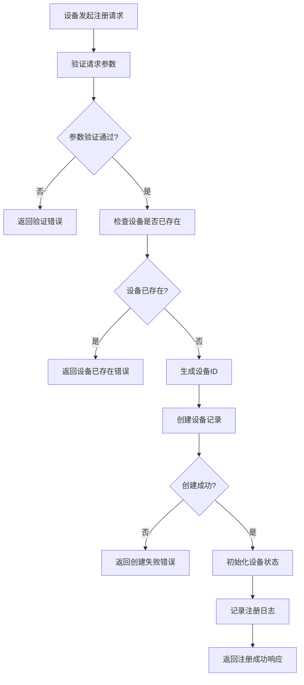
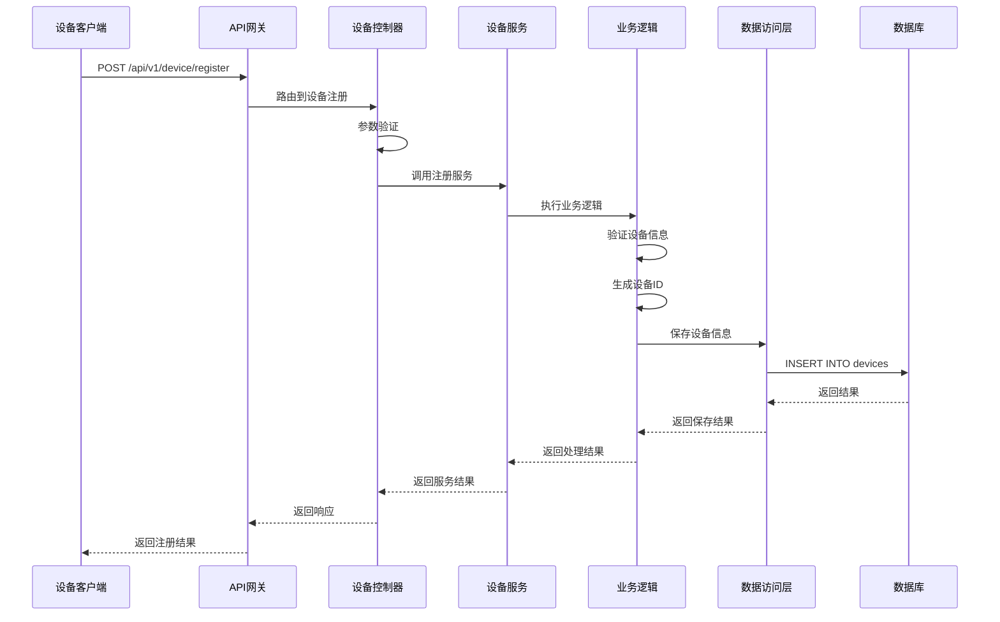

# 设备注册模块需求文档

## 1. 功能描述

设备注册模块是OneGoServer系统的核心功能之一，负责处理各种类型设备的注册请求。该模块支持设备主动注册和被动注册两种模式，确保设备能够安全、可靠地接入系统，并为后续的设备管理、监控和控制提供基础数据支持。

### 1.1 主要功能
- **设备主动注册**：设备通过API主动向系统注册
- **设备信息验证**：验证设备提供的基本信息和配置
- **设备ID生成**：为注册的设备生成唯一标识符
- **设备状态初始化**：设置设备的初始状态为离线
- **设备配置管理**：存储和管理设备的基本配置信息
- **设备白名单管理**：支持设备白名单的添加和移除

### 1.2 支持设备类型
- **server**：服务器设备
- **workstation**：工作站设备  
- **mobile**：移动设备
- **iot**：物联网设备

## 2. 功能目标

### 2.1 业务目标
- 实现设备快速、安全的系统接入
- 建立完整的设备信息档案
- 支持大规模设备并发注册
- 确保设备注册数据的准确性和完整性

### 2.2 技术目标
- 注册响应时间 < 500ms
- 支持1000+设备并发注册
- 数据一致性保证
- 系统可用性 > 99.9%

### 2.3 安全目标
- 防止重复注册
- 防止恶意设备注册
- 保护设备敏感信息
- 支持设备身份验证

## 3. 输入输出说明

### 3.1 输入参数

#### 3.1.1 必需参数
```json
{
  "device_name": "string",     // 设备名称，1-100字符
  "device_type": "string"      // 设备类型：server|workstation|mobile|iot
}
```

#### 3.1.2 可选参数
```json
{
  "device_model": "string",    // 设备型号，1-100字符
  "serial_number": "string",   // 序列号，1-100字符
  "mac_address": "string",     // MAC地址，标准格式
  "ip_address": "string",      // IP地址，标准格式
  "location": "string",        // 位置信息，1-200字符
  "description": "string",     // 设备描述，最大500字符
  "config": "object",          // 设备配置，JSON对象
  "tags": ["string"],          // 设备标签，最多10个
  "owner_id": "string",        // 所有者ID，最大50字符
  "department": "string"       // 部门名称，1-100字符
}
```

### 3.2 输出参数

#### 3.2.1 成功响应
```json
{
  "code": 0,
  "message": "success",
  "data": {
    "device_id": "string",     // 生成的设备ID
    "message": "string"        // 注册成功消息
  }
}
```

#### 3.2.2 错误响应
```json
{
  "code": 400,
  "message": "error message",
  "data": null
}
```

## 4. 涉及接口以及接口设计

### 4.1 API接口定义

#### 4.1.1 设备注册接口
- **路径**：`POST /api/v1/device/device/register`
- **标签**：设备管理
- **摘要**：设备注册

#### 4.1.2 设备白名单管理接口
- **路径**：`POST /api/v1/device/device/whitelist`
- **标签**：设备管理
- **摘要**：管理设备白名单

### 4.2 内部接口

#### 4.2.1 数据验证接口
```go
type ValidateDeviceRegistrationInput struct {
    Name       string
    MacAddress string
    IPAddress  string
    DeviceType string
    Model      string
    Protocol   string
    Port       int
}

type ValidateDeviceRegistrationOutput struct {
    IsValid bool
    Message string
    Errors  []string
}
```

#### 4.2.2 设备创建接口
```go
type CreateDeviceInput struct {
    Device *Device
}

type CreateDeviceOutput struct {
    DeviceId string
    Message  string
}
```

## 5. 数据结构设计

### 5.1 数据库表结构

#### 5.1.1 devices表
```sql
CREATE TABLE devices (
    id BIGINT PRIMARY KEY AUTO_INCREMENT,
    device_id VARCHAR(36) UNIQUE NOT NULL,
    name VARCHAR(100) NOT NULL,
    type VARCHAR(20) NOT NULL,
    model VARCHAR(100),
    board_id VARCHAR(50),
    status VARCHAR(20) DEFAULT 'offline',
    health_score INT DEFAULT 100,
    ip_address VARCHAR(45),
    port INT,
    protocol VARCHAR(10),
    endpoint VARCHAR(255),
    reg_time TIMESTAMP DEFAULT CURRENT_TIMESTAMP,
    metadata TEXT,
    tags TEXT,
    created_at TIMESTAMP DEFAULT CURRENT_TIMESTAMP,
    updated_at TIMESTAMP DEFAULT CURRENT_TIMESTAMP ON UPDATE CURRENT_TIMESTAMP,
    created_by VARCHAR(50),
    updated_by VARCHAR(50)
);
```

### 5.2 模型结构

#### 5.2.1 Device实体
```go
type Device struct {
    Id                   int64       `json:"id"`
    DeviceId             string      `json:"deviceId"`
    Name                 string      `json:"name"`
    Type                 string      `json:"type"`
    Model                string      `json:"model"`
    BoardId              string      `json:"boardId"`
    Status               string      `json:"status"`
    HealthScore          int         `json:"healthScore"`
    IpAddress            string      `json:"ipAddress"`
    Port                 int         `json:"port"`
    Protocol             string      `json:"protocol"`
    Endpoint             string      `json:"endpoint"`
    RegTime              *gtime.Time `json:"regTime"`
    Metadata             string      `json:"metadata"`
    Tags                 string      `json:"tags"`
    CreatedAt            *gtime.Time `json:"createdAt"`
    UpdatedAt            *gtime.Time `json:"updatedAt"`
    CreatedBy            string      `json:"createdBy"`
    UpdatedBy            string      `json:"updatedBy"`
}
```

## 6. 异常处理

### 6.1 输入验证异常
- **设备名称为空**：返回400错误，提示"设备名称不能为空"
- **设备类型无效**：返回400错误，提示"设备类型只能是server,workstation,mobile,iot"
- **设备名称过长**：返回400错误，提示"设备名称长度为1-100字符"
- **MAC地址格式错误**：返回400错误，提示"MAC地址格式不正确"
- **IP地址格式错误**：返回400错误，提示"IP地址格式不正确"

### 6.2 业务逻辑异常
- **设备已存在**：返回409错误，提示"设备已存在"
- **设备ID生成失败**：返回500错误，提示"设备ID生成失败"
- **数据库连接失败**：返回500错误，提示"数据库连接失败"
- **数据保存失败**：返回500错误，提示"设备信息保存失败"

### 6.3 系统异常
- **系统内部错误**：返回500错误，提示"系统内部错误"
- **服务不可用**：返回503错误，提示"服务暂时不可用"

## 7. 交互流程图



## 8. 交互时序图



## 9. 安全与权限

### 9.1 访问控制
- **接口权限**：需要设备注册权限
- **IP白名单**：支持IP地址白名单控制
- **频率限制**：限制注册请求频率，防止恶意注册

### 9.2 数据安全
- **敏感信息加密**：设备密码等敏感信息需要加密存储
- **数据传输安全**：使用HTTPS协议传输数据
- **数据完整性**：使用数据校验确保数据完整性

### 9.3 身份验证
- **设备身份验证**：支持设备证书或Token验证
- **用户身份验证**：支持用户Token验证
- **会话管理**：支持会话超时和自动清理

## 10. 日志与审计要求

### 10.1 操作日志
- **注册操作日志**：记录设备注册的详细信息
- **参数日志**：记录注册请求的参数信息
- **结果日志**：记录注册操作的结果

### 10.2 审计日志
- **用户操作审计**：记录操作用户和时间
- **系统变更审计**：记录系统配置变更
- **安全事件审计**：记录安全相关事件

### 10.3 日志格式
```json
{
  "timestamp": "2024-01-01T00:00:00Z",
  "level": "INFO",
  "service": "device-register",
  "operation": "register_device",
  "device_id": "device-123",
  "user_id": "user-456",
  "ip_address": "192.168.1.100",
  "result": "success",
  "message": "设备注册成功"
}
```

## 11. 测试用例

### 11.1 功能测试用例

#### 11.1.1 正常注册测试
- **测试目标**：验证设备正常注册功能
- **测试数据**：
  ```json
  {
    "device_name": "测试服务器01",
    "device_type": "server",
    "device_model": "Dell PowerEdge R740",
    "ip_address": "192.168.1.100"
  }
  ```
- **预期结果**：返回成功响应，包含生成的设备ID

#### 11.1.2 参数验证测试
- **测试目标**：验证参数验证功能
- **测试数据**：
  ```json
  {
    "device_name": "",
    "device_type": "invalid_type"
  }
  ```
- **预期结果**：返回400错误，包含具体的验证错误信息

#### 11.1.3 重复注册测试
- **测试目标**：验证重复注册处理
- **测试步骤**：
  1. 注册设备A
  2. 使用相同信息再次注册设备A
- **预期结果**：第二次注册返回409错误

### 11.2 性能测试用例

#### 11.2.1 并发注册测试
- **测试目标**：验证并发注册性能
- **测试场景**：100个并发请求同时注册设备
- **预期结果**：所有请求在5秒内完成，成功率>95%

#### 11.2.2 响应时间测试
- **测试目标**：验证注册响应时间
- **测试场景**：单个注册请求
- **预期结果**：响应时间<500ms

### 11.3 安全测试用例

#### 11.3.1 SQL注入测试
- **测试目标**：验证SQL注入防护
- **测试数据**：在设备名称中包含SQL注入代码
- **预期结果**：系统正确过滤恶意代码

#### 11.3.2 权限验证测试
- **测试目标**：验证权限控制
- **测试场景**：无权限用户尝试注册设备
- **预期结果**：返回403权限不足错误

### 11.4 异常测试用例

#### 11.4.1 数据库连接异常测试
- **测试目标**：验证数据库异常处理
- **测试场景**：模拟数据库连接失败
- **预期结果**：返回500错误，记录详细错误日志

#### 11.4.2 网络异常测试
- **测试目标**：验证网络异常处理
- **测试场景**：模拟网络超时
- **预期结果**：返回超时错误，支持重试机制