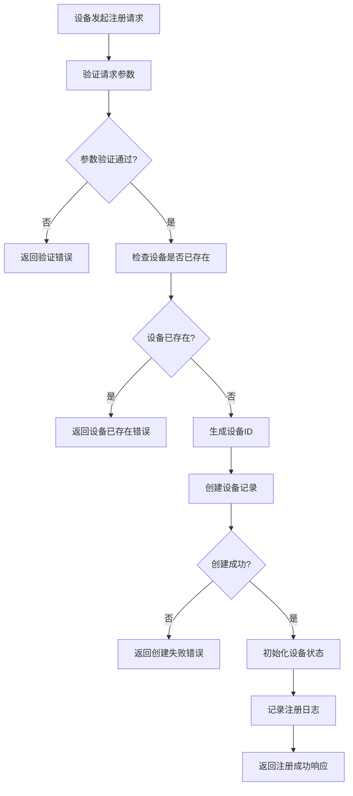
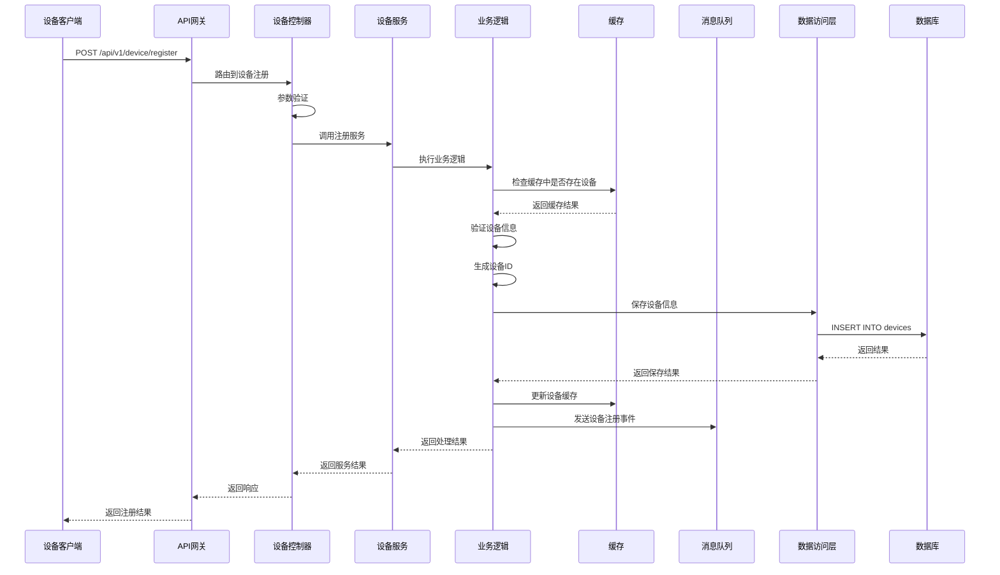

# 设备注册模块需求文档

## 1. 功能描述

设备注册模块是OneGoServer系统的核心功能之一，负责处理各种类型设备的注册请求。该模块支持设备主动注册和被动注册两种模式，确保设备能够安全、可靠地接入系统，并为后续的设备管理、监控和控制提供基础数据支持。

### 1.1 主要功能
- **设备主动注册**：设备通过API主动向系统注册
- **设备信息验证**：验证设备提供的基本信息和配置
- **设备ID生成**：为注册的设备生成唯一标识符
- **设备状态初始化**：设置设备的初始状态为离线
- **设备配置管理**：存储和管理设备的基本配置信息
- **设备白名单管理**：支持设备白名单的添加和移除

### 1.2 支持设备类型
- **server**：服务器设备
- **workstation**：工作站设备  
- **mobile**：移动设备
- **iot**：物联网设备

## 2. 功能目标

### 2.1 业务目标
- 实现设备快速、安全的系统接入
- 建立完整的设备信息档案
- 支持大规模设备并发注册
- 确保设备注册数据的准确性和完整性

### 2.2 技术目标
- 注册响应时间 < 500ms
- 支持1000+设备并发注册
- 数据一致性保证
- 系统可用性 > 99.9%

### 2.3 安全目标
- 防止重复注册
- 防止恶意设备注册
- 保护设备敏感信息
- 支持设备身份验证

## 3. 输入输出说明

### 3.1 输入参数

#### 3.1.1 必需参数
```json
{
  "device_name": "string",     // 设备名称，1-100字符
  "device_type": "string"      // 设备类型：server|workstation|mobile|iot
}
```

#### 3.1.2 可选参数
```json
{
  "device_model": "string",    // 设备型号，1-100字符
  "serial_number": "string",   // 序列号，1-100字符
  "mac_address": "string",     // MAC地址，标准格式
  "ip_address": "string",      // IP地址，标准格式
  "location": "string",        // 位置信息，1-200字符
  "description": "string",     // 设备描述，最大500字符
  "config": "object",          // 设备配置，JSON对象
  "tags": ["string"],          // 设备标签，最多10个
  "owner_id": "string",        // 所有者ID，最大50字符
  "department": "string"       // 部门名称，1-100字符
}
```

### 3.2 输出参数

#### 3.2.1 成功响应
```json
{
  "code": 0,
  "message": "success",
  "data": {
    "device_id": "string",     // 生成的设备ID
    "message": "string"        // 注册成功消息
  }
}
```

#### 3.2.2 错误响应
```json
{
  "code": 400,
  "message": "error message",
  "data": null
}
```

## 4. 涉及接口以及接口设计

### 4.1 API接口定义

#### 4.1.1 设备注册接口
- **路径**：`POST /api/v1/device/device/register`
- **标签**：设备管理
- **摘要**：设备注册

#### 4.1.2 设备白名单管理接口
- **路径**：`POST /api/v1/device/device/whitelist`
- **标签**：设备管理
- **摘要**：管理设备白名单

### 4.2 内部接口

#### 4.2.1 数据验证接口
```go
type ValidateDeviceRegistrationInput struct {
    Name       string
    MacAddress string
    IPAddress  string
    DeviceType string
    Model      string
    Protocol   string
    Port       int
}

type ValidateDeviceRegistrationOutput struct {
    IsValid bool
    Message string
    Errors  []string
}
```

#### 4.2.2 设备创建接口
```go
type CreateDeviceInput struct {
    Device *Device
}

type CreateDeviceOutput struct {
    DeviceId string
    Message  string
}
```

## 5. 数据结构设计

### 5.1 数据库表结构

#### 5.1.1 devices表
```sql
CREATE TABLE devices (
    id BIGINT PRIMARY KEY AUTO_INCREMENT,
    device_id VARCHAR(36) UNIQUE NOT NULL,
    name VARCHAR(100) NOT NULL,
    type VARCHAR(20) NOT NULL,
    model VARCHAR(100),
    board_id VARCHAR(50),
    status VARCHAR(20) DEFAULT 'offline',
    health_score INT DEFAULT 100,
    ip_address VARCHAR(45),
    port INT,
    protocol VARCHAR(10),
    endpoint VARCHAR(255),
    reg_time TIMESTAMP DEFAULT CURRENT_TIMESTAMP,
    metadata TEXT,
    tags TEXT,
    created_at TIMESTAMP DEFAULT CURRENT_TIMESTAMP,
    updated_at TIMESTAMP DEFAULT CURRENT_TIMESTAMP ON UPDATE CURRENT_TIMESTAMP,
    created_by VARCHAR(50),
    updated_by VARCHAR(50)
);
```

### 5.2 模型结构

#### 5.2.1 Device实体
```go
type Device struct {
    Id                   int64       `json:"id"`
    DeviceId             string      `json:"deviceId"`
    Name                 string      `json:"name"`
    Type                 string      `json:"type"`
    Model                string      `json:"model"`
    BoardId              string      `json:"boardId"`
    Status               string      `json:"status"`
    HealthScore          int         `json:"healthScore"`
    IpAddress            string      `json:"ipAddress"`
    Port                 int         `json:"port"`
    Protocol             string      `json:"protocol"`
    Endpoint             string      `json:"endpoint"`
    RegTime              *gtime.Time `json:"regTime"`
    Metadata             string      `json:"metadata"`
    Tags                 string      `json:"tags"`
    CreatedAt            *gtime.Time `json:"createdAt"`
    UpdatedAt            *gtime.Time `json:"updatedAt"`
    CreatedBy            string      `json:"createdBy"`
    UpdatedBy            string      `json:"updatedBy"`
}
```

## 6. 异常处理

### 6.1 输入验证异常
- **设备名称为空**：返回400错误，提示"设备名称不能为空"
- **设备类型无效**：返回400错误，提示"设备类型只能是server,workstation,mobile,iot"
- **设备名称过长**：返回400错误，提示"设备名称长度为1-100字符"
- **MAC地址格式错误**：返回400错误，提示"MAC地址格式不正确"
- **IP地址格式错误**：返回400错误，提示"IP地址格式不正确"

### 6.2 业务逻辑异常
- **设备已存在**：返回409错误，提示"设备已存在"
- **设备ID生成失败**：返回500错误，提示"设备ID生成失败"
- **数据库连接失败**：返回500错误，提示"数据库连接失败"
- **数据保存失败**：返回500错误，提示"设备信息保存失败"

### 6.3 系统异常
- **系统内部错误**：返回500错误，提示"系统内部错误"
- **服务不可用**：返回503错误，提示"服务暂时不可用"

## 7. 交互流程图



## 8. 交互时序图



## 8.1 详细数据流程描述

### 8.1.1 Controller层实现描述

**DeviceController.RegisterDevice()** 控制器是设备注册的入口点，负责处理HTTP请求和响应：

1. **HTTP请求解析**
   - 接收POST请求：`/api/v1/device/device/register`
   - 解析HTTP Header，获取认证信息（Token、User-Agent等）
   - 解析HTTP Body，提取设备注册参数
   - 获取客户端IP地址和请求时间戳

2. **参数验证与预处理**
   - 检查必需参数：设备名称不能为空，长度1-100字符
   - 验证设备类型：只允许server、workstation、mobile、iot四种类型
   - 格式验证：MAC地址格式（XX:XX:XX:XX:XX:XX），IP地址格式（IPv4/IPv6）
   - 可选参数验证：序列号、位置信息、描述等字段长度限制

3. **权限验证**
   - 验证用户Token有效性
   - 检查用户是否具有设备注册权限
   - 验证IP地址是否在白名单中（如果配置了IP白名单）
   - 检查注册频率限制，防止恶意大量注册

4. **Service层调用**
   - 构造Service层所需的输入参数
   - 调用DeviceService.RegisterDevice()方法
   - 处理Service层返回的结果和异常

5. **响应构造与返回**
   - 根据业务处理结果构造HTTP响应
   - 设置正确的HTTP状态码
   - 记录Controller层操作日志
   - 返回标准化的JSON响应格式

### 8.1.2 Logic层步骤详细描述

**DeviceLogic.RegisterDevice()** 是核心业务逻辑处理层，包含以下详细步骤：

#### 步骤1：缓存检查
- 根据设备名称查询缓存：使用"device:name:{设备名称}"作为缓存键
- 根据MAC地址查询缓存：使用"device:mac:{MAC地址}"作为缓存键  
- 缓存命中处理：如果缓存中存在相同设备名称或MAC地址，直接返回"设备已存在"错误
- 缓存未命中：继续执行数据库查重验证流程

#### 步骤2：数据库查重验证
- 设备名称查重：在devices表中查询是否存在相同name的记录
- MAC地址查重：在devices表中查询是否存在相同mac_address的记录
- 查询结果处理：
  - 如果发现重复记录，将查询结果写入缓存（TTL=24小时），返回"设备已存在"错误
  - 如果未发现重复记录，继续后续流程
  - 如果查询异常，记录错误日志并返回数据库异常错误

#### 步骤3：业务规则验证
- 设备类型限制：检查设备类型是否在系统允许的范围内（server、workstation、mobile、iot）
- 部门设备数量限制：如果指定了部门，检查该部门当前设备数量是否超过配置的上限
- IP地址段限制：检查IP地址是否在系统配置的允许网络段内
- 设备标签限制：检查设备标签数量和内容是否符合规范（最多10个标签）
- 所有者权限验证：检查指定的设备所有者是否有效且有权限

#### 步骤4：设备ID生成
**主方案：基于设备类型的有序ID**
- 根据设备类型获取前缀：server→SRV、workstation→WKS、mobile→MOB、iot→IOT
- 从Redis获取该设备类型的下一个序列号（自增）
- 组合生成设备ID：{前缀}{10位序列号}，如SRV0000000001

**备选方案：UUID生成**
- 使用UUID算法生成全局唯一标识符
- 适用于分布式环境下的设备ID生成

**唯一性验证**
- 在devices表中检查生成的设备ID是否已存在
- 如果存在冲突，重新生成直到获得唯一ID

#### 步骤5：设备数据构造
**基础字段设置**
- 设备ID：使用步骤4生成的唯一设备ID
- 设备基本信息：名称、类型、型号、序列号等
- 设备状态：初始状态设置为"offline"（离线）
- 健康分数：初始值设置为100（满分）

**网络信息设置**
- IP地址、端口、协议等网络连接信息
- 生成设备访问端点地址（endpoint）

**时间戳设置**
- 注册时间（reg_time）：当前时间
- 创建时间（created_at）：当前时间  
- 更新时间（updated_at）：当前时间

**可选字段处理**
- 设备配置：将JSON格式的配置信息序列化存储到metadata字段
- 设备标签：将标签数组序列化存储到tags字段
- 操作人信息：记录创建人和更新人ID

#### 步骤6：数据库事务处理
**事务开始**
- 开启数据库事务，确保所有操作的原子性

**主表插入**
- 在devices表中插入设备基本信息记录

**关联表操作**
- 如果有设备配置信息，在device_configs表中插入配置记录（版本号=1）
- 在device_stats表中更新对应设备类型的统计计数（+1）
- 在device_history表中插入设备注册历史记录（action="register"）

**事务提交/回滚**
- 如果所有操作成功，提交事务
- 如果任一操作失败，自动回滚事务，确保数据一致性

#### 步骤7：缓存更新
**设备信息缓存**
- 使用"device:id:{设备ID}"作为键，缓存完整的设备信息（TTL=24小时）
- 使用"device:name:{设备名称}"作为键，缓存设备信息用于查重（TTL=24小时）
- 如果有MAC地址，使用"device:mac:{MAC地址}"作为键缓存设备信息（TTL=24小时）

**列表缓存失效**
- 删除全量设备列表缓存："device:list:all"
- 删除按设备类型的列表缓存："device:list:type:{设备类型}"
- 删除按部门的列表缓存："device:list:department:{部门}"

**容错处理**
- 缓存更新失败不影响主流程，仅记录错误日志
- 采用异步更新机制，避免影响响应时间

#### 步骤8：消息队列通知
**设备注册事件**
- 队列名称：device.register
- 事件内容：设备ID、设备名称、设备类型、IP地址、注册时间、操作人ID
- 消费者：邮件通知服务、设备统计服务

**设备监控事件**
- 队列名称：device.monitor  
- 事件内容：设备ID、事件类型（device_registered）、时间戳
- 消费者：监控服务、告警服务

**设备通知事件**
- 队列名称：device.notification
- 事件内容：通知类型、接收人、设备信息、模板参数
- 消费者：通知服务（邮件、短信、钉钉等）

**容错机制**
- 消息发送失败不影响设备注册主流程
- 记录发送失败的错误日志，用于后续排查
- 支持消息重试机制和死信队列处理

### 8.1.3 数据访问层操作描述

**DeviceDAO** 数据访问层负责具体的数据库操作：

#### 数据库连接管理
- **读写分离架构**：主库负责写操作，从库负责读操作
- **连接池管理**：设置合理的最大连接数和空闲连接数
- **连接选择策略**：根据操作类型（读/写）自动选择对应的数据库连接

#### 主要数据库操作
**设备查重查询**
- 按设备名称查询：在从库执行SELECT查询，避免影响主库性能
- 按MAC地址查询：检查MAC地址是否已被其他设备注册
- 查询优化：为name和mac_address字段创建索引，提升查询效率

**设备创建操作**
- 单设备创建：在主库执行INSERT操作
- 批量设备创建：支持批量插入操作，提升性能
- 数据验证：在数据库层面进行数据完整性检查

**事务处理框架**
- 自动事务管理：支持声明式事务，自动处理提交和回滚
- 事务隔离级别：使用READ_COMMITTED隔离级别，平衡一致性和性能
- 死锁处理：实现死锁检测和自动重试机制

### 8.1.4 缓存策略说明

#### 缓存层次结构
- **L1缓存**：本地内存缓存（1分钟TTL）
- **L2缓存**：Redis分布式缓存（24小时TTL）
- **L3缓存**：数据库查询缓存

#### 缓存Key设计
- **设备信息缓存**：
  - 按设备ID：`device:id:{设备ID}` → 设备完整信息
  - 按设备名称：`device:name:{设备名称}` → 设备信息（用于查重）
  - 按MAC地址：`device:mac:{MAC地址}` → 设备信息（用于查重）
- **设备列表缓存**：
  - 全量列表：`device:list:all` → 所有设备列表
  - 按类型：`device:list:type:{设备类型}` → 该类型设备列表
  - 按部门：`device:list:department:{部门}` → 该部门设备列表
- **设备统计缓存**：
  - 按类型统计：`device:stats:type:{设备类型}` → 该类型设备数量
  - 全局统计：`device:stats:global` → 全局设备统计信息

### 8.1.5 消息队列处理

#### 队列设计
- **设备注册队列**：`device.register`
- **设备监控队列**：`device.monitor`
- **设备通知队列**：`device.notification`

#### 消息处理器
**设备注册事件处理器**
- 发送邮件通知：通知设备管理员设备注册成功
- 更新设备统计：更新对应设备类型的统计数量
- 触发设备监控初始化：为新注册设备启动健康检查监控
- 同步到外部系统：如CMDB、资产管理系统等

**消息处理策略**
- 异步处理：所有消息处理都采用异步方式，不阻塞主流程
- 重试机制：消息处理失败时支持自动重试（最多3次）
- 死信处理：重试失败的消息转移到死信队列，人工处理
- 幂等性保证：确保消息重复消费不会产生副作用

## 9. 安全与权限

### 9.1 访问控制
- **接口权限**：需要设备注册权限
- **IP白名单**：支持IP地址白名单控制
- **频率限制**：限制注册请求频率，防止恶意注册

### 9.2 数据安全
- **敏感信息加密**：设备密码等敏感信息需要加密存储
- **数据传输安全**：使用HTTPS协议传输数据
- **数据完整性**：使用数据校验确保数据完整性

### 9.3 身份验证
- **设备身份验证**：支持设备证书或Token验证
- **用户身份验证**：支持用户Token验证
- **会话管理**：支持会话超时和自动清理

## 10. 日志与审计要求

### 10.1 操作日志
- **注册操作日志**：记录设备注册的详细信息
- **参数日志**：记录注册请求的参数信息
- **结果日志**：记录注册操作的结果

### 10.2 审计日志
- **用户操作审计**：记录操作用户和时间
- **系统变更审计**：记录系统配置变更
- **安全事件审计**：记录安全相关事件

### 10.3 日志格式
```json
{
  "timestamp": "2024-01-01T00:00:00Z",
  "level": "INFO",
  "service": "device-register",
  "operation": "register_device",
  "device_id": "device-123",
  "user_id": "user-456",
  "ip_address": "192.168.1.100",
  "result": "success",
  "message": "设备注册成功"
}
```

## 11. 测试用例

### 11.1 功能测试用例

#### 11.1.1 正常注册测试
- **测试目标**：验证设备正常注册功能
- **测试数据**：
  ```json
  {
    "device_name": "测试服务器01",
    "device_type": "server",
    "device_model": "Dell PowerEdge R740",
    "ip_address": "192.168.1.100"
  }
  ```
- **预期结果**：返回成功响应，包含生成的设备ID

#### 11.1.2 参数验证测试
- **测试目标**：验证参数验证功能
- **测试数据**：
  ```json
  {
    "device_name": "",
    "device_type": "invalid_type"
  }
  ```
- **预期结果**：返回400错误，包含具体的验证错误信息

#### 11.1.3 重复注册测试
- **测试目标**：验证重复注册处理
- **测试步骤**：
  1. 注册设备A
  2. 使用相同信息再次注册设备A
- **预期结果**：第二次注册返回409错误

### 11.2 性能测试用例

#### 11.2.1 并发注册测试
- **测试目标**：验证并发注册性能
- **测试场景**：100个并发请求同时注册设备
- **预期结果**：所有请求在5秒内完成，成功率>95%

#### 11.2.2 响应时间测试
- **测试目标**：验证注册响应时间
- **测试场景**：单个注册请求
- **预期结果**：响应时间<500ms

### 11.3 安全测试用例

#### 11.3.1 SQL注入测试
- **测试目标**：验证SQL注入防护
- **测试数据**：在设备名称中包含SQL注入代码
- **预期结果**：系统正确过滤恶意代码

#### 11.3.2 权限验证测试
- **测试目标**：验证权限控制
- **测试场景**：无权限用户尝试注册设备
- **预期结果**：返回403权限不足错误

### 11.4 异常测试用例

#### 11.4.1 数据库连接异常测试
- **测试目标**：验证数据库异常处理
- **测试场景**：模拟数据库连接失败
- **预期结果**：返回500错误，记录详细错误日志

#### 11.4.2 网络异常测试
- **测试目标**：验证网络异常处理
- **测试场景**：模拟网络超时
- **预期结果**：返回超时错误，支持重试机制