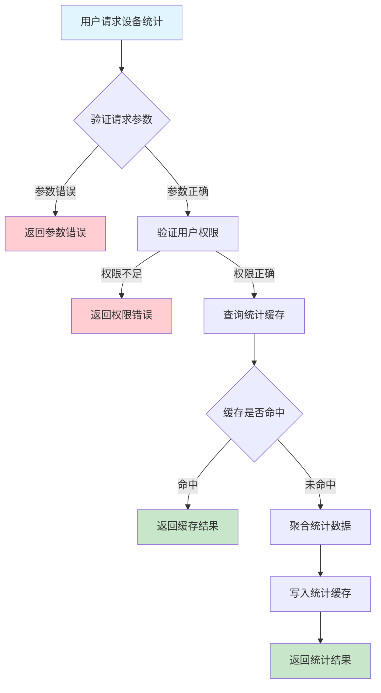
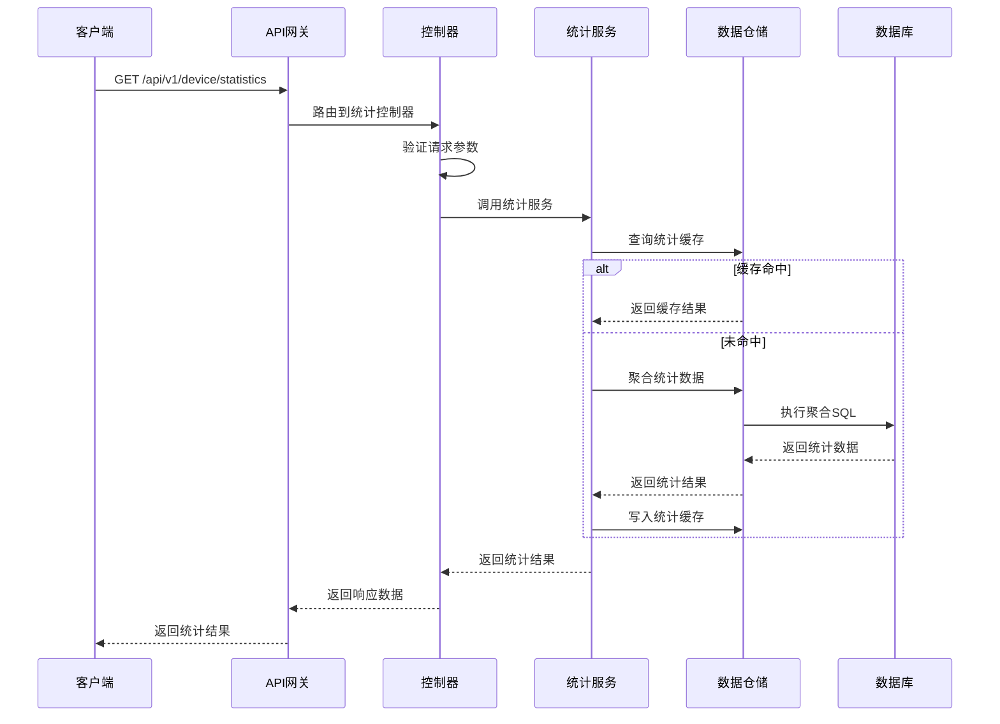

# 设备统计需求文档

## 1. 功能描述

### 1.1 功能概述
设备统计功能用于对设备的各类运行数据、状态、分布、告警、任务等进行统计分析，支持多维度、多周期的统计报表，便于管理者掌握设备整体运行状况。

### 1.2 主要功能列表
- 设备总数、在线/离线数统计
- 设备分组/类型/区域分布统计
- 设备告警统计
- 设备任务统计
- 设备活跃度统计
- 支持按天/周/月/自定义周期统计

### 1.3 支持的功能特性
- 多维度统计（状态、类型、分组、区域等）
- 多周期统计
- 支持导出统计报表
- 支持图表化展示

## 2. 功能目标

### 2.1 业务目标
- 提供设备全局运行视图
- 支持运维决策与资源优化
- 提高设备管理效率

### 2.2 技术目标
- 高效大数据量统计
- 支持灵活多维度聚合
- 统计结果实时性保障

### 2.3 安全目标
- 统计数据权限隔离
- 防止敏感数据泄露
- 统计操作可审计

## 3. 输入输出说明

### 3.1 输入参数

#### 3.1.1 必需参数
- `dimension` (string): 统计维度（status/type/group/region/alarm/task等）
- `period` (string): 统计周期（day/week/month/custom）

#### 3.1.2 可选参数
- `start_time` (string): 自定义周期起始时间
- `end_time` (string): 自定义周期结束时间
- `group_id` (string): 分组ID
- `region` (string): 区域

### 3.2 输出参数

#### 3.2.1 成功响应
```json
{
  "code": 200,
  "message": "success",
  "data": {
    "dimension": "status",
    "period": "day",
    "statistics": [
      {"key": "online", "count": 120},
      {"key": "offline", "count": 30}
    ],
    "generated_at": "2024-01-15T16:00:00Z"
  }
}
```

#### 3.2.2 错误响应
```json
{
  "code": 400,
  "message": "参数错误或操作不允许",
  "data": null
}
```

### 3.3 参数格式和约束
- 维度：status/type/group/region/alarm/task
- 周期：day/week/month/custom
- 时间：ISO 8601格式

## 4. 涉及接口以及接口设计

### 4.1 API接口定义

#### 4.1.1 获取设备统计
```go
// 获取设备统计
GET /api/v1/device/statistics
```

**请求参数：**
- Query参数：dimension, period, start_time, end_time, group_id, region

**响应结构：**
```go
type DeviceStatisticsResponse struct {
    Code    int    `json:"code"`
    Message string `json:"message"`
    Data    struct {
        Dimension   string         `json:"dimension"`
        Period      string         `json:"period"`
        Statistics  []StatisticKV  `json:"statistics"`
        GeneratedAt string         `json:"generated_at"`
    } `json:"data"`
}

type StatisticKV struct {
    Key   string `json:"key"`
    Count int    `json:"count"`
}
```

### 4.2 内部接口设计

#### 4.2.1 统计服务接口
```go
type DeviceStatisticsService interface {
    GetStatistics(ctx context.Context, req *StatisticsRequest) (*DeviceStatisticsResponse, error)
}
```

#### 4.2.2 统计仓储接口
```go
type DeviceStatisticsRepository interface {
    Aggregate(ctx context.Context, dimension, period string, filter map[string]interface{}) ([]StatisticKV, error)
}
```

## 5. 数据结构设计

### 5.1 数据库表结构
- 复用 device、device_alarm、device_task 等表
- 可新增 device_statistics_cache 表用于统计缓存

#### 5.1.1 统计缓存表 (device_statistics_cache)
```sql
CREATE TABLE device_statistics_cache (
    id BIGINT AUTO_INCREMENT PRIMARY KEY COMMENT '主键',
    dimension VARCHAR(32) NOT NULL COMMENT '统计维度',
    period VARCHAR(16) NOT NULL COMMENT '统计周期',
    statistics JSON NOT NULL COMMENT '统计结果',
    generated_at TIMESTAMP DEFAULT CURRENT_TIMESTAMP COMMENT '生成时间',
    INDEX idx_dimension_period (dimension, period)
) ENGINE=InnoDB DEFAULT CHARSET=utf8mb4 COMMENT='设备统计缓存表';
```

### 5.2 模型结构定义
```go
type StatisticsRequest struct {
    Dimension  string `json:"dimension" v:"required"`
    Period     string `json:"period" v:"required"`
    StartTime  string `json:"start_time"`
    EndTime    string `json:"end_time"`
    GroupID    string `json:"group_id"`
    Region     string `json:"region"`
}

type StatisticKV struct {
    Key   string `json:"key"`
    Count int    `json:"count"`
}
```

### 5.3 数据关系说明
- 统计数据与设备、告警、任务等表关联
- 支持多维度聚合

## 6. 异常处理

### 6.1 输入验证异常
- 维度/周期为空或不支持
- 时间格式错误

### 6.2 业务逻辑异常
- 统计范围无数据
- 权限不足

### 6.3 系统异常
- 数据库连接失败
- 统计超时
- 系统资源不足

## 7. 交互流程图



## 8. 交互时序图



## 9. 安全与权限

### 9.1 访问控制策略
- 需要用户身份验证
- 验证用户对统计数据的访问权限
- 支持基于角色的访问控制(RBAC)
- 记录所有统计操作

### 9.2 数据安全要求
- 敏感数据脱敏
- 统计结果加密存储
- 支持数据访问审计
- 防止SQL注入

### 9.3 身份验证机制
- JWT令牌
- API密钥
- 请求频率限制
- IP白名单

## 10. 日志与审计要求

### 10.1 操作日志要求
- 记录所有统计操作
- 记录参数和结果
- 记录操作人员身份
- 记录操作时间和IP

### 10.2 审计日志要求
- 记录统计访问轨迹
- 记录身份和权限
- 记录访问目的
- 支持长期保存

### 10.3 日志格式规范
```json
{
  "timestamp": "2024-01-15T16:00:00Z",
  "level": "INFO",
  "service": "device-statistics",
  "operation": "get_statistics",
  "user_id": "user_001",
  "parameters": {
    "dimension": "status",
    "period": "day"
  },
  "result": {
    "statistics": [
      {"key": "online", "count": 120},
      {"key": "offline", "count": 30}
    ]
  }
}
```

## 11. 测试用例

### 11.1 功能测试用例

#### 11.1.1 设备状态统计测试
**测试场景：** 按状态统计设备
**输入数据：**
```json
{
  "dimension": "status",
  "period": "day"
}
```
**预期结果：**
- 返回状态码：200
- 返回各状态设备数量

#### 11.1.2 设备分组统计测试
**测试场景：** 按分组统计设备
**输入数据：**
```json
{
  "dimension": "group",
  "period": "week"
}
```
**预期结果：**
- 返回状态码：200
- 返回各分组设备数量

### 11.2 性能测试用例

#### 11.2.1 大量设备统计测试
**测试场景：** 统计10万台设备
**预期结果：**
- 响应时间 < 2秒
- 错误率 < 1%

### 11.3 安全测试用例

#### 11.3.1 权限验证测试
**测试场景：** 验证用户统计访问权限
**测试数据：**
- 用户A：有权限
- 用户B：无权限
**预期结果：**
- 用户A：成功获取统计
- 用户B：返回权限错误

#### 11.3.2 敏感数据脱敏测试
**测试场景：** 敏感数据脱敏
**输入数据：**
```json
{
  "dimension": "region",
  "period": "month"
}
```
**预期结果：**
- 敏感字段脱敏
- 不影响统计准确性

### 11.4 异常测试用例

#### 11.4.1 参数错误测试
**测试场景：** 参数错误
**输入数据：**
```json
{
  "dimension": "invalid",
  "period": "day"
}
```
**预期结果：**
- 返回参数验证错误
- 状态码400

#### 11.4.2 统计范围无数据测试
**测试场景：** 统计范围无数据
**输入数据：**
```json
{
  "dimension": "status",
  "period": "day",
  "group_id": "non_existent_group"
}
```
**预期结果：**
- 返回200
- 统计结果为空

#### 11.4.3 系统异常测试
**测试场景：** 数据库连接失败
**测试方法：** 临时关闭数据库
**预期结果：**
- 返回500
- 记录详细错误日志 