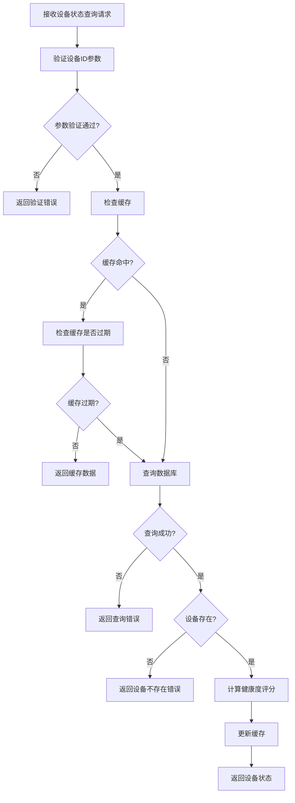
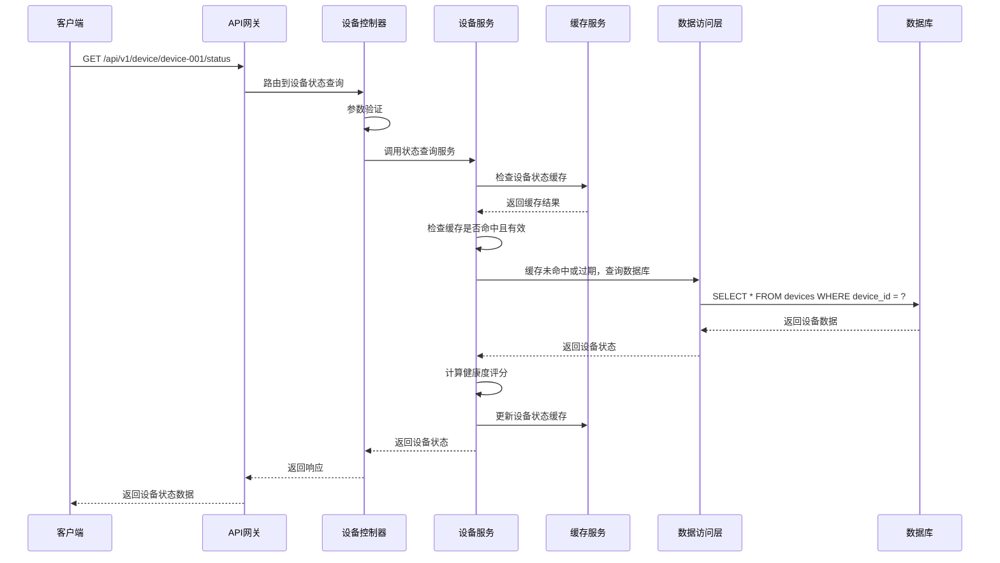

# 设备状态查询模块需求文档

## 1. 功能描述

设备状态查询模块是OneGoServer系统的核心监控功能，负责提供设备的实时状态信息查询服务。该模块不仅返回设备的基本状态，还包含设备的健康度评分、在线时长、运行时间等详细信息，为用户提供全面的设备运行状态视图。

### 1.1 主要功能
- **设备状态查询**：获取设备的当前运行状态
- **健康度评分查询**：获取设备的健康度评分
- **在线时长统计**：获取设备的在线时长统计
- **运行时间查询**：获取设备的运行时间信息
- **状态历史查询**：获取设备状态变更历史
- **实时状态监控**：提供设备状态的实时监控

### 1.2 支持状态类型
- **online**：设备在线，正常运行
- **offline**：设备离线，无法连接
- **maintenance**：设备维护中，暂停服务
- **error**：设备错误，需要处理

## 2. 功能目标

### 2.1 业务目标
- 提供设备运行状态的实时查询服务
- 支持设备健康度的评估和监控
- 为设备管理和维护提供状态依据
- 支持设备故障的快速识别

### 2.2 技术目标
- 状态查询响应时间 < 50ms
- 支持实时状态更新
- 状态数据一致性保证
- 高效的状态缓存机制

### 2.3 监控目标
- 设备状态实时可见
- 健康度趋势分析
- 异常状态快速告警
- 状态变更历史追踪

## 3. 输入输出说明

### 3.1 输入参数

#### 3.1.1 路径参数
```json
{
  "deviceId": "string"  // 设备ID，必填，不能为空
}
```

### 3.2 输出参数

#### 3.2.1 成功响应
```json
{
  "code": 0,
  "message": "success",
  "data": {
    "device_id": "device-001",
    "status": "online",
    "health_score": 95,
    "last_online_time": "2024-01-01T15:30:00Z",
    "last_offline_time": "2024-01-01T10:00:00Z",
    "total_online_duration": 86400,
    "uptime_hours": 24.5
  }
}
```

#### 3.2.2 错误响应
```json
{
  "code": 404,
  "message": "设备不存在",
  "data": null
}
```

## 4. 涉及接口以及接口设计

### 4.1 API接口定义

#### 4.1.1 设备状态查询接口
- **路径**：`GET /api/v1/device/device/{deviceId}/status`
- **标签**：设备状态
- **摘要**：获取设备状态

### 4.2 内部接口

#### 4.2.1 设备状态查询接口
```go
type GetDeviceStatusInput struct {
    DeviceID string
}

type GetDeviceStatusOutput struct {
    DeviceID            string
    Status              string
    HealthScore         int
    LastOnlineTime      *gtime.Time
    LastOfflineTime     *gtime.Time
    TotalOnlineDuration int64
    UptimeHours         float64
}
```

#### 4.2.2 状态计算接口
```go
type CalculateDeviceHealthInput struct {
    DeviceID string
}

type CalculateDeviceHealthOutput struct {
    HealthScore float64
    Components  map[string]interface{}
}
```

## 5. 数据结构设计

### 5.1 数据库查询结构

#### 5.1.1 基础状态查询SQL
```sql
SELECT 
    device_id, status, health_score, last_online_time, 
    last_offline_time, total_online_duration, uptime_hours
FROM devices 
WHERE device_id = ? AND deleted_at IS NULL
```

#### 5.1.2 状态历史查询SQL
```sql
SELECT 
    device_id, status, health_score, created_at
FROM device_status_history 
WHERE device_id = ? 
ORDER BY created_at DESC 
LIMIT 100
```

### 5.2 缓存结构

#### 5.2.1 设备状态缓存
```go
type DeviceStatusCache struct {
    DeviceID            string    // 设备ID
    Status              string    // 设备状态
    HealthScore         int       // 健康度评分
    LastOnlineTime      time.Time // 最后在线时间
    LastOfflineTime     time.Time // 最后离线时间
    TotalOnlineDuration int64     // 总在线时长
    UptimeHours         float64   // 运行时长
    LastUpdate          time.Time // 最后更新时间
    ExpireAt            time.Time // 过期时间
}
```

## 6. 异常处理

### 6.1 输入验证异常
- **设备ID为空**：返回400错误，提示"设备ID不能为空"
- **设备ID格式错误**：返回400错误，提示"设备ID格式不正确"

### 6.2 业务逻辑异常
- **设备不存在**：返回404错误，提示"设备不存在"
- **设备已删除**：返回404错误，提示"设备已删除"
- **权限不足**：返回403错误，提示"权限不足，无法查看设备状态"

### 6.3 系统异常
- **数据库连接失败**：返回500错误，提示"数据库连接失败"
- **状态计算失败**：返回500错误，提示"状态计算失败"
- **缓存服务异常**：返回500错误，提示"缓存服务异常"

## 7. 交互流程图



## 8. 交互时序图



## 9. 安全与权限

### 9.1 访问控制
- **接口权限**：需要设备查询权限
- **数据权限**：根据用户权限过滤可查看的设备状态
- **状态权限**：根据用户权限决定可查看的状态信息

### 9.2 数据安全
- **状态数据保护**：保护设备状态数据不被未授权访问
- **查询审计**：记录设备状态查询操作
- **数据脱敏**：对敏感状态信息进行脱敏处理

### 9.3 查询安全
- **设备ID验证**：验证设备ID的有效性
- **查询频率限制**：限制状态查询请求频率
- **数据权限验证**：验证用户是否有权限查看该设备状态

## 10. 日志与审计要求

### 10.1 查询日志
- **状态查询日志**：记录设备状态查询的详细信息
- **访问日志**：记录用户访问设备状态的行为
- **权限日志**：记录权限验证的结果

### 10.2 性能日志
- **查询耗时日志**：记录查询执行时间
- **缓存命中率日志**：记录缓存命中情况
- **数据库性能日志**：记录数据库查询性能

### 10.3 日志格式
```json
{
  "timestamp": "2024-01-01T00:00:00Z",
  "level": "INFO",
  "service": "device-status",
  "operation": "get_device_status",
  "device_id": "device-001",
  "user_id": "user-123",
  "ip_address": "192.168.1.100",
  "result": "success",
  "duration_ms": 30,
  "cache_hit": true,
  "status": "online",
  "health_score": 95
}
```

## 11. 测试用例

### 11.1 功能测试用例

#### 11.1.1 正常状态查询测试
- **测试目标**：验证设备状态正常查询功能
- **测试数据**：
  ```
  GET /api/v1/device/device-001/status
  ```
- **预期结果**：返回设备device-001的完整状态信息

#### 11.1.2 设备不存在测试
- **测试目标**：验证设备不存在时的处理
- **测试数据**：
  ```
  GET /api/v1/device/non-existent-device/status
  ```
- **预期结果**：返回404错误，提示"设备不存在"

#### 11.1.3 参数验证测试
- **测试目标**：验证参数验证功能
- **测试数据**：
  ```
  GET /api/v1/device//status
  ```
- **预期结果**：返回400错误，提示"设备ID不能为空"

#### 11.1.4 权限验证测试
- **测试目标**：验证权限控制功能
- **测试场景**：无权限用户尝试查询设备状态
- **预期结果**：返回403错误，提示"权限不足"

### 11.2 性能测试用例

#### 11.2.1 查询响应时间测试
- **测试目标**：验证查询响应时间
- **测试场景**：查询单个设备状态
- **预期结果**：响应时间<50ms

#### 11.2.2 缓存性能测试
- **测试目标**：验证缓存机制性能
- **测试场景**：重复查询相同设备状态
- **预期结果**：缓存命中后查询时间<10ms

#### 11.2.3 并发查询测试
- **测试目标**：验证并发查询性能
- **测试场景**：100个并发查询不同设备状态
- **预期结果**：所有请求在1秒内完成，成功率>99%

### 11.3 状态准确性测试

#### 11.3.1 状态数据准确性测试
- **测试目标**：验证状态数据的准确性
- **测试场景**：设备状态变更后查询
- **预期结果**：返回最新的设备状态

#### 11.3.2 健康度评分准确性测试
- **测试目标**：验证健康度评分的准确性
- **测试场景**：设备性能变化后查询健康度
- **预期结果**：健康度评分反映设备实际状况

#### 11.3.3 在线时长计算测试
- **测试目标**：验证在线时长计算的准确性
- **测试场景**：设备长时间运行后查询在线时长
- **预期结果**：在线时长计算准确

### 11.4 安全测试用例

#### 11.4.1 设备ID注入测试
- **测试目标**：验证设备ID注入防护
- **测试数据**：在设备ID中包含恶意代码
- **预期结果**：系统正确过滤恶意代码

#### 11.4.2 权限越权测试
- **测试目标**：验证权限控制
- **测试场景**：普通用户尝试查询管理员设备状态
- **预期结果**：返回403权限不足错误

#### 11.4.3 查询频率限制测试
- **测试目标**：验证查询频率限制
- **测试场景**：短时间内发送大量状态查询请求
- **预期结果**：超出限制后返回429错误

### 11.5 异常测试用例

#### 11.5.1 数据库异常测试
- **测试目标**：验证数据库异常处理
- **测试场景**：模拟数据库连接失败
- **预期结果**：返回500错误，记录详细错误日志

#### 11.5.2 缓存异常测试
- **测试目标**：验证缓存异常处理
- **测试场景**：模拟缓存服务不可用
- **预期结果**：降级到直接查询数据库，不影响功能

#### 11.5.3 网络异常测试
- **测试目标**：验证网络异常处理
- **测试场景**：模拟网络超时
- **预期结果**：返回超时错误，支持重试机制

### 11.6 数据完整性测试

#### 11.6.1 状态数据一致性测试
- **测试目标**：验证状态数据一致性
- **测试场景**：设备状态更新后查询
- **预期结果**：返回最新的设备状态

#### 11.6.2 缓存一致性测试
- **测试目标**：验证缓存数据一致性
- **测试场景**：设备状态更新后检查缓存
- **预期结果**：缓存数据与数据库数据一致

#### 11.6.3 字段完整性测试
- **测试目标**：验证返回字段的完整性
- **测试场景**：查询设备状态
- **预期结果**：返回所有必需的字段，无缺失

### 11.7 监控功能测试

#### 11.7.1 实时状态监控测试
- **测试目标**：验证实时状态监控功能
- **测试场景**：设备状态实时变化
- **预期结果**：能够及时反映设备状态变化

#### 11.7.2 状态告警测试
- **测试目标**：验证状态告警功能
- **测试场景**：设备状态异常
- **预期结果**：能够及时触发状态告警

#### 11.7.3 状态趋势分析测试
- **测试目标**：验证状态趋势分析功能
- **测试场景**：设备状态历史数据
- **预期结果**：能够分析设备状态趋势 