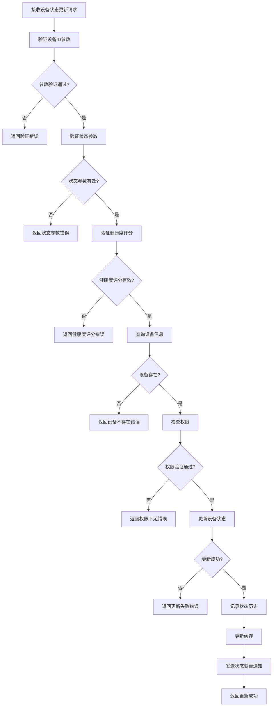
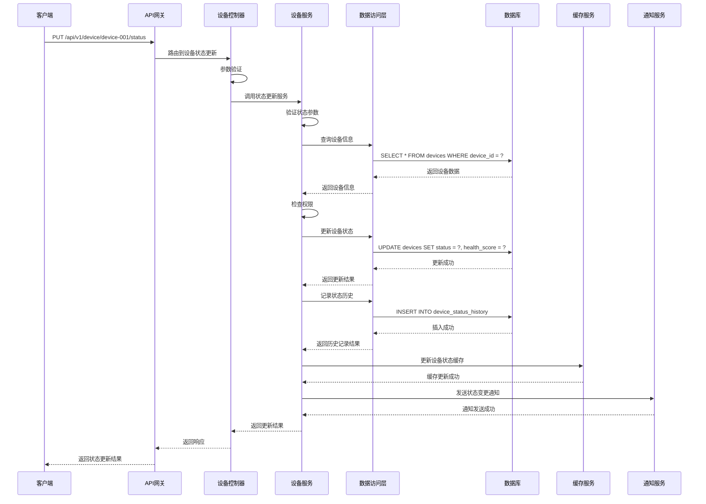

# 设备状态更新模块需求文档

## 1. 功能描述

设备状态更新模块是OneGoServer系统的核心状态管理功能，负责处理设备状态的实时更新和变更。该模块支持设备状态的主动更新、健康度评分计算、状态历史记录等功能，确保设备状态信息的准确性和实时性。

### 1.1 主要功能
- **设备状态更新**：更新设备的当前运行状态
- **健康度评分更新**：更新设备的健康度评分
- **状态历史记录**：记录设备状态变更历史
- **状态变更通知**：发送状态变更通知
- **状态验证**：验证状态更新的有效性
- **批量状态更新**：支持批量设备状态更新

### 1.2 支持状态类型
- **online**：设备在线，正常运行
- **offline**：设备离线，无法连接
- **maintenance**：设备维护中，暂停服务
- **error**：设备错误，需要处理

## 2. 功能目标

### 2.1 业务目标
- 提供设备状态的实时更新服务
- 支持设备健康度的动态评估
- 为设备管理和维护提供状态变更依据
- 支持设备故障的快速响应

### 2.2 技术目标
- 状态更新响应时间 < 100ms
- 支持并发状态更新
- 状态数据一致性保证
- 高效的状态缓存更新机制

### 2.3 监控目标
- 设备状态变更实时可见
- 状态变更历史完整记录
- 异常状态快速响应
- 状态变更趋势分析

## 3. 输入输出说明

### 3.1 输入参数

#### 3.1.1 路径参数
```json
{
  "deviceId": "string"  // 设备ID，必填，不能为空
}
```

#### 3.1.2 请求体参数
```json
{
  "status": "string",       // 设备状态，必填，只能是online,offline,maintenance,error
  "health_score": 95        // 健康度评分，可选，范围0-100
}
```

### 3.2 输出参数

#### 3.2.1 成功响应
```json
{
  "code": 0,
  "message": "设备状态更新成功",
  "data": {
    "device_id": "device-001",
    "status": "online",
    "health_score": 95,
    "updated_at": "2024-01-01T15:30:00Z"
  }
}
```

#### 3.2.2 错误响应
```json
{
  "code": 400,
  "message": "状态参数无效",
  "data": null
}
```

## 4. 涉及接口以及接口设计

### 4.1 API接口定义

#### 4.1.1 设备状态更新接口
- **路径**：`PUT /api/v1/device/device/{deviceId}/status`
- **标签**：设备状态
- **摘要**：更新设备状态

### 4.2 内部接口

#### 4.2.1 设备状态更新接口
```go
type UpdateDeviceStatusInput struct {
    DeviceID    string
    Status      string
    HealthScore int
    UpdatedBy   string
}

type UpdateDeviceStatusOutput struct {
    DeviceID    string
    Status      string
    HealthScore int
    UpdatedAt   *gtime.Time
    Message     string
}
```

#### 4.2.2 状态历史记录接口
```go
type RecordStatusHistoryInput struct {
    DeviceID    string
    OldStatus   string
    NewStatus   string
    HealthScore int
    UpdatedBy   string
    Reason      string
}

type RecordStatusHistoryOutput struct {
    HistoryID string
    CreatedAt *gtime.Time
}
```

#### 4.2.3 状态变更通知接口
```go
type NotifyStatusChangeInput struct {
    DeviceID    string
    OldStatus   string
    NewStatus   string
    HealthScore int
    UpdatedBy   string
}

type NotifyStatusChangeOutput struct {
    NotificationID string
    SentAt         *gtime.Time
}
```

## 5. 数据结构设计

### 5.1 数据库更新结构

#### 5.1.1 设备状态更新SQL
```sql
UPDATE devices 
SET 
    status = ?, 
    health_score = ?, 
    last_online_time = CASE 
        WHEN ? = 'online' THEN NOW() 
        ELSE last_online_time 
    END,
    last_offline_time = CASE 
        WHEN ? = 'offline' THEN NOW() 
        ELSE last_offline_time 
    END,
    updated_at = NOW()
WHERE device_id = ? AND deleted_at IS NULL
```

#### 5.1.2 状态历史记录SQL
```sql
INSERT INTO device_status_history (
    device_id, old_status, new_status, health_score, 
    updated_by, reason, created_at
) VALUES (?, ?, ?, ?, ?, ?, NOW())
```

#### 5.1.3 状态变更通知SQL
```sql
INSERT INTO device_notifications (
    device_id, notification_type, old_status, new_status, 
    health_score, updated_by, created_at
) VALUES (?, 'status_change', ?, ?, ?, ?, NOW())
```

### 5.2 缓存更新结构

#### 5.2.1 设备状态缓存更新
```go
type DeviceStatusCacheUpdate struct {
    DeviceID            string    // 设备ID
    Status              string    // 设备状态
    HealthScore         int       // 健康度评分
    LastOnlineTime      time.Time // 最后在线时间
    LastOfflineTime     time.Time // 最后离线时间
    UpdatedAt           time.Time // 更新时间
    ExpireAt            time.Time // 过期时间
}
```

#### 5.2.2 状态变更事件
```go
type StatusChangeEvent struct {
    EventID     string    // 事件ID
    DeviceID    string    // 设备ID
    OldStatus   string    // 旧状态
    NewStatus   string    // 新状态
    HealthScore int       // 健康度评分
    UpdatedBy   string    // 更新者
    Timestamp   time.Time // 时间戳
    Reason      string    // 变更原因
}
```

## 6. 异常处理

### 6.1 输入验证异常
- **设备ID为空**：返回400错误，提示"设备ID不能为空"
- **设备ID格式错误**：返回400错误，提示"设备ID格式不正确"
- **状态参数为空**：返回400错误，提示"状态不能为空"
- **状态参数无效**：返回400错误，提示"状态只能是online,offline,maintenance,error"
- **健康度评分超出范围**：返回400错误，提示"健康分数范围为0-100"

### 6.2 业务逻辑异常
- **设备不存在**：返回404错误，提示"设备不存在"
- **设备已删除**：返回404错误，提示"设备已删除"
- **权限不足**：返回403错误，提示"权限不足，无法更新设备状态"
- **状态变更被拒绝**：返回409错误，提示"状态变更被拒绝"

### 6.3 系统异常
- **数据库连接失败**：返回500错误，提示"数据库连接失败"
- **状态更新失败**：返回500错误，提示"状态更新失败"
- **缓存更新失败**：返回500错误，提示"缓存更新失败"
- **通知发送失败**：返回500错误，提示"通知发送失败"

## 7. 交互流程图



## 8. 交互时序图



## 9. 安全与权限

### 9.1 访问控制
- **接口权限**：需要设备状态更新权限
- **数据权限**：根据用户权限过滤可更新的设备
- **状态权限**：根据用户权限决定可更新的状态类型

### 9.2 数据安全
- **状态数据保护**：保护设备状态数据不被未授权修改
- **更新审计**：记录设备状态更新操作
- **数据完整性**：确保状态更新的一致性

### 9.3 更新安全
- **设备ID验证**：验证设备ID的有效性
- **状态验证**：验证状态更新的合理性
- **权限验证**：验证用户是否有权限更新该设备状态
- **并发控制**：防止并发更新冲突

## 10. 日志与审计要求

### 10.1 更新日志
- **状态更新日志**：记录设备状态更新的详细信息
- **操作日志**：记录用户更新设备状态的行为
- **权限日志**：记录权限验证的结果

### 10.2 性能日志
- **更新耗时日志**：记录更新执行时间
- **缓存更新日志**：记录缓存更新情况
- **数据库性能日志**：记录数据库更新性能

### 10.3 日志格式
```json
{
  "timestamp": "2024-01-01T00:00:00Z",
  "level": "INFO",
  "service": "device-status-update",
  "operation": "update_device_status",
  "device_id": "device-001",
  "user_id": "user-123",
  "ip_address": "192.168.1.100",
  "old_status": "offline",
  "new_status": "online",
  "health_score": 95,
  "result": "success",
  "duration_ms": 50,
  "reason": "设备重新连接"
}
```

## 11. 测试用例

### 11.1 功能测试用例

#### 11.1.1 正常状态更新测试
- **测试目标**：验证设备状态正常更新功能
- **测试数据**：
  ```
  PUT /api/v1/device/device-001/status
  {
    "status": "online",
    "health_score": 95
  }
  ```
- **预期结果**：设备状态成功更新为online，健康度评分为95

#### 11.1.2 设备不存在测试
- **测试目标**：验证设备不存在时的处理
- **测试数据**：
  ```
  PUT /api/v1/device/non-existent-device/status
  {
    "status": "online"
  }
  ```
- **预期结果**：返回404错误，提示"设备不存在"

#### 11.1.3 参数验证测试
- **测试目标**：验证参数验证功能
- **测试数据**：
  ```
  PUT /api/v1/device/device-001/status
  {
    "status": "invalid_status"
  }
  ```
- **预期结果**：返回400错误，提示"状态只能是online,offline,maintenance,error"

#### 11.1.4 健康度评分验证测试
- **测试目标**：验证健康度评分验证功能
- **测试数据**：
  ```
  PUT /api/v1/device/device-001/status
  {
    "status": "online",
    "health_score": 150
  }
  ```
- **预期结果**：返回400错误，提示"健康分数范围为0-100"

#### 11.1.5 权限验证测试
- **测试目标**：验证权限控制功能
- **测试场景**：无权限用户尝试更新设备状态
- **预期结果**：返回403错误，提示"权限不足"

### 11.2 性能测试用例

#### 11.2.1 更新响应时间测试
- **测试目标**：验证更新响应时间
- **测试场景**：更新单个设备状态
- **预期结果**：响应时间<100ms

#### 11.2.2 并发更新测试
- **测试目标**：验证并发更新性能
- **测试场景**：10个并发更新不同设备状态
- **预期结果**：所有请求在1秒内完成，成功率>99%

#### 11.2.3 缓存更新性能测试
- **测试目标**：验证缓存更新机制性能
- **测试场景**：状态更新后查询设备状态
- **预期结果**：查询返回最新状态，响应时间<10ms

### 11.3 状态准确性测试

#### 11.3.1 状态更新准确性测试
- **测试目标**：验证状态更新的准确性
- **测试场景**：更新设备状态后查询
- **预期结果**：查询结果与更新状态一致

#### 11.3.2 状态历史记录测试
- **测试目标**：验证状态历史记录的准确性
- **测试场景**：多次更新设备状态
- **预期结果**：状态历史记录完整准确

#### 11.3.3 健康度评分更新测试
- **测试目标**：验证健康度评分更新的准确性
- **测试场景**：更新设备健康度评分
- **预期结果**：健康度评分更新正确

### 11.4 安全测试用例

#### 11.4.1 设备ID注入测试
- **测试目标**：验证设备ID注入防护
- **测试数据**：在设备ID中包含恶意代码
- **预期结果**：系统正确过滤恶意代码

#### 11.4.2 权限越权测试
- **测试目标**：验证权限控制
- **测试场景**：普通用户尝试更新管理员设备状态
- **预期结果**：返回403权限不足错误

#### 11.4.3 状态参数注入测试
- **测试目标**：验证状态参数注入防护
- **测试数据**：在状态参数中包含恶意代码
- **预期结果**：系统正确过滤恶意代码

### 11.5 异常测试用例

#### 11.5.1 数据库异常测试
- **测试目标**：验证数据库异常处理
- **测试场景**：模拟数据库连接失败
- **预期结果**：返回500错误，记录详细错误日志

#### 11.5.2 缓存异常测试
- **测试目标**：验证缓存异常处理
- **测试场景**：模拟缓存服务不可用
- **预期结果**：降级到直接更新数据库，不影响功能

#### 11.5.3 通知服务异常测试
- **测试目标**：验证通知服务异常处理
- **测试场景**：模拟通知服务不可用
- **预期结果**：状态更新成功，通知失败不影响主流程

### 11.6 数据完整性测试

#### 11.6.1 状态数据一致性测试
- **测试目标**：验证状态数据一致性
- **测试场景**：并发更新设备状态
- **预期结果**：最终状态一致，无数据冲突

#### 11.6.2 历史记录完整性测试
- **测试目标**：验证历史记录完整性
- **测试场景**：多次更新设备状态
- **预期结果**：所有状态变更都有历史记录

#### 11.6.3 缓存一致性测试
- **测试目标**：验证缓存数据一致性
- **测试场景**：状态更新后检查缓存
- **预期结果**：缓存数据与数据库数据一致

### 11.7 通知功能测试

#### 11.7.1 状态变更通知测试
- **测试目标**：验证状态变更通知功能
- **测试场景**：设备状态发生变更
- **预期结果**：相关用户收到状态变更通知

#### 11.7.2 通知内容准确性测试
- **测试目标**：验证通知内容的准确性
- **测试场景**：设备状态变更
- **预期结果**：通知内容包含正确的状态信息

#### 11.7.3 通知发送时机测试
- **测试目标**：验证通知发送时机
- **测试场景**：设备状态更新
- **预期结果**：状态更新成功后立即发送通知

### 11.8 业务逻辑测试

#### 11.8.1 状态转换逻辑测试
- **测试目标**：验证状态转换的业务逻辑
- **测试场景**：从offline状态更新为online状态
- **预期结果**：last_online_time字段正确更新

#### 11.8.2 健康度评分逻辑测试
- **测试目标**：验证健康度评分的业务逻辑
- **测试场景**：更新健康度评分
- **预期结果**：健康度评分在合理范围内

#### 11.8.3 状态变更限制测试
- **测试目标**：验证状态变更的业务限制
- **测试场景**：尝试进行不允许的状态转换
- **预期结果**：返回409错误，提示状态变更被拒绝 