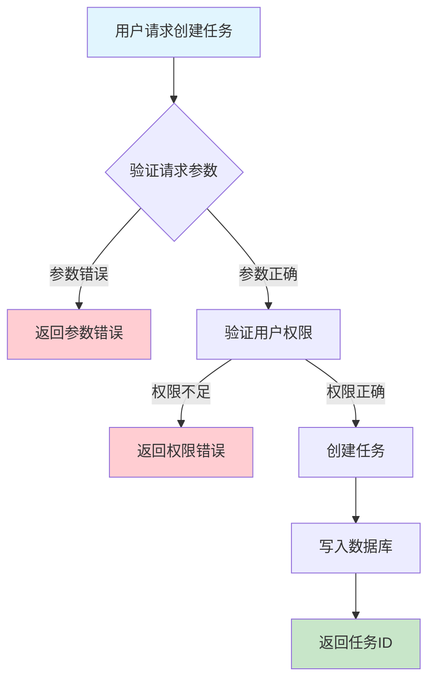
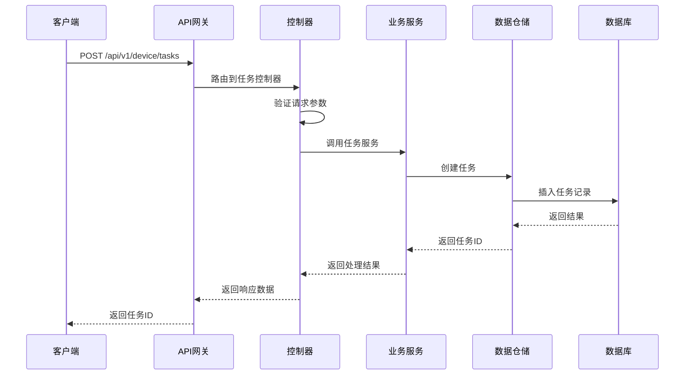

# 设备任务需求文档

## 1. 功能描述

### 1.1 功能概述
设备任务功能用于下发、调度和管理设备执行的各类任务，包括任务的创建、分配、状态跟踪、结果查询等。支持批量任务、定时任务、任务优先级等多种业务场景。

### 1.2 主要功能列表
- 创建设备任务
- 查询任务列表
- 查询任务详情
- 任务状态跟踪
- 任务结果查询
- 批量任务下发
- 任务优先级与调度

### 1.3 支持的功能特性
- 支持多种任务类型
- 支持批量任务
- 支持定时/周期任务
- 任务优先级与调度策略
- 任务状态流转

## 2. 功能目标

### 2.1 业务目标
- 实现设备自动化运维
- 提高任务下发与执行效率
- 支持复杂业务流程

### 2.2 技术目标
- 高并发任务调度能力
- 任务状态一致性保障
- 任务执行可追溯

### 2.3 安全目标
- 任务操作权限控制
- 防止误操作
- 任务操作可审计

## 3. 输入输出说明

### 3.1 输入参数

#### 3.1.1 必需参数
- `task_type` (string): 任务类型
- `device_ids` (array[string]): 目标设备ID列表

#### 3.1.2 可选参数
- `params` (object): 任务参数
- `schedule_time` (string): 定时任务时间
- `priority` (string): 任务优先级
- `description` (string): 任务描述

### 3.2 输出参数

#### 3.2.1 成功响应
```json
{
  "code": 200,
  "message": "success",
  "data": {
    "task_id": "task_001",
    "device_ids": ["device_001", "device_002"],
    "status": "pending",
    "created_at": "2024-01-15T14:10:00Z"
  }
}
```

#### 3.2.2 错误响应
```json
{
  "code": 400,
  "message": "参数错误或操作不允许",
  "data": null
}
```

### 3.3 参数格式和约束
- 任务类型：如upgrade、restart、collect_data等
- 设备ID：1-64字符，字母、数字、下划线
- 优先级：low、normal、high
- 定时任务时间：ISO 8601格式

## 4. 涉及接口以及接口设计

### 4.1 API接口定义

#### 4.1.1 创建任务
```go
// 创建任务
POST /api/v1/device/tasks
```

#### 4.1.2 查询任务列表
```go
// 查询任务列表
GET /api/v1/device/tasks
```

#### 4.1.3 查询任务详情
```go
// 查询任务详情
GET /api/v1/device/tasks/{task_id}
```

### 4.2 内部接口设计

#### 4.2.1 任务服务接口
```go
type DeviceTaskService interface {
    CreateTask(ctx context.Context, req *DeviceTaskRequest) (*DeviceTask, error)
    GetTaskList(ctx context.Context, filter *TaskFilter) ([]DeviceTask, error)
    GetTaskDetail(ctx context.Context, taskID string) (*DeviceTask, error)
}
```

#### 4.2.2 任务仓储接口
```go
type DeviceTaskRepository interface {
    Create(ctx context.Context, task *DeviceTask) error
    GetList(ctx context.Context, filter *TaskFilter) ([]DeviceTask, error)
    GetByID(ctx context.Context, taskID string) (*DeviceTask, error)
}
```

## 5. 数据结构设计

### 5.1 数据库表结构

#### 5.1.1 设备任务表 (device_tasks)
```sql
CREATE TABLE device_tasks (
    id VARCHAR(64) PRIMARY KEY COMMENT '任务ID',
    task_type VARCHAR(50) NOT NULL COMMENT '任务类型',
    device_ids JSON NOT NULL COMMENT '目标设备ID列表',
    params JSON COMMENT '任务参数',
    schedule_time TIMESTAMP NULL COMMENT '定时任务时间',
    priority VARCHAR(10) DEFAULT 'normal' COMMENT '优先级',
    status VARCHAR(20) DEFAULT 'pending' COMMENT '任务状态',
    description VARCHAR(255) COMMENT '任务描述',
    created_at TIMESTAMP DEFAULT CURRENT_TIMESTAMP COMMENT '创建时间',
    updated_at TIMESTAMP DEFAULT CURRENT_TIMESTAMP ON UPDATE CURRENT_TIMESTAMP COMMENT '更新时间',
    INDEX idx_task_type (task_type),
    INDEX idx_status (status),
    INDEX idx_created_at (created_at)
) ENGINE=InnoDB DEFAULT CHARSET=utf8mb4 COMMENT='设备任务表';
```

### 5.2 模型结构定义
```go
type DeviceTask struct {
    ID           string   `json:"task_id" db:"id"`
    TaskType     string   `json:"task_type" db:"task_type"`
    DeviceIDs    []string `json:"device_ids" db:"device_ids"`
    Params       map[string]interface{} `json:"params" db:"params"`
    ScheduleTime *string  `json:"schedule_time" db:"schedule_time"`
    Priority     string   `json:"priority" db:"priority"`
    Status       string   `json:"status" db:"status"`
    Description  string   `json:"description" db:"description"`
    CreatedAt    string   `json:"created_at" db:"created_at"`
    UpdatedAt    string   `json:"updated_at" db:"updated_at"`
}

type DeviceTaskRequest struct {
    TaskType     string   `json:"task_type" v:"required"`
    DeviceIDs    []string `json:"device_ids" v:"required"`
    Params       map[string]interface{} `json:"params"`
    ScheduleTime *string  `json:"schedule_time"`
    Priority     string   `json:"priority"`
    Description  string   `json:"description"`
}

type TaskFilter struct {
    Status    string   `json:"status"`
    TaskType  string   `json:"task_type"`
    DeviceID  string   `json:"device_id"`
    StartTime string   `json:"start_time"`
    EndTime   string   `json:"end_time"`
}
```

### 5.3 数据关系说明
- 任务与设备通过device_ids关联
- 支持批量任务、定时任务

## 6. 异常处理

### 6.1 输入验证异常
- 任务类型为空或不支持
- 设备ID为空或格式错误
- 优先级非法

### 6.2 业务逻辑异常
- 设备不存在
- 权限不足
- 任务状态不允许操作

### 6.3 系统异常
- 数据库连接失败
- 网络超时
- 系统资源不足

## 7. 交互流程图



## 8. 交互时序图



## 9. 安全与权限

### 9.1 访问控制策略
- 需要用户身份验证
- 验证用户对任务的操作权限
- 支持基于角色的访问控制(RBAC)
- 记录所有任务操作

### 9.2 数据安全要求
- 防止误操作
- 任务操作需二次确认（如批量）
- 支持数据访问审计
- 防止SQL注入

### 9.3 身份验证机制
- JWT令牌
- API密钥
- 请求频率限制
- IP白名单

## 10. 日志与审计要求

### 10.1 操作日志要求
- 记录所有任务操作
- 记录参数和结果
- 记录操作人员身份
- 记录操作时间和IP

### 10.2 审计日志要求
- 记录任务变更轨迹
- 记录身份和权限
- 记录操作目的
- 支持长期保存

### 10.3 日志格式规范
```json
{
  "timestamp": "2024-01-15T14:10:00Z",
  "level": "INFO",
  "service": "device-task",
  "operation": "create_task",
  "user_id": "user_001",
  "parameters": {
    "task_type": "upgrade",
    "device_ids": ["device_001", "device_002"]
  },
  "result": {
    "success": true,
    "task_id": "task_001"
  }
}
```

## 11. 测试用例

### 11.1 功能测试用例

#### 11.1.1 创建任务测试
**测试场景：** 创建新任务
**输入数据：**
```json
{
  "task_type": "upgrade",
  "device_ids": ["device_001", "device_002"]
}
```
**预期结果：**
- 返回状态码：200
- 返回新任务ID

#### 11.1.2 查询任务列表测试
**测试场景：** 查询任务列表
**输入数据：**
无
**预期结果：**
- 返回状态码：200
- 返回任务列表

#### 11.1.3 查询任务详情测试
**测试场景：** 查询任务详情
**输入数据：**
无
**预期结果：**
- 返回状态码：200
- 返回任务详情

### 11.2 性能测试用例

#### 11.2.1 大量任务创建测试
**测试场景：** 批量创建1000个任务
**预期结果：**
- 响应时间 < 2秒
- 错误率 < 1%

### 11.3 安全测试用例

#### 11.3.1 权限验证测试
**测试场景：** 验证用户任务操作权限
**测试数据：**
- 用户A：有权限
- 用户B：无权限
**预期结果：**
- 用户A：成功操作
- 用户B：返回权限错误

#### 11.3.2 误操作防护测试
**测试场景：** 批量误操作防护
**输入数据：**
```json
{
  "task_type": "restart",
  "device_ids": ["device_003", "device_004"]
}
```
**预期结果：**
- 需二次确认
- 未确认时不执行

### 11.4 异常测试用例

#### 11.4.1 参数错误测试
**测试场景：** 参数错误
**输入数据：**
```json
{
  "task_type": "",
  "device_ids": []
}
```
**预期结果：**
- 返回参数验证错误
- 状态码400

#### 11.4.2 设备不存在测试
**测试场景：** 创建任务时设备不存在
**输入数据：**
```json
{
  "task_type": "upgrade",
  "device_ids": ["non_existent_device"]
}
```
**预期结果：**
- 返回404
- 错误信息友好

#### 11.4.3 系统异常测试
**测试场景：** 数据库连接失败
**测试方法：** 临时关闭数据库
**预期结果：**
- 返回500
- 记录详细错误日志 