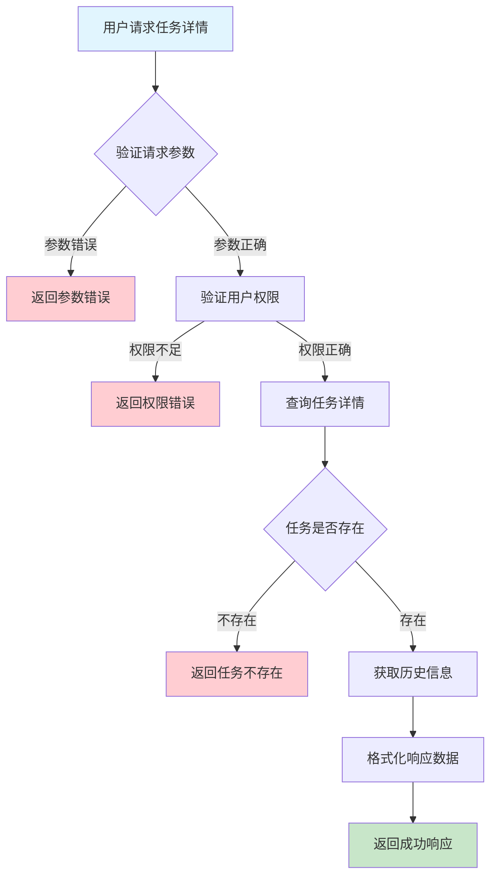
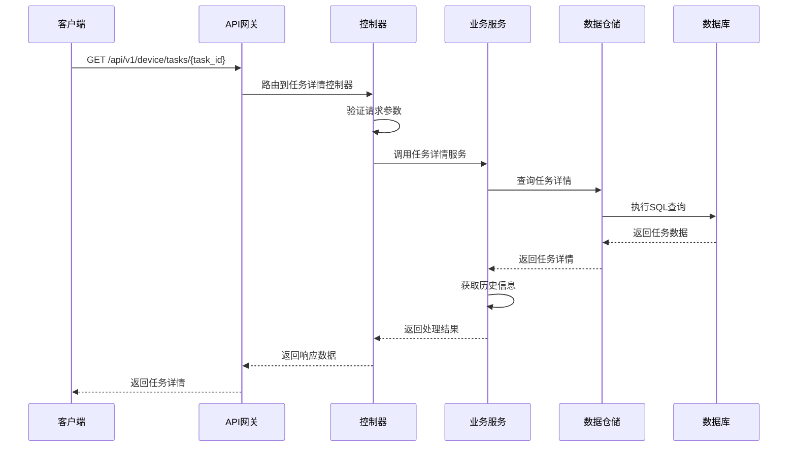

# 设备任务详情需求文档

## 1. 功能描述

### 1.1 功能概述
设备任务详情功能用于获取单个任务的详细信息，包括任务基本属性、目标设备、参数、执行状态、执行结果、历史变更等。支持任务的全流程跟踪和分析。

### 1.2 主要功能列表
- 获取任务详细信息
- 展示任务执行状态与结果
- 展示任务参数与目标设备
- 展示任务历史变更记录
- 支持任务详情导出

### 1.3 支持的功能特性
- 结构化详情展示
- 任务状态与结果追踪
- 任务参数与设备联查
- 变更历史可追溯

## 2. 功能目标

### 2.1 业务目标
- 提供任务全流程可视化
- 支持任务执行分析与优化
- 提升运维响应速度

### 2.2 技术目标
- 高效查询单个任务详情
- 支持复杂数据结构解析
- 确保数据一致性与准确性

### 2.3 安全目标
- 保护敏感任务信息
- 控制详情访问权限
- 审计所有详情访问操作

## 3. 输入输出说明

### 3.1 输入参数

#### 3.1.1 必需参数
- `task_id` (string): 任务ID

#### 3.1.2 可选参数
- `include_history` (boolean): 是否包含变更历史，默认true

### 3.2 输出参数

#### 3.2.1 成功响应
```json
{
  "code": 200,
  "message": "success",
  "data": {
    "task_id": "task_001",
    "task_type": "upgrade",
    "device_ids": ["device_001", "device_002"],
    "params": {"version": "v2.0"},
    "schedule_time": "2024-01-15T15:00:00Z",
    "priority": "high",
    "status": "completed",
    "result": {"device_001": "success", "device_002": "failed"},
    "description": "固件升级任务",
    "created_at": "2024-01-15T14:10:00Z",
    "updated_at": "2024-01-15T15:10:00Z",
    "history": [
      {"action": "created", "operator": "user_001", "timestamp": "2024-01-15T14:10:00Z", "comment": ""},
      {"action": "executed", "operator": "system", "timestamp": "2024-01-15T15:00:00Z", "comment": "自动执行"}
    ]
  }
}
```

#### 3.2.2 错误响应
```json
{
  "code": 404,
  "message": "任务不存在",
  "data": null
}
```

### 3.3 参数格式和约束
- 任务ID：1-64字符，字母、数字、下划线
- 布尔参数：true/false

## 4. 涉及接口以及接口设计

### 4.1 API接口定义

#### 4.1.1 获取任务详情
```go
// 获取任务详情
GET /api/v1/device/tasks/{task_id}
```

**请求参数：**
- Path参数：task_id
- Query参数：include_history

**响应结构：**
```go
type TaskDetailResponse struct {
    Code    int         `json:"code"`
    Message string      `json:"message"`
    Data    TaskDetail  `json:"data"`
}

type TaskDetail struct {
    TaskID       string                 `json:"task_id"`
    TaskType     string                 `json:"task_type"`
    DeviceIDs    []string               `json:"device_ids"`
    Params       map[string]interface{} `json:"params"`
    ScheduleTime string                 `json:"schedule_time"`
    Priority     string                 `json:"priority"`
    Status       string                 `json:"status"`
    Result       map[string]string      `json:"result"`
    Description  string                 `json:"description"`
    CreatedAt    string                 `json:"created_at"`
    UpdatedAt    string                 `json:"updated_at"`
    History      []TaskHistory          `json:"history"`
}

type TaskHistory struct {
    Action    string `json:"action"`
    Operator  string `json:"operator"`
    Timestamp string `json:"timestamp"`
    Comment   string `json:"comment"`
}
```

### 4.2 内部接口设计

#### 4.2.1 任务详情服务接口
```go
type TaskDetailService interface {
    GetTaskDetail(ctx context.Context, taskID string, includeHistory bool) (*TaskDetail, error)
    GetTaskHistory(ctx context.Context, taskID string) ([]TaskHistory, error)
}
```

#### 4.2.2 任务详情仓储接口
```go
type TaskDetailRepository interface {
    GetByID(ctx context.Context, taskID string) (*TaskDetail, error)
    GetHistory(ctx context.Context, taskID string) ([]TaskHistory, error)
}
```

## 5. 数据结构设计

### 5.1 数据库表结构
- 复用 device_tasks 表
- 新增 device_task_history 表

#### 5.1.1 任务历史表 (device_task_history)
```sql
CREATE TABLE device_task_history (
    id BIGINT AUTO_INCREMENT PRIMARY KEY COMMENT '历史ID',
    task_id VARCHAR(64) NOT NULL COMMENT '任务ID',
    action VARCHAR(50) NOT NULL COMMENT '操作类型',
    operator VARCHAR(64) NOT NULL COMMENT '操作人',
    timestamp TIMESTAMP DEFAULT CURRENT_TIMESTAMP COMMENT '操作时间',
    comment TEXT COMMENT '备注',
    INDEX idx_task_id (task_id),
    INDEX idx_action (action),
    FOREIGN KEY (task_id) REFERENCES device_tasks(id) ON DELETE CASCADE
) ENGINE=InnoDB DEFAULT CHARSET=utf8mb4 COMMENT='设备任务历史表';
```

### 5.2 模型结构定义
```go
type TaskDetail struct {
    TaskID       string                 `json:"task_id" db:"task_id"`
    TaskType     string                 `json:"task_type" db:"task_type"`
    DeviceIDs    []string               `json:"device_ids" db:"device_ids"`
    Params       map[string]interface{} `json:"params" db:"params"`
    ScheduleTime string                 `json:"schedule_time" db:"schedule_time"`
    Priority     string                 `json:"priority" db:"priority"`
    Status       string                 `json:"status" db:"status"`
    Result       map[string]string      `json:"result" db:"result"`
    Description  string                 `json:"description" db:"description"`
    CreatedAt    string                 `json:"created_at" db:"created_at"`
    UpdatedAt    string                 `json:"updated_at" db:"updated_at"`
    History      []TaskHistory          `json:"history"`
}

type TaskHistory struct {
    Action    string `json:"action" db:"action"`
    Operator  string `json:"operator" db:"operator"`
    Timestamp string `json:"timestamp" db:"timestamp"`
    Comment   string `json:"comment" db:"comment"`
}
```

### 5.3 数据关系说明
- 任务详情与设备表通过device_ids关联
- 任务历史与任务表通过task_id关联

## 6. 异常处理

### 6.1 输入验证异常
- 任务ID为空或格式错误

### 6.2 业务逻辑异常
- 任务不存在
- 权限不足

### 6.3 系统异常
- 数据库连接失败
- 网络超时
- 系统资源不足

## 7. 交互流程图



## 8. 交互时序图



## 9. 安全与权限

### 9.1 访问控制策略
- 需要用户身份验证
- 验证用户对任务的访问权限
- 支持基于角色的访问控制(RBAC)
- 记录所有详情访问操作

### 9.2 数据安全要求
- 敏感信息脱敏
- 详情数据加密存储
- 支持数据访问审计
- 防止SQL注入

### 9.3 身份验证机制
- JWT令牌
- API密钥
- 请求频率限制
- IP白名单

## 10. 日志与审计要求

### 10.1 操作日志要求
- 记录所有详情访问操作
- 记录参数和结果
- 记录操作人员身份
- 记录操作时间和IP

### 10.2 审计日志要求
- 记录访问轨迹
- 记录身份和权限
- 记录访问目的
- 支持长期保存

### 10.3 日志格式规范
```json
{
  "timestamp": "2024-01-15T15:10:00Z",
  "level": "INFO",
  "service": "device-task-detail",
  "operation": "get_task_detail",
  "user_id": "user_001",
  "task_id": "task_001",
  "parameters": {
    "include_history": true
  },
  "result": {
    "found": true,
    "has_history": true
  }
}
```

## 11. 测试用例

### 11.1 功能测试用例

#### 11.1.1 正常查询测试
**测试场景：** 获取任务详情
**输入数据：**
```json
{
  "task_id": "task_001"
}
```
**预期结果：**
- 返回状态码：200
- 返回任务详细信息
- 包含历史信息

#### 11.1.2 不含历史测试
**测试场景：** 不包含历史
**输入数据：**
```json
{
  "task_id": "task_001",
  "include_history": false
}
```
**预期结果：**
- 返回状态码：200
- 不包含history字段

### 11.2 性能测试用例

#### 11.2.1 大量历史查询测试
**测试场景：** 查询包含大量历史的任务
**测试数据：** 1000条历史记录
**预期结果：**
- 查询响应时间 < 1秒
- 数据完整

### 11.3 安全测试用例

#### 11.3.1 权限验证测试
**测试场景：** 验证用户访问权限
**测试数据：**
- 用户A：有任务访问权限
- 用户B：无任务访问权限
**预期结果：**
- 用户A：成功获取详情
- 用户B：返回权限错误

#### 11.3.2 敏感信息脱敏测试
**测试场景：** 敏感信息脱敏
**输入数据：**
```json
{
  "task_id": "task_with_sensitive"
}
```
**预期结果：**
- 敏感信息脱敏
- 不影响可读性

### 11.4 异常测试用例

#### 11.4.1 任务不存在测试
**测试场景：** 查询不存在的任务
**输入数据：**
```json
{
  "task_id": "non_existent_task"
}
```
**预期结果：**
- 返回404
- 错误信息友好

#### 11.4.2 参数错误测试
**测试场景：** 参数错误
**输入数据：**
```json
{
  "task_id": ""
}
```
**预期结果：**
- 返回参数验证错误
- 状态码400

#### 11.4.3 系统异常测试
**测试场景：** 数据库连接失败
**测试方法：** 临时关闭数据库
**预期结果：**
- 返回500
- 记录详细错误日志 