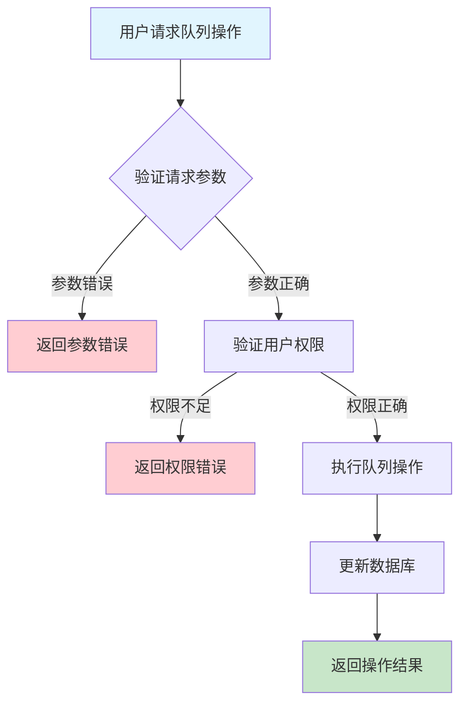
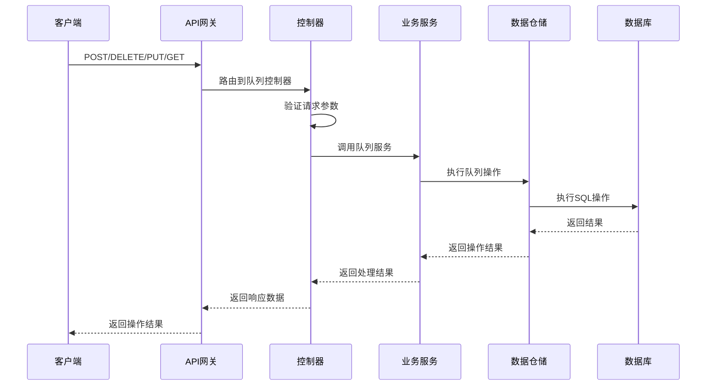

# 设备任务队列需求文档

## 1. 功能描述

### 1.1 功能概述
设备任务队列功能用于管理设备待执行的任务队列，包括任务的入队、出队、队列状态查询、队列优先级调整等。支持多设备、多类型任务的队列化调度。

### 1.2 主要功能列表
- 任务入队
- 任务出队
- 查询队列状态
- 队列优先级调整
- 队列长度统计
- 批量队列操作

### 1.3 支持的功能特性
- 多设备队列独立管理
- 支持优先级队列
- 支持批量入队/出队
- 队列状态实时查询

## 2. 功能目标

### 2.1 业务目标
- 实现任务有序调度与执行
- 提高设备任务处理效率
- 支持复杂调度策略

### 2.2 技术目标
- 高并发队列操作能力
- 队列状态一致性保障
- 队列操作可追溯

### 2.3 安全目标
- 队列操作权限控制
- 防止误操作
- 队列操作可审计

## 3. 输入输出说明

### 3.1 输入参数

#### 3.1.1 必需参数
- `device_id` (string): 设备ID
- `task_id` (string): 任务ID

#### 3.1.2 可选参数
- `action` (string): 操作类型（enqueue、dequeue、adjust_priority）
- `priority` (string): 优先级

### 3.2 输出参数

#### 3.2.1 成功响应
```json
{
  "code": 200,
  "message": "success",
  "data": {
    "device_id": "device_001",
    "queue": ["task_001", "task_002"],
    "action": "enqueue",
    "updated_at": "2024-01-15T15:20:00Z"
  }
}
```

#### 3.2.2 错误响应
```json
{
  "code": 400,
  "message": "参数错误或操作不允许",
  "data": null
}
```

### 3.3 参数格式和约束
- 设备ID/任务ID：1-64字符，字母、数字、下划线
- 操作类型：enqueue、dequeue、adjust_priority
- 优先级：low、normal、high

## 4. 涉及接口以及接口设计

### 4.1 API接口定义

#### 4.1.1 任务入队
```go
// 任务入队
POST /api/v1/device/{device_id}/task_queue
```

#### 4.1.2 任务出队
```go
// 任务出队
DELETE /api/v1/device/{device_id}/task_queue
```

#### 4.1.3 查询队列状态
```go
// 查询队列状态
GET /api/v1/device/{device_id}/task_queue
```

#### 4.1.4 队列优先级调整
```go
// 队列优先级调整
PUT /api/v1/device/{device_id}/task_queue/priority
```

### 4.2 内部接口设计

#### 4.2.1 任务队列服务接口
```go
type DeviceTaskQueueService interface {
    EnqueueTask(ctx context.Context, deviceID string, taskID string, priority string) error
    DequeueTask(ctx context.Context, deviceID string) (string, error)
    GetQueue(ctx context.Context, deviceID string) ([]string, error)
    AdjustPriority(ctx context.Context, deviceID string, taskID string, priority string) error
}
```

#### 4.2.2 任务队列仓储接口
```go
type DeviceTaskQueueRepository interface {
    Enqueue(ctx context.Context, deviceID string, taskID string, priority string) error
    Dequeue(ctx context.Context, deviceID string) (string, error)
    GetQueue(ctx context.Context, deviceID string) ([]string, error)
    AdjustPriority(ctx context.Context, deviceID string, taskID string, priority string) error
}
```

## 5. 数据结构设计

### 5.1 数据库表结构

#### 5.1.1 设备任务队列表 (device_task_queue)
```sql
CREATE TABLE device_task_queue (
    id BIGINT AUTO_INCREMENT PRIMARY KEY COMMENT '队列ID',
    device_id VARCHAR(64) NOT NULL COMMENT '设备ID',
    task_id VARCHAR(64) NOT NULL COMMENT '任务ID',
    priority VARCHAR(10) DEFAULT 'normal' COMMENT '优先级',
    status VARCHAR(20) DEFAULT 'queued' COMMENT '队列状态',
    created_at TIMESTAMP DEFAULT CURRENT_TIMESTAMP COMMENT '入队时间',
    updated_at TIMESTAMP DEFAULT CURRENT_TIMESTAMP ON UPDATE CURRENT_TIMESTAMP COMMENT '更新时间',
    INDEX idx_device_id (device_id),
    INDEX idx_task_id (task_id),
    INDEX idx_priority (priority)
) ENGINE=InnoDB DEFAULT CHARSET=utf8mb4 COMMENT='设备任务队列表';
```

### 5.2 模型结构定义
```go
type DeviceTaskQueueRequest struct {
    DeviceID string `json:"device_id" v:"required"`
    TaskID   string `json:"task_id" v:"required"`
    Action   string `json:"action"`
    Priority string `json:"priority"`
}
```

### 5.3 数据关系说明
- 队列与设备、任务通过device_id、task_id关联
- 支持优先级调整和批量操作

## 6. 异常处理

### 6.1 输入验证异常
- 设备ID/任务ID为空或格式错误
- 操作类型不支持
- 优先级非法

### 6.2 业务逻辑异常
- 设备不存在
- 任务不存在
- 权限不足
- 队列状态不允许操作

### 6.3 系统异常
- 数据库连接失败
- 网络超时
- 系统资源不足

## 7. 交互流程图



## 8. 交互时序图



## 9. 安全与权限

### 9.1 访问控制策略
- 需要用户身份验证
- 验证用户对队列的操作权限
- 支持基于角色的访问控制(RBAC)
- 记录所有队列操作

### 9.2 数据安全要求
- 防止误操作
- 队列操作需二次确认（如批量）
- 支持数据访问审计
- 防止SQL注入

### 9.3 身份验证机制
- JWT令牌
- API密钥
- 请求频率限制
- IP白名单

## 10. 日志与审计要求

### 10.1 操作日志要求
- 记录所有队列操作
- 记录参数和结果
- 记录操作人员身份
- 记录操作时间和IP

### 10.2 审计日志要求
- 记录队列变更轨迹
- 记录身份和权限
- 记录操作目的
- 支持长期保存

### 10.3 日志格式规范
```json
{
  "timestamp": "2024-01-15T15:20:00Z",
  "level": "INFO",
  "service": "device-task-queue",
  "operation": "enqueue_task",
  "user_id": "user_001",
  "parameters": {
    "device_id": "device_001",
    "task_id": "task_001",
    "action": "enqueue"
  },
  "result": {
    "success": true,
    "queue": ["task_001", "task_002"]
  }
}
```

## 11. 测试用例

### 11.1 功能测试用例

#### 11.1.1 入队测试
**测试场景：** 任务入队
**输入数据：**
```json
{
  "device_id": "device_001",
  "task_id": "task_001",
  "action": "enqueue"
}
```
**预期结果：**
- 返回状态码：200
- 任务入队成功
- 队列状态正确

#### 11.1.2 出队测试
**测试场景：** 任务出队
**输入数据：**
```json
{
  "device_id": "device_001",
  "action": "dequeue"
}
```
**预期结果：**
- 返回状态码：200
- 任务出队成功
- 队列状态正确

#### 11.1.3 优先级调整测试
**测试场景：** 队列优先级调整
**输入数据：**
```json
{
  "device_id": "device_001",
  "task_id": "task_002",
  "action": "adjust_priority",
  "priority": "high"
}
```
**预期结果：**
- 返回状态码：200
- 优先级调整成功
- 队列顺序正确

### 11.2 性能测试用例

#### 11.2.1 大量队列操作测试
**测试场景：** 批量入队1000个任务
**预期结果：**
- 响应时间 < 2秒
- 错误率 < 1%

### 11.3 安全测试用例

#### 11.3.1 权限验证测试
**测试场景：** 验证用户队列操作权限
**测试数据：**
- 用户A：有权限
- 用户B：无权限
**预期结果：**
- 用户A：成功操作
- 用户B：返回权限错误

#### 11.3.2 误操作防护测试
**测试场景：** 批量误操作防护
**输入数据：**
```json
{
  "device_id": "device_001",
  "task_id": "task_003",
  "action": "enqueue"
}
```
**预期结果：**
- 需二次确认
- 未确认时不执行

### 11.4 异常测试用例

#### 11.4.1 参数错误测试
**测试场景：** 参数错误
**输入数据：**
```json
{
  "device_id": "",
  "task_id": ""
}
```
**预期结果：**
- 返回参数验证错误
- 状态码400

#### 11.4.2 设备/任务不存在测试
**测试场景：** 操作不存在的设备或任务
**输入数据：**
```json
{
  "device_id": "non_existent_device",
  "task_id": "non_existent_task"
}
```
**预期结果：**
- 返回404
- 错误信息友好

#### 11.4.3 系统异常测试
**测试场景：** 数据库连接失败
**测试方法：** 临时关闭数据库
**预期结果：**
- 返回500
- 记录详细错误日志 